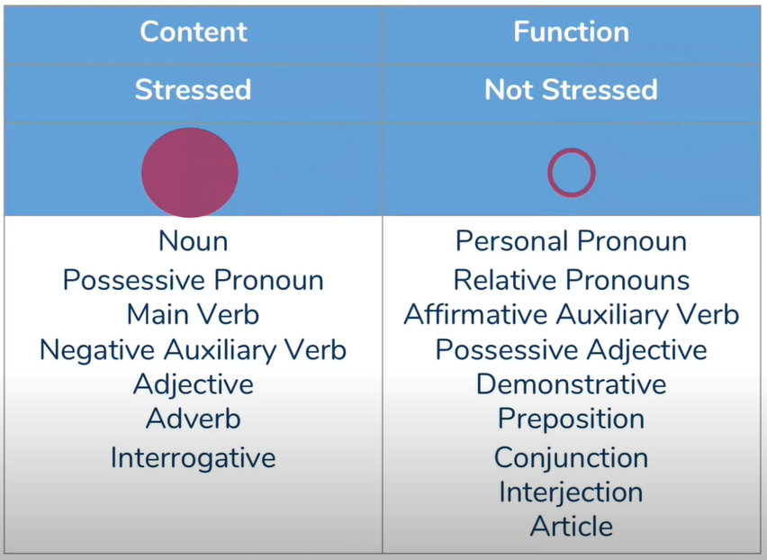
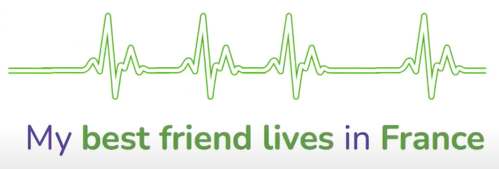
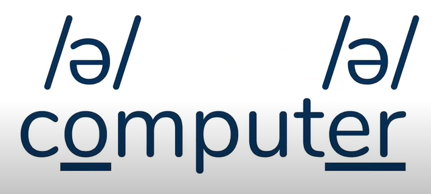
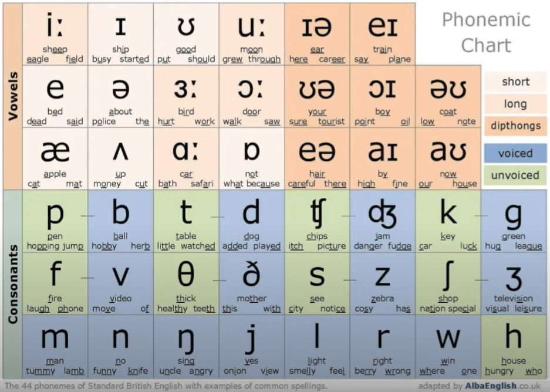

# Pronunciation 
   
<!-- more -->
## 1. English Core Pronunciation
### 1.1. Rhythm Determining Factors
- stress-timed language
  - English
  - German
- syllable-timed language
  - Chinese
  - French
- mora-timed language
  - Japanese

⚠︎  The time it takes to pronounce an English sentence is not determined by the total number of syllables but by the number of stressed syllables.


### 1.2. Sentence Stress
To put stress on some certain syllables and certain words in a sentence.

Behavior to stress:
- longer sound
- louder sound
- higher pitch
- clear and enumciated sound
- facial movement

Two Types of Words:
- content words
  - important
  - provide the content/information
  - typically: nouns, main verbs, adjectives, adverbs 
- function words
  - unimportant
  - make grammer correct



There is a constant beat in a native speaker's head.

Clap hands to keep a regular beat, that is the basic rhythm of the sentence. Now what we need to do is insert all those little function words in between the main beat.


You should more or less be able to understand what the sentence is trying to say without all the function words(Watch - children - going - town). That's why sentence stress is so important.




### 1.3. Weak Forms and Neutral Vowel /ə/
#### 1.3.1. Neutral Vowel (The Schwa Sound): /ə/
- It's one of the most common phonetic sounds in English.  
- It's quite a lazy sound.  
- It's kind of like a replacement vowel in English.  
- If you can replicate and use this neutral vowel in your English pronounciation, you will automatically sound a lot more native, because very rarely do we actually pronounce all of the vowels. We're super lazy in English, so insert this neutral vowel as much as you can.
#### 1.3.2. Weak Forms
What？
- In daily conversations, the vowels are very commonly rendered as the neutral vowel /ə/, and this particular pronunciation is called the "weak form", also known as the reduced form, reduced sounds, or reduction. 
- Note, weak pronunciation in English does not mean low volume.

Why？
- This will help you speak English more like a native speaker, avoiding Chinglish and making your phrases and sentences sound smoother and more natural.
- Help you understand the rhythm of native English speakers so you can comprehend them better.

How?
- contracting those vowel sounds to use the neutral vowel /ə/ instead

When NOT?
- End of sentence
- Contrast
- Emphasis

Which? (all of those unimportant words in a sentence)
- What kind of words in a sentence?
  - Auxiliary Verbs
    - am
    - are
    - have
    - has
    - do /də/
    - dose
    - can /kən/
    - could
    - would /wəd/
    - should
    - must /məst/
    - going to => gunna /gənə/
  - Pronouns
    - you
    - us
    - them
    - her
  - Prepositions
    - at
    - for /fə/
    - from /frəm/
    - of /əv/
    - to /tə/
  - Conjunctions
    - and /ən/
    - but /bət/
  - Articles
    - a /ə/
    - an
    - some
- Which part of a word?
  - The only rule that applies to every single word is it is never in a stressed syllable in a word.
  - suffix
    - ar (sugar)
    - er (brother)
    - or (actor)
    - our (colour)
    - ure (picture)
    - ous (nervous)


Examples: 
```
I have a /ə/ pen and /ən/ pencil.

I'm going to visit you later! -> I'm gunna /gənə/ visit you later!
```




## 2. English Detail Pronunciation
### 2.1. Alphabet


Special Focus:  
⚠︎  C /si:/  
⚠︎  G /dʒi:/   
⚠︎  W /double + U/  
⚠︎  Z /zi:/
### 2.2. Phonemic Chart


#### 2.2.1. Vowel Sounds (monophthong & diphthong)

Note: Vowels are all voiced, so you should always feel a vibration in the throat.
- monophthong: individual sound
- diphthong: two sounds


⚠︎  u: -> ü:  
⚠︎  &aelig; is more like ʌ rather than more like e. Personally, I feel that &aelig; is pronounced forward, and the mouth widens from small to large, while ʌ is pronounced backward, and the mouth size remains unchanged.

#### 2.2.2. Consonants Sounds (voiced & unvoiced)
- voiced sounds (blue): require a lot of energy, create a vibration in the throat    
- unvoiced sounds (green): light airy sound, do not create a vibration in the throat  


Voice Pairs（Everything should be exactly the same(the tongue, the jaw, the cheeks, the face), the only difference is one is voiced, strong harsh, and one is unvoiced, quiet and calm.）
- b vs p
- d vs t
- g vs k
- v vs f
- z vs s
- &eth; vs &theta;
- ʒ vs &#x00017F;
- dʒ vs t&#x00017F;

### 2.3. Word Stress
- 2-syllable words
  - ending in 'er' or 'en'
    - first syllable (eg. listen, faster)
  - nouns and adjectives
    - first syllable (eg. bottle, happy)
  - verbs and prepositions
    - second syllable (eg. begin, above)
- 3-syllable words
  - ending in 'er' or 'ly'
    - first syllable (eg. manager, quietly)
- suffixes
  - able, cian, ery, ial, ian, ible, ic, ics, ient, ion, ious, ish, osis, sion, tion
    - the second-from-end syllable (eg. creation, dramatic)
  - ade, ee, eer, ese, ette, que, oon
    - last syllable (eg. guarantee, lemonade)
  - al, cy, gy, phy, ty
    - the thrid-from-end syllable (eg. photography, democracy)
- compound words
  - compound nouns
    - first syllable (eg. hairbrush, football)
  - compound adjectives
    - second syllable (eg. old-fashioned)
  - compound verbs
    - last syllable (eg. understand)

### 2.4. Connected Speech
- Catenation: push consonants onto the vowels of the next word
  - My name is Hannah. -> My na meis Hannah.
- Assimilation: Changing a sound (when two consonants next to each other)
  - t + m/b/p => p
    - best man => bespman
    - sit back => sipback
    - pot plant => poplant
  - t + k/g => k
    - that cake => thakcack
    - fat girl => fakgirl
  - d + m/b/p => b
    - bad pain => babpain
    - good morning => goobmorning
    - good boy => goobboy
  - d + k/g => g
    - bad girl => baggirl
    - cold call => colgcall
  - n + m/b/p => m
    - action planning => actiomplanning
    - con man => comman
    - sun bathe => sumbatch
  - n + k/g => ŋ
    - action group => actioŋgroup
    - roman candle => romaŋcandle
  - s + &#x00017F; => &#x00017F;
    - bus shelter => bu&#x00017F;shelter
  - z + &#x00017F; => ʒ
    - cheese shop => cheeʒshop
- Liaison: Adding a sound (when two vowels next to each other)
  - /&aelig;/ & /ə/ => R
    - Asia and Africa are continents. => AsiaRand AfricaRare continents.
  - /u:/ & /ʊ/ => W
    - Who is that? => WhoWis that?
  - /i:/ & /ɪ/ & /eɪ/ => Y
    - This is the end. => This is theYend.
- Elision: Eliminating a sound (this is most common with the consonants H,T and D)
  - a pronoun starting with H (his, her)
    - He passed his exam. => he passedis exam.
    - She did her homework. => She dider homework.
  - End with T
    - The next day he went home. => the nexday he went home.

### 2.5. Silent Letters
- slient 'a'
  - 'ally' 
    - eg. basically /beɪsɪkli/, critically /krɪtɪkli/, physically /fɪzɪkli/
- slient 'b'
  - end with 'mb' 
    - eg. lamb /l&aelig;m/, thumb /&theta;ʌm/, comb /kəʊm/
  - 'bt' 
    - eg. debt /dɛt/, doubt /daʊt/, subtle /sʌtl/
- slient 'c'
  - 'sc'
    - eg. muscle /mʌsl/, scissors /sɪ
zəz/, science /saɪəns/
  - 'ck' or 'cq'
    - eg. block /blɒk/, acquire /əkwaɪə/
  - 'ch' -> /t&#x00017F;/
    - eg.church /t&#x00017F;ɜ:t&#x00017F;/, witch /wɪt&#x00017F;/  
- slient 'd'
  - 'nd'
    - eg. handsome /h&aelig;nsəm/, handkerchief /h&aelig;ŋkət&#x00017F;ɪf/, sandwich /s&aelig;nwɪdʒ/
  - 'dg' -> /dʒ/
    - eg. fudge /fʌdʒ/, bridge /bridʒ/
  - random word
    - Wednesday
- slient 'e'
  - last letter
    - eg. love /lʌv/, hate /heɪt/, face /feɪs/
- slient 'g'
  - start or end with 'gn'
    - eg. foreign /fɒrɪn/, sign /saɪn/, gnome /nəʊm/
  - 'gh' -> slient or /f/
    - slient
      - eg. high /haɪ/, light /laɪt/, daughter /dɔ:tə/
    - /f/
      - eg. laugh /lɑf/, cough /kɒf/, enough /ɪnʌf/
- slient 'h'
  - first letter
    - eg. hour, honest, heir /eə/
  - 'gh'
    - eg. ghost /gəʊst/, gherkin /gɜ:kɪn/
  - 'ch'
    - eg. chemistry /kɛmɪstri/, Christmas /krɪsməs/, echo /ɛkəʊ/
  - 'rh'
    - eg. rhythm /rɪ&eth;əm/, rhino /raɪnəʊ/
  - 'wh'
    - eg. when, where, what 
- slient 'k'
  - 'kn'
    - eg. know, knife, knee /ni:/
- slient 'l'
  - after 'a','o','u' in the middle
    - eg. salmon /s&aelig;mən/, yolk /jəʊk/, should /fʊd/
  - after 'a','o','u' 
- slient 'n'
  - end with 'mn'
    - eg. autumn, column
- slient 'p'
  - start with 'ps','pn','pt'
    - eg. psychology
  - random word
    - receipt /rɪsi:t/
    - coup /ku:/
  - 'ph' -> /f/
    - eg. phone
- slient 's'
  - random word
    - island /aɪlənd/
- slient 't'
  - end with 'stle'
    - eg. castle /kɑ:sl/, whistle /wɪsl/
  - end with 'sten'
    - eg. listen, fasten /fɑ:sn/
  - french words end with 't'
    - eg. ballet /b&aelig;leɪ/, beret /bɛreɪ/
  - random words
    - eg. often, Christmas /krɪsməs/, mortgage /m
ɔ:gɪdʒ/
- slient 'u'
  - 'gu' + vowel
    - eg. guitar, guard, guide
  - end with 'gue'
    - eg. tongue /tʌŋ/, catalogue /k&aelig;təlɒg/, fatigue /fəti:g/
  - random words
    - eg. buscuit /bɪskɪt/, circuit /sɜ:kɪt/, build
- slient 'w'
  - start with 'wr'
    - eg. write, wrong, wrist /rɪst/
  - 'who'
    - eg. who, whole /həʊl/
  - random words
    - eg. answer, sword /sɔ:d/, two
- slient 'x'
  - random words
    - faux /fəʊ/
- slient 'z'
  - random words
    - rendezvous /rɒndɪvu:/

### 2.6. S
- /s/
  - last letter before S is unvoiced sounds
    - looks / books
    - lamps
- /z/
  - last letter before S is voiced sounds
    - calls
    - cards
    - pens
- /ɪz/
  - last letter before ED is /dʒ/, /ʒ/, /z/, /&#x00017F;/, /t&#x00017F;/ or /s/
    - watches
    - houses


### 2.7. ED
- /t/
  - last letter before ED is unvoiced sounds (eg. walked)
- /d/
  - last letter before ED is voiced sounds (eg. called)
- /ɪd/
  - last letter before ED is /t/ or /d/ (eg. wanted, needed.  Aim :avoid different sounds)


### 2.7. Common Fault

- schedule UK:/ˈʃedjuːl/ US & Australia:/ˈskedjuːl/
- vitamin UK:/ˈvɪtəmən/ US /ˈvaɪtmən/ 
- protein /ˈprəʊtiːn/ 
- bull /bʊl/ cow /kaʊ/
- jail /dʒeɪl/ 
- soap /o/ soap opera
- soup /u/ soup recipes
- dessert /dɪˈzɜːt/ 
- couch /kaʊtʃ/ sofa
- coach /kəʊtʃ/ 
- plane /pleɪn/
- vehicle /ˈviːəkl/ 
- gold /gəʊld/ 
- mirror /ˈmɪrə/ 
- husband /ˈhʌzbənd/ 
- man /mæn/ woman /ˈwʊmən/ plural /ˈwɪmən/
- race /reɪs/  1) nationality / ethnicity 2) competition / contest
- policy /ˈpɒləsɪ/ 
- favor /ˈfeɪvə/  agree
- fever /ˈfiːvə/  disease
- mouth /maʊθ/ month /mʌnθ/
- tongue /tʌŋ/ 
- shame /ʃeɪm/ 
- desire /dɪˈzaɪə/ 
- half  uk  /hɑːf/ us  /hæf/
- angle /ˈæŋg(ə)l/ 
- angel /ˈeɪn.dʒəl/
- mood /muːd/ 
- moon /muːn/
- smooth /smuːð/ 
- process /ˈprəʊses/ 
- spray /spreɪ/
- praise /preɪz/ 
- shout /ʃaʊt/ 
- bother /ˈbɒðə/ 
- live /lɪv/ 
- breathe /briːð/ 
- lose /luːz/ 
- loose /luːs/ 
- pure /pjʊə/ 
- liquid /ˈlɪkwɪd/ 
- hot uk  /hɒt/ us  /hɑːt/
- dull /dʌl/
- spicy /ˈspaɪsɪ/ 
- loud /laʊd/ 
- violent /ˈvaɪəl(ə)nt/ 
- polite /pəˈlaɪt/ 
- police /pəˈliːs/
- please /pliːz/
- brave  /breɪv/
- gross /grəʊs/ 
- typical /ˈtɪpɪk(ə)l/ 
- causal /ˈkɔːz(ə)l/
- casual uk  /ˈkæʒ.ju.əl/ us  /ˈkæʒ.uː.əl/
- through /θruː/ 
- toward us  /tɔːrd/ /twɔːrd/ uk  /təˈwɔːd/ /twɔːd/
- against uk  /əˈɡenst/ /əˈɡeɪnst/ us  /əˈɡenst/
- bowl /bəʊl/
- quiet /ˈkwaɪ.ət/ 
- quite /kwaɪt/
- perfume /ˈpɜː.fjuːm/
- folks /fəʊks/  vs.  fox /fɒks/

