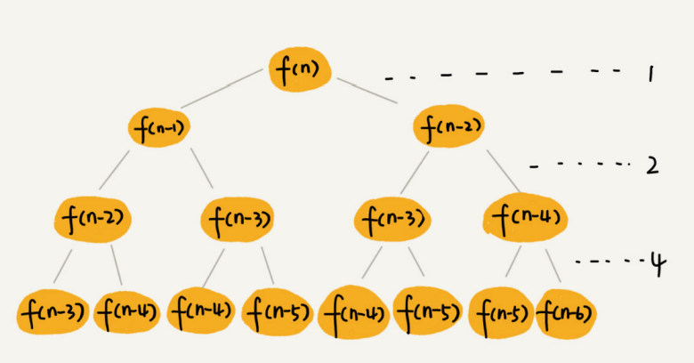
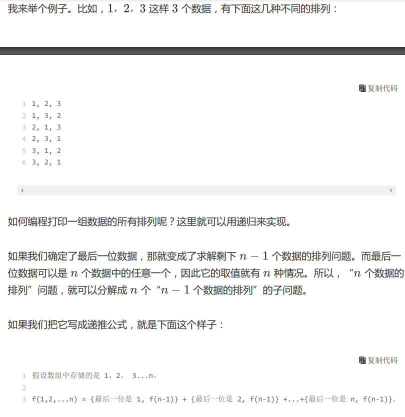
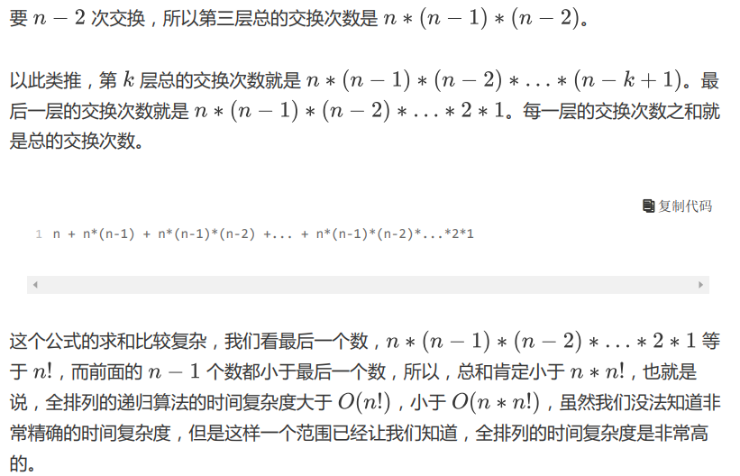

# 复杂度分析 Complexity Analysis

## 1. 大O复杂度表示法
T(n) = O(f(n)) 
- T(n)表示代码执行时间  
- n表示数据规模大小  
- f(n)表示每行代码执行次数总和    

表示代码执行时间/所需空间随数据规模增长的变化趋势。

Note：只是表示一种变化趋势，不是具体的执行时间/空间大小。低阶、常量、系数被忽略，只记录最大量级就可以了。
  
## 2. 复杂度计算

1. 最大值法则（非嵌套代码）：总复杂度等于量级最大的那段代码的复杂度 <br/>

只关注循环执行次数最多的一段代码 <br/>
如果 T1(n)=O(f(n))，T2(n)=O(g(n))； <br/>
那么 T(n)=max(T1(n),T2(n))=max(O(f(n)), O(g(n)))=O(max(f(n), g(n))) <br/>

2. 乘法法则（嵌套代码）：嵌套代码的复杂度等于嵌套内外代码复杂度的乘积 <br/>

如果 T1(n)=O(f(n))，T2(n)=O(g(n))；   
那么T(n)=T1(n)*T2(n)=O(f(n))*O(g(n))=O(f(n)*g(n)) <br/>

3. 涉及两个数据规模：无法评估 m 和 n 的量级大小，不能省略其中任意一个 <br/>

非嵌套代码：T1(m)+T2(n)=O(f(m)+g(n)) <br/>
嵌套代码：T1(m)+T2(n)=O(f(m)*g(n)) <br/>

## 3. 复杂度量级
$O(1)<O(logn)<O(n)<O(nlogn)<O(n^2)<O(2n)<O(n!)$ <br/>


1. O(1) <br/>

只要和样本量没关系，不随n的增大而增大，即使有成千上万行的代码，复杂度都是O(1)。 <br/>

2. O(logn) <br/>


这是一种极其高效的时间复杂度，有的时候甚至比时间复杂度是常量级 O(1) 的算法还要高效。为什么这么说呢？  <br/>

因为 logn 是一个非常“恐怖”的数量级，即便 n 非常非常大，对应的 logn 也很小。比如 n 等于 2 的 32 次方，这个数很大了吧？大约是 42 亿。也就是说，如果我们在 42 亿个数据中用二分查找一个数据，最多需要比较 32 次。 <br/>

用大 O 标记法表示时间复杂度的时候，会省略掉常数、系数和低阶。对于常量级时间复杂度的算法来说，O(1) 有可能表示的是一个非常大的常量值，比如 O(1000)、O(10000)。所以，常量级时间复杂度的算法有时候可能还没有 O(logn) 的算法执行效率高。     <br/>

3. O(n^2)  

反过来，对数对应的就是指数。有一个非常著名的“阿基米德与国王下棋的故事”，可以感受到指数的“恐怖”。这也是为什么我们说，指数时间复杂度的算法在 大规模数据面前是无效的。   <br/>

## 4. 通用数据结构复杂度
| **数组** | **增O(n)，删O(n)，查O(1)** |
| --- | --- |
| **链表** | **增O(1)，删O(1)，查O(n)** |
| **栈** | **增O(1)，删O(1)，查O(n)** |
| **队列** | **增O(1)，删O(1)，查O(n)** |
| **哈希表** | **查O(1)** |
| **二叉搜索树** | **增删改查：平均O(logn)，最差O(n)** |
| **平衡二叉搜索树（AVL树、红黑树）** | **增删改查：平均与最差均为O(logn)** |


## 5. 递归复杂度分析
熟练掌握分析递归复杂度的⽅法，必须得有⽐较扎实的数学基础，⽐如要牢记等差数列、等⽐数列等求和公式。   <br/>
### 5.1. 迭代法（一般不用此，用下面的公式法了）
 <br/>
## 5.2. 公式法（最便捷）
$T(n) = a \cdot T\left(\frac{n}{b}\right) + f(n^d)$

- n：问题规模大小
- a：原问题的子问题个数
- $\frac{n}{b}$：每个子问题的大小
- $f(n^d)$：将原问题分解成子问题和将子问题的解合并成原问题的解的时间

$T(n) = 
\begin{cases} 
O(n^d) & \text{if } d > \log_b a \\
O(n^d \log n) & \text{if } d = \log_b a \\
O(n^{\log_b a}) & \text{if } d < \log_b a
\end{cases}
$

示例：
||||
|---|---|---|
|$T(n) = 2 \cdot T\left(\frac{n}{2}\right) + n$|a=2, b=2, d=1|O(nlogn)|
|$T(n) = 2 \cdot T\left(\frac{n}{2}\right) + logn$|a=2, b=2|O(n)|
|$T(n) = 2 \cdot T\left(\frac{n}{2}\right) + 1$|a=2, b=2, d=0|O(n)|
|$T(n) = T\left(\frac{n}{2}\right) + 1$|a=1, b=2, d=0|O(logn)|
|$T(n) = 2 \cdot T\left(\frac{n}{4}\right) + 1$|a=2, b=4, d=0|$O(\sqrt{n})$|
|$T(n) = 3 \cdot T\left(\frac{n}{2}\right) + n^2$|a=3, b=2, d=2|$O(n^2)$|
### 5.3. 递归树：借助递归树来分析递归算法的时间复杂度
思路是重点，不要纠结于精确的时间复杂度到底是多少 <br/>
思路 <br/>

1. 计算每层的耗时（每层耗时可能一样，也可能不一样） <br/>
2. 计算树的高度（从根节点到叶子节点的路径长度，可能一样，可能不一样，不一样**可从最长路径与最短路径两方面进行分析**） <br/>
3. 了解复杂度的区间范围【最小复杂度量级，最大复杂度量级】 <br/>
4. 求得时间复杂度量级（往往最小和最大复杂度量级是同一量级） <br/>
#### 5.3.1. 递归树分析归并排序
 <br/>
一分为二递归调用：代价很低，耗时记为1 <br/>
每层归并操作：从上图可知，每层归并操作总耗时一样，都为n <br/>
树的高度：归并排序递归树是一棵满二叉树，高度为log<sub>2</sub>n <br/>
归并排序递归实现的时间复杂度=每层归并操作*层数=O(nlogn) <br/>
#### 5.3.2. 递归树分析快排
 快排最好情况下，每个分区一分为二。假设两分区大小比例为1：k，我们取k等于9，也就是说，每次分区都很不平均，一个分区是另一个分区的9倍。 如果我们把递归分解的过程画成递归树，就是下面这个样子：   <br/>
 <br/>
 <br/>
 <br/>
### 5.3.3. 递归树分析斐波那契数列
 <br/>
 <br/>
### 5.3.4. 递归树分析全排列
 <br/>
```shell
// 调用方式 
public static void main() { 
	 int[] a = {1,2,3,4}; 
   printPermutations(a,4,4); 
} 

public void printPermutations(int[] data, int n, int k) { 
	if(k == 1) { 
     for(int i = 0; i < n; i++) { 
       System.out.println(data[i]+" "); 
     } 
     System.out.println(); 
  } 
  for(int i = 0; i < k; i++) { 
    swap(data,i,k-1); 
    printPermutations(data, n, k-1); 
    swap(data,i,k-1); 
  } 
} 

private swap(int[] data,int a, int b) { 
	int tmp = data[a]; 
 	data[a] = data[b]; 
  data[b] = tmp; 
} 
```
 <br/>
 <br/>


