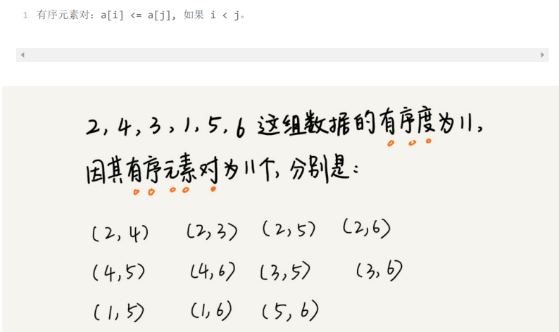
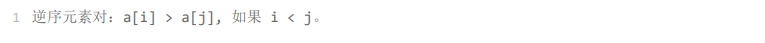
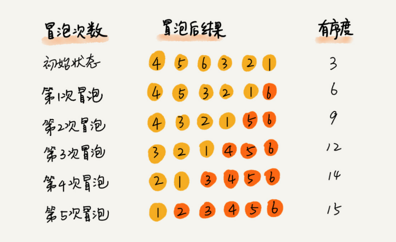
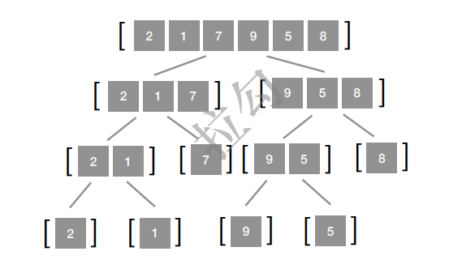
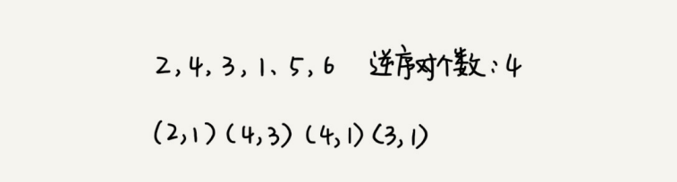
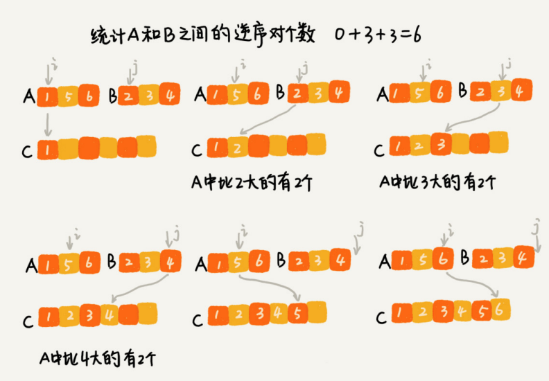
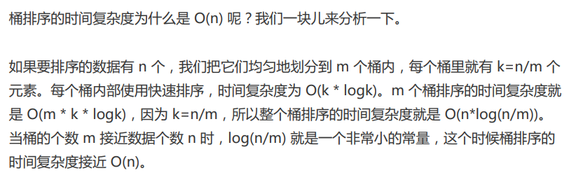
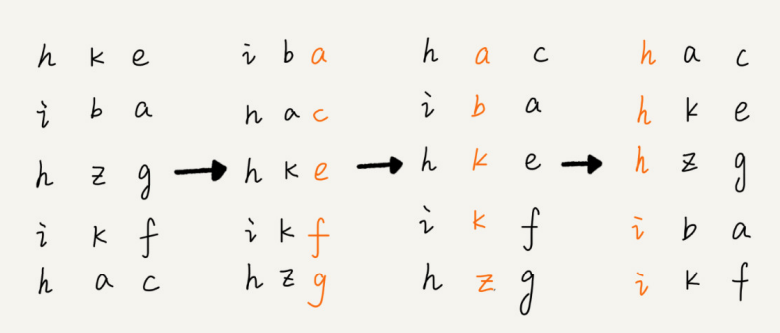

# 排序
# 排序算法的分析与评价
## 执行效率
### 最好情况、最坏情况、平均情况下的时间复杂度
对于要排序的数据，有的接近有序，有的完全无序。有序度不同的数据，对于排序的执行时间肯定是有影响的，我们要知道排序算法在不同数据下的性能表现。   <br/>
#### 平均复杂度分析：有序度&逆序度
**有序度：**是数组中具有有序关系的元素对的个数。 <br/>
对于一个倒序排列的数组，比如 6，5，4，3，2，1，有序度是 0；对于一个完全有序的数组，比如 1，2，3，4，5，6，有序度就是1+2+...+(n-1)=n*(n-1)/2，也就是 1+2+3+4+5=15。 <br/>
**满有序度**：我们把这种完全有序的数组的有序度叫作满有序度。   <br/>
 <br/>
 **逆序度**：定义正好跟有序度相反。 <br/>
 <br/>
**公式**：**逆序度 = 满有序度 - 有序度** <br/>
我们排序的过程就是一种增加有序度，减少逆序度的过程，最后达到满有序度，就说明排序完成了。  <br/>
拿冒泡排序的例子来说明。要排序的数组的初始状态是 4，5，6，3， 2，1 ，其中，有序元素对有 (4，5) (4，6)(5，6)，所以有序度是 3。n=6，所以排序完成之后终态的满有序度为 n*(n-1)/2=15。   <br/>
 <br/>
冒泡排序包含两个操作原子，**比较**和**交换**。每交换一次，有序度就加 1。不管算法怎么改 进，**交换次数总是确定的，即为逆序度**，也就是n*(n-1)/2减去初始有序度。 <br/>
此例中就是 15– 3=12，要进行 12 次交换操作。 对于包含 n 个数据的数组进行冒泡排序，平均交换次数是多少呢？最坏情况下，初始状态的有序度是 0，所以要进行 n*(n-1)/2 次交换。最好情况下，初始状态的有序度是 n*(n-1)/2，就不需要进行交换。我们可以取个中间值 n*(n-1)/4，来表示初始有序度既不是很高也不是很低的平均情况。 换句话说，平均情况下，需要 n*(n-1)/4 次交换操作，比较操作肯定要比交换操作多，而复杂度的上限是 O(n)，所以平均情况下的时间复杂度就是 O(n)。  <br/>
这个平均时间复杂度推导过程其实并不严格，但是很多时候很实用，毕竟概率论的定量分析太复杂，不太好用。 <br/>
### 时间复杂度的系数、常数、低阶
我们知道，时间复杂度反应的是数据规模 n 很大的时候的一个增长趋势，所以它表示的时候会忽略系数、常数、低阶。但是实际的软件开发中，我们排序的可能是 10 个、100 个、 1000 个这样规模很小的数据，所以，在对同一阶时间复杂度的排序算法性能对比的时候， 我们就要把系数、常数、低阶也考虑进来。 <br/>
### 比较次数和交换（或移动）次数
基于比较的排序算法的执行过程，会涉及两种操作，一种是元素比较大小，另一种是元素交换或移动。在分析排序算法 的执行效率的时候，应该把比较次数和交换（或移动）次数也考虑进去。   <br/>
## 内存消耗
算法的内存消耗可以通过空间复杂度来衡量，排序算法也不例外。不过，针对排序算法的空间复杂度，我们还引入了一个新的概念，原地排序（Sorted in place）。 原地排序算法，就是额外空间复杂度是 O(1) 的排序算法。   <br/>
## 稳定性
排序算法还有一个重要的度量指标，稳定性。这个概念是说，如果待排序的序列中存在值相等的元素，经过排序之后，相等元素之间原有的先后顺序不变。 <br/>
稳不稳定有什么意义吗？ <br/>
在讲排序的时候，我们都是用整数来举例，但在真正软件开发中，我 们要排序的往往不是单纯的整数，而是一组对象，我们需要按照对象的某个 key 来排序。   <br/>
比如说，我们现在要给电商交易系统中的“订单”排序。订单有两个属性，一个是下单时 间，另一个是订单金额。如果我们现在有 10 万条订单数据，我们希望按照金额从小到大对 订单数据排序。对于金额相同的订单，我们希望按照下单时间从早到晚有序。对于这样一个 排序需求，我们怎么来做呢？  <br/>
最先想到的方法是：我们先按照金额对订单数据进行排序，然后，再遍历排序之后的订单数 据，对于每个金额相同的小区间再按照下单时间排序。这种排序思路理解起来不难，但是实 现起来会很复杂。  <br/>
借助稳定排序算法，这个问题可以非常简洁地解决。解决思路是这样的：我们先按照下单时 间给订单排序，注意是按照下单时间，不是金额。排序完成之后，我们用稳定排序算法，按 照订单金额重新排序。两遍排序之后，我们得到的订单数据就是按照金额从小到大排序，金 额相同的订单按照下单时间从早到晚排序的。为什么呢？  <br/>
稳定排序算法可以保持金额相同的两个对象，在排序之后的前后顺序不变。第一次排序之 后，所有的订单按照下单时间从早到晚有序了。在第二次排序中，我们用的是稳定的排序算 法，所以经过第二次排序之后，相同金额的订单仍然保持下单时间从早到晚有序。   <br/>
# 10种排序算法的汇总比较

不稳定排序记忆：**快选希堆**（快速排序，选择排序，希尔排序，堆排序） <br/>

## 为什么快速排序的性能要比堆排序好？
1. 堆排序数据访问的方式没有快速排序友好。   <br/>
堆排序是跳着访问数据的，不像快速排序那样，局部顺序访问，所以，这样对 CPU 缓存是不友好的。   <br/>
2. 对于同样的数据，在排序过程中，堆排序算法的数据交换次数要多于快速排序。   <br/>
堆排序的第一步是建堆，建堆的过程会打乱数据原有的相对先后顺序，导致原数据的有序度降低。比如，对于一组已经有序的数据来说，经过建堆之后，数据反而变得更无序了。 <br/>
## 在实际的软件开发里，为什么更倾向于使用插入排序算法而不是冒泡排序算法呢？  
 <br/>
经过实验证实，插入排序确实比冒泡排序性能好，所以，如果我们希望把性能优化做到极致，那肯定首选插入排序。   <br/>
# 如何实现一个通用的、高性能的排序函数
为了兼顾任意场景（不选线性排序算法），任意规模数据（不选O(n2)的排序算法）的排序，一般都会首选时间复杂度是O(nlogn)的排序算法来实现排序函数。 <br/>
堆排序和快排都有比较多的应用，比如Java语言采用堆排序实现排序函数，C语言使用快排实现排序函数。 <br/>
归并排序使用的其实并不多，主要因为它不是原地排序算法，空间复杂度是O(n)。所以，粗略点、夸张点讲，如果要排序100MB的数据，除了数据本身占用的内存之外，排序算法还要额外再占用100MB的内存空间，空间耗费就翻倍了。 <br/>
# 大规模数据排序 O(nlogn)
## 快排（快速排序，Quick Sort）
思想：分治。递归的把整块数组拆成较小和较大的两块子数组 <br/>
技巧：双指针。两指针从两端向中间移动 <br/>
关键：选择基准值 <br/>
时间复杂度：O(nlogn) <br/>
时间复杂度是T(n)的函数：T(n)=2*T(n/2)+O(n) <br/>
空间复杂度：O(logn) <br/>
快排每次递归过程中，只需要开辟O(1)的存储空间来完成交换操作实现对数组的修改，所以它的整体空间复杂度完全取决于压栈的次数。 <br/>
由于划分的结果不同导致了快速排序递归调用的层数也会不同，最坏情况下需O(n) 的空间，最优情况下每次都平衡，此时整个递归树高度为 logn。 <br/>
总体而言，快速排序的空间复杂度为 O(logn)。 <br/>
快排模版： <br/>
```java
void sort(int[] nums, int left, int right) { <br/>
    if (left >= right) return; <br/>
    int i = left, j = right, x = nums[i]; // 将最左端的元素作为基准值x，此时最左端空出来了 <br/>
    while (i < j) {// 每一轮把前后各一个不符合的元素挪到对应的块 <br/>
        while (i < j && nums[j] > x) --j; // j向左移，把遇到的第一个小于基准值x的元素移到左边空出的位置i处 <br/>
        if (i < j) nums[i++] = nums[j]; <br/>
        while (i < j && nums[i] <= x) ++i; // i向右移，把遇到的第一个大于基准值x的元素移到右边空出的位置j处 <br/>
        if (i < j) nums[j--] = nums[i]; <br/>
    } <br/>
    nums[i] = x; // 此刻空出的位置前都不大于x,空出的位置后都不小于x。然后把基准值x放在空出的位置 <br/>
    sort(nums, left, i-1); <br/>
    sort(nums, i+1, right); <br/>
} <br/>
```
### 如何优化快排
快排出现O(n2)时间复杂度的主要原因是分区点选的不够合理。 <br/>
最理想的分区点是：被分区点分开的两个分区中，数据的数量差不多。 <br/>
两种比较常用、比较简单的分区算法如下： <br/>
#### 三数取中法
从区间的首、尾、中间，分别取出一个数，然后对比大小，取这3个数的中间值作为分区点。 <br/>
变体：“五数取中法”或“十数取中法” <br/>
#### 随机法
从区间中随机选一个数作为分区点。 <br/>
这种方法并不能保证每 次分区点都选的比较好，但是从概率的角度来看，也不大可能会出现每次分区点都选的很差 的情况，所以平均情况下，这样选的分区点是比较好的。时间复杂度退化为最糟糕的 O(n ) 的情况，出现的可能性不大。   <br/>
### 在 O(n) 的时间复杂度内查找第 K 大元素  
> 通过快排的分区，进行二分查找 <br/>

 比如，4， 2， 5， 12， 3 这样一组数据，第 3 大元素就是 4。   <br/>
 <br/>
第一次分区查找，我们需要对大小为 n 的数组执行分区操作，需要遍历 n 个元素。 <br/>
第二次分区查找，我们只需要对大小为 n/2 的数组执行分区操作，需要遍历 n/2 个元素。 <br/>
依此类推，分区遍历元素的个数分别为n、n/2、n/4、n/8、n/16.……直到区间缩小为 1。 如果我们把每次分区遍历的元素个数加起来，就是：n+n/2+n/4+n/8+…+1。这是一个等 比数列求和，最后的和等于 2n-1。所以，上述解决思路的时间复杂度就为 O(n)。    <br/>
你可能会说，我有个很笨的办法，每次取数组中的最小值，将其移动到数组的最前面，然后 在剩下的数组中继续找最小值，以此类推，执行 K 次，找到的数据不就是第 K 大元素了吗？ 不过，时间复杂度就并不是 O(n) 了，而是 O(K * n)。你可能会说，时间复杂度前面的系数不是可以忽略吗？O(K * n) 不就等于 O(n) 吗？ 这个可不能这么简单地划等号。当 K 是比较小的常量时，比如 1、2，那最好时间复杂度确实是 O(n)；但当 K 等于 n/2 或者 n 时，这种最坏情况下的时间复杂度就是 O(n2 ) 了。   <br/>
## 归并排序（Merge Sort）
思想：分治，把一个复杂问题拆成若干子问题来求解 <br/>
 <br/>
轮数：logn轮（一棵树的高度） <br/>
每一轮操作：把树的这层每个左右分枝的两序列合并为一个序列 <br/>
时间复杂度：O(nlogn)    <br/>
时间复杂度是T(n)的函数：T(n)=2*T(n/2)+O(n) <br/>
整体估计： <br/>
一共进行logn层，每一层的合并复杂度都是O(n)，所以整体复杂度是O(nlogn) <br/>
空间复杂度：O(n) <br/>
需要分配一个大小为n的额外数组，并且每次递归调用都重复利用同一个数组 <br/>
 归并排序的空间复杂度到底是多少呢？ 是 O(n)，还是 O(nlogn)，应该如何分析呢？ 如果我们继续按照分析递归时间复杂度的方法，通过递推公式来求解，那整个归并过程需要 的空间复杂度就是 O(nlogn)。不过，类似分析时间复杂度那样来分析空间复杂度，这个思路对吗？ 实际上，递归代码的空间复杂度并不能像时间复杂度那样累加。刚刚我们忘记了最重要的一 点，那就是，尽管每次合并操作都需要申请额外的内存空间，但在合并完成之后，临时开辟的内存空间就被释放掉了。在任意时刻，CPU 只会有一个函数在执行，也就只会有一个临时的内存空间在使用。临时内存空间最大也不会超过 n 个数据的大小，所以空间复杂度是 O(n)。   <br/>
归并排序模版： <br/>
```java
/** <br/>
说明：tmp数组大小为n,初始为空数组即可。 <br/>
*/ <br/>
void sort(int[] A,int low, int high, int[] tmp) { <br/>
    if(low >= high) return; <br/>
    int mid = low + (high - low) / 2; <br/>
    sort(A,low,mid,tmp); <br/>
    sort(A,mid+1,high,tmp); <br/>
    merge(A,low,mid,high,tmp); <br/>
} <br/>

void merge(int[] nums, int low, int mid, int high, int[] tmp) { <br/>
    int k = low, i = low, j = mid + 1; <br/>
    for(int t = low; t <= high; t++) { <br/>
        tmp[t] = nums[t]; <br/>
    } <br/>
    while(k <= high) { <br/>
        if(i > mid) { <br/>
            nums[k++] = tmp[j++]; <br/>
        } else if(j > high) { <br/>
            nums[k++] = tmp[i++]; <br/>
        } else if(tmp[j] < tmp[i]) { <br/>
            nums[k++] = tmp[j++]; <br/>
        } else { <br/>
            nums[k++] = tmp[i++]; <br/>
        } <br/>
    } <br/>
} <br/>
```
### 归并排序和分治的应用：统计逆序对个数
在排序算法里，我们用有序度来表示一组数据的有序程度，用逆序度表示一组数据的无序程度。 假设我们有 n 个数据，我们期望数据从小到大排列，那完全有序的数据的有序度就是 n(n-1)/2，逆序度等于 0；相反，倒序排列的数据的有序度就是 0，逆序度是 n(n-1)/2。除了这两种极端情况外，我们通过计算有序对或者逆序对的个数，来表示数据的有序度或逆序度。   <br/>
 <br/>
如何编程求出一组数据的有序对个数或者逆序对个数呢？因为有序对个数和逆序对个数的求解方式是类似的，所以你可以只思考逆序对个数的求解方法。   <br/>
最笨的方法是，拿每个数字跟它后面的数字比较，看有几个比它小的。我们把比它小的数字 个数记作 k，通过这样的方式，把每个数字都考察一遍之后，然后对每个数字对应的 k 值求 和，最后得到的总和就是逆序对个数。不过，这样操作的时间复杂度是 O(n^2)。那有没有 更加高效的处理方法呢？   <br/>
我们用分治算法来试试。我们套用分治的思想来求数组 A 的逆序对个数。我们可以将数组 分成前后两半 A1 和 A2，分别计算 A1 和 A2 的逆序对个数 K1 和 K2，然后再计算 A1 与 A2 之间的逆序对个数 K3。那数组 A 的逆序对个数就等于 K1+K2+K3。   <br/>
使用分治算法其中一个要求是，子问题合并的代价不能太大，否则就起不了降低时间复杂度的效果了。那回到这个问题，如何快速计算出两个子问题 A1 与 A2 之间的逆序对个数呢？ <br/>
这里就要借助归并排序算法了。     <br/>
归并排序中有一个非常关键的操作，就是将两个有序的小数组，合并成一个有序的数组。实 际上，在这个合并的过程中，我们就可以计算这两个小数组的逆序对个数了。   <br/>
 <br/>
```shell
private int num = 0; // 全局变量或者成员变量 <br/>
public int count(int[] a, int n) { <br/>
   num = 0; <br/>
   mergeSortCounting(a, 0, n-1); <br/>
   return num; <br/>
} <br/>
private void mergeSortCounting(int[] a, int p, int r) { <br/>
   if (p >= r) return; <br/>
   int q = (p+r)/2; <br/>
   mergeSortCounting(a, p, q); <br/>
   mergeSortCounting(a, q+1, r); <br/>
   merge(a, p, q, r); <br/>
} <br/>
private void merge(int[] a, int p, int q, int r) { <br/>
   int i = p, j = q+1, k = 0; <br/>
   int[] tmp = new int[r-p+1]; <br/>
   while (i<=q && j<=r) { <br/>
       if (a[i] <= a[j]) { <br/>
       		 tmp[k++] = a[i++]; <br/>
       } else { <br/>
           num += (q-i+1); // 统计 p-q 之间，比 a[j] 大的元素个数 <br/>
           tmp[k++] = a[j++]; <br/>
       } <br/>
   } <br/>
   while (i <= q) { // 处理剩下的 <br/>
   		tmp[k++] = a[i++]; <br/>
   } <br/>
   while (j <= r) { // 处理剩下的 <br/>
   		tmp[k++] = a[j++]; <br/>
   } <br/>
   for (i = 0; i <= r-p; ++i) { // 从 tmp 拷贝回 a <br/>
   		a[p+i] = tmp[i]; <br/>
   } <br/>
} <br/>
```
## 堆排序（Heap Sort）
# 小规模数据排序 O(n^2)
## 冒泡排序（Bubble Sort）
轮数：n-1轮 <br/>
每一轮操作：相邻元素两两比较，不符的进行交换 <br/>
每一轮结果：数组后端多一个元素排在正确位置 <br/>
k轮结果：最后k个元素排在了正确位置 <br/>
优化：如果上一轮完全没有进行过交换，那么结束。 <br/>
```java
void sort(int[] nums) { <br/>
    boolean hasChange = true; <br/>
    for(int i = 0; i < nums.length - 1 && hasChange; i++) { <br/>
    	hasChange = false; <br/>
        for(int j = 0; j < nums.length - 1 - i; j++) { <br/>
            if(nums[j] > nums[j+1]) { <br/>
                swap(nums,j,j+1); <br/>
                hasChange = true; <br/>
            } <br/>
        } <br/>
    } <br/>
} <br/>
```
## 选择排序（Selection Sort）
轮数：n-1轮 <br/>
每一轮操作：记录未排好序中最小的元素及其下标，和未排好序的首位元素进行交换 <br/>
每一轮结果：数组前端多一个元素排在正确位置 <br/>
k轮结果：前k个元素排在了正确位置 <br/>
## 插入排序（Insertion Sort）
轮数：n-1轮 <br/>
每一轮操作：把尚未排好的一个元素插入到已排好序的部分 <br/>
每一轮结果：前面排好序的部分多了一个元素 <br/>
k轮结果：前k个元素排好了序（Note：不一定在最终的正确位置） <br/>
```java
void sort(int[] nums) { <br/>
    for(int i = 1,j,current; i < nums.length; i++) { <br/>
        current = nums[i]; <br/>
        for(j = i - 1; j >= 0 && nums[j] > current; j--) { <br/>
            nums[j+1] = nums[j]; <br/>
        } <br/>
        nums[j+1] = current; <br/>
    } <br/>
}  <br/>
```
## 希尔排序（Shell Sort）插入排序的优化
# 线性排序 O(n)
 线性排序算法的时间复杂度比较低，适用场景比较特殊。   <br/>
三种时间复杂度是 O(n) 的排序算法：桶排序、计数排序、基数排序。因为这些排序算法的时间复杂度是线性的，所以我们把这类排序算法叫作线性排序（Linear sort）。之所以能做到线性的时间复杂度，主要原因是，这三个算法是非基于比较的排序算法，都不涉及元素之间的比较操作。   <br/>
## 桶排序（Bucket Sort）
 <br/>
### 复杂度分析
 <br/>
### 适用场景

1. 首先，要排序的数据需要很容易就能划分成 m 个桶，并且，桶与桶之间有着天然的大小顺 序。这样每个桶内的数据都排序完之后，桶与桶之间的数据不需要再进行排序。  <br/>
2. 其次，数据在各个桶之间的分布是比较均匀的。如果数据经过桶的划分之后，有些桶里的数 据非常多，有些非常少，很不平均，那桶内数据排序的时间复杂度就不是常量级了。在极端 情况下，如果数据都被划分到一个桶里，那就退化为 O(nlogn) 的排序算法了。 <br/>
3. 桶排序比较适合用在**外部排序**中。所谓的外部排序就是数据存储在外部磁盘中，数据量比较大，内存有限，无法将数据全部加载到内存中。     <br/>
### 应用：海量数据排序（无法将数据全部加载到内存中）
比如说我们有 10GB 的订单数据，我们希望按订单金额（假设金额都是正整数）进行排序，但是我们的内存有限，只有几百 MB，没办法一次性把 10GB 的数据都加载到内存中。这个时候该怎么办呢？  <br/>
现在我来讲一下，如何借助桶排序的处理思想来解决这个问题。  <br/>
我们可以先扫描一遍文件，看订单金额所处的数据范围。假设经过扫描之后我们得到，订单 金额最小是 1 元，最大是 10 万元。我们将所有订单根据金额划分到 100 个桶里，第一个桶我们存储金额在 1 元到 1000 元之内的订单，第二桶存储金额在 1001 元到 2000 元之内的订单，以此类推。每一个桶对应一个文件，并且按照金额范围的大小顺序编号命名 （00，01，02…99）。  <br/>
理想的情况下，如果订单金额在 1 到 10 万之间均匀分布，那订单会被均匀划分到 100 个 文件中，每个小文件中存储大约 100MB 的订单数据，我们就可以将这 100 个小文件依次放到内存中，用快排来排序。等所有文件都排好序之后，我们只需要按照文件编号，从小到大依次读取每个小文件中的订单数据，并将其写入到一个文件中，那这个文件中存储的就是按照金额从小到大排序的订单数据了。  <br/>
不过，你可能也发现了，订单按照金额在 1 元到 10 万元之间并不一定是均匀分布的 ，所 以 10GB 订单数据是无法均匀地被划分到 100 个文件中的。有可能某个金额区间的数据特 别多，划分之后对应的文件就会很大，没法一次性读入内存。这又该怎么办呢？  <br/>
针对这些划分之后还是比较大的文件，我们可以继续划分，比如，订单金额在 1 元到 1000 元之间的比较多，我们就将这个区间继续划分为 10 个小区间，1 元到 100 元，101 元到 200 元，201 元到 300 元…901 元到 1000 元。如果划分之后，101 元到 200 元之间的订 单还是太多，无法一次性读入内存，那就继续再划分，直到所有的文件都能读入内存为止。   <br/>
## 计数排序（Counting Sort）桶排序的一种特殊情况
当要排序的 n 个数据，所处的范围并不大的时候，比如最大值是 k，我们就可以把数据划分成 k 个桶。每个桶内的数据值都是相同的，省掉了桶内排序的时间。 <br/>
计数排序跟桶排序非常类似，只是桶的大小粒度不一样。 <br/>
### 复杂度分析
因为只涉及扫描遍历操作，所以时间复杂度是O(n) <br/>
空间复杂度是O(k)，k为桶的个数，即数据范围 <br/>
### 适用场景

1. 只能用在数据范围不大的场景中，如学生成绩范围0-100，年龄范围1-120等。 <br/>

如果数据范围k比要排序的数据n大很多，就不适合用计数排序了。 <br/>

2. 只能给非负整数排序 <br/>

如果不是非负整数，看是否可以转换到非负整数范围内。 <br/>
比如，如果考生成绩精确到小数后一位，我们就需要将所有的分数都先乘以 10，转化成整数，然后再放到 9010 个桶内。 <br/>
再比如，如果要排序的数据中有负数，数据的范围是 [-1000, 1000]，那我们就需要先对每个数据都加 1000，转化成非负整数。   <br/>
### 应用：如何根据年龄给100万用户排序
我们假设年龄的范围最小 1 岁，最大不超过 120 岁。我们可以遍历这 100 万用户，根据年龄将其划分到这 120 个桶里，然后依次顺序遍历这 120 个桶中的元素。这样就得到了按照年龄排序的 100 万用户数据。   <br/>
## 基数排序（Radix Sort）按位排序
基数排序借助于稳定排序算法。数据可以分割成k位，从低位到高位依次排序，每一位使用线性排序算法（桶排序或计数排序）来排序。 <br/>
 <br/>
### 不等长的处理：补齐到相同长度
要排序的数据并不都是等长的，比如我们排序牛津字典中的 20 万个英文单词，最短的只有 1 个字母，最长的我特意去查了下，有 45 个字母，中文翻译是尘肺病。对于这种不等长的数据，基数排序还适用吗？   <br/>
我们可以把所有的单词补齐到相同长度，位数不够的可以在后面补“0”，因为根 据ASCII 值，所有字母都大于“0”，所以补“0”不会影响到原有的大小顺序。这样就可 以继续用基数排序了。   <br/>
### 时间复杂度分析
如果要排序的n个数据都有k位，那就需要k次桶排序或计数排序，总的时间复杂度是O(k*n)。 <br/>
当k不大时，比如手机号排序的例子，k最大就是11，所以基数排序的时间复杂度就近似于O(n)。 <br/>
### 适用场景

1. 数据可以分割出独立的“位”来比较 <br/>
2. 每一位的数据范围不能太大，要可以用线性排序算法（桶排序或计数排序）来排序，否则，基数排序的时间复杂度就无法做到O(n)了 <br/>
3. 位之间有递进的关系， 如果 a 数据的高位比 b 数据大，那剩下的低位就不用比较了。 <br/>
### 应用：10万个手机号码排序
借助稳定排序算法，这里有一个巧妙的实现思路。 <br/>
先按照最后一位来排序手机号码，然后，再按照倒数第二位重新排序，以此类推，最后按照第一位重新排序。经过 11 次排序之后，手机号码就都有序了。 <br/>
每一位的排序使用桶排序或计数排序。 <br/>