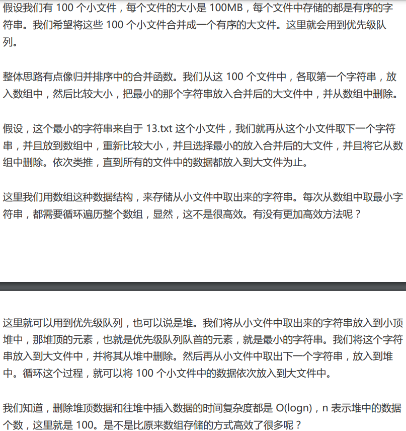
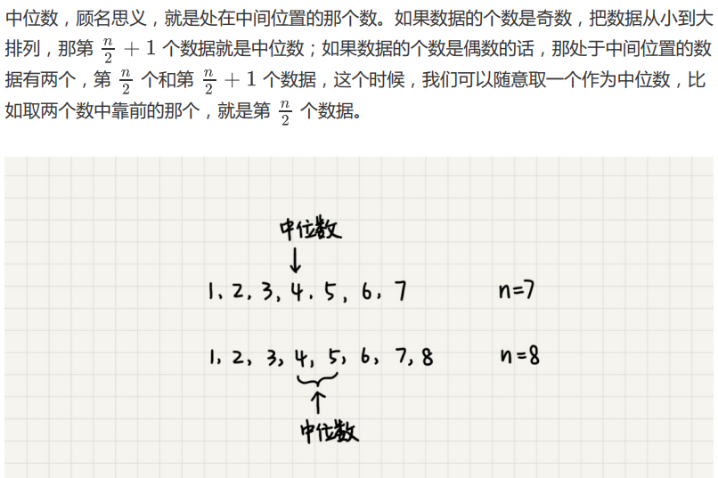

# 堆（优先队列）
## 概念（关键词：堆、完全二叉树、优先队列）
只要满足以下这两点，它就是一个堆： <br/>

1. 堆是一个**完全二叉树** <br/>
2. 堆中每一个节点的值都必须大于等于（或小于等于）其子树中每个节点的值 <br/>

特性：堆顶拥有最高优先级；每个父节点的优先级高于子节点的优先级。 <br/>
## 分类
### 大根堆（大顶堆）
概念：每个节点的值都大于等于子树中每个节点值的堆 <br/>
特点：堆顶元素存储的是堆中数据的最大值 <br/>
### 小根堆（小顶堆）
概念：每个节点的值都小于等于子树中每个节点值的堆 <br/>
特点：堆顶元素存储的是堆中数据的最小值 <br/>
## 存储（和完全二叉树一致）
### 数组（一般用此）
用一维数组存，从下标1开始存，x的左儿子为2x，x的右儿子为2x+1 <br/>
Note：下标从1开始，方便计算左儿子和右儿子的位置，从0开始不太方便 <br/>
 <br/>
### 链表（一般不用）
## 操作（仅两种，都称为堆化）
**堆化**的理解：堆发生变动后，恢复堆的过程。 <br/>
插入数据和删除堆顶元素的主要逻辑就是堆化 。   <br/>
堆化分为两种： <br/>

1. **从下往上堆化**（向上筛选/sift up/bubble up） <br/>
2. **从上往下堆化**（向下筛选/sift down/bubble down） <br/>

插入时用从下往上的堆化，删除时用从上往下的堆化。 <br/>
堆化的时间复杂度跟树的高度成正比，也就是O(logn) 。 <br/>
### 往堆中插入一个元素（从下往上堆化）O(logn)
把新插入的元素放到堆的最后，然后进行从下往上的堆化。 <br/>
如下为新插入22，从下往上的堆化方法。   <br/>
 <br/>
### 删除堆顶元素（从上往下堆化）O(logn)
堆顶拿走后，把最后一个节点放到堆顶，然后进行从上往下的堆化。 <br/>
 <br/>
## 堆排序
堆排序是一种原地的、时间复杂度为O(nlogn)的排序算法。堆排序不是稳定的排序算法。 <br/>
堆排序包括建堆和排序两个操作，建堆过程的时间复杂度是O(n) ，排序过程的时间复杂度是O(nlogn) ，所以，堆排序整体的时间复杂度是O(nlogn) 。   <br/>
如何基于堆实现排序？我们可以把堆排序的过程大致分解成两个大的步骤，建堆和排序。 <br/>
### 1.建小根堆（就是往堆中插入元素）
我们首先将数组原地建成一个堆。所谓“原地”就是，不借助另一个数组，就在原数组上操作。  <br/>
我们将下标从n/2到1的节点，依次进行从上到下的堆化操作，然后就可以将数组中的数据组织成堆这种数据结构。 <br/>
```java
private static void headpify(int[] arr) { <br/>
    int n = arr.length; <br/>
    if (n < 2) return; <br/>
    for (int i = (n - 2) / 2; i >= 0; --i) { <br/>
        int p = i, val = arr[i]; // Down <br/>
        while (p < n) { <br/>
            if (2 * p + 1 >= n) break; <br/>
            int left = arr[2 * p + 1], right = 2 * p + 2 < n ? arr[2 * p + 2] : Integer.MAX_VALUE, minVal = Math.min(left, right); <br/>
            if (val <= minVal) break; <br/>
            arr[p] = minVal; <br/>
            p = minVal == left ? 2 * p + 1 : 2 * p + 2; <br/>
        } <br/>
        arr[p] = val; <br/>
    } <br/>
} <br/>
```
   
#### 例题
从完全二叉树的最右下角元素开始，将父节点直到根节点的元素，进行比较并交换，从右到左，从下到上每个元素依次进行相同操作。 <br/>
 <br/>
### 2.排序（就是删除堆顶元素）
我们迭代地将堆顶的元素放到堆的末尾，并将堆的大小减一，然后再堆化，重复这个过程，直到堆中只剩下一个元素，整个数组中的数据就都有序排列了。  <br/>
## 堆的应用
### 优先队列
保证每次取出的元素是队列中优先级最高的。 <br/>
优先级别可自定义。 <br/>
在优先级队列中，数据的出队顺序不是先进先出，而是按照优先级来，优先级最高的，最先出队。 <br/>
如何实现一个优先级队列呢？方法有很多，但是用堆来实现是最直接、最高效的。这是因为，堆和优先级队列非常相似。一个堆就可以看作一个优先级队列。很多时候，它们只是概 念上的区分而已。往优先级队列中插入一个元素，就相当于往堆中插入一个元素；从优先级队列中取出优先级最高的元素，就相当于取出堆顶元素。  <br/>
你可别小看这个优先级队列，它的应用场景非常多。我们后面要讲的很多数据结构和算法都 要依赖它。比如，赫夫曼编码、图的最短路径、最小生成树算法等等。不仅如此，很多语言中，都提供了优先级队列的实现，比如，Java 的 PriorityQueue，C++ 的 priority_queue 等。   <br/>
具体应用： <br/>
1）合并有序小文件 <br/>
 <br/>
2）高性能定时器 <br/>
假设我们有一个定时器，定时器中维护了很多定时任务，每个任务都设定了一个要触发执行 的时间点。定时器每过一个很小的单位时间（比如 1 秒），就扫描一遍任务，看是否有任务到达设定的执行时间。如果到达了，就拿出来执行。   <br/>
但是，这样每过 1 秒就扫描一遍任务列表的做法比较低效，主要原因有两点：第一，任务的约定执行时间离当前时间可能还有很久，这样前面很多次扫描其实都是徒劳的；第二，每次都要扫描整个任务列表，如果任务列表很大的话，势必会比较耗时。   <br/>
针对这些问题，我们就可以用优先级队列来解决。我们按照任务设定的执行时间，将这些任 务存储在优先级队列中，队列首部（也就是小顶堆的堆顶）存储的是最先执行的任务。  <br/>
它拿队首任务的执行时间点，与当前时间点相减，得到一个时间间隔 T。定时器就可以设定在 T 秒之后，再来执行任务。从当前时间点到（T-1）秒这段时间里，定时器都不需要做任何事情。     <br/>
这样，定时器既不用间隔 1 秒就轮询一次，也不用遍历整个任务列表，性能也就提高了。   <br/>
### Top K
维护一个大小为 K 的小顶堆，堆中的数据就是前 K 大数据 。这样，无论任何时候需要查询当前的前 K 大数据，我们都可以里立刻返回给他。    <br/>
当有数据被添加到集合中时，我们就拿它与堆顶的元素对比。如果比堆顶元素大，我们就把堆顶元素删除，并且将这个元素插入到堆中；如果比堆顶元素小，则不做处理。   <br/>

快速获取到Top 10最热门的搜索关键词  <br/>
假设现在我们有一个包含 10 亿个搜索关键词的日志文件，如何快速获取到 Top 10 最热门的搜索关键词呢？    <br/>
处理这个问题，有很多高级的解决方法，比如使用 MapReduce 等。但是，如果我们将处理的场景限定为单机，可以使用的内存为 1GB。那这个问题该如何解决呢？   <br/>
10 亿的关键词还是很多的。我们假设 10 亿条搜索关键词中不重复的有 1 亿条，如果每个搜索关键词的平均长度是 50 个字节，那存储 1 亿个关键词起码需要 5GB 的内存空间，而散列表因为要避免频繁冲突，不会选择太大的装载因子，所以消耗的内存空间就更多了。而我们的机器只有 1GB 的可用内存空间，所以我们无法一次性将所有的搜索关键词加入到内存中。这个时候该怎么办呢？   <br/>
1）将 10 亿条搜索关键词先通过哈希算法**分片**到 10 个文件中    <br/>
具体可以这样做：我们创建 10 个空文件 00，01，02，……，09。我们遍历这 10 亿个关键词，并且通过某个哈希算法对其求哈希值，然后哈希值同 10 取模，得到的结果就是这个搜索关键词应该被分到的文件编号。 <br/>
对这 10 亿个关键词分片之后，每个文件都只有 1 亿的关键词，去除掉重复的，可能就只有 1000 万个，每个关键词平均 50 个字节，所以总的大小就是 500MB。1GB 的内存完全可以放得下。 <br/>
2） 对每个包含 1 亿条搜索关键词的文件，利用散列表和堆，分别求出 Top 10    <br/>
2.1 统计关键字频率 <br/>
因为用户搜索的关键词，有很多可能都是重复的，所以我们首先要统计每个搜索关键词出现的频率。 假设我们选用散列表。我们就顺序扫描这 10 亿个搜索关键词。当扫描到某个关键词时，我们去散列表中查询。如果存在，我们就将对应的次数加一；如果不存在，我们就将它插入到散列表，并记录次数为 1。以此类推，等遍历完这 10 亿个搜索关键词之后，散列表中就存储了不重复的搜索关键词以及出现的次数。  <br/>
2.2  维护一个大小为 10 的小顶堆 <br/>
用堆求 Top K 的方法，建立一个大小为 10 的小顶堆，遍历散列表，依次取出每个搜索关键词及对应出现的次数，然后与堆顶的搜索关键词对比。如果出 现次数比堆顶搜索关键词的次数多，那就删除堆顶的关键词，将这个出现次数更多的关键词加入到堆中。 <br/>
2.3   堆中的搜索关键词就是出现次数最多的 Top 10 搜索关键词   <br/>
3）   把这个 10 个 Top 10 放在一块，然后取这 100 个关键词中，出现次数最多的 10 个关键词， 这就是这 10 亿数据中的 Top 10 最频繁的搜索关键词了。  <br/>
### 中位数（N分位数）
 <br/>
对于一组静态数据，中位数是固定的，我们可以先排序，第n/2个数据就是中位数。每次询 问中位数的时候，我们直接返回这个固定的值就好了。所以，尽管排序的代价比较大，但是 边际成本会很小。但是，如果我们面对的是动态数据集合，中位数在不停地变动，如果再用 先排序的方法，每次询问中位数的时候，都要先进行排序，那效率就不高了。  <br/>
借助堆这种数据结构，我们不用排序，就可以非常高效地实现求中位数操作。我们来看看， 它是如何做到的？   <br/>
要维护两个堆，一个大顶堆，一个小顶堆。大顶堆中存储前半部分数据，小顶堆中存储后半部分数据，且小顶堆中的数据都大于大顶堆中的数据。  如果是偶数，各存n/2个数据；如果是奇数，大顶堆存n/2+1个数据，小顶堆存n/2个数据。 <br/>
当新添加一个数据的时候，我们如何调整两个堆，让 大顶堆中的堆顶元素继续是中位数呢？ 如果新加入的数据小于等于大顶堆的堆顶元素，我们就将这个新数据插入到大顶堆；如果新 加入的数据大于等于小顶堆的堆顶元素，我们就将这个新数据插入到小顶堆。   <br/>
两个堆中的数据个数不符合前面约定的情况，这个时候，我们可以从一个堆中不停地将堆顶元素移动到另一个堆，通过这样的调整， 来让两个堆中的数据满足上面的约定。   <br/>
于是，我们就可以利用两个堆，一个大顶堆、一个小顶堆，实现在动态数据集合中求中位数 的操作。插入数据因为需要涉及堆化，所以时间复杂度变成了 O(logn)，但是求中位数我们 只需要返回大顶堆的堆顶元素就可以了，所以时间复杂度就是 O(1)。   <br/>
 <br/>

实际上，利用两个堆不仅可以快速求出中位数，还可以**快速求其他百分位的数据**，原理是类似的。 <br/>
“如何快速求接口 的 99% 响应时间？”   <br/>
如果有 100 个接口访问请求，每个接口请求的响应时间都不同，比如 55 毫秒、100 毫秒、23 毫秒等，我们把这 100 个接口的响应时间按照从小到大排列，排在第 99 的那个数据就是 99% 响应时间，也叫 99 百分位响应时间。   我们总结一下，如果有 n 个数据，将数据从小到大排列之后，99 百分位数大约就是第 n*99% 个数据，同类，80 百分位数大约就是第 n*80% 个数据。   <br/>
我们维护两个堆，一个大顶堆，一个小顶堆。假设当前总数据的个数是 n，大顶堆中保存 n*99% 个数据，小顶堆中保存 n*1% 个数据。大顶堆堆顶的数据就是我们要找的 99% 响应时间。 <br/>
每次插入一个数据的时候，我们要判断这个数据跟大顶堆和小顶堆堆顶数据的大小关系，然 后决定插入到哪个堆中。如果这个新插入的数据比大顶堆的堆顶数据小，那就插入大顶堆； 如果这个新插入的数据比小顶堆的堆顶数据大，那就插入小顶堆。   <br/>
但是，为了保持大顶堆中的数据占 99%，小顶堆中的数据占 1%，在每次新插入数据之后，我们都要重新计算，这个时候大顶堆和小顶堆中的数据个数，是否还符合 99:1 这个比例。如果不符合，我们就将一个堆中的数据移动到另一个堆，直到满足这个比例。   <br/>
通过这样的方法，每次插入数据，可能会涉及几个数据的堆化操作，所以时间复杂度是 O(logn)。每次求 99% 响应时间的时候，直接返回大顶堆中的堆顶数据即可，时间复杂度 是 O(1)。 <br/>
