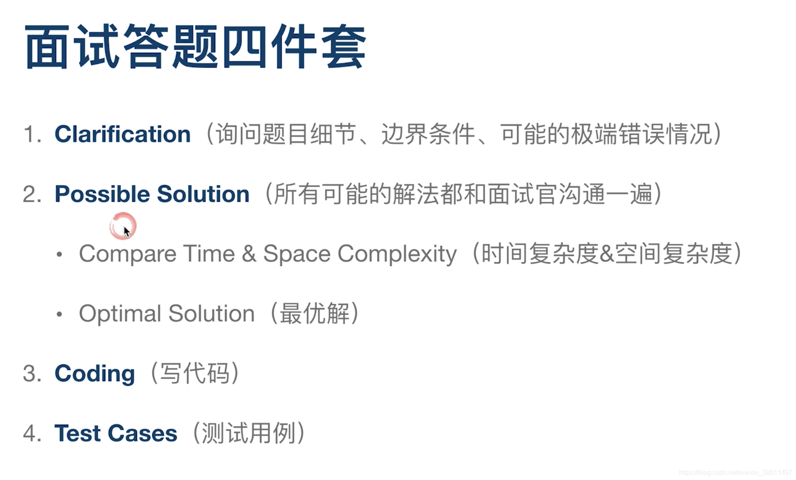
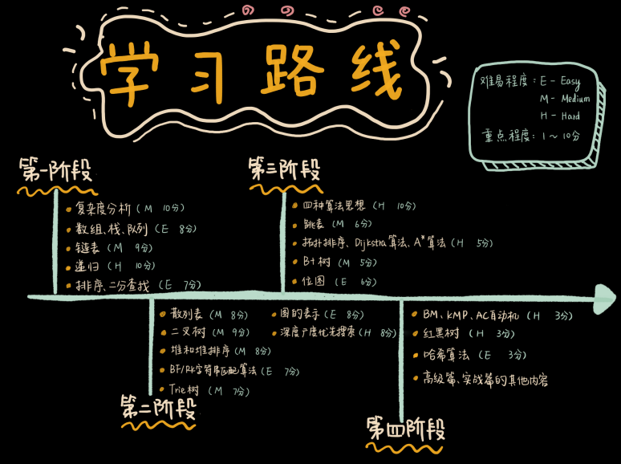

# 算法提升
# 刷题（持续练习，刻意练习不熟悉的数据结构和算法，反复回顾）
刷算法  
1.限时10分钟想思路，如果想不出来直接看题解，节省时间，试着根据题解写代码，还写不出来，直接看题解代码，理解后复现  
2.重复刷题：时间久了会生疏，需重复刷找回记忆  
3.写解题报告  
写解题步骤，供忘记了快速想起来，减少重复刷题的遍数  

Note:面试时，注重沟通和交流，把面试官当作之后的同事伙伴，一起交流问题  
题库：力扣  
做题：把所有想到的方法过一遍，**时刻想到时空复杂度**，选择时空复杂度最优的  
关键：3分学，7分练，动手写，总结自己的代码模板  
合格程序员的第一步：算法和数据结构  
  
1.看题，边界范围，可通过范围知道可能的解法（询问题目细节，边界条件，可能的极端错误情况）  
2.想尽可能多的解，找到最佳解（所有可能的解法都和面试官沟通一遍）  
3.代码实现  
4.学习别人的代码  
  
# 学习资源（不要再找其他学习资源了，这些就够了）
> 前三个是超级非常无敌的学习资源，只要能够掌握这些，就够了  
> 最后一个用于扩展眼界  

1.数据结构与算法之美  
2.leetcode  
#  学习思路：“来历”“自身的特点”“适合解决的问题”以及“实际的应用场景”  
  

# 划重点
《数据结构与算法之美》王争说：结合我自己的学习心得，还有这些年的面试、开发经验，我总结了**20 个最常用的、 最基础数据结构与算法**，不管是应付面试还是工作需要，只要集中精力逐一攻克这 20 个知识点就足够了。 这里面有 10 个数据结构：数组、链表、栈、队列、散列表、二叉树、堆、跳表、图、Trie 树；10 个算法：递归、排序、二分查找、搜索、哈希算法、贪心算法、分治算法、回溯算法、动态规划、字符串匹配算法。    

