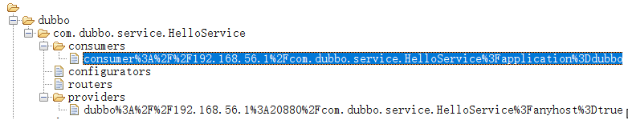
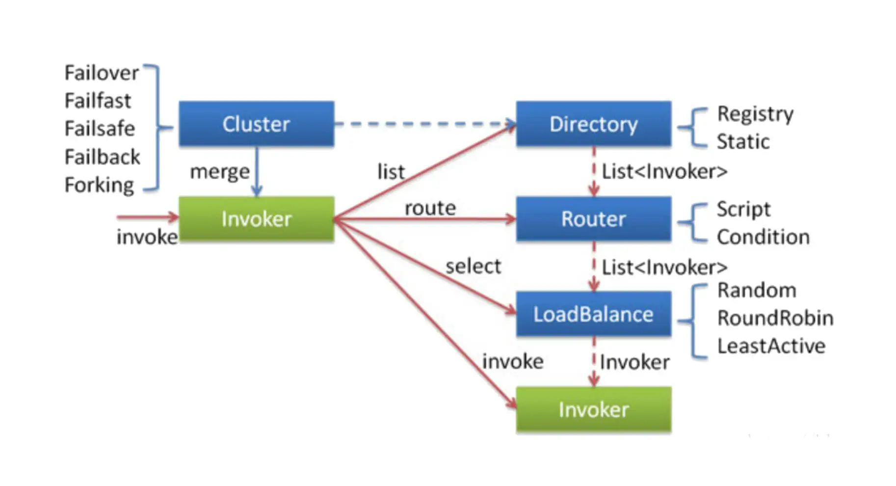
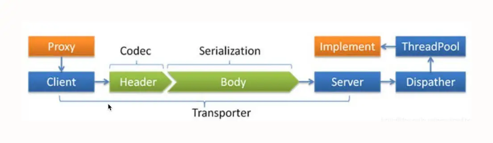
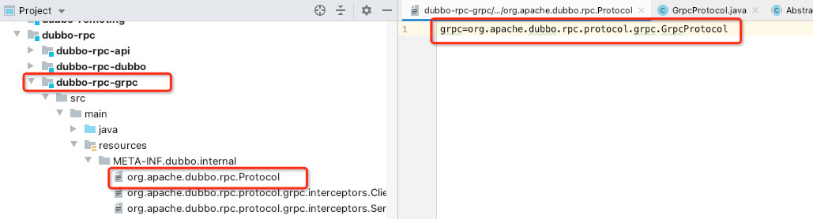
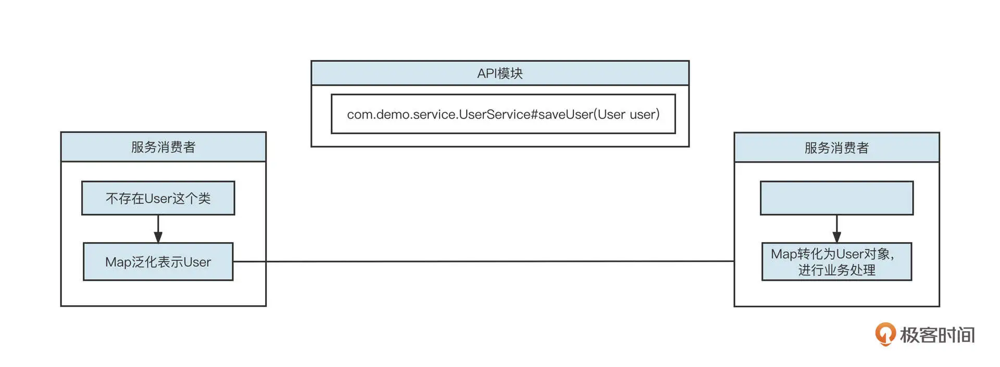

# RPC

有了解过dubbo吗，简单介绍下dubbo结构。  
如何做服务隔离。简单介绍下hystrix。  
如何设计个rpc框架。  

# Dubbo

## 服务注册/发现

Dubbo的服务注册与发现机制:  
  

4类角色: 消费者、提供者、注册中心、Monitor  

## Registry原理
以Dubbo最常用的Zookeeper来介绍  

zk里的存储:  
  
每一个服务的存储的目录结构为/dubbo/{serviceName} ，   其中serviceName为Provider的{包名}.{类名}  
下面有4个子文件夹，分别存储:  

- consumers: 消费者列表  
- providers: 提供者列表  
- routers: 路由规则列表  (一个服务，可以设置多个路由规则)  
- configurators: 动态配置条目。在 Dubbo 中，可以不重启消费者、服务提供者的前提下动态修改服务提供者、服务消费者的配置，配置信息发生变化后会存储在 configurators 子节点中。此时，服务提供者、消费者会动态监听配置信息的变化，变化一旦发生就使用最新的配置重构服务提供者和服务消费者。  

启动时3个要点:  

1. Provider在启动时要向注册中心(Registry)注册，Registry来存储服务相关信息。具体是在对应服务的 providers 目录下增加一条记录（临时节点），记录服务提供者的 IP、端口等信息。同时服务提供者会监听 configurators 节点的变化。  
2. Consumer在启动时向Registry订阅指定服务，Registry将以某种机制(Push 或 Pull)告知Consumer，有哪些Provider。具体是在对应服务的 consumers 目录下增加一条记录（临时节点），记录消费者的 IP、端口等信息，同时监听 configurators、routers 目录的变化，所谓的监听就是利用 ZooKeeper 提供的 watch 机制。  
3. 当Provider的数量变化时，Registry要告知Consumer，以便Consumer进行正常的Load Balancing。当有新的服务提供者上线后， providers 目录会增加一条记录，注册中心会将最新的服务提供者列表推送给服务调用方（消费端），这样消费者可以立刻收到通知，知道服务提供者的列表产生了变化。如果一个服务提供者宕机，因为它是临时节点，所以 ZooKeeper 会把这个节点移除，同样会触发事件，消费端一样能得知最新的服务提供者列表，从而实现路由的动态注册与发现。  

## 服务调用

服务调用重点阐述的是客户端Consumer发起一个 RPC 服务调用时的所有实现细节，它包括服务发现、故障转移、路由转发、负载均衡等方面，是 Dubbo 实现灰度发布、多环境隔离的理论指导。  

  

### 负载均衡
注：负载均衡+智能路由是Dubbo灰度发布的基础  

Dubbo 默认提供了随机、加权随机、最少活跃连接、一致性 Hash 等负载均衡算法。  

### 路由
路由机制即设置一定的规则对Provider列表进行过滤。负载均衡时，只在过滤后的Provider中进行选择。  

  

### 故障转移

远程服务调用通常涉及到网络等因素，因此并不能保证 100% 成功，当调用失败时应该采用什么策略呢？  
Dubbo 提供了下面五种策略：  

- **failover**: 失败后选择另外一Provider进行重试，重试次数可配置，适合实现幂等服务的场景  
- **failfast**:  快速失败，失败后立即返回错误  
- **failsafe**:  调用失败后打印错误日志，返回成功，通常用于记录审计日志等场景  
- **failback**: 调用失败后，返回成功，但会在后台定时无限次重试，重启后不再重试  
- **forking**: 并发调用，收到第一个响应结果后返回给客户端。通常适合实时性要求比较高的场景。但这一策略浪费服务器资源，通常可以通过 forks 参数设置并发调用度。  

## 网络通信模型
服务调用的底层具体实现:  
  
主要包括网络通信协议和线程派发机制（Dispatcher）两部分。  
### 通信协议
Header + Body  
为了提高传输效率，会对Body 进行序列化与压缩。目前Dubbo支持的序列化协议:  

- java  
- compactedjava  
- nativejava  
- fastjson  
- fst  
- hessian2  
- kryo 等序列化协议，  

生产环境默认为 hessian2  

协议对比:  

|   | protobuf | jackson | xstream | Serializable | hessian2 | hessian2压缩 | hessian1 |
| --- | --- | --- | --- | --- | --- | --- | --- |
| 序列化(单位ns) | 1154 | 5421  | 92406  | 10189 | 26794 | 100766 | 29027 |
| 反序列化(单位ns) | 1334 | 8743  | 117329  | 64027 | 37871 | 188432 | 37596 |
| bytes | 97 | 311  | 664  | 824 | 374 | 283 | 495 |

protobuf 不管是处理时间上，还是空间占用上都优于现有的其他序列化方式。内存暂用是java 序列化的1/9，时间也是差了一个数量级，一次操作在1us左右。缺点：就是对象结构体有限制，只适合于内部系统使用。  

   1. json格式在空间占用还是有一些优势，是java序列化的1/2.6。序列化和反序列化处理时间上差不多，也就在5us。当然这次使用的jackson，如果使用普通的jsonlib可能没有这样好的性能，jsonlib估计跟java序列化差不多。  
   2. xml相比于java序列化来说，空间占用上有点优势，但不明显。处理时间上比java序列化多了一个数量级，在100us左右。  
   3. 以前一种的java序列化，表现得有些失望  
   4. hessian测试有点意外，具体序列化数据上还步入json。性能上也不如jackjson，输得比较彻底。  
   5. hessian使用压缩，虽然在字节上有20%以上的空间提升，但性能上差了4,5倍，典型的以时间换空间。总的来说还是google protobuf比较给力  

### Dispatcher
Dubbo 中会默认创建 200 个线程处理业务，线程派发机制负责指导 IO 线程与业务线程如何分工。  
Dubbo 提供了下面几种线程派发机制：  

- all，所有的请求转发到业务线程池中执行（IO 读写、心跳包除外，因为在 Dubbo 中这两种请求都必须在 IO 线程中执行，不能通过配置修改）  
- message，只有请求事件在线程池中执行，其他请求在 IO 线程上执行  
- connection ，请求事件在线程池中执行，连接和断开连接的事件排队执行（含一个线程的线程池）  
- direct，所有请求直接在 IO 线程中执行  

网络编程中需要遵循一条最佳实践：**IO 线程中不能有阻塞操作，通常将阻塞操作转发到业务线程池异步执行**。  

与网络通信协议相关的参数定义在 dubbo:protocol，关键的设置属性如下  

- threads，业务线程池线程个数，默认 200  
- queues，业务线程池队列长度，默认为 0，表示不支持排队，如果线程池满，则直接拒绝。该参数与 threads 配合使用，主要是对服务端进行限流，一旦超过其处理能力，就拒绝请求，快速失败。  
- iothreads：默认为 CPU 核数再加一，用于处理网络读写。在生产实践中，通常的瓶颈在于业务线程池，如果业务线程无明显瓶颈（jstack 日志查询到业务线程基本没怎么干活），但吞吐量已经无法继续提升了，可以考虑调整 iothreads，增加 IO 线程数量，提高 IO 读写并发度。该值建议保持在“2*CPU 核数”以下。  
- serialization：序列化协议，新版本支持 protobuf 等高性能序列化机制。  
- dispatcher：线程派发机制，默认为 all。  

## 灵活扩展机制
Dubbo 出现之后迅速成为微服务领域最受欢迎的框架，除操作简单这个原因外，还有扩展机制的功劳。Dubbo 高度灵活的扩展机制堪称“王者级别的设计”。  

基于 SPI 设计理念:  
Dubbo 所有的底层能力都通过接口来定义。用户在扩展时只需要实现对应的接口，定义一个统一的扩展目录（META-INF.dubbo.internal）存放所有的扩展定义即可。要注意的是，目录下的文件名是需要扩展的接口的全名，  

  

在初次使用对应接口实例时，可以扫描扩展目录中的文件，并根据文件中存储的 key-value 初始化具体的实例。  
所以可以将gRPC作为dubbo的rpc扩展:   
  

## 泛化调用
实现Dubbo网关的理论基础  

我们在开发 Dubbo 应用时通常会包含 API包、Consumer、Provider 三个子模块。其中 API 模块通常定义统一的服务接口，而 Consumer、Provider 模块都需要**显式依赖 API 模块**。这种设计理念虽然将 Provider 与 Consumer 进行了解耦合，但对 API 模块形成了强依赖，如果 API 模块发生改变，Provider 和 Consumer 必须同时改变。也就是说，一旦 API 模块发生变化，服务调用方、服务消费方都需要重新部署，这对应用发布来说非常不友好。特别是在网关领域，几乎是不可接受的，如下图所示：  

  
如果网关需要跟着 API 模块不停地发布新版本，网关的可用性和稳定性都将受到极大挑战  

而Dubbo泛化调用:  
  
Consumer调用的时候用Map作为方法参数，传给Provider，Provider在执行业务方法前将Map转化成具体的DTO对象，然后再执行业务逻辑 (这个在Provider方是通过Filter机制统一处理的)  

这样，Consumer不再需要依赖Provider的 Jar 包。Provider可以不断地演变而不影响Consumer的运行。  
