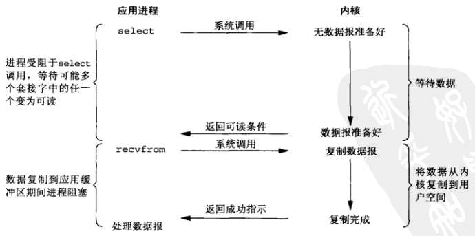
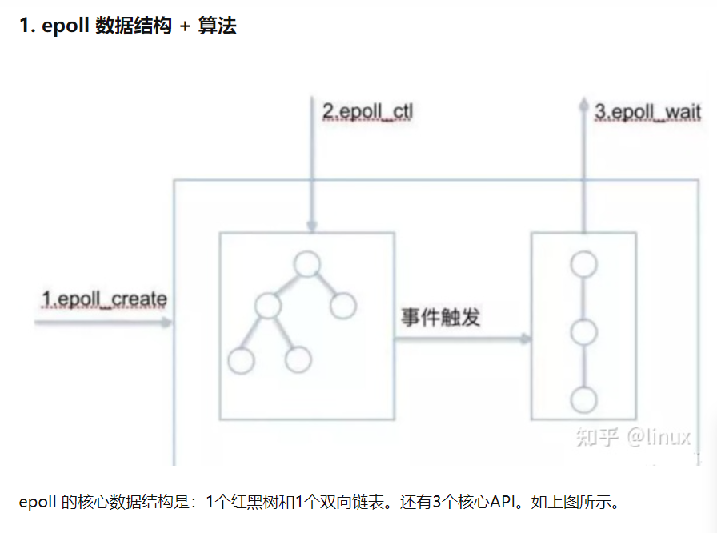

# 操作系统
- [操作系统](#操作系统)
- [快速掌握面试](#快速掌握面试)
  - [1. 操作系统：应用程序和硬件之间的媒介 ](#1-操作系统应用程序和硬件之间的媒介-)
  - [2. 并发\&并行，进程\&线程\&协程 ](#2-并发并行进程线程协程-)
  - [3. 进程上下文切换\&线程上下文切换 ](#3-进程上下文切换线程上下文切换-)
  - [4. 用户态\&内核态，系统调用：用户态通过系统调用切换到内核态 ](#4-用户态内核态系统调用用户态通过系统调用切换到内核态-)
  - [5. 操作系统的进程/线程有哪些状态（Note:Java是6种状态）：创建，就绪，运行，阻塞，结束 ](#5-操作系统的进程线程有哪些状态notejava是6种状态创建就绪运行阻塞结束-)
  - [6. 进程间通信（7种） ](#6-进程间通信7种-)
  - [7. 进程的调度算法 ](#7-进程的调度算法-)
  - [8. 线程间同步 ](#8-线程间同步-)
  - [9. 操作系统的内存管理 ](#9-操作系统的内存管理-)
  - [10. 常见内存管理机制 ](#10-常见内存管理机制-)
  - [11. 页式管理重要概念：快表\&多级页表 ](#11-页式管理重要概念快表多级页表-)
  - [12. 虚拟内存（虚拟地址）\&物理内存（物理地址） ](#12-虚拟内存虚拟地址物理内存物理地址-)
  - [13. 交换空间：磁盘上用于扩展内存的一块空间，就叫交换空间。 ](#13-交换空间磁盘上用于扩展内存的一块空间就叫交换空间-)
  - [14. 页面置换算法 ](#14-页面置换算法-)
- [区分IO密集、内存密集和计算密集](#区分io密集内存密集和计算密集)
- [Java 中 IO 流分为几种?](#java-中-io-流分为几种)
  - [既然有了字节流,为什么还要有字符流?](#既然有了字节流为什么还要有字符流)
- [BIO、NIO、AIO](#bionioaio)
  - [IO汇总表概览](#io汇总表概览)
  - [五大IO模型（狭义NIO）](#五大io模型狭义nio)
  - [BIO (阻塞I/O, blocking I/O)](#bio-阻塞io-blocking-io)
  - [NIO/IO多路复用 (非阻塞I/O, noblocking I/O)](#nioio多路复用-非阻塞io-noblocking-io)
    - [BIO与NIO的区别](#bio与nio的区别)
    - [NIO三大核心组件：Selector（选择器）、Channel（通道）、Buffer（缓冲器）](#nio三大核心组件selector选择器channel通道buffer缓冲器)
    - [I/O多路复用的三种实现机制](#io多路复用的三种实现机制)
      - [select与poll](#select与poll)
      - [epoll](#epoll)
      - [比较](#比较)
  - [AIO (异步I/O,Asynchronous I/O)](#aio-异步ioasynchronous-io)

# 快速掌握面试
## 1. 操作系统：应用程序和硬件之间的媒介 <br/>

主要功能： <br/>
**CPU管理**：主要指的是**进程管理** <br/>
**内存管理**：主要利用了**虚拟内存**的方式 <br/>
**外存管理**：主要指的是**文件管理**，将磁盘以文件的形式提供出去 <br/>
**I/O管理**：输入输出设备的统一管理 <br/>

## 2. 并发&并行，进程&线程&协程 <br/>

进程是资源分配的单位。 <br/>
线程（Java虚拟线程概念下，线程被称为平台线程）是CPU调度的单位。依赖于操作系统。 <br/>
协程（Java中叫虚拟线程，Go中叫协程）是一种比线程更加轻量级的存在，不依赖于操作系统。协程完全由程序所控制（在用户态执行），带来的好处是性能大幅度大的提升。一个线程内的多个协程只能串行执行（进程和线程在多核CPU上可以并行执行），当线程内某个协程运行时，其他协程必须挂起。协程是一个特殊的函数，这个函数可以在某个地方挂起，并且可以重新在挂起处继续运行。 <br/>
协程的适用场景：IO型的操作，利用协程在IO等待时间就去切换执行其他任务，当IO结束后再自动回调，那么就会大大节省资源并提高性能，从而实现异步编程（不等待任务结束就可以去执行其它代码）。 <br/>
一个操作系统中可以有多个进程；一个进程可以有多个线程；一个线程可以有多个协程。 <br/>
推出协程的目的：线程切换会耗费大量CPU时间，这是更轻量级的；达到应用程序的高吞吐量（高并发性），不受限于CPU。 <br/>
线程池确实能提高并发场景下系统的性能，但是，请注意，线程池只是帮助你如何更好的管理线程、利用线程，本身不会凭空给你创造出线程来，最终工作的还是底层的内核线程。而且线程池往往会受限于 CPU、网络、内存等，所以从硬件的角度来看，并没有解决实际问题。 <br/>
 <br/>
多线程模型中的线程在虚拟线程模型中被称为平台线程，**一个平台线程对应多个虚拟线程**，最终其实也是由内核线程去驱动。 <br/>
**虚拟线程只会增加程序的吞吐量，不会增加程序的处理速度** <br/>

## 3. 进程上下文切换&线程上下文切换 <br/>

线程上下文切换，需要看前后两个线程是否属于同一个进程。 <br/>
不属于同一个进程，则和进程上下文切换一致，开销大。 <br/>
属于同一个进程，只需切换线程的私有数据、寄存器等不共享的数据，开销小。 <br/>

## 4. 用户态&内核态，系统调用：用户态通过系统调用切换到内核态 <br/>
## 5. 操作系统的进程/线程有哪些状态（Note:Java是6种状态）：创建，就绪，运行，阻塞，结束 <br/>
## 6. 进程间通信（7种） <br/>

a. 管道/匿名管道：亲缘关系的进程间通信 <br/>
b. 命名管道：可实现本机任意两个进程通信。严格遵循先进先出。 <br/>
c. 信号：用于通知接收进程某个事件已经发生。 <br/>
d. 信号量：计数器。用于多进程对共享资源的访问，用于进程间同步。 <br/>
e. 消息队列：消息队列克服了信号承载信息量少，管道只能承载无格式字节流以及缓冲区大小受限等缺点。 <br/>
f. 共享内存：最有用的进程间通信方式。使得多个进程可以访问同一块内存空间。 <br/>
g. 套接字（Socket）：不同主机之间（客户端与服务端之间）进行双向通信的端点。 <br/>
 <br/>

## 7. 进程的调度算法 <br/>

目的：确定进程执行顺序，以实现CPU利用率最大化 <br/>
进程调度算法： <br/>
a. 先来先服务 <br/>
b. 短作业优先 <br/>
c. 时间片轮循 <br/>
d. 优先级调度 <br/>
e. 多级反馈队列调度算法：公认较好的算法，UNIX采用此。既能使高优先级的作业得到响应，又能使短作业迅速完成。 <br/>

## 8. 线程间同步 <br/>

目的：避免关键资源使用冲突 <br/>
操作系统线程同步方式： <br/>

   1. 互斥量：synchronized关键字和各种Lock <br/>
   2. 信号量：计数器 <br/>
   3. 事件：Wait/Notify <br/>
## 9. 操作系统的内存管理 <br/>
   1. 内存的分配：malloc函数申请内存 <br/>
   2. 内存的回收：free函数释放内存 <br/>
   3. 地址转换：将逻辑地址转换为物理地址 <br/>
## 10. 常见内存管理机制 <br/>

目的：提高内存利用率，减少内存碎片。 <br/>
简单分为**连续内存管理方式（块式管理）**和**非连续内存管理方式（页式管理、段式管理、段页式管理）**两种。 <br/>

   1. 块式管理：远古管理方式。内存分块，每块一个进程。 <br/>
   2. 段式管理：主存分段，段的大小不固定（取决于当前运行的程序），段是有实际意义的，段是逻辑信息的单位，可以体现为代码段、数据段，堆段，栈段，能更好满足用户的需求，对用户可见。通过段表对应逻辑地址和物理地址。 <br/>
   3. 页式管理：主存分页，页较小，大小固定（由操作系统决定），页无任何实际意义，对用户透明。通过页表对应逻辑地址和物理地址。 <br/>
   4. 段页式管理：主存分段，段内再分页。结合了段式和页式的优点。 <br/>
## 11. 页式管理重要概念：快表&多级页表 <br/>

多级页表（作用是：索引）：把单级页表再次分页。避免把全部页表一直放内存中占用过多空间。属于时间换空间的场景。 <br/>
快表（作用域：缓存）：把最常用的几个页表存储到Cache，这个Cache就是TLB(Translation Lookaside Buffer),通常称为页表缓存、转址旁路缓存、快表。解决虚拟地址到物理地址的转换速度。可以把快表理解为一种特殊的高速缓冲存储器Cache。属于空间换时间。（类似redis缓存的作用） <br/>
采用多级页表，节省了空间，浪费了时间，于是用快表补充损失的时间性能。 <br/>

## 12. 虚拟内存（虚拟地址）&物理内存（物理地址） <br/>

虚拟内存是操作系统提供的一种机制，将虚拟内存地址和物理内存地址映射起来。 <br/>
目前，大多数操作系统都使用了虚拟内存，如Windows的“虚拟内存”，Linux的“交换空间”。 <br/>
虚拟内存的好处：使用这种技术的系统使得大型程序的编写变得更容易，对真正的物理内存的使用也更有效率。 <br/>
具体来说： <br/>

   1. 可以让程序拥有超过物理内存大小的可用内存空间（使用磁盘空间来扩展内存） <br/>
   2. 虚拟内存使每个进程拥有一片连续完整的内存空间（实际上这片完整虚拟内存，在物理内存上被分割成多个物理内存碎片） <br/>
   3. 不让用户直接接触物理内存，更安全 <br/>
## 13. 交换空间：磁盘上用于扩展内存的一块空间，就叫交换空间。 <br/>

**虚拟内存容量 = 物理内存容量 + 交换空间容量** <br/>

## 14. 页面置换算法 <br/>

在载⼊程序的时候，只需要将程序的⼀部分装⼊内存，⽽将其他部分留在外存，然后程序就可以执⾏了。当所要访问的⻚⾯不在内存中，则发⽣**缺⻚中断** 。当缺页中断时，**内存中没有空闲页面**，操作系统就必须选择一个页面移出内存，把需要的页移入内存。   <br/>
用来选择淘汰哪一页的规则叫做页面置换算法（淘汰页面的规则）。 <br/>

   1. LFU (Least Frequently Used 最少使用) <br/>
   2. LRU (Least Currently Used 最近最少使用) <br/>
   3. FIFO (First In First Out 先进先出) <br/>
   4. OPT ( Optimal ,OPT, 最佳页面置换算法)：淘汰将来最远使用到的。无法实现，一般用作衡量方法。 <br/>
# 区分IO密集、内存密集和计算密集
IO密集型：要处理的数据存储在磁盘，比如数据库中。**代码的性能瓶颈主要在磁盘。** <br/>
内存密集型：要处理的数据存储在内存。**代码的性能瓶颈主要在内存数据的存取。** <br/>
计算密集型（CPU密集型）：**代码的性能瓶颈主要在CPU执行的效率。** <br/>
# Java 中 IO 流分为几种?
流按照不同的特点，有很多种划分方式。 <br/>

- 按照流的流向分，可以分为**输入流**和**输出流**； <br/>
- 按照操作单元划分，可以划分为**字节流**和**字符流**； <br/>
- 按照流的角色划分为**节点流**和**处理流** <br/>

Java Io 流共涉及 40 多个类，看上去杂乱，其实都存在一定的关联， Java IO流的 40 多个类都是从如下 4 个抽象类基类中派生出来的。 <br/>

- **InputStream**/**Reader**: 所有的输入流的基类，前者是字节输入流，后者是字符输入流。 <br/>
- **OutputStream**/**Writer**: 所有输出流的基类，前者是字节输出流，后者是字符输出流。 <br/>

 <br/>
IO-操作方式分类 <br/>
IO 流用到了什么设计模式？ <br/>
其实，Java 的 IO 流体系还用到了一个设计模式——**装饰器模式**。 <br/>
 <br/>
Java IO流用到装饰器模式 <br/>
## 既然有了字节流,为什么还要有字符流?
其实字符流是由 Java 虚拟机将字节转换得到的，问题就出在这个过程还比较耗时，并且，如果我们不知道编码类型就很容易出现乱码问题。 <br/>
所以， I/O 流就干脆提供了一个直接操作字符的接口，方便我们平时对字符进行流操作。如果音频文件、图片等媒体文件用字节流比较好，如果涉及到字符的话使用字符流比较好。 <br/>
# BIO、NIO、AIO
## IO汇总表概览


## 五大IO模型（狭义NIO）
unix提供了5种IO模型 <br/>
1、阻塞IO <br/>
2、非阻塞IO <br/>
3、IO多路复用 <br/>
4、信号量 <br/>
5、异步IO <br/>
阻塞等待的是**内核数据准备好**和**数据从内核态拷贝到用户态**这两个过程。 <br/>
 <br/>
 <br/>
 <br/>
 <br/>
 <br/>
 <br/>
## BIO (阻塞I/O, blocking I/O)
传统的 IO，同步阻塞，服务器实现模式为一个连接一个线程，即**客户端有连接请求时服务器端就需要启动一个线程进行处理**，如果这个连接不做任何事情会造成不必要的线程开销，可以通过连接池机制改善(实现多个客户连接服务器)。 <br/>
 <br/>
BIO 方式适用于连接数目比较小且固定的架构，这种方式对服务器资源要求比较高，并发局限于应用中，JDK1.4 以前的唯一选择，程序简单易理解。 <br/>
## NIO/IO多路复用 (非阻塞I/O, noblocking I/O)
### BIO与NIO的区别


### NIO三大核心组件：Selector（选择器）、Channel（通道）、Buffer（缓冲器）
**NIO** ：全称 java non-blocking IO，是指 JDK 提供的新 API。从 JDK1.4 开始，Java 提供了一系列改进的输入/输出的新特性，被统称为 NIO(即 New IO)。 <br/>
NIO 是**同步非阻塞**的，服务器端用一个线程处理多个连接，客户端发送的连接请求会注册到多路复用器上，多路复用器轮询到连接有 IO 请求就进行处理。 <br/>
NIO 的数据是面向**缓冲区 Buffer**的，必须从 Buffer 中读取或写入。 <br/>
 <br/>
NIO示意图 <br/>
可以看出，NIO 或 IO多路复用 的运行机制： <br/>

1. Selector <br/>

通过Selector来管理多个Channel的读写操作。Selector 对应一个线程，一个Selector对应多个 Channel。Selector 会根据Channel上发生的读写事件，在各个通道上切换。 <br/>

2. Channel <br/>

通过Channel对象来进行读写操作。Channel会注册到Selector。Channel 类似于一个流，但Channel是双向的，而Stream是单向的，InputStream只负责输入，OutputStream只负责输出。Buffer和Channel都是可读可写的。 <br/>

3. Buffer <br/>

通过Buffer对象缓存读写的内容。每个 Channel 对应一个 Buffer。Buffer 是内存块，底层是数据。 <br/>
### I/O多路复用的三种实现机制
背景：服务端需要支持多个客户端，多个客户端连接一个服务端 <br/>
传统I/O处理：服务端为每个客户端单独分配一个进程/线程来处理。 <br/>
IO多路复用：服务端用一个进程/线程来处理多个客户端连接（Socket连接）。多路复用就是指多个连接复用一个进程/线程。高效的处理多个网络连接请求，尽量减少网络IO的时间消耗。 <br/>
应用：netty、redis都采用了 <br/>
文件描述符集合 = Socket连接集合 = 已连接的客户端集合 <br/>
文件描述符（FD，File Descriptor）：是一个抽象的概念，形式上是一个整数，实际上是一个索引值，指向一个Socket连接。 <br/>
#### select与poll
具体操作<br/>
1.已连接的 Socket 都放到⼀个文件描述符集合fd_set<br/>
2.调⽤ select 函数将fd_set集合拷⻉到内核⾥（用户态拷贝到内核）<br/>
3.内核检查是否有⽹络事件产⽣，检查的⽅式很粗暴，就是通过遍历fd_set的⽅式，当检查到有事件产⽣后，将此 Socket 标记为可读或可写（内核态遍历标记）<br/>
4.内核把整个fd_set拷⻉回⽤户态（内核态拷贝到用户态）<br/>
5.⽤户态通过遍历的⽅法找到可读或可写的 Socket进行处理（用户态遍历处理）<br/>
```
while(1){
    for(Fd in Fds){
    	if(Fd有数据){
        	读Fd;
            处理;
        }
    }
}
```
#### epoll
 <br/>
红黑树来管理注册fd（维护socket连接），就绪列表来收集所有就绪fd（有事件发生，回调函数回调处理，把文件描述符添加到就绪队列）。 <br/>
 <br/>
具体操作<br/>
基于事件驱动<br/>
epoll_create：创建一个 epoll 实例，该实例代表了一个文件描述符的集合。在内核cache里建了个红黑树用于存储以后epoll_ctl传来的socket外，还会再建立一个list链表，用于存储准备就绪的事件。<br/>
epoll_ctl（红黑树：管理连接，对连接进行增删查。添加（注册进来，建立连接）、删除（注销，关闭连接）和查找（新注册时，看看是否已经注册了）O(log n)）：将文件描述符添加（注册文件描述符）到 epoll 实例中，并指定要监视的事件类型（读、写、错误等），进行监听，并且告知内核注册回调函数。<br/>
epoll_wait（双向链表，就绪Socket列表，回调函数会把就绪的放到就绪列表中）：等待事件的发生。该调用会阻塞，直到有注册的文件描述符上发生了指定的事件。一旦有事件发生，epoll_wait 返回事件的详细信息，包括触发事件的文件描述符和事件类型。根据 epoll_wait 返回的事件信息，执行相应的操作。这可以包括读取数据、写入数据、连接处理等。<br/>
#### 比较

## AIO (异步I/O,Asynchronous I/O)
JDK 7 引入了 Asynchronous I/O，是**异步非阻塞**的 IO。在进行 I/O 编程中，常用到两种模式：Reactor 和 Proactor。Java 的 NIO 就是 Reactor，当有事件触发时，服务器端得到通知，进行相应的处理，完成后才通知服务端程序启动线程去处理，一般适用于连接数较多且连接时间较长的应用。 <br/>
