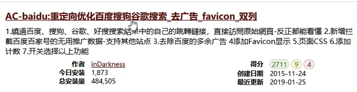
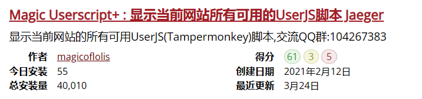
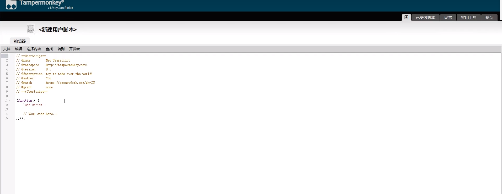

# 浏览器技能

# 快捷键

| | |
| --- | --- |
| 切换下一个 | Ctrl+Tab |
| 关闭当前网页 | Ctrl+W |
| 恢复被关掉的网页 | Ctrl+Shift+T |
| 打开历史记录 | Ctrl+H |

# 选择

| 只推荐以下三个 |  |
| --- | --- |
| Google Chrome | 开发调试用此
不用魔法，无法在多设备间同步，无法打开应用商城 |
| Microsoft Edge | 日常用此
Chrome和Edge有相同的内核Chromium，支持相同的扩展

可以登陆微软账号来同步数据，由于在国内不能直接访问谷歌，这与Chrome相比是一大优势，虽然国内有很多浏览器可以同步数据，但或多或少不太干净，既要干净又要同步，Edge是绝佳的选择。 |
| Mozilla Firefox | 不采用
火狐的扩展和Chromium内核的不通用 |

# Edge使用

1、阅读器模式：在地址栏前加read:

1）一些需要权限的也可以看了，且无限制复制文本了

2）沉浸式阅读

3）翻译

2、垂直标签页

3、数学求解器

4、PDF阅读器：可标注，高亮

5、朗读

6、集锦：相当于收藏夹，可当做稍后阅读、资料收集。可拖拽页面内容并注释，可定位到网页位置；还可加入文本，图片，注释

7、使用睡眠标签页保存资源

8、页面内搜索

9、存PDF网页：右键-打印-另存为pdf

10、可截长图

11、右键功能有很多

# 扩展（添加前审查代码，用chatgpt）

没有扩展的浏览器是不完整的

打开开发人员模式，可安装解压的扩展

# 谷歌扩展插件下载渠道

因为谷歌应用商店没法访问，以下均是通过crx文件安装，将crx文件拖到开发者模式页面，就可安装插件

crx4：http://www.crx4.com/

极简插件：https://chrome.zzzmh.cn/index

扩展迷：https://www.extfans.com/

浏览器插件下载中心：https://www.chromefor.com/

Chrome插件网：http://www.cnplugins.com/

GugeApps：https://www.gugeapps.net/

# 相似网站——Similar Sites

# 屏蔽广告&找资源等脚本——Tampermonkey油猴

安装插件后，打开greasyfork.org网站

1、屏蔽百度广告

输入百度，找到以下脚本安装

2、豆瓣下载资源

输入豆瓣，找到豆瓣资源下载大师，安装此脚本

可以找豆瓣网站上的所有资源：电影，电视剧，动漫，图书，音乐...

打开豆瓣网站，如果遇到拦截，选总是允许全部域名，然后确定

然后会找到资源下载位置

一般用迅雷下载，如果版权问题没法下载，可以尝试比特彗星或μtorrent或迅雷的5.8版本。

3、推荐所有网址适用的脚本——UserScript+

安装后，每个网页下方会出现一个圈或者数字，点开就可以看到适用该网页的扩展

n、其他脚本

n+1、在油猴上编写自己的脚本

# 提升阅读体验——简悦

可随意改变配色和排版

可以对内容标注

可以导出保存

# 暗黑模式护眼——Dark Reader

让所有页面都是暗黑模式

可以设置亮暗等样式

# 下载管理——IDM

# 去流氓下载按钮——集装箱

集装箱里的下载卫士可屏蔽安全下载、高速下载等流氓下载按钮

# 设置起始页

设置

开始、主页和新建标签页

进行设置

# iTab插件（采用）

[作者·使用教程](https://space.bilibili.com/88104935/video)

# 百度

设置点1：关闭热榜

设置点2：去广告

# 搜索和浏览页去广告

# uBlock Origin插件（采用）

# 书签管理

1、按类放收藏夹

2、名称简化

# Chromium内核

Chromium是谷歌的一个开源项目，很多浏览器都是从它衍生出来的，如Edge，QQ浏览器，360浏览器。

基于Chromium内核的浏览器的最大的好处就是，可以使用Google Chrome的所有扩展