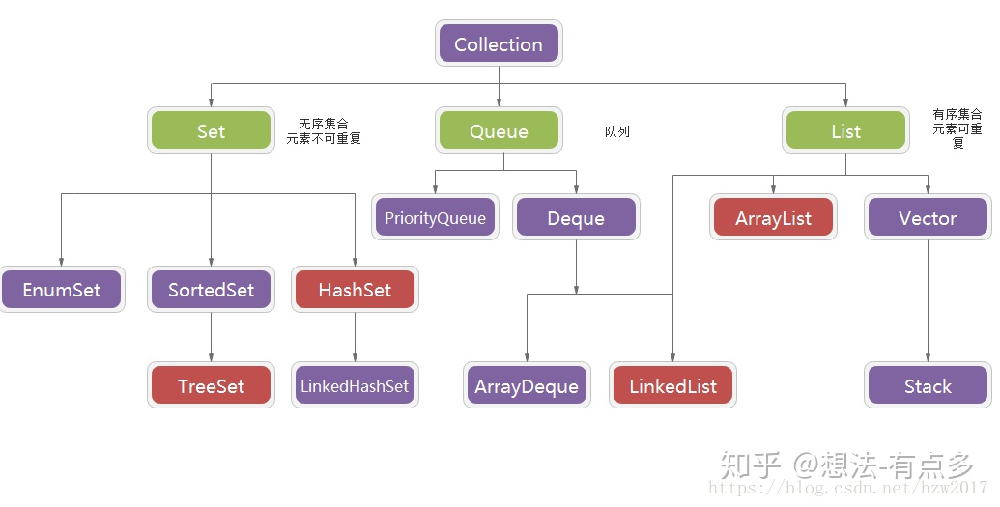

# 集合
- [集合](#集合)
- [二、集合](#二集合)
  - [（一）Comparator与Comparable实现自定义类排序](#一comparator与comparable实现自定义类排序)
  - [（二）List (对付顺序的好帮⼿)  、Set (注重独⼀⽆⼆的性质)  、Map (⽤Key来搜索的专家)](#二list-对付顺序的好帮--set-注重独的性质--map-key来搜索的专家)
  - [（三）ArrayList（底层是Object数组）、LinkedList（底层是双向链表）与Vector（保证线程安全，而ArrayList与LinkedList不保证线程安全）](#三arraylist底层是object数组linkedlist底层是双向链表与vector保证线程安全而arraylist与linkedlist不保证线程安全)
  - [（四）HashMap、Hashtable、HashSet、ConcurrentHashMap、LinkedHashMap、TreeMap](#四hashmaphashtablehashsetconcurrenthashmaplinkedhashmaptreemap)
    - [（1）HashMap（⾮线程安全）](#1hashmap线程安全)
    - [（2）HashTable（线程安全，是全表锁，性能差， 基本被淘汰）](#2hashtable线程安全是全表锁性能差-基本被淘汰)
    - [（3）HashSet（底层就是基于HashMap实现的，检查重复时，先用hashcode()，后用equals()）](#3hashset底层就是基于hashmap实现的检查重复时先用hashcode后用equals)
    - [（4）ConcurrentHashMap](#4concurrenthashmap)
    - [（5）LinkedHashMap](#5linkedhashmap)
    - [（6）TreeMap： 红⿊树(⾃平衡的排序⼆叉树)](#6treemap-红树平衡的排序叉树)
  - [（五）CopyOnWriteArrayList避免并发修改异常](#五copyonwritearraylist避免并发修改异常)
  - [（六）把集合包装成线程安全的](#六把集合包装成线程安全的)

# 二、集合
## （一）Comparator与Comparable实现自定义类排序
| Comparable接口 | Comparator接口 |
| --- | --- |
| 内部比较器 | 外部比较器 |
| 位于java.lang包下 | 位于java.util包下 |
| public interface Comparable\<T\>{ public int compareTo(T o);  } | public interface Comparator\<T\>{  	int compare(T o1,T o2);  } |
| 自定义类实现这个接口，并重写CompareTo方法，表明该类支持排序 | 不必修改自定义类，而要控制该类的排序，则建立一个该类的比较器并重写compare方法来进行排序 |
| Collections.sort(arrayList） | Collections.sort(arrayList, new Comparator\<Integer\>() {    @Override     public int compare(Integer o1, Integer o2) {     return o2.compareTo(o1);     }   }); |

compareto就是比较两个数据的大小关系。大于0表示前一个数据比后一个数据大（降序）， 0表示相等，小于0表示第一个数据小于第二个数据（升序）  
## （二）List (对付顺序的好帮⼿)  、Set (注重独⼀⽆⼆的性质)  、Map (⽤Key来搜索的专家)
  
  
## （三）ArrayList（底层是Object数组）、LinkedList（底层是双向链表）与Vector（保证线程安全，而ArrayList与LinkedList不保证线程安全）
 （1）list 遍历⽅式的选择  
实现了 RandomAccess 接⼝的list，优先选择普通 for 循环 ，其次 foreach。  
未实现 RandomAccess 接⼝的list，优先选择iterator遍历（foreach遍历底层也是通过 iterator实现的），⼤size的数据，千万不要使⽤普通for循环。  
（2）ArrayList的扩容机制  
## （四）HashMap、Hashtable、HashSet、ConcurrentHashMap、LinkedHashMap、TreeMap
### （1）HashMap（⾮线程安全）
 《Java 8系列之重新认识HashMap》 ：https://zhuanlan.zhihu.com/p/21673805    
** JDK1.8之前  **   
  
**JDK1.8 之前 HashMap 底层是 数组和链表 结合在⼀起使⽤也就是 链表散列**。 HashMap 通过 key 的 hashCode 经过扰动函数处理过后得到 hash 值，然后通过 (n - 1) & hash 判断当前元素存放的位置 （这⾥的 n 指的是数组的⻓度），如果当前位置存在元素的话，就判断该元素与要存⼊的元素的 hash 值以及 key 是否相同，如果相同的话，直接覆盖，不相同就通过拉链法解决冲突。   
所谓扰动函数指的就是 HashMap 的 hash ⽅法。使⽤ hash ⽅法也就是扰动函数是为了防⽌⼀些实现 ⽐较差的 hashCode() ⽅法 换句话说使⽤扰动函数之后可以减少碰撞。  
所谓 “拉链法” 就是：将链表和数组相结合。也就是说创建⼀个链表数组，数组中每⼀格就是⼀个链 表。若遇到哈希冲突，则将冲突的值加到链表中即可。  
**JDK1.8之后**  
 相⽐于之前的版本， JDK1.8之后在解决哈希冲突时有了⼤的变化，当链表⻓度⼤于阈值（默认为8） 时，将链表转化为红⿊树，以减少搜索时间。    
 TreeMap、TreeSet以及JDK1.8之后的HashMap底层都⽤到了红⿊树。红⿊树就是为了解决⼆叉查找树 的缺陷，因为⼆叉查找树在某些情况下会退化成⼀个线性结构。    
 **HashMap 的⻓度为什么是2的幂次⽅**    
数组长度默认是16。   
散列值是不能直接拿来⽤的。⽤之前还要先做对数组的⻓度取模运算，得到的余数才能⽤来要存放 的位置也就是对应的数组下标。 我们⾸先可能会想到采⽤%取余的操作来实现。但是，重点来了：“取余(%)操作中如果除数是2的幂次则 等价于与其除数减⼀的与(&)操作（也就是说 hash%length==hash&(length-1)的前提是 length 是2的 n 次⽅；）。” 并且 采⽤⼆进制位操作 &，相对于%能够提⾼运算效率，  这个数组下标的计算⽅法是“ (n - 1) & hash ”。（n代表数组⻓ 度）。这也就解释了 HashMap 的⻓度为什么是2的幂次⽅。    
### （2）HashTable（线程安全，是全表锁，性能差， 基本被淘汰）
### （3）HashSet（底层就是基于HashMap实现的，检查重复时，先用hashcode()，后用equals()）
### （4）ConcurrentHashMap
JDK1.7  
底层数据结构：Segment数组结构+HashEntry链表结构+ReentrantLock  
  
二维数组Segment，一个Segment中包含一个HashEntry数组，每个HashEntry又是一个链表结构  
元素查询：二次hash，第一次hash定位到Segment，第二次hash定位到元素所在链表的头部  
 实现线程安全的⽅式：分段锁。 读不加锁，用volatile保证，写和扩容加分段锁。Segment继承了ReentrantLock，锁定操作的Segment，其他Segment不受影响。并发度为Segment的个数，可通过构造函数指定。  
  
JDK1.8  
底层数据结构：Node数组+链表+红黑树+synchronized  
 实现线程安全的⽅式：到了 JDK1.8 的时候已经摒弃了Segment的 概念，⽽是直接⽤ Node 数组+链表+红⿊树的数据结构来实现，并发控制使⽤ synchronized 和 CAS 来操作。（JDK1.6以后 对 synchronized锁做了很多优化）    
 synchronized只锁定当前链表或红⿊⼆叉树的⾸节点，这样只要hash不冲突，就不会产⽣并发，效率⼜提升N倍。    
 整个看起来就像是优化过且线程安全的 HashMap，虽然在JDK1.8中还能看到 Segment 的数据结构，但是已经简化了属性，只 是为了兼容旧版本；    
  
### （5）LinkedHashMap
LinkedHashMap是HashMap的一个子类， 增加了⼀条双向链表，使得上⾯的结构可以保持键值对的插⼊顺序  ，保存了记录的插入顺序，在用Iterator遍历LinkedHashMap时，先得到的记录肯定是先插入的，也可以在构造时带参数，按照访问次序排序。  
### （6）TreeMap： 红⿊树(⾃平衡的排序⼆叉树)  
TreeMap实现SortedMap接口，能够把它保存的记录根据键排序，默认是按键值的升序排序，也可以指定排序的比较器，当用Iterator遍历TreeMap时，得到的记录是排过序的。如果使用排序的映射，建议使用TreeMap。在使用TreeMap时，key必须实现Comparable接口或者在构造TreeMap传入自定义的Comparator，否则会在运行时抛出java.lang.ClassCastException类型的异常。  
## （五）CopyOnWriteArrayList避免并发修改异常
在用迭代器遍历ArrayList时，边访问边修改（插入或删除），会报并发修改异常，这是一种保护措施，建议用迭代器去遍历。  
如果确实需要边访问边修改，可以使用CopyOnWriteArrayList之类的集合。  
## （六）把集合包装成线程安全的
Collections.synchornizedList(list);  
Collections.synchornizedSet(list);  
Collections.synchornizedMap(list);  
