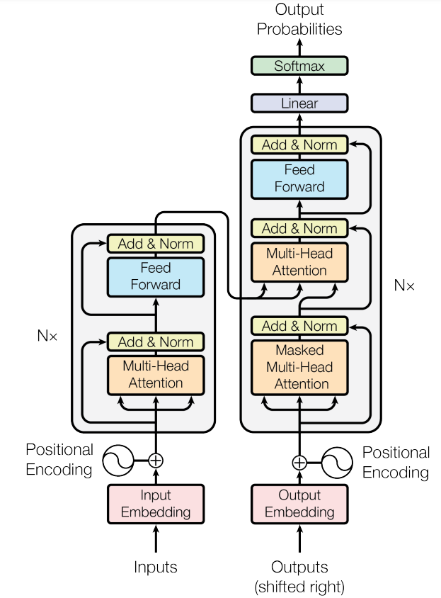
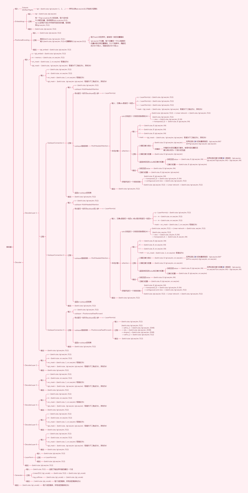

# Transformer Source Code Exploration
  - 1. About
  - 2. Transformer Overall Architecture
  - 3. Hyperparameters
  - 4. Tensor Dimensionality Transformation
  - 5. Number of Trainable Parameters  
  - 6. Source Code
<!-- more -->

## 1. About
Thesis：Attention Is All You Need

Year：2017

Company：Google

Source Code：https://github.com/harvardnlp/annotated-transformer/

Accompanying Source Code Analysis：
https://nlp.seas.harvard.edu/annotated-transformer/

## 2. Transformer Overall Architecture


Encoder (left part): "Inputs" are the input to the encoder, for instance, if you are translating from Chinese to English, then this would be your sentence in Chinese. The encoder maps the input sequence (x<sub>1</sub>,...,x<sub>n</sub>) to a series of vector representations z = (z<sub>1</sub>,...,z<sub>n</sub>). Each x<sub>t</sub> represents the tth element in the input sequence (for example, a word), and each z<sub>t</sub> is the vector representation corresponding to x<sub>t</sub>. These vector representations can be viewed as abstract representations of the input sequence, allowing the machine learning model to better understand the input sequence.

Decoder (right part): "Outputs" are what the decoder uses as input, and when making predictions, the decoder does not have any inputs. "Shifted Right" refers to shifting to the right one element at a time. The decoder operates based on the output of the encoder and generates the target sequence (y<sub>1</sub>,...,y<sub>m</sub>), one element at a time, where m may be different from n. At each step, the model is autoregressive, incorporating the results generated previously into the input sequence for prediction when generating the next result. (This is a characteristic of autoregressive models.)

An important distinction between the encoder and decoder is that the decoder is autoregressive. This means that it generates the output sequence step by step, rather than processing the entire sequence all at once. After generating the first output y<sub>1</sub>, the decoder uses the previously generated outputs as input to generate the next output, and so on, until the complete target sequence is produced.

In summary, the encoder transforms the input sequence into a series of vector representations, while the decoder generates the target sequence step by step based on the output of the encoder. The autoregressive nature of the decoder allows it to generate the output progressively and to use the previously generated outputs as inputs. This encoder-decoder architecture is widely used in sequence-to-sequence tasks such as machine translation, summary generation, etc.


## 3. Hyperparameters


## 4. Tensor Dimensionality Transformation




## 5. Number of Trainable Parameters

### 5.1. MultiHeadedAttention
Model Parameters for this Block：The weights and biases for the 4 linear transformations in the MultiHeadedAttention. The weight matrices$W_Q、W_K、W_V$ for $Q、K、V$ and the corresponding biases, as well as the output weight matrix $W_O$ and its corresponding bias

Parameter Size of this Block: The shape of the 4 weight matrices is $[d=512,d=512]$, and the shape of the 4 biases is $[d=512]$,  The total number of parameters for the MultiHeadedAttention block is $4*(d^2+d)$

Number of Blocks：The encoder layer has one MultiHeadedAttention sub-layer, and the decoder layer has two MultiHeadedAttention sub-layers. As there are 6 identical layers each in the encoder and decoder, there is a total of 18 MultiHeadedAttention blocks

Total Parameter Quantity of this Block in Transformer：$18*4*(d^2+d)=72*(d^2+d)=18*4*(512^2+512)=18911232$

### 5.2. PositionwiseFeedForward
Model Parameters for this Block：The weights and biases of two linear transformations in the PositionwiseFeedForward. The first linear layer maps the dimensions from $d=512$ to $4d=2048$, and the second linear layer maps dimensions back down from $4d=2048$ to $d=512$

Parameter Size of this Block：The weight matrix $W_1$ of the first linear layer has the shape of $[d=512,4d=2048]$, and the bias has the shape of $[4d=2048]$, The weight matrix $W_2$ of the second linear layer has the shape of $[4d=2048,d=512]$, and the bias has the shape of $[d=512]$, The total number of parameters in the PositionwiseFeedForward block is $d*4d+4d+4d*d+d=8d^2+5d$

Number of Blocks：There is one PositionwiseFeedForward sublayer in each of the encoder and decoder layers, and with both encoder and decoder having 6 identical layers, there are a total of 12 PositionwiseFeedForward blocks

Total Parameter Quantity of this Block in Transformer：$12*(8d^2+5d)=96d^2+60d=96*512^2+60*512=25196544$

### 5.3. LayerNorm
Model Parameters for this Block：The LayerNorm contains two trainable parameters: the scaling parameter $\gamma$ and the shifting parameter $\beta$

Parameter Size of this Block：Both parameters have the shape $[d]$, and the total number of parameters in the LayerNorm block is $d+d=2d$

Number of Blocks：Each sublayer in the encoder and decoder layers is followed by a LayerNorm, with 5 such sublayer connections. Since there are 6 identical encoder and decoder layers, and there is a LayerNorm after the 6 encoder and decoder layers, there are a total of $6*2+2=32$ LayerNorm blocks

Total Parameter Quantity of this Block in Transformer：$32*2d=64d=64*512=32768$

### 5.4. Embeddings
Model Parameters for this Block： This block appears in 3 locations in the Transformer (Input Embeddings, Output Embeddings, Generator), but the parameters are shared, so there is only one set of parameters

Parameter Size of this Block：The shape is $[vocab,d=512]$, The shape is $vocab*d$

Number of Blocks：1

Total Parameter Quantity of this Block in Transformer：$vocab*d=vocab*512$

### 5.5. Total Trainable Parameters
$72*(d^2+d)+96d^2+60d+64d+vocab*d=168*d^2+196*d+vocab*d=168*512^2+196*512+vocab*512=44140544+vocab*512$

## 6. Source Code
### 6.1. Complete Model
```python
import torch
import torch.nn as nn
import math
from torch.nn.functional import log_softmax
import copy

def make_model(src_vocab, tgt_vocab, N=6, d_model=512, d_ff=2048, h=8, dropout=0.1):
    """
    Build a model based on hyperparameters.
    src_vocab: The number of words in the source sentence
    tgt_vocab: The number of words in the target sentence
    N: The number of encoder and decoder layers
    d_model: The dimension of word embeddings/input and output dimensions
    d_ff: The dimension of the hidden layer in the Feed-Forward network/inner-layer dimension
    h: The number of heads in attention
    dropout: A technique to prevent deep learning networks from overfitting by randomly dropping neurons, thereby increasing the network's generalization ability
    """
    c = copy.deepcopy # Deep copy
    attn = MultiHeadedAttention(h, d_model)  # Create an instance of multi-head attention mechanism
    ff = PositionwiseFeedForward(d_model, d_ff, dropout)  # Create an instance of positionwise feed-forward network
    position = PositionalEncoding(d_model, dropout)  # Create an instance of positional encoding
    model = EncoderDecoder(
        Encoder(EncoderLayer(d_model, c(attn), c(ff), dropout), N),  # Create an instance of the encoder
        Decoder(DecoderLayer(d_model, c(attn), c(attn), c(ff), dropout), N),  # Create an instance of the decoder
        nn.Sequential(Embeddings(d_model, src_vocab), c(position)),  # Create an instance of the source language embedding layer
        nn.Sequential(Embeddings(d_model, tgt_vocab), c(position)),  #  Create an instance of the target language embedding layer
        Generator(d_model, tgt_vocab),  # Create an instance of the generator
    )

    # Initialize parameters
    for p in model.parameters():
        if p.dim() > 1:
            nn.init.xavier_uniform_(p)
    return model
```

### 6.2. EncoderDecoder
```python
class EncoderDecoder(nn.Module):
    """
    A standard Encoder-Decoder architecture. Base for this and many other models.
    """
    def __init__(self, encoder, decoder, src_embed, tgt_embed, generator):
        super(EncoderDecoder, self).__init__()
        self.encoder = encoder 
        self.decoder = decoder
        self.src_embed = src_embed 
        self.tgt_embed = tgt_embed
        self.generator = generator

    def forward(self, src, tgt, src_mask, tgt_mask):
        "Take in and process masked src and target sequences."
        return self.decode(self.encode(src, src_mask), src_mask, tgt, tgt_mask)

    def encode(self, src, src_mask):
        return self.encoder(self.src_embed(src), src_mask) # Encode the source sequence

    def decode(self, memory, src_mask, tgt, tgt_mask):
        return self.decoder(self.tgt_embed(tgt), memory, src_mask, tgt_mask) # Decode the target sequence
```

### 6.3. Encoder
```python
class Encoder(nn.Module):
    """
    Core encoder is a stack of N layers
    """

    def __init__(self, layer, N):
        super(Encoder, self).__init__()
        self.layers = clones(layer, N) 
        self.norm = LayerNorm(layer.size)

    def forward(self, x, mask):
        "Pass the input (and mask) through each layer in turn."
        for layer in self.layers:
            x = layer(x, mask) # Process the input x layer by layer
        return self.norm(x) # Perform Layer Normalization on the processed result x
```

```python
class EncoderLayer(nn.Module):
    "Encoder is made up of self-attn and feed forward."
    def __init__(self, size, self_attn, feed_forward, dropout):
        super(EncoderLayer, self).__init__()
        self.self_attn = self_attn
        self.feed_forward = feed_forward
        self.sublayer = clones(SublayerConnection(size, dropout), 2)
        self.size = size

    def forward(self, x, mask):
        "Follow Figure 1 (left) for connections."
        # The first sublayer connection: self-attention mechanism
        x = self.sublayer[0](x, lambda x: self.self_attn(x, x, x, mask))
        # The second sublayer connection: feed-forward neural network
        return self.sublayer[1](x, self.feed_forward)
```
### 6.4. Decoder
The decoder is also composed of $N=6$ identical layers.

In addition to the two sublayers in each decoder layer, the decoder contains a third sublayer that performs multi-head attention on the output of the encoder. (That is, the encoder-decoder-attention layer, where the q vector comes from the input of the previous layer, and the k and v vectors are the output vectors of the encoder's last layer memory) Similar to the encoder, we again adopt residual connections after each sublayer, followed by layer normalization.

```python
class Decoder(nn.Module):
    """Generic N layer decoder with masking.
    """
    def __init__(self, layer, N):
        super(Decoder, self).__init__()
        self.layers = clones(layer, N)
        self.norm = LayerNorm(layer.size)

    def forward(self, x, memory, src_mask, tgt_mask):
        for layer in self.layers:
            # Apply each decoder layer, passing the input x, memory, source mask src_mask, and target mask tgt_mask
            x = layer(x, memory, src_mask, tgt_mask)
        return self.norm(x) # Normalize the output
```

```python
class DecoderLayer(nn.Module):
    "Decoder is made of self-attn, src-attn, and feed forward."

    def __init__(self, size, self_attn, src_attn, feed_forward, dropout):
        super(DecoderLayer, self).__init__()
        self.size = size # The size of the decoder layer
        self.self_attn = self_attn # Self-attention mechanism
        self.src_attn = src_attn # Source attention mechanism
        self.feed_forward = feed_forward # Feed-forward neural network
        self.sublayer = clones(SublayerConnection(size, dropout), 3) # Clone three sublayer connections

    def forward(self, x, memory, src_mask, tgt_mask):
        "Follow Figure 1 (right) for connections. "
        m = memory
        # The first sublayer connection: self-attention mechanism
        x = self.sublayer[0](x, lambda x: self.self_attn(x, x, x, tgt_mask))
        # The second sublayer connection: source attention mechanism
        x = self.sublayer[1](x, lambda x: self.src_attn(x, m, m, src_mask))
        # The third sublayer connection: feed-forward neural network
        return self.sublayer[2](x, self.feed_forward)
```

### 6.5. MultiHeadedAttention
Why scaling is necessary: For a large  $d_k$, the dot product $QK^T$ will result in very large values, which, after the softmax operation, can lead to very small gradients, hindering the training of the network.

In practice, we compute the attention function for a set of queries simultaneously, packaging them together into a matrix $Q$. Keys and values are also combined into matrices $K$ and $V$.The output matrix we compute is:

$$
   \mathrm{Attention}(Q, K, V) = \mathrm{softmax}(\frac{QK^T}{\sqrt{d_k}})V
$$

Where Q、K and V are three matrices and their second dimensionality corresponds to $d_q,d_k,d_v$, respectively. From the subsequent computational process, it is actually found that $d_q = d_v$.

```python
def attention(query, key, value, mask=None, dropout=None):
    """
     'Scaled Dot Product Attention'
    """
    d_k = query.size(-1)  # Obtain the last dimension size of the query vector, i.e., the dimension of attention

    scores = torch.matmul(query, key.transpose(-2, -1)) / math.sqrt(d_k)  # Calculate attention scores

    if mask is not None:
        scores = scores.masked_fill(mask == 0, -1e9)  # Fill positions where the mask is 0 with a very small negative number, so that the corresponding attention scores become a very small negative number

    p_attn = scores.softmax(dim=-1)  # Normalize the attention scores with softmax to obtain attention weights

    if dropout is not None:
        p_attn = dropout(p_attn)  # Apply dropout to the attention weights

    return torch.matmul(p_attn, value), p_attn  # Return the weighted value and attention weights
```
$$
\mathrm{MultiHead}(Q, K, V) =
    \mathrm{Concat}(\mathrm{head_1}, ..., \mathrm{head_h})W^O \\
    \text{where}~\mathrm{head_i} = \mathrm{Attention}(QW^Q_i, KW^K_i, VW^V_i)
$$

The mapping is accomplished by the weight matrix： $W^Q_i \in
\mathbb{R}^{d_{\text{model}} \times d_k}$, $W^K_i \in
\mathbb{R}^{d_{\text{model}} \times d_k}$, $W^V_i \in
\mathbb{R}^{d_{\text{model}} \times d_v}$ and $W^O \in
\mathbb{R}^{hd_v \times d_{\text{model}}}$.

In this work, we utilize $h=8$ parallel attention layers, or heads. For each of these heads, we use $d_k=d_v=d_{\text{model}}/h=64$，reducing the dimension of each head, which results in the total computational cost being similar to that of a single head attention with full dimensions.

```python
class MultiHeadedAttention(nn.Module):
    def __init__(self, h, d_model, dropout=0.1):
        super(MultiHeadedAttention, self).__init__()
        assert d_model % h == 0
        # We assume d_v always equals d_k
        self.d_k = d_model // h  # The dimension of attention for each head
        self.h = h  # The number of heads
        # Define four Linear networks, size (512, 512), containing two types of trainable parameters: Weights, with a size of 512*512, and biases, with a size of 512 = d_model
        self.linears = clones(nn.Linear(d_model, d_model), 4)  # A collection of linear transformation layers
        self.attn = None # Used to store attention weights
        self.dropout = nn.Dropout(p=dropout)

    def forward(self, query, key, value, mask=None):
        if mask is not None:
            # (batch.size,1,seq.len) -> (batch.size,1,1,seq.len)
            mask = mask.unsqueeze(1)
        nbatches = query.size(0)  # batch size

        """
        1) Process all the linear projections in the batch.

        Here is the specific application of the first three Linear Networks.

        query=(batch.size, seq.len, 512) -> Linear network -> (batch.size, seq.len, 512)
        -> view -> (batch.size, seq.len, 8, 64) -> transpose(1,2) -> (batch.size, 8, seq.len, 64)，
        Similarly for the other keys and values:(batch.size, seq.len, 512) -> (batch.size, 8, seq.len, 64)
        """
        query, key, value = [lin(x).view(nbatches, -1, self.h, self.d_k).transpose(1, 2) for lin, x in zip(self.linears, (query, key, value))]

        # 2) Apply the attention mechanism to all projected vectors in the batch
        x, self.attn = attention(query, key, value, mask=mask, dropout=self.dropout)

        """
        3) x ~ (batch.size, 8, seq.len, 64) -> transpose(1,2) ->
        (batch.size, seq.len, 8, 64) -> contiguous() and view ->
        (batch.size, seq.len, 8*64) = (batch.size, seq.len, 512)
        """
        x = (
            x.transpose(1, 2)
            .contiguous()
            .view(nbatches, -1, self.h * self.d_k)
        )
        del query
        del key
        del value

        # 4) Then apply the last linear layer
        # Perform the fourth Linear network, transforming (batch.size, seq.len, 512) through a linear network, yielding (batch.size, seq.len, 512)
        return self.linears[-1](x)
```
### 6.6. PositionwiseFeedForward
The network includes two linear transformations with a ReLU activation function in between the two linear transformations.

$$\mathrm{FFN}(x)=\max(0, xW_1 + b_1) W_2 + b_2$$

Although both layers are linear transformations, they use different parameters between layers. The dimensions of both input and output are
$d_{\text{model}}=512$ and the inner dimension is $d_{ff}=2048$. (That is, the first layer inputs 512 dimensions and outputs 2048 dimensions; the second layer inputs 2048 dimensions and outputs 512 dimensions)

```python
class PositionwiseFeedForward(nn.Module):
    def __init__(self, d_model, d_ff, dropout=0.1):
        # d_model = 512
        # d_ff = 2048 = 512*4
        super(PositionwiseFeedForward, self).__init__()
        # Construct the first fully connected layer, (512, 2048), with two trainable parameters: weights matrix, (512, 2048), and biases offset vector, (2048)
        self.w_1 = nn.Linear(d_model, d_ff)
        # Construct the second fully connected layer, (2048, 512), with two trainable parameters: weights matrix, (2048, 512), and biases offset vector, (512)
        self.w_2 = nn.Linear(d_ff, d_model)
        self.dropout = nn.Dropout(dropout)

    def forward(self, x):
        """
        (batch.size, seq.len, 512) -> self.w_1 -> (batch.size, seq.len, 2048)
        -> relu -> (batch.size, seq.len, 2048)
        -> dropout -> (batch.size, seq.len, 2048)
        -> self.w_2 -> (batch.size, seq.len, 512)
        """
        return self.w_2(self.dropout(self.w_1(x).relu()))
```
### 6.7. Embeddings
Convert the input tokens and output tokens into $d_{\text{model}}$ dimensional vectors.

```python
class Embeddings(nn.Module):
    def __init__(self, d_model, vocab):
        super(Embeddings, self).__init__()
        # (vocab.len, 512)
        self.lut = nn.Embedding(vocab, d_model)
        self.d_model = d_model

    def forward(self, x):
        # (batch.size, seq.len) -> (batch.size, seq.len, 512)
        return self.lut(x) * math.sqrt(self.d_model)
```

### 6.8. PositionalEncoding
Since our model does not contain recurrence or convolution, in order to enable the model to utilize the order of the sequence, we must inject some information about the relative or absolute position of the tokens in the sequence. To this end, we add "positional encoding" to the input embeddings at the bottom of the encoder and decoder stacks. The dimensionalities of positional coding and embedding are the same, both being 
$d_{\text{model}}$, so the two vectors can be summed.

Using sine and cosine functions of different frequencies:

$$PE_{(pos,2i)} = \sin(pos / 10000^{2i/d_{\text{model}}})$$

$$PE_{(pos,2i+1)} = \cos(pos / 10000^{2i/d_{\text{model}}})$$

where $pos$ is the position and $i$is the dimension. That is, each dimension of the positional encoding corresponds to a sine curve. These wavelengths form a geometric series from $2\pi$ to $10000 \cdot2\pi$. We chose this function because we hypothesize it will allow the model to easily learn to pay attention to relative positions, since for any fixed offset  $k$, $PE_{pos+k}$ can be represented as a linear function of $PE_{pos}$.

Moreover, we apply a dropout to the sum of the embeddings and the positional encodings in the encoder and decoder stacks. For the base model, we use a dropout rate of $P_{drop}=0.1$.

It uses an exponential function to generate a series of values scaled by position. These values will later be used to calculate the sine and cosine positional encodings. Let’s break down this code step by step:

torch.arange(0, d_model, 2): Creates a one-dimensional tensor starting from 0 to d_model (not including), with a step of 2.

d_model is typically a parameter in the Transformer model, indicating the encoding size or "depth". This step generates a sequence used to calculate the frequencies of positional encoding for each dimension.

-(math.log(10000.0) / d_model): math.log(10000.0) calculates the natural logarithm of 10000.

This value is then divided by d_model to get a scaling factor, which is multiplied by each element of the sequence generated by torch.arange above.

Since there is a negative sign, it means flipping the sign. This calculation implements a key part of the positional encoding in the Transformer: the frequency of each position decreases at a logarithmic level as the dimension increases.
torch.exp(...): Applies an exponential function to the result of the last computation. Since each input element is a negative value (because of the negative sign), this produces a series of decreasing values between 0 and 1.
These values provide different wavelengths when calculating sine and cosine functions, which is one way the Transformer model utilizes positional information.

In simple terms, this code generates a sequence for each positional encoding in the Transformer model by generating different scaling factors at different frequencies for each position.
This position-based encoding helps the model understand the relative or absolute positional relationships between words or tokens, which is an important concept in natural language processing (NLP).

After the positional encoding is added to the input embedding, it provides the model with a complete representation of the input, containing both the semantic information of the word and its position information in the sequence.

```python
class PositionalEncoding(nn.Module):
    def __init__(self, d_model, dropout, max_len=5000):
        super(PositionalEncoding, self).__init__()
        self.dropout = nn.Dropout(p=dropout)
        # Prepare position encodings for a sequence of max_len=5000 in advance
        # (5000,512) matrix, a total of 5000 positions, each position represented by a 512-dimensional vector encoding its position
        pe = torch.zeros(max_len, d_model)
        # (5000)->(5000,1)
        position = torch.arange(0, max_len).unsqueeze(1)
        # (256)
        div_term = torch.exp(torch.arange(0, d_model, 2) * -(math.log(10000.0) / d_model))
        # Position at even indices,(5000,256)
        pe[:, 0::2] = torch.sin(position * div_term)
        # Position at odd indices,(5000,256)
        pe[:, 1::2] = torch.cos(position * div_term)
        # (5000, 512) -> (1, 5000, 512) to make space for batch.size
        pe = pe.unsqueeze(0)
        self.register_buffer("pe", pe)

    def forward(self, x):
        """
        :param x: The result of Embeddings' word embedding
        :return: The result of Embeddings plus the positional encoding result
        Note that the positional encoding does not update; it is hardcoded, so there are no trainable parameters in this class
        x.size(1) is src.seq.len, the sequence length size is cut from the prepared 5000 positions
        When actually adding, it will expand (1,src.seq.len,512) to (batch.size,src.seq.len,512)
        Each sequence in the batch uses the same positional encoding
        """
        x = x + self.pe[:, : x.size(1)].requires_grad_(False)
        return self.dropout(x)
```

### 6.9. Generator
```python
class Generator(nn.Module):
    """
    Define standard linear + softmax generation step.
    """

    def __init__(self, d_model, vocab):
        super(Generator, self).__init__()
        self.proj = nn.Linear(d_model, vocab) # Linear projection layer, which transforms the input dimension to the size of the vocab

    def forward(self, x):
        return log_softmax(self.proj(x), dim=-1) # Apply the log_softmax function to the results of the linear projection to normalize and compute probabilities
```

The log_softmax function is the logarithm of each element of the softmax function and is used to normalize probabilities, commonly used in neural networks, particularly in the computation of probabilistic scores in attention mechanisms. Since the probability distribution obtained from softmax and that obtained from log_softmax can be added and subtracted, converting the original scores into logarithmic form can prevent overflow and makes it easier to compute probability multiplication. The advantage of LogSoftmax over Softmax is that the logarithm operation makes differentiation easier, which speeds up backpropagation and solves potential issues of overflow and underflow with Softmax.

### 6.10. clones
```python
def clones(module, N):
    "Produce N identical layers."
    return nn.ModuleList([copy.deepcopy(module) for _ in range(N)])
```

### 6.11. LayerNorm
```python
class LayerNorm(nn.Module):
    "Construct a layernorm module (See citation for details)."

    def __init__(self, features, eps=1e-6): # features is a number
        super(LayerNorm, self).__init__()
        self.a_2 = nn.Parameter(torch.ones(features))
        self.b_2 = nn.Parameter(torch.zeros(features))
        self.eps = eps

    def forward(self, x):
        mean = x.mean(-1, keepdim=True)
        std = x.std(-1, keepdim=True)
        return self.a_2 * (x - mean) / (std + self.eps) + self.b_2
```

### 6.12. SublayerConnection
```python
class SublayerConnection(nn.Module):
    """
    A residual connection followed by a layer norm.
    Note for code simplicity the norm is first as opposed to last.
    """
    def __init__(self, size, dropout):
        # size=d_model=512; dropout=0.1
        super(SublayerConnection, self).__init__()
        self.norm = LayerNorm(size)
        self.dropout = nn.Dropout(dropout)

    def forward(self, x, sublayer):
        """
        Apply residual connection to any sublayer with the same size.

        x (batch.size, seq.len, 512) -> norm (LayerNorm) -> (batch.size, seq.len, 512)
        -> sublayer (MultiHeadAttention or PositionwiseFeedForward)
        -> (batch.size, seq.len, 512) -> dropout -> (batch.size, seq.len, 512)
        """
        return x + self.dropout(sublayer(self.norm(x)))
```

### 6.13. Example Usage
```python
if __name__ == '__main__':
    flag = 0
    if flag == 0:
        # Assume the size of the English vocabulary is 10000, and the size of the Chinese vocabulary is 15000
        src_vocab_size = 10000
        tgt_vocab_size = 15000

        src = torch.LongTensor([[1, 2, 3, 4, 5, 6, 7, 8, 9, 10]]) # Create an input sequence tensor
        src_mask = torch.ones(1, 1, 10) # Create a mask tensor for the input sequence
        ys = torch.zeros(1, 1).type_as(src)  # Create an initial output sequence tensor
        print(ys)
        test_model = make_model(src_vocab_size, tgt_vocab_size) # Create a model instance
        test_model.eval()  # Set the model to evaluation mode
        memory = test_model.encode(src, src_mask) # Encode the input sequence, obtaining the memory tensor
        print(f'src:{src.shape}')
        print(f'memory:{memory.shape}')
        for i in range(8):
            print(f'ys:{ys.shape}')
            print(ys)
            t = subsequent_mask(ys.size(1)).type_as(src.data)
            out = test_model.decode(
                memory, src_mask, ys, subsequent_mask(ys.size(1)).type_as(src.data)
                )  # Decode the output sequence
            t = out[:, -1]
            print(f'out:{out.shape}, input parameter for generator: {t.shape}')
            prob = test_model.generator(out[:, -1])  # Obtain the probability distribution for the next word via the generator
            _, next_word = torch.max(prob, dim=1)  # Select the next word with the highest probability
            print("Next word with the highest probability:", next_word.item())  # Print the index of the next word with the highest probability
            next_word = next_word.item()  # Get the index of the next word
            ys = torch.cat(
                    [ys, torch.empty(1, 1).type_as(src.data).fill_(next_word)], dim=1
                )  # Add the next word to the output sequence
            print("Untrained prediction result:", ys)
    elif flag == 1:
        V = 11
        batch_size = 80
        data_iter = data_gen(V, batch_size, 20)

        model = make_model(V, V)
        for i, batch in enumerate(data_iter):
            # Forward pass using the model
            out = model.forward(
                batch.src, batch.tgt, batch.src_mask, batch.tgt_mask
            )
            if i == 0:
                print(out.shape)
                print(out)
```

```python
def subsequent_mask(size):
    """
    Mask out subsequent positions. 
    Block attention to future positions during training, preventing the current word from attending to subsequent words.

    This mask prevents attention to future positions. This masking, combined with offsetting the output embeddings by one position, ensures that predictions for position i depend only on the known outputs at positions less than i.
    """
    # Shape of the attention matrix
    attn_shape = (1, size, size)
    # Create an upper triangular matrix
    subsequent_mask = torch.triu(torch.ones(attn_shape), diagonal=1).type(
        torch.uint8
    )
    return subsequent_mask == 0
```

```python
class Batch:
    """
    Batch processing and masking
    An object for holding a batch of data and its masks during the training process.
    """

    def __init__(self, src, tgt=None, pad=2):  # 2 = <blank>, index for the padding token
        # src: Source language sequence, (batch.size, src.seq.len)
        # A 2D tensor, the first dimension is batch.size; the second dimension is the length of the source language sentence
        # e.g., [ [2,1,3,4], [2,3,1,4] ] a two-row, four-column tensor,
        # 1-4 represent the id of each word
        
        # tgt: Target language sequence, default is None, its shape is similar to src
        # (batch.size, tgt.seq.len),
        # A 2D tensor, the first dimension is batch.size; the second dimension is the length of the target language sentence
        # e.g., tgt=[ [2,1,3,4], [2,3,1,4] ] for a "copy network"
        # (the output sequence is completely identical to the input sequence)
        
        # pad: Padding symbol '<blank>' used uniformly in source and target languages,
        # The corresponding id, default here is 0
        # For example, if a source sequence is shorter than 4, pad on the right
        # [1,2] -> [1,2,0,0]
        self.src = src  # Source sequence tensor
        # In the computation of the attention mechanism, this mask can be used to ensure that the model does not consider elements at padding positions,
        # i.e., by making the attention weight of padding positions close to or actually zero.
        # With this treatment, the model will only compute attention on non-padding elements, thus avoiding padding values from disturbing the model’s ability to understand and process the sequence.
        self.src_mask = (src != pad).unsqueeze(-2)  # Mask tensor for the source sequence, used to mask padding positions
        # src = (batch.size, seq.len) -> != pad -> 
        # (batch.size, seq.len) -> usnqueeze ->
        # (batch.size, 1, seq.len) essentially expands at the second to last dimension
        # e.g., src=[ [2,1,3,4], [2,3,1,4] ] corresponds to
        # src_mask=[ [[1,1,1,1], [1,1,1,1]] ]
        if tgt is not None:
            self.tgt = tgt[:, :-1]  # Target sequence tensor, excluding the last position token
            # tgt is equivalent to the sequence of the first N-1 words of the target sequence
            # (excluding the last word)
            self.tgt_y = tgt[:, 1:]  # Target sequence tensor for the next position's marker
            # tgt_y is equivalent to the sequence of the last N-1 words of the target sequence
            # (excluding the first word)
            # The purpose is to predict (tgt_y) from (src + tgt),
            self.tgt_mask = self.make_std_mask(self.tgt, pad)  # Mask tensor for the target sequence, used to mask padding positions and future positions
            self.ntokens = (self.tgt_y != pad).data.sum()  # The number of non-padding tokens in the target sequence

    @staticmethod
    def make_std_mask(tgt, pad):
        "Create a mask to hide padding positions and future words."
        # tgt similar to:
        #[ [2,1,3], [2,3,1] ] (the initial target sequence input, each missing the last word
        # pad=0, id number for '<blank>'
        tgt_mask = (tgt != pad).unsqueeze(-2)  # Create a mask tensor to cover padding positions
        # resulting tgt_mask similar to
        #tgt_mask = tensor([[[1, 1, 1]],[[1, 1, 1]]], dtype=torch.uint8)
        # shape=(2,1,3)
        tgt_mask = tgt_mask & subsequent_mask(tgt.size(-1)).type_as(
            tgt_mask.data
        )  # Combined with a mask tensor for hiding future positions to obtain the final target sequence mask tensor
        # First look at subsequent_mask, it takes tgt.size(-1)=3 as input
        # The output of this function is = tensor([[[1, 0, 0],
        # [1, 1, 0],
        # [1, 1, 1]]], dtype=torch.uint8)
        # type_as converts this tensor to the type of tgt_mask.data (also torch.uint8)
        
        # This way, the tensors on both sides of the & operation are (2,1,3) & (1,3,3), after the & operation, the shape of the result is (2,3,3)
        #tgt_mask = tensor([[[1, 1, 1]],[[1, 1, 1]]], dtype=torch.uint8)
        #and
        # tensor([[[1, 0, 0], [1, 1, 0], [1, 1, 1]]], dtype=torch.uint8)
        
        # The shape (2,3,3) is the final tensor obtained
        #tgt_mask.data = tensor([[[1, 0, 0],
        # [1, 1, 0],
        # [1, 1, 1]],

        #[[1, 0, 0],
        # [1, 1, 0],
        # [1, 1, 1]]], dtype=torch.uint8)
        return tgt_mask
```

```python
def data_gen(V, batch_size, nbatches):
    "Generate random data for a src-tgt copy task. Synthetic data"
    """
    Start with a simple copy task. Given a set of random input symbols from a small vocabulary, the goal is to generate those same symbols.
    """
    for i in range(nbatches):
        data = torch.randint(1, V, size=(batch_size, 10))
        data[:, 0] = 1
        src = data.requires_grad_(False).clone().detach()
        tgt = data.requires_grad_(False).clone().detach()
        yield Batch(src, tgt, 0)
```

## 7. References
https://jalammar.github.io/illustrated-transformer/