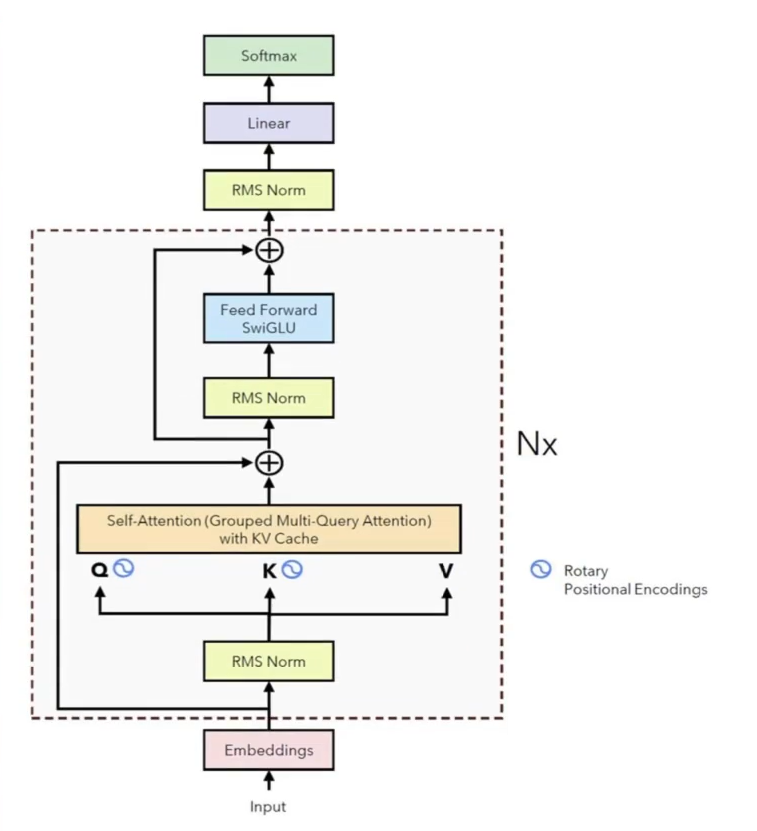
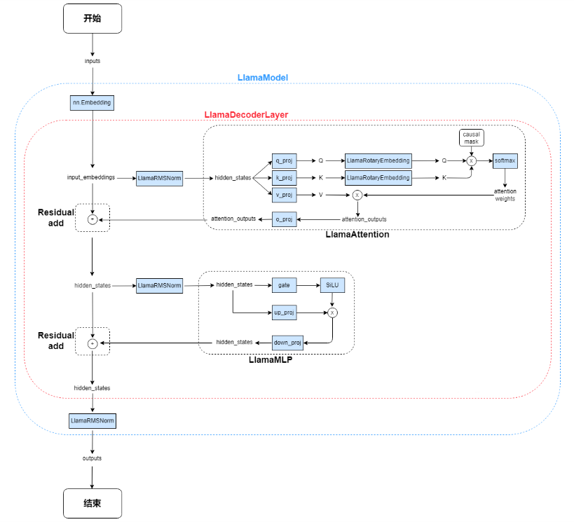
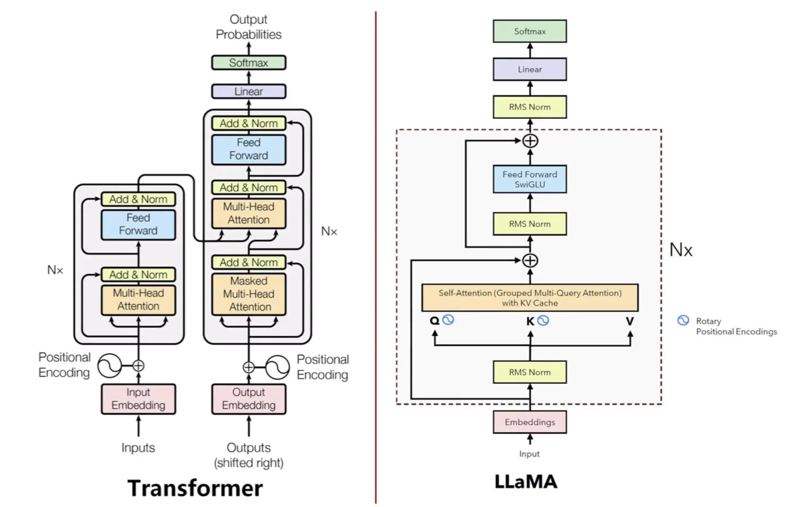
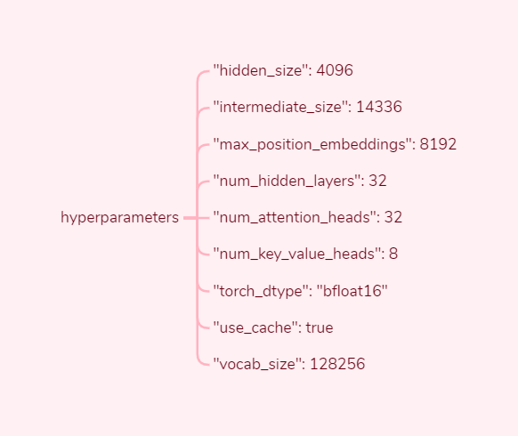
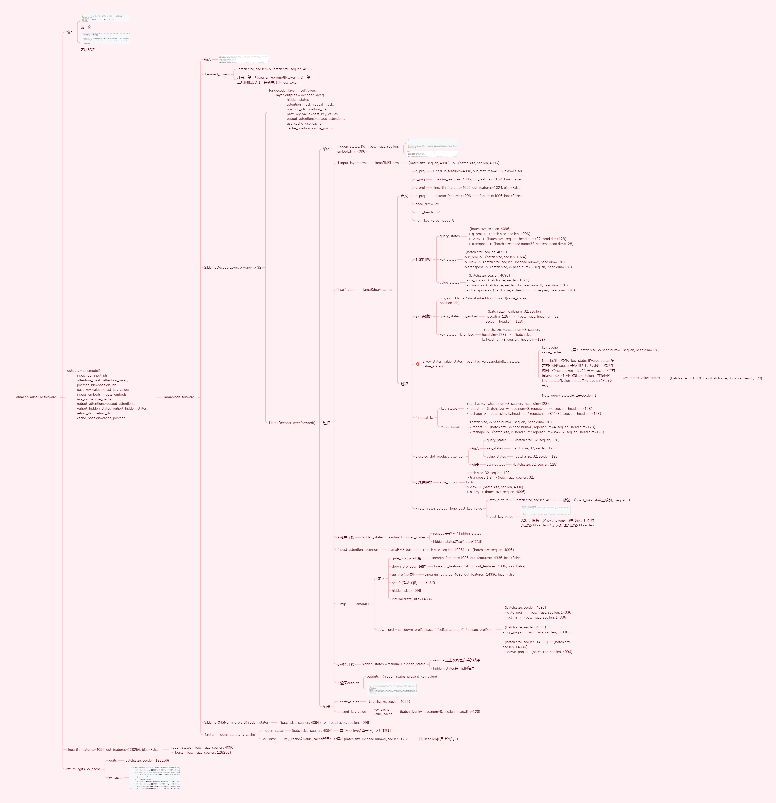
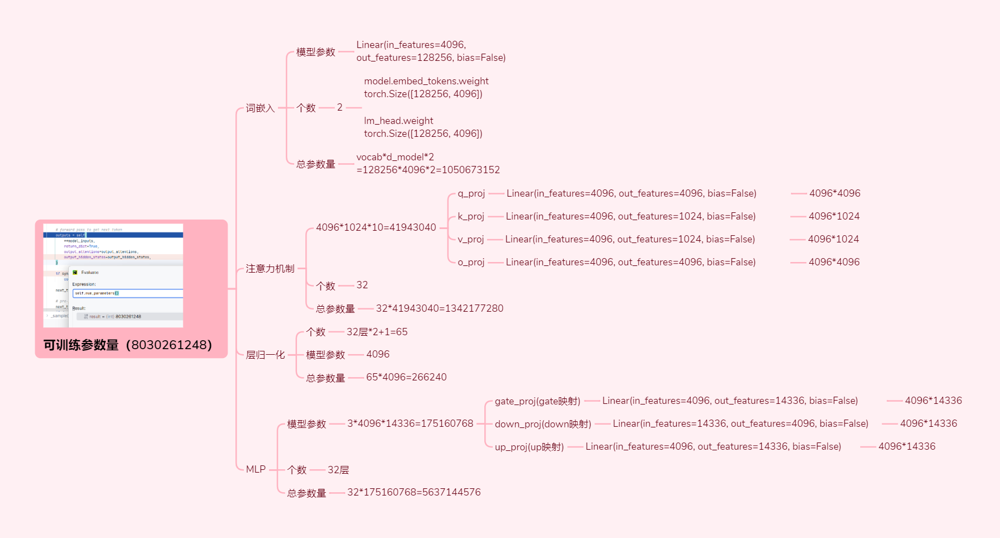
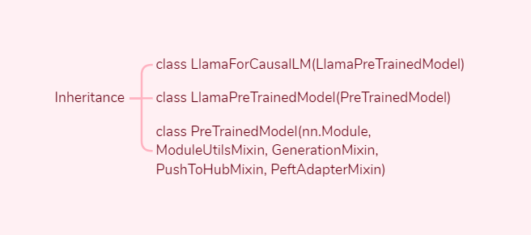

# Llama Source Code Exploration
  - 1. About
  - 2. Llama Overall Architecture
  - 3. Llama Code Logic
  - 4. Hyperparameters
  - 5. Tensor Dimensionality Transformation
  - 6. Number of Trainable Parameters  
  - 7. Source Code
<!-- more -->

## 1. About
Source：https://huggingface.co/meta-llama/Meta-Llama-3-8B-Instruct

Date：2024.04.18

Company：Meta

Source Code：

https://github.com/huggingface/transformers/blob/main/src/transformers/models/llama/modeling_llama.py

## 2. Llama Overall Architecture






## 3. Llama Code Logic
### 3.1. Llama Inference Code Logic
Key Points:
- 1. Batch_size during inference: Indicates the number of samples processed simultaneously. With batch_size=8, 8 prompts are processed as a batch
    - These prompts may have different token sequence lengths
        - Sequence alignment
            - Padding is used to align sequences to the same length
            - Padding tokens (typically [PAD]) don't affect model computations
        - Attention mask ignores padding
            - Binary vector marking valid tokens (1) vs padding (0), ensuring attention calculations skip padding
- 2. Inference only involves forward propagation
    - Why no backpropagation during inference?
        - Training: Backprop calculates gradients for parameter updates
        - Inference: Uses pre-trained parameters for generation without gradient calculations

Inference Process (Autoregressive):
1. Tokenize prompt into token sequence
2. Embed tokens into hidden_size dimension tensors
3. Process through 32 decoder layers
4. Map final hidden states to vocabulary probabilities
5. Append highest probability token and repeat

Code Details:
- 1. Tokenization
    - 128,000 regular tokens + 256 special tokens (e.g., <|begin_of_text|>, <|end_of_text|>)
    - Total vocabulary: 128,256 tokens


- 2. Embedding Layer
    - hidden_size: 4096
    - Shape transformation: (batch_size, seq_len) → (batch_size, seq_len, 4096)

- 3. Decoder Layers (32x LlamaDecoderLayer)
    - Each layer contains attention + MLP blocks
    - Parameters per layer: 16h² (4h² from attention + 12h² from MLP)
    - Total parameters: 32 × 16h² = 512h²

- 4. Attention Block
    - 4 linear projections: Q, K, V, O (each h×h)

- 5. MLP Block
    - 3 linear projections: gate, up, down (each h×4h)

### 3.2. Llama Training Code Logic
Training Process: Forward pass → Loss calculation → Backprop → Parameter updates

Key Aspects:
- 1. Multiple epochs: Full dataset passes
- 2. Batch processing: Dataset divided into batches
- 3. Per-batch updates: Parameters updated after each batch

Training Workflow:
1. Data preparation: Tokenization & batching
2. Epoch loop
3. Batch processing:
    - 3.1 Forward pass (Layer 1→32)
    - 3.2 Loss calculation (e.g., cross-entropy)
    - 3.3 Backprop (Layer 32→1)
    - 3.4 Parameter update (optimizer step)

## 4. Hyperparameters


## 5. Tensor Dimensionality Transformation




## 6. Number of Trainable Parameters


## 7. Source Code
### 7.1. Entrance
```python
# Download the vocabulary file tokenizer.json from the model_id path and instantiate the tokenizer class
tokenizer = AutoTokenizer.from_pretrained(model_id)
"""
The main steps are divided into two parts:
1.Download the configuration file config.json from the model_id path and instantiate the LlamaConfig class
2.Download the model-related information from the model_id path and instantiate the LlamaForCausalLM class
"""
model = AutoModelForCausalLM.from_pretrained(
    model_id,
    torch_dtype=torch.bfloat16,
    device_map="auto",
)

# prompt
messages = [
    {"role": "system", "content": "You are a pirate chatbot who always responds in pirate speak!"},
    {"role": "user", "content": "Who are you?"},
]

# Convert messages into tokens
input_ids = tokenizer.apply_chat_template(
    messages,
    add_generation_prompt=True,
    return_tensors="pt"
).to(model.device)

terminators = [
    tokenizer.eos_token_id,
    tokenizer.convert_tokens_to_ids("<|eot_id|>")
]

# GenerationMixin's generate
# Generation Strategy：*multinomial sampling* if `num_beams=1` and `do_sample=True`
outputs = model.generate(
    input_ids,
    max_new_tokens=256,
    eos_token_id=terminators,
    do_sample=True,
    temperature=0.6, # The value used to modulate the next token probabilities.defaults to 1.0
    top_p=0.9, # defaults to 1.0
)

print(outputs)
response = outputs[0][input_ids.shape[-1]:] # Retrieve the part of the outputs that excludes the original output of input_ids (prompt)
print(tokenizer.decode(response, skip_special_tokens=True)) # Convert tokens back into characters, ignoring special tokens
```
### 7.2. GenerationMixin

```python
class GenerationMixin:

    @torch.no_grad()
    def generate(
        self,
        inputs: Optional[torch.Tensor] = None,
        generation_config: Optional[GenerationConfig] = None,
        logits_processor: Optional[LogitsProcessorList] = None,
        stopping_criteria: Optional[StoppingCriteriaList] = None,
        prefix_allowed_tokens_fn: Optional[Callable[[int, torch.Tensor], List[int]]] = None,
        synced_gpus: Optional[bool] = None,
        assistant_model: Optional["PreTrainedModel"] = None,
        streamer: Optional["BaseStreamer"] = None,
        negative_prompt_ids: Optional[torch.Tensor] = None,
        negative_prompt_attention_mask: Optional[torch.Tensor] = None,
        **kwargs,
    ) -> Union[GenerateOutput, torch.LongTensor]:

        # 13. run sample
        result = self._sample(
            input_ids,
            logits_processor=prepared_logits_processor,
            logits_warper=prepared_logits_warper,
            stopping_criteria=prepared_stopping_criteria,
            generation_config=generation_config,
            synced_gpus=synced_gpus,
            streamer=streamer,
            **model_kwargs,
        )

    def _sample(
        self,
        input_ids: torch.LongTensor,
        logits_processor: LogitsProcessorList,
        stopping_criteria: StoppingCriteriaList,
        generation_config: GenerationConfig,
        synced_gpus: bool,
        streamer: Optional["BaseStreamer"],
        logits_warper: Optional[LogitsProcessorList] = None,
        **model_kwargs,
    ) -> Union[GenerateNonBeamOutput, torch.LongTensor]:

        while self._has_unfinished_sequences(this_peer_finished, synced_gpus, device=input_ids.device):            

            # forward pass to get next token
            outputs = self(
                **model_inputs,
                return_dict=True,
                output_attentions=output_attentions,
                output_hidden_states=output_hidden_states,
            )

            next_token_logits = outputs.logits[:, -1, :]

            next_token_scores = logits_warper(input_ids, next_token_scores)

            # token selection        
            probs = nn.functional.softmax(next_token_scores, dim=-1)
            next_tokens = torch.multinomial(probs, num_samples=1).squeeze(1)

            input_ids = torch.cat([input_ids, next_tokens[:, None]], dim=-1)

        return GenerateDecoderOnlyOutput(
                    sequences=input_ids,
                    scores=scores,
                    logits=raw_logits,
                    attentions=decoder_attentions,
                    hidden_states=decoder_hidden_states,
                    past_key_values=model_kwargs.get("past_key_values"),
                )
```

### 7.3. LlamaForCausalLM
```python
class LlamaForCausalLM(LlamaPreTrainedModel):
    def __init__(self, config):
        super().__init__(config)
        self.model = LlamaModel(config)
        self.vocab_size = config.vocab_size
        self.lm_head = nn.Linear(config.hidden_size, config.vocab_size, bias=False)

        # Initialize weights and apply final processing
        self.post_init()
    
    def forward(
        self,
        input_ids: torch.LongTensor = None,
        attention_mask: Optional[torch.Tensor] = None,
        position_ids: Optional[torch.LongTensor] = None,
        past_key_values: Optional[Union[Cache, List[torch.FloatTensor]]] = None,
        inputs_embeds: Optional[torch.FloatTensor] = None,
        labels: Optional[torch.LongTensor] = None,
        use_cache: Optional[bool] = None,
        output_attentions: Optional[bool] = None,
        output_hidden_states: Optional[bool] = None,
        return_dict: Optional[bool] = None,
        cache_position: Optional[torch.LongTensor] = None,
    ) -> Union[Tuple, CausalLMOutputWithPast]:

        # decoder outputs consists of (dec_features, layer_state, dec_hidden, dec_attn)
        outputs = self.model(
            input_ids=input_ids,
            attention_mask=attention_mask,
            position_ids=position_ids,
            past_key_values=past_key_values,
            inputs_embeds=inputs_embeds,
            use_cache=use_cache,
            output_attentions=output_attentions,
            output_hidden_states=output_hidden_states,
            return_dict=return_dict,
            cache_position=cache_position,
        )

        hidden_states = outputs[0]

        logits = self.lm_head(hidden_states)

        return CausalLMOutputWithPast(
            loss=loss,
            logits=logits,
            past_key_values=outputs.past_key_values,
            hidden_states=outputs.hidden_states,
            attentions=outputs.attentions,
        )
```

### 7.4. LlamaModel
```python
class LlamaModel(LlamaPreTrainedModel):
    def __init__(self, config: LlamaConfig):
        super().__init__(config)
        self.padding_idx = config.pad_token_id
        self.vocab_size = config.vocab_size

        self.embed_tokens = nn.Embedding(config.vocab_size, config.hidden_size, self.padding_idx)
        self.layers = nn.ModuleList(
            [LlamaDecoderLayer(config, layer_idx) for layer_idx in range(config.num_hidden_layers)]
        )
        self.norm = LlamaRMSNorm(config.hidden_size, eps=config.rms_norm_eps)
        self.gradient_checkpointing = False

        # Initialize weights and apply final processing
        self.post_init()

    def forward(
        self,
        input_ids: torch.LongTensor = None,
        attention_mask: Optional[torch.Tensor] = None,
        position_ids: Optional[torch.LongTensor] = None,
        past_key_values: Optional[Union[Cache, List[torch.FloatTensor]]] = None,
        inputs_embeds: Optional[torch.FloatTensor] = None,
        use_cache: Optional[bool] = None,
        output_attentions: Optional[bool] = None,
        output_hidden_states: Optional[bool] = None,
        return_dict: Optional[bool] = None,
        cache_position: Optional[torch.LongTensor] = None,
    ) -> Union[Tuple, BaseModelOutputWithPast]:

        hidden_states = self.embed_tokens(input_ids)

        for decoder_layer in self.layers:
            layer_outputs = decoder_layer(
                    hidden_states,
                    attention_mask=causal_mask,
                    position_ids=position_ids,
                    past_key_value=past_key_values,
                    output_attentions=output_attentions,
                    use_cache=use_cache,
                    cache_position=cache_position,
                )
        
        hidden_states = self.norm(layer_outputs[0]) 

        return BaseModelOutputWithPast(
            last_hidden_state=hidden_states,
            past_key_values=next_cache,
            hidden_states=all_hidden_states,
            attentions=all_self_attns,
        )
```

### 7.5. LlamaDecoderLayer
```python
class LlamaDecoderLayer(nn.Module):
    def __init__(self, config: LlamaConfig, layer_idx: int):
        super().__init__()
        self.hidden_size = config.hidden_size

        self.self_attn = LLAMA_ATTENTION_CLASSES[config._attn_implementation](config=config, layer_idx=layer_idx)

        self.mlp = LlamaMLP(config)
        self.input_layernorm = LlamaRMSNorm(config.hidden_size, eps=config.rms_norm_eps)
        self.post_attention_layernorm = LlamaRMSNorm(config.hidden_size, eps=config.rms_norm_eps)

    def forward(
        self,
        hidden_states: torch.Tensor,
        attention_mask: Optional[torch.Tensor] = None,
        position_ids: Optional[torch.LongTensor] = None,
        past_key_value: Optional[Cache] = None,
        output_attentions: Optional[bool] = False,
        use_cache: Optional[bool] = False,
        cache_position: Optional[torch.LongTensor] = None,
    ) -> Tuple[torch.FloatTensor, Optional[Tuple[torch.FloatTensor, torch.FloatTensor]]]:

        residual = hidden_states

        hidden_states = self.input_layernorm(hidden_states)

        # Self Attention
        hidden_states, self_attn_weights, present_key_value = self.self_attn(
            hidden_states=hidden_states,
            attention_mask=attention_mask,
            position_ids=position_ids,
            past_key_value=past_key_value,
            output_attentions=output_attentions,
            use_cache=use_cache,
            cache_position=cache_position,
        )

        hidden_states = residual + hidden_states

        # Fully Connected
        residual = hidden_states
        hidden_states = self.post_attention_layernorm(hidden_states)
        hidden_states = self.mlp(hidden_states)
        hidden_states = residual + hidden_states

        outputs = (hidden_states,)

        if use_cache:
            outputs += (present_key_value,)

        return outputs
```
### 7.6. LlamaRMSNorm
```python
class LlamaRMSNorm(nn.Module):
    def __init__(self, hidden_size, eps=1e-6):
        """
        LlamaRMSNorm is equivalent to T5LayerNorm
        """
        super().__init__()
        self.weight = nn.Parameter(torch.ones(hidden_size))
        self.variance_epsilon = eps

    def forward(self, hidden_states):
        input_dtype = hidden_states.dtype
        hidden_states = hidden_states.to(torch.float32)
        variance = hidden_states.pow(2).mean(-1, keepdim=True)
        hidden_states = hidden_states * torch.rsqrt(variance + self.variance_epsilon)
        return self.weight * hidden_states.to(input_dtype)
```

### 7.7. LlamaSdpaAttention
```python
class LlamaSdpaAttention(LlamaAttention):
    """
    Llama attention module using torch.nn.functional.scaled_dot_product_attention. This module inherits from
    `LlamaAttention` as the weights of the module stays untouched. The only changes are on the forward pass to adapt to
    SDPA API.
    """
    def __init__(self, config: LlamaConfig, layer_idx: Optional[int] = None):
        super().__init__()
        self.config = config
        self.layer_idx = layer_idx
        self.attention_dropout = config.attention_dropout
        self.hidden_size = config.hidden_size
        self.num_heads = config.num_attention_heads
        self.head_dim = self.hidden_size // self.num_heads
        self.num_key_value_heads = config.num_key_value_heads
        self.num_key_value_groups = self.num_heads // self.num_key_value_heads
        self.max_position_embeddings = config.max_position_embeddings
        self.rope_theta = config.rope_theta
        self.is_causal = True

        self.q_proj = nn.Linear(self.hidden_size, self.num_heads * self.head_dim, bias=config.attention_bias)
        self.k_proj = nn.Linear(self.hidden_size, self.num_key_value_heads * self.head_dim, bias=config.attention_bias)
        self.v_proj = nn.Linear(self.hidden_size, self.num_key_value_heads * self.head_dim, bias=config.attention_bias)
        self.o_proj = nn.Linear(self.hidden_size, self.hidden_size, bias=config.attention_bias)
        
        self.rotary_emb = LlamaRotaryEmbedding(
                self.head_dim,
                max_position_embeddings=self.max_position_embeddings,
                base=self.rope_theta,
            )

    # Adapted from LlamaAttention.forward
    def forward(
        self,
        hidden_states: torch.Tensor,
        attention_mask: Optional[torch.Tensor] = None,
        position_ids: Optional[torch.LongTensor] = None,
        past_key_value: Optional[Cache] = None,
        output_attentions: bool = False,
        use_cache: bool = False,
        cache_position: Optional[torch.LongTensor] = None,
    ) -> Tuple[torch.Tensor, Optional[torch.Tensor], Optional[Tuple[torch.Tensor]]]:        

        bsz, q_len, _ = hidden_states.size()

        query_states = self.q_proj(hidden_states)
        key_states = self.k_proj(hidden_states)
        value_states = self.v_proj(hidden_states)

        query_states = query_states.view(bsz, q_len, self.num_heads, self.head_dim).transpose(1, 2)
        key_states = key_states.view(bsz, q_len, self.num_key_value_heads, self.head_dim).transpose(1, 2)
        value_states = value_states.view(bsz, q_len, self.num_key_value_heads, self.head_dim).transpose(1, 2)

        cos, sin = self.rotary_emb(value_states, position_ids)
        query_states, key_states = apply_rotary_pos_emb(query_states, key_states, cos, sin)

        if past_key_value is not None:
            # sin and cos are specific to RoPE models; cache_position needed for the static cache
            cache_kwargs = {"sin": sin, "cos": cos, "cache_position": cache_position}
            key_states, value_states = past_key_value.update(key_states, value_states, self.layer_idx, cache_kwargs)

        key_states = repeat_kv(key_states, self.num_key_value_groups)
        value_states = repeat_kv(value_states, self.num_key_value_groups)

        causal_mask = attention_mask
        if attention_mask is not None:
            causal_mask = causal_mask[:, :, :, : key_states.shape[-2]]

        # SDPA with memory-efficient backend is currently (torch==2.1.2) bugged with non-contiguous inputs with custom attn_mask,
        # Reference: https://github.com/pytorch/pytorch/issues/112577.
        if query_states.device.type == "cuda" and causal_mask is not None:
            query_states = query_states.contiguous()
            key_states = key_states.contiguous()
            value_states = value_states.contiguous()

        # We dispatch to SDPA's Flash Attention or Efficient kernels via this if statement instead of an
        # inline conditional assignment to support both torch.compile's `dynamic=True` and `fullgraph=True`
        is_causal = True if causal_mask is None and q_len > 1 else False

        attn_output = torch.nn.functional.scaled_dot_product_attention(
            query_states,
            key_states,
            value_states,
            attn_mask=causal_mask,
            dropout_p=self.attention_dropout if self.training else 0.0,
            is_causal=is_causal,
        )

        attn_output = attn_output.transpose(1, 2).contiguous()
        attn_output = attn_output.view(bsz, q_len, self.hidden_size)

        attn_output = self.o_proj(attn_output)

        return attn_output, None, past_key_value
```

### 7.8. LlamaRotaryEmbedding
```python
class LlamaRotaryEmbedding(nn.Module):
    def __init__(self, dim, max_position_embeddings=2048, base=10000, device=None, scaling_factor=1.0):
        super().__init__()
        self.scaling_factor = scaling_factor # used to adjust the magnitude of positional encoding
        self.dim = dim
        self.max_position_embeddings = max_position_embeddings # Indicates the maximum sequence length, i.e., the maximum number of positional encodings that the model can handle
        self.base = base # used for calculating frequencies
        inv_freq = 1.0 / (self.base ** (torch.arange(0, self.dim, 2, dtype=torch.int64).float().to(device) / self.dim)) # Inverse frequency; the shape of inv_freq is (dim/2), and each element of inv_freq represents how quickly the encoding for that dimension will cycle through the sinusoidal functions. Smaller inv_freq leads to lower frequency (slower cycling), whereas a larger inv_freq results in higher frequency (faster cycling). In this way, the feature vector for any position will be unique, allowing the model to understand and exploit the positional information of elements in the sequence
        self.register_buffer("inv_freq", inv_freq, persistent=False)
        # For BC we register cos and sin cached
        self.max_seq_len_cached = max_position_embeddings

    @torch.no_grad()
    def forward(self, x, position_ids):
        # x: [bs, num_attention_heads, seq_len, head_size]
        inv_freq_expanded = self.inv_freq[None, :, None].float().expand(position_ids.shape[0], -1, 1) # （64）->(batch.size, 64, 1)
        position_ids_expanded = position_ids[:, None, :].float() # (1, seq.len)->(batch.size, 1, seq.len)
        # Force float32 since bfloat16 loses precision on long contexts
        # See https://github.com/huggingface/transformers/pull/29285
        device_type = x.device.type
        device_type = device_type if isinstance(device_type, str) and device_type != "mps" else "cpu"
        with torch.autocast(device_type=device_type, enabled=False):
            freqs = (inv_freq_expanded.float() @ position_ids_expanded.float()).transpose(1, 2) # (batch.size, 64, 1) * (batch.size, 1, seq.len) -> (batch.size, 64, seq.len) -> transpose(1, 2) -> (batch.size, seq.len, 64)
            emb = torch.cat((freqs, freqs), dim=-1) # (batch.size, seq.len, 128)
            cos = emb.cos() # (batch.size, seq.len, 128)
            sin = emb.sin() # (batch.size, seq.len, 128)
        return cos.to(dtype=x.dtype), sin.to(dtype=x.dtype)
```

### 7.9. LlamaMLP
```python
class LlamaMLP(nn.Module):
    def __init__(self, config):
        super().__init__()
        self.config = config
        self.hidden_size = config.hidden_size
        self.intermediate_size = config.intermediate_size
        self.gate_proj = nn.Linear(self.hidden_size, self.intermediate_size, bias=config.mlp_bias)
        self.up_proj = nn.Linear(self.hidden_size, self.intermediate_size, bias=config.mlp_bias)
        self.down_proj = nn.Linear(self.intermediate_size, self.hidden_size, bias=config.mlp_bias)
        self.act_fn = ACT2FN[config.hidden_act]

    def forward(self, x):
        if self.config.pretraining_tp > 1:
            slice = self.intermediate_size // self.config.pretraining_tp
            gate_proj_slices = self.gate_proj.weight.split(slice, dim=0)
            up_proj_slices = self.up_proj.weight.split(slice, dim=0)
            down_proj_slices = self.down_proj.weight.split(slice, dim=1)

            gate_proj = torch.cat(
                [F.linear(x, gate_proj_slices[i]) for i in range(self.config.pretraining_tp)], dim=-1
            )
            up_proj = torch.cat([F.linear(x, up_proj_slices[i]) for i in range(self.config.pretraining_tp)], dim=-1)

            intermediate_states = (self.act_fn(gate_proj) * up_proj).split(slice, dim=2)
            down_proj = [
                F.linear(intermediate_states[i], down_proj_slices[i]) for i in range(self.config.pretraining_tp)
            ]
            down_proj = sum(down_proj)
        else:
            down_proj = self.down_proj(self.act_fn(self.gate_proj(x)) * self.up_proj(x))

        return down_proj
```