# Vector Databases and Similarity Search
  - 1. Vector Embeddings
  - 2. Similarity (Distance) Calculation Between Vectors
  - 3. Traditional Recommendation System Modules
  - 4. Vector Databases
  - 5. Indexing Algorithms: KNN, ANN, NSW, HNSW, PQ
  - 6. Sparse Search, Dense Search, Hybrid Search
<!-- more -->

## 1. Vector Embeddings
- Vector embeddings capture the underlying meaning of the data and can be viewed as a machine-readable format of the data.
- Embedding Models
  - Open-source library: sentence-transformers
    - Available via the Hugging Face model hub or directly from the source code repository.
    - Provides embedding models with dimensions in the range of 384, 512, and 768.
  - Paid API Services
    - OpenAI Embedding API
      - Higher dimensionality with better quality, reaching thousands of dimensions.
    - Cohere Embedding API
      - Known for high-quality multilingual embedding models that outperform open-source variants.
- Embedding Evaluation Leaderboard: https://huggingface.co/spaces/mteb/leaderboard
  
## 2. Similarity (Distance) Calculation Between Vectors
The greater the similarity, the smaller the distance; the two metrics are inversely related.

4 Distance Metrics

Dot Product and Cosine Distance are commonly used in the field of NLP, to evaluate how similar two sentence embeddings are.

- Euclidean Distance (L2)
  - Calculates the shortest path.
  - Smaller values indicate better matches.

- Manhattan Distance (L1)
  - Moves one direction axis at a time.
  - Smaller values indicate better matches.

- Dot Product
  - The projection of one vector onto another.
  - Produces a non-normalized value with arbitrary size.
  - Larger values indicate better matches, while negative values usually indicate greater distance.

- Cosine Distance
  - Calculates the angle between vectors.
  - Produces a normalized value (between -1 and 1).
  - Smaller values indicate better matches.

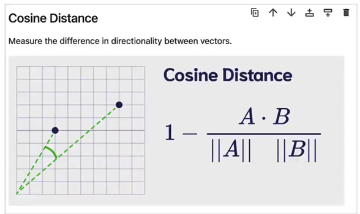

## 3. Traditional Recommendation System Modules
### 3.1. Classification
- Content-Based Recommendation
  - Based on previously liked content.
  - Pros: Recommendations are explicitly aligned with user interests.
  - Cons: Does not recommend types of content not previously encountered.
- Collaborative Filtering Recommendation
  - Recommends content liked by friends.
  - Pros: Can recommend types of content previously unseen.
  - Cons: Might recommend content the user is not interested in.

### 3.2. Input
  - 1. Behavior (e.g., articles viewed, articles clicked)
  - 2. User's basic information
  - 3. Article list

### 3.3. Goal
  - Recommend new content.

### 3.4. Approach
  - Build user profiles based on behavior and basic information.
    - User vectors (similar to tags, but these are all vectors).
    - Tags (liked topics, disliked topics, preferences, etc.)
      - A collection of tags from articles the user has viewed (both provided and learned).
  - Recall candidates from the article database based on tags.
    - Multiple recall iterations can be designed.
  - Coarse ranking + fine ranking.
    - Multiple ranking iterations can be designed.
    - Considerations:
      - Changes in user interests.
      - Source and timeliness of articles.
      - More detailed exploration of user interests.
  - Top 10 articles.

### 3.5. Traditional Recommendation System Process

Article -> User Profile -> Recall -> Candidates -> Rank -> Top 10
- 1. Article -> User Profile
- 2. User Profile -> Recall
- 3. Recall -> Candidates
- 4. Candidates -> Rank
- 5. Rank -> Top 10

### 3.6. Recommendation Systems Combined with LLMs

Consider which processes can incorporate LLMs:
- Step 1
  - Use LLM to extract tags.
- Step 4
  - Use LLM for ranking.

## 4. Vector Databases
### 4.1. Vector Databases: Solving Efficiency Issues

Vector databases have existed prior to the explosion of generative AI and have long been part of semantic search applications, which search based on the meaning similarity of words or phrases rather than exact keyword matching.

The main goal of vector databases is to provide a fast and efficient way to store and perform semantic query data.
- Previously: Similarity calculations with each vector.
- Now: Approximate search.

### 4.2. Vector Database Products
- Open Source & Closed Source
  - Among all listed options, only one is completely closed-source: Pinecone. Zilliz is also a fully closed commercial solution but is entirely built on Milvus and can be considered the parent company of Milvus.

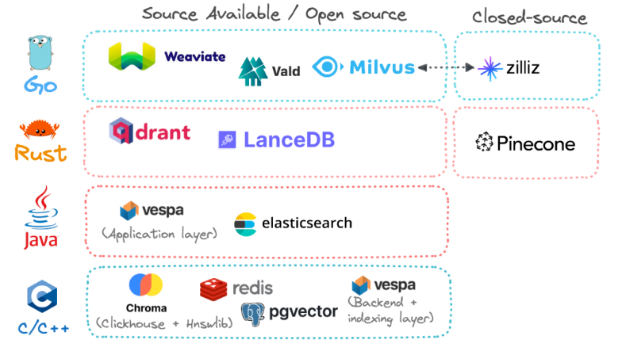

- Development History
  - Vespa was one of the first major vendors to incorporate vector similarity search alongside the mainstream BM25 keyword search algorithm.
  - Established vendors like Elasticsearch, Redis, and PostgreSQL only began offering vector search in 2022 and beyond, much later than originally anticipated.

- Hosting Options
  - Self-hosted (On-Premises)
    - Follows a client-server architecture.
  - Managed (Cloud-Native)
    - Follows a client-server architecture.
  - Recent Option: Embedded Mode
    - The database itself is tightly coupled with application code, running in a serverless manner.
    - Currently, only Chroma and LanceDB are available as embedded databases.

### 4.3. Vector Database Comparison
- Trade-offs
  - Hybrid search or keyword search? A hybrid of keyword and vector search can yield the best results; each vector database vendor recognizes this and provides their own customized hybrid search solution.
  - On-premises or cloud-native deployment? Many vendors tout "cloud-native" as a selling point, as if infrastructure is the biggest pain point globally, but on-premises deployment might be more cost-effective in the long run.
  - Open source or fully managed? Most vendors build on accessible or open-source code to demonstrate their foundational approaches and then offer deployment and infrastructure through fully managed SaaS. While self-hosting many solutions is still possible, it requires additional manpower and internal skill requirements.

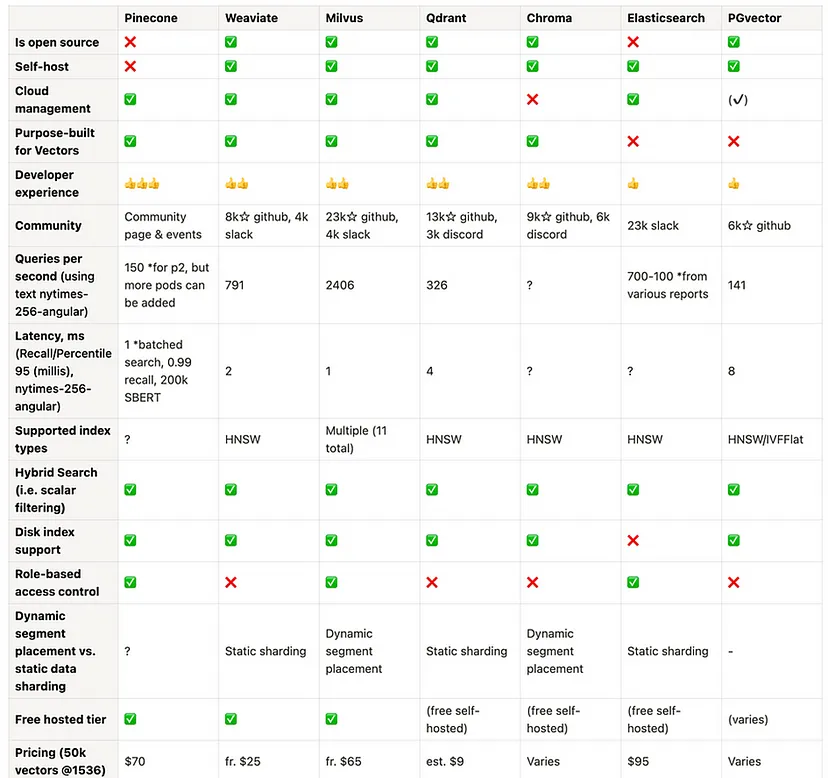

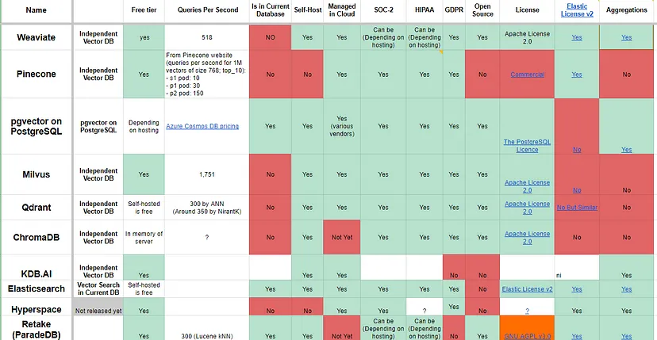

### 4.4. Indexing Algorithms
Data is stored in vector databases through indexing, which refers to creating data structures called indexes for efficient vector lookup by rapidly narrowing the search space.

As with most cases, choosing a vector index involves a trade-off between precision (accuracy/recall) and speed/throughput.
- BM25
- IVF (Inverted File)
- HNSW (Hierarchical Navigable Small World)
- PQ (Product Quantization)
- Flat
- RHNSW
- Vamana (used in the DiskANN implementation)

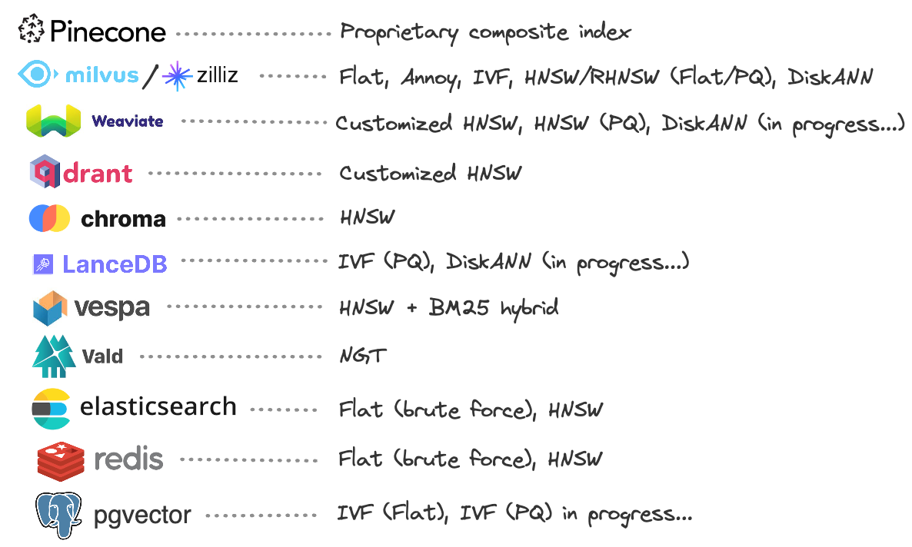

### 4.5. Index Evaluation Criteria
The evaluation of an index's quality always depends on the specific data model, generally including the following points:

- Query Time. The speed of queries is crucial, especially in large models.
- Query Quality. ANN queries may not always return the most accurate results, but the quality should not deviate too much. Query quality has many metrics, with recall being one of the most commonly used.
- Memory Consumption. The memory consumed by query indexing; looking up in memory is significantly faster than looking up on disk.
- Training Time. Some query methods require training to achieve better performance.
- Write Time. The impact on the index when writing vectors, including all maintenance.

## 5. Search
### 5.1. Sparse Search (Keyword Search) vs Dense Search (Vector Search/Semantic Search)
- Sparse Search (Keyword Search)
  - Keyword search, text matching.
- Dense Search (Vector Search/Semantic Search)
  - Vector similarity search.
  - Searching for the closest objects in vector space, known as semantic search or vector search.
  - For example, "Baby dogs" <=> "Here is content on puppies!"
  - Limitations:
    - Influenced by the embedding model used; vector similarity is only effective on the training dataset. If the search content is significantly different from the dataset used to train the embedding model, the search results will be poor due to the mismatch in distribution.
    - Do vectors truly represent semantics? They can be seen as hashes rather than true understanding, which can lead to misleading results.
    - With a large volume of vector data, search accuracy can significantly decline (refer to https://mp.weixin.qq.com/s/DH4-QCK1U8BYGlAblQLTLw).
    - Search is not suitable for data types lacking semantic information, such as sequential numbers or tabular data.
- Hybrid Search
  - Combines the ranking results of both sparse and dense searches.

### 5.2. Sparse Search
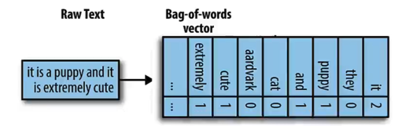

Bag of Words

The simplest way to perform keyword matching is through Bag of Words—counting how many times a word occurs in the query and the data vector, then returning objects with the highest matching word frequencies.

In practice, this method may capture only a small percentage of the available words, resulting in many zeros in the data.

### 5.3. Hybrid Search
Combines the results of both search types by setting appropriate weight ratios.

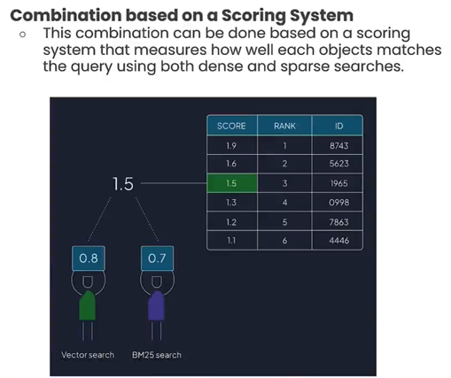

### 5.4. Multilingual Search
In multilingual search scenarios, texts with the same meaning but in different languages will generate very similar (if not identical) embeddings.

## 6. Keyword Matching Algorithm: BM25 (Best Matching 25)
Belongs to sparse search (keyword search).

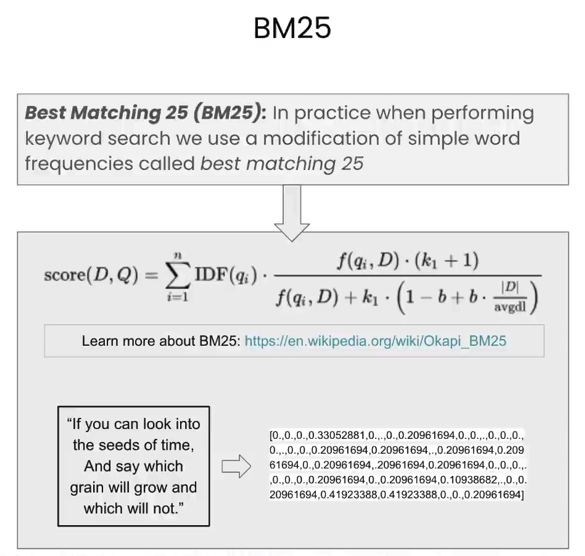

BM25 performs exceptionally well when searching across multiple keywords.

Concept: It counts the occurrences of words in the incoming phrases, where more frequently appearing words are weighted as less important during matching, while rarer words score significantly higher.

## 7. Inverted Index / Inverted File Index (IVF) - Fast Text Search
Belongs to sparse search (keyword search).

Used by search engines like Google and Baidu, it is particularly suitable for text retrieval.

Forward Index: DocId -> Value  
Inverted Index: Value -> DocId

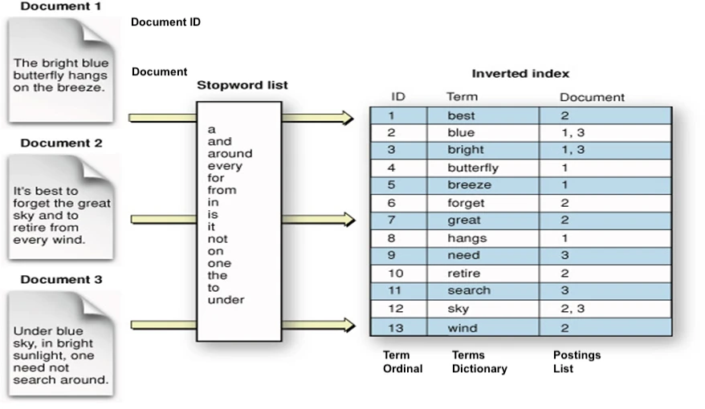

1. Extract words from documents that are not part of the stop words list (function words that have little actual meaning and are used in almost every document).
2. Create a mapping between each word and the multiple document IDs it appears in.
3. When querying keywords, recall (Recall) all documents containing those keywords.
4. When querying a sentence, which has multiple keywords, recall the corresponding documents for each keyword, then take the intersection, rank them, and return the top k documents as results.

## 8. KNN (K-Nearest Neighbors Algorithm, KNN Search, Brute Force Search)

Brute force search: Calculates similarity with every vector.

In classical machine learning, this is known as the K-Nearest Neighbors (KNN) algorithm.

It compares the query vector with each vector in the database.

1. Given a Query, find the distance between all vectors and the Query vector.
2. Sort all distances.
3. Return the top K matching objects that are closest.

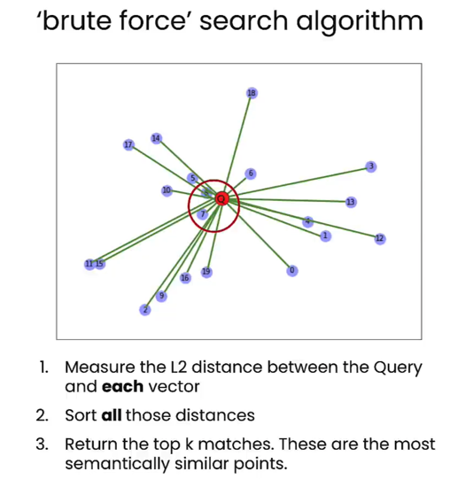

The issue with brute force search is the enormous computational cost; the total query time increases with the number of stored objects.

The more vectors you have, the longer the query takes, and in practical applications, you might be handling tens of millions or even hundreds of millions of objects.

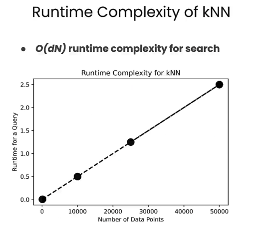

- Advantage: Precise  
- Disadvantage: High computational cost, long processing time, time complexity O(n).

## 9. Approximate KNN - Dividing Space into Several Modules
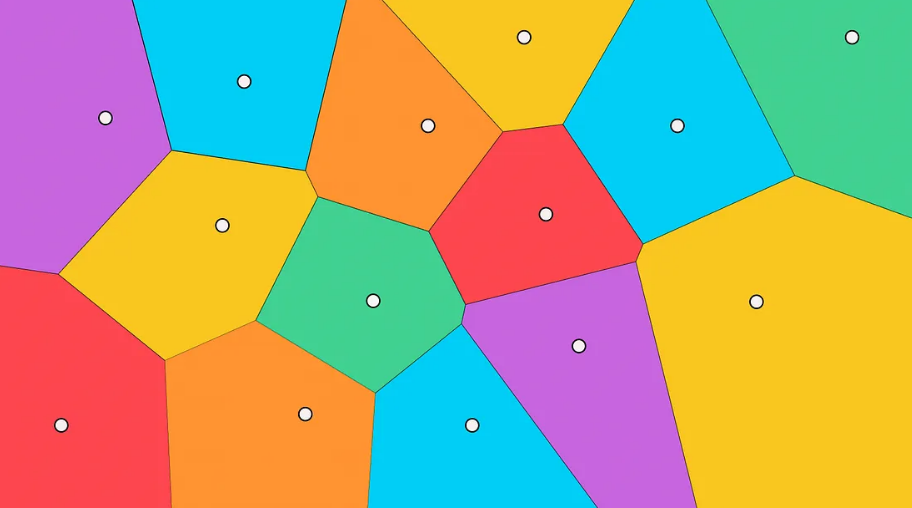

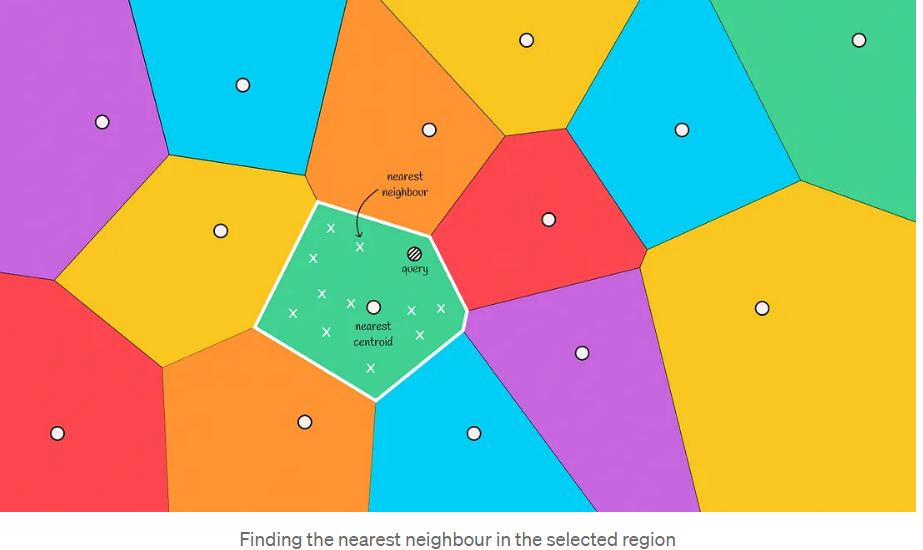

1. Use a clustering algorithm (like K-means) to initialize k cluster centers (also called centroids).
2. Calculate the distance from each sample to the centroids and assign samples to the nearest centroid, forming clusters.
3. Divide the space using these centroids and the samples belonging to each cluster, resulting in a Voronoi diagram.
   - The main property of a Voronoi diagram is that the distance from a centroid to any point in its region is less than the distance from that point to any other centroid.
4. Given a Query, calculate the distance from the Query to each centroid and find the corresponding space for the Query.
   - When given a new object, calculate the distances to all centroids of the Voronoi partitions. Then select the closest centroid and consider the vectors within that partition as candidates.
5. The Query then computes distances with all nodes in the space of the centroid.
   - By calculating distances to candidates and selecting the top k closest, it returns the final answer.

If there are k centroids, then the average number of nodes per space is n/k, resulting in a time complexity of O(k + n/k).

### 9.1. Boundary Problem

In the image below, we can see a situation where the actual nearest neighbor is located in the red area, but we only select candidates from the green area. This is referred to as the boundary problem.

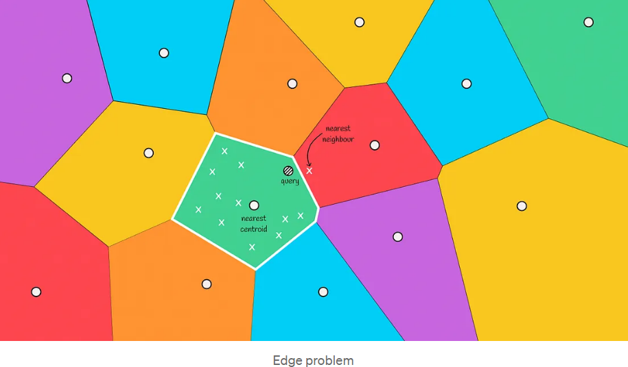

The boundary problem essentially arises because:

The Voronoi diagram only guarantees that the distance from a node to its region's centroid is less than to other centroids, but does not guarantee that the distance from a node to other nodes within the region is less than to nodes in other regions.

**Solution:** Expand the search range.

This situation often occurs when the query object is near the boundary of another region. To reduce errors in such cases, we can increase the search range and select several regions to search candidates based on the nearest m centroids.

The time complexity for expanding the search range is O(k + 3 * n/k).

The more regions searched, the more accurate the results, but the time required to compute them increases. A trade-off must be made between accuracy and processing time.

## 10. ANN (Approximate Nearest Neighbors Algorithm)

It doesn't always find the best match, but it finds approximate nearest neighbor matches, which is still a fairly good result, even if it's not perfect.

By sacrificing some accuracy (not always returning the true nearest neighbors), substantial performance improvements can be achieved using ANN algorithms.

- NSW
- HNSW

## 11. NSW (Navigable Small World)
### 11.1. Graph Construction (one by one)

- m=2: The number of neighbors, meaning how many nodes are connected.

- Highway Concept:
  - Initially, connections may be long because they are made one by one, without better or closer options. As connections progress, they become denser and shorter.
  - This approach has the advantage of resembling highways: the initially distant connections allow for traveling long distances without going through many small paths, thus improving search efficiency.

- Construction Complexity: O(n²)
  - The i-th node is compared with the previous i-1 nodes.

### 11.2. Search
1. Start from a random entry node and move towards the Query along the nearest neighbors.
2. Keep track of the top k points in a priority queue.

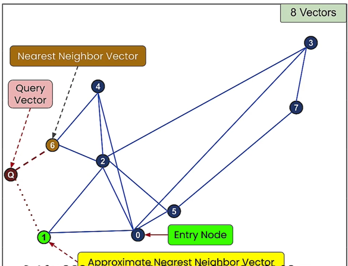

- Query Complexity: O(n log n)
- Problem: Can't find the next step? Early Stopping
  - Early stopping occurs when the two neighbors of the current node are farther from the query. The algorithm may return the current node as the response, even though closer nodes exist.
  - Improvement: Using multiple entry points can enhance search accuracy.

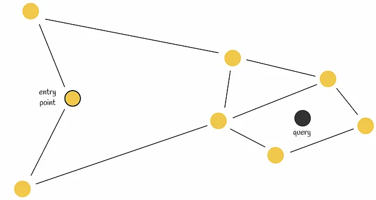

## 12. HNSW (Hierarchical Navigable Small World)
- HNSW Algorithm: An optimization of NSW based on the Skip List concept.
  - HNSW explicitly distinguishes between highways in the highway concept, imagining layers for different modes of transport: airplane, train, car, bicycle, and walking.
- It has driven the development of some of the most powerful vector databases, which utilize this structure.

### 12.1. Building - Hierarchical Structure
- The structure is divided into layers, with the number of nodes increasing from top to bottom, with the bottom layer containing all nodes.
- How to allocate nodes into layers?
  - Each node is assigned a random number as its maximum layer (Max Layer). A node with a Max Layer of zero exists only at the bottom layer. If the random number is 2, the node exists at layers 0, 1, and 2, and so forth.
- Construction Complexity: O(n log n)

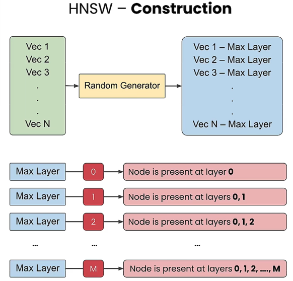
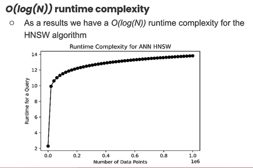

### 12.2. Querying
- Query Process:
  1. Start from a random entry node at the top layer, moving towards the nearest neighbors.
  2. Move to the nearest node in that layer.
  3. Enter the next layer and continue to the nearest neighbor until reaching the bottom layer.

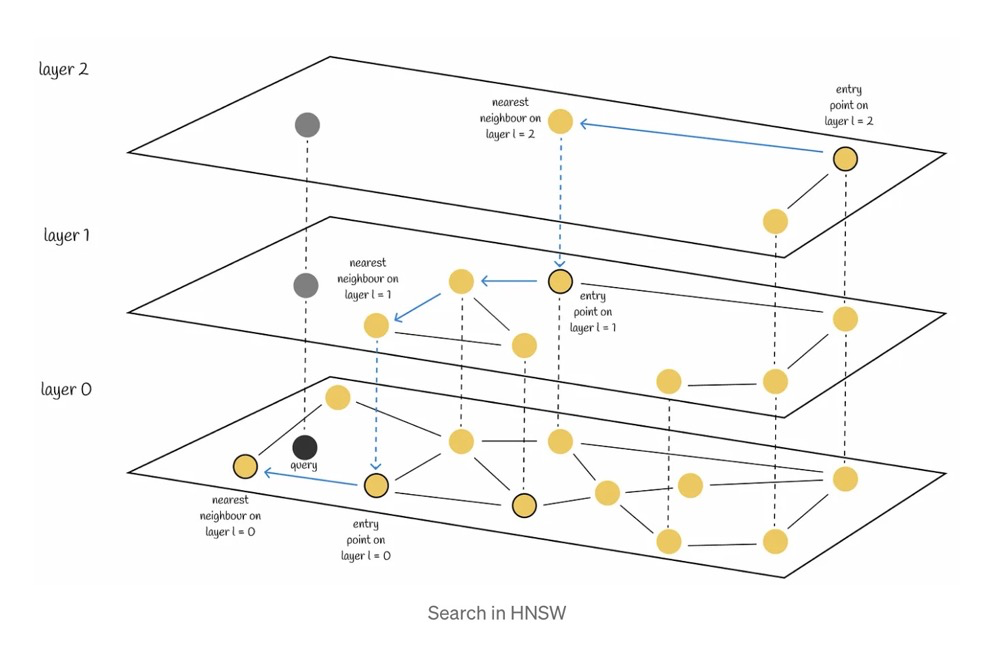
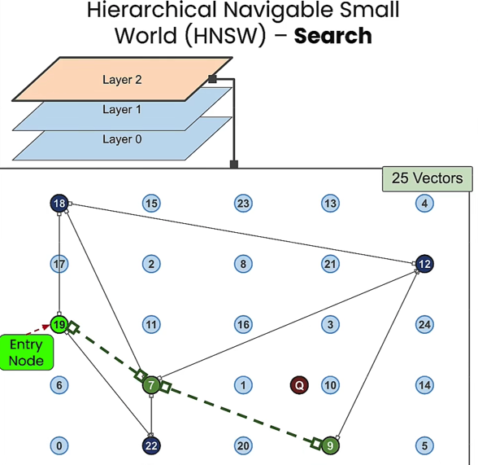

- Query Complexity: O(log n)
  - Query time grows logarithmically, meaning that it doesn't significantly impact speed as data volume increases.

### 12.3. Further Optimization: HNSW + Approximate KNN
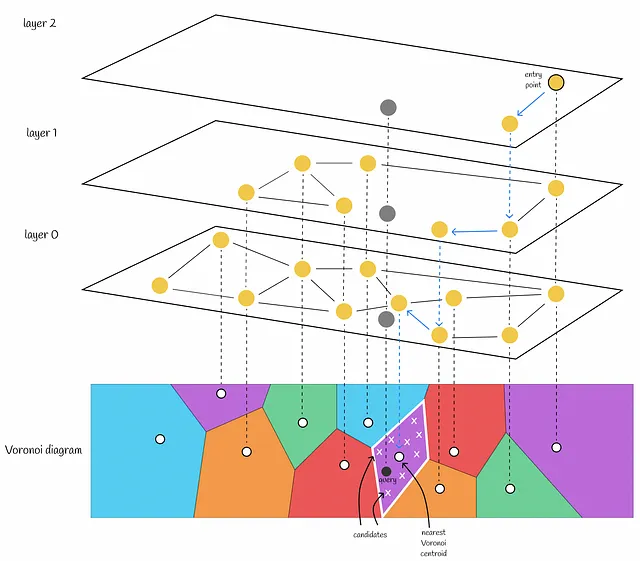

## 13. Product Quantization (PQ)
Enhances search efficiency while compressing data and reducing memory usage.

Core:
- Fast
  - Time Complexity: O(number of vectors * (subspace/dimension))
- Compression
  - Data Compression: For instance, if each vector in the database is 1024-dimensional and split into four 256-dimensional subvectors, the storage requirement is greatly reduced by converting from 1024 floats to 4 ints.

Product Quantization aims to reduce memory usage and improve query speed (due to reduced computational load). PQ is a lossy compression method, which can lead to decreased retrieval accuracy, but this is acceptable in the context of ANN requirements.

### 13.1. Construction

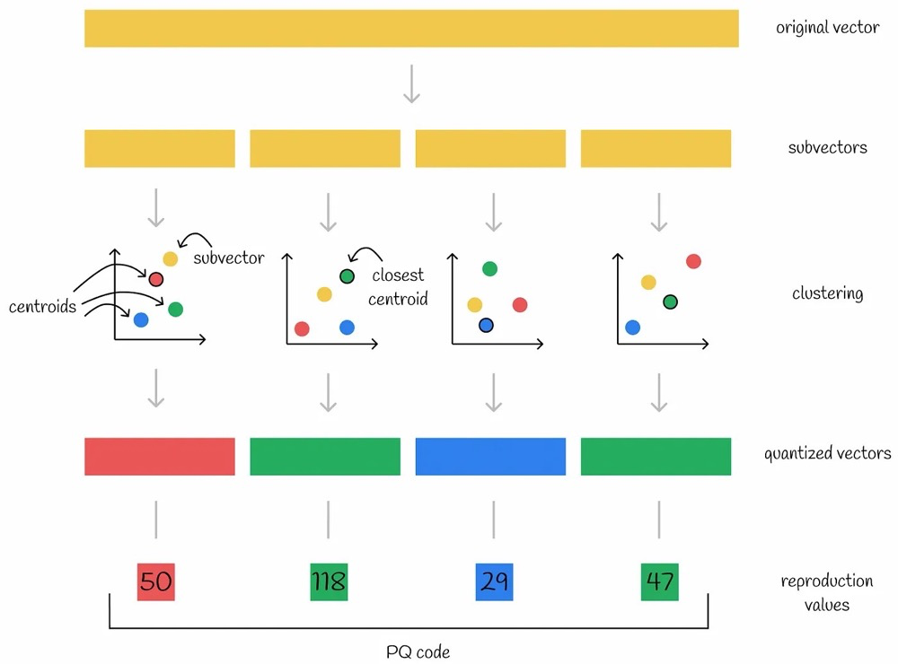

Steps:
1. **Subvectors**: Split the original high-dimensional vector into n low-dimensional subvectors.
   - For example, if each vector in the database is 1024-dimensional, split it into four 256-dimensional subvectors.
2. **Codebook**: Use k-means to compute Voronoi diagrams for each of the n subvectors, resulting in n distinct Voronoi diagrams (assuming each diagram has k centroids).
3. **Clustering**: Place the n subvectors into their respective completed Voronoi diagrams to find the nearest centroid.
4. **Quantized Vectors**: Treat the nearest centroids as new vectors, leading to quantized vectors.
5. **Reproduction Values**: Use the indices of the nearest centroids in each of the n subvectors as new values, collectively referred to as the PQ code.
   - Each subvector gets the index of its nearest centroid, resulting in four new values per vector in the database.

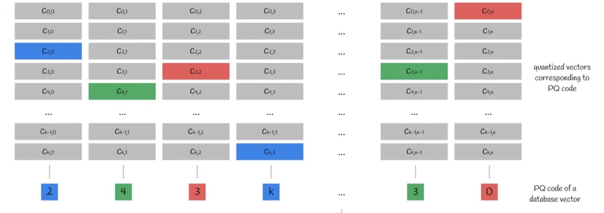

Based on the n subvectors and the k centroids in each subspace, we obtain an n*k centroid matrix. The index of each subvector's nearest centroid is the PQ code.

### 13.2. Querying
To find the centroids using the PQ code, look for KNN in the subspace of the centroid, approximating the distance between the query vector and an existing vector \( y \) using the centroid.

Query Steps:
1. Split the query vector into multiple subvectors.
2. Calculate the distance between the query subvectors and the centroid matrix (finding the distance from each query subvector to each centroid), resulting in a distance matrix.
3. For each vector in the database, use its PQ code to find the corresponding centroid, retrieve distances from the distance matrix, and calculate the approximate distance between the query vector and any vector in the database by summing the squared distances of each subvector and taking the square root.

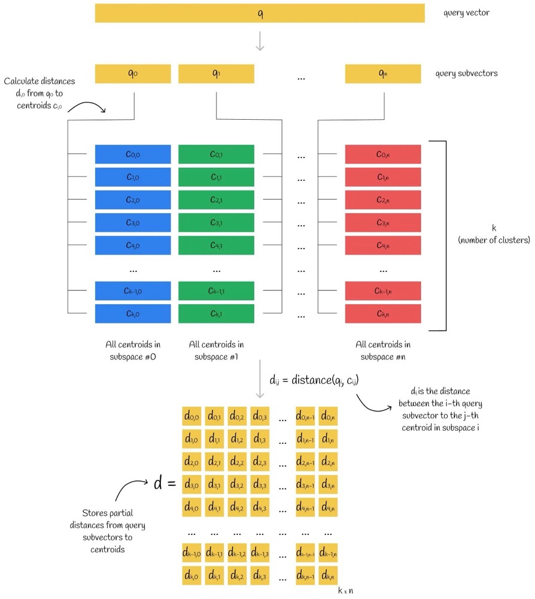
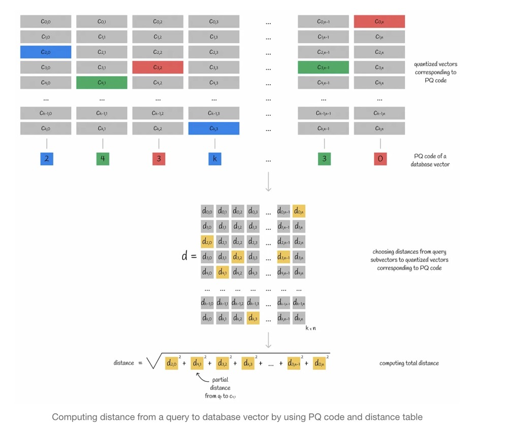

### 13.3. Further Optimization
Combining PQ with Approximate KNN allows for not needing to compute distances with every vector in the database.

## 14. References
[Middleware for Large Models: Principles and Selection of Vector Databases]
(https://hub.baai.ac.cn/view/29516)

https://www.modb.pro/db/1817186648364507136

https://www.xiaozhuai.com/similarity-search-part-4-hierarchical-navigable-small-world-hnsw.html