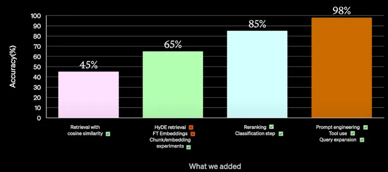
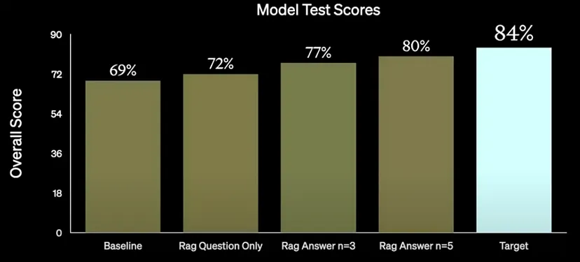

# Best Practices for Optimizing LLMs (Prompt Engineering, RAG and Fine-tuning)
<!-- more -->

## 1. The Challenges of Optimizing LLMs
- Extracting signal (meaningful information) from the noise (irrelevant information) is not easy
- Performance can be abstract and difficult to measure
- It’s not clear when to use what kind of method to optimize LLMs.

## 2. The Optimization Strategies
Optimizing LLMs can be thought of as a two-axis problem

- First to Optimize Prompt
- Context Optimization (What the model needs to know?) => RAG
- LLM Optimization (How the model needs to act ?) => Fine-Tuning

## 3. Typical Optimization Pipeline

- 1.Start with a prompt
- 2.Get proper evaluation metrics
- 3.Once evaluation metrics are set, figure out the baseline
- 4.Once the baseline is known, add more few shot examples
  - This is required to guide the model, about how the customer wants the model to act
- 5.If adding a few shots leads to an increase in performance, then follow the RAG process
- 6.After RAG is done, the model is getting the context right, but it is not producing the output in a required format, so then fine-tuning approach is taken.
- 7.It can be a possibility, that retrieval might not be as good as one wants, then go back to RAG and optimize the RAG again.
  - For example, in RAG maybe add Hypothetical Document Embeddings (HyDE) retrieval + fast-checking step.
  - Then fine-tune the model again, with these new examples added as context via RAG.

## 4. Comparison of Optimisation Approaches
||Prompt Engineering|RAG|Fine-tuning|
|--|--|--|--|
|Reducing token usage|&#10005;|&#10005;|&#10003;|
|Introducing new information|&#10005;|&#10003;|&#10003;|
|Testing and learning early|&#10003;|&#10005;|&#10005;|
|Reducing hallucinations|&#10003;|&#10003;|&#10003;|
|Improving efficiency|&#10005;|&#10005;|&#10003;|

## 5. Optimization via Prompt Engineering
- Write clear instructions
- Split complex tasks into simpler subtasks
- Give llm time to “think”
- Test changes systematically
- Providing Examples
- Using external Tools

## 6. How to Evaluate RAG

RAG can be evaluated using 4 metrics. Two of the metrics are inclined towards LLMs and two towards context.
### 6.1. LLM-related Metrics
- Faithfulness
  - Takes the answer, chunk it, and tries to reconcile the answer with the facts
  - If the answer can’t be reconciled as a fact, then the answer is hallucinated
- Answer Relevancy
  - Let’s say that the model is provided with a lot of context, now the model makes use of that context and provides the answer, but the answer is nothing near to what the user wanted or originally asked
  - Thus, this metric looks at the relevancy of the answer provided by the model.
### 6.2. Context-related Metrics
- Context Precision
  - Most useful from the customer perspective, as there can be scenarios where model accuracy is high, but context precision is low.
  - Classic RAG scenario can be thought of as being able to put more and more context in the context window, however as the model gets more context, the model hallucinations might increase (Refer paper: Lost in the Middle: How Language Models Use Long Contexts)
  - Thus, context precision evaluates the signal-to-noise ratio of the retrieved content. It takes the content log and compares it with the answer, and figures out whether the retrieved content matches the “to be answer”.
- Context Recall
  - Can the model retrieve all the relevant information required to answer the question?
  - Does the search which is put at the top by the model is answering the question?
  - context recalls tell if the search needs to be optimized, may need to add reranking, fine-tune embeddings, or may be different embeddings are needed to surface more relevant content.

## 7. Optimization via Fine-Tuning
Fine-tuning is a process of continuing the training of a model on a smaller domain-specific dataset to optimize the model for a specific task.

Why Fine-Tune?
- Reducing token usage
  - Reduced limitations on context windows and exposed to much more data
- Improving model efficiency
  - It is observed that complex prompting techniques are not required to reach the desired level of performance, once a model is fine-tuned
  - No need to provide a complex set of instructions, explicit schemas, in-context examples
  - Fewer prompt tokens are needed per request, thus making the interaction cheaper and leading to a quicker response
  - Knowledge distillation: knowledge distillation via fine-tuning say from a very large model like GPT-4 turbo, to a smaller model like GPT-3.5 which is much cheaper (cost and latency-wise)

## 8. Best Practices in Fine-Tuning
- 1.Start with prompt engineering and a few shot learning (FSL)
  - These are low-investment techniques to quickly iterate and validate a use-case
  - These can give intuition about how LLMs operate, and how they work on a specific problem.
- 2.Establish a baseline
  - Ensure a performance baseline to compare the fine-tuned model to
  Understand the failure cases of the model
  - Understand the exact target to be achieved via fine-tuning
- 3.Start small, focus on quality
  - Datasets are difficult to build, so start small and invest intentionally
  - Fine-tune a model on a smaller dataset, look at its output, see what area it struggles in, and then target those areas with new data
  - Optimize for fewer high-quality training examples.
- 4.Devise proper evaluation strategies
  - Expert humans to look at the output and rank them on some scale
  - Generate output from different models, and get the model rank them for you. For example, use GPT-4 to rank the output of some open source model.
  - Train the model, evaluate it, and deploy it to production. Then, collect the samples from it in production, use that to build a new dataset, downsample that dataset, curate it, and then fine-tune again on that dataset.

## 9. Best Practices in Fine-Tuning + RAG
- 1.Fine-tune the model to understand the complex instructions
  - It will eliminate the need to provide complex few-shot examples to the model at a sample time
  - It will also minimize the prompt-engineering tokens, leading to more space for retrieved context.
- 2.Next, use RAG to inject relevant knowledge into the context needed to be maximized, but do not over-saturate the context

## 10. OpenAI RAG Use Case
One of the OpenAI customers had a pipeline with 2 knowledge bases and an LLM. The job was to take the user question, decide which knowledge base to use, fire a query, and use one of the knowledge bases to answer a question.

### 10.1. Experiments that didn’t work

- Retrieval with cosine similarity (gave 45 % accuracy)
- HyDE retrieval was tried but didn’t pass through for production.
- Fine-tuning the embeddings worked well from the accuracy perspective, but was slow and expensive, so they discarded it for non-functional reasons.

### 10.2. Experiments which worked

- Chunk / embedding experiments
  - Trying different size chunks of information and embedding different bits of content gave a 20% accuracy bump to 65%
- Reranking
  - Applied cross-encoder to rerank or rules-based ranking
  - rerank
    - cohere -> rerank (good) https://docs.cohere.com/reference/rerank
    - bje reranker （open source）https://huggingface.co/collections/BAAI/bge-66797a74476eb1f085c7446d
    - jina
  - Cross Encoder：https://www.cnblogs.com/huggingface/p/18010292
- Classification Step
  - Classify which two domains (two knowledge bases), the question could belong to and give extra metadata in the prompt to help it decide further
- To reach accuracy levels of 98%, the following trials were successful
  - Further prompt engineering to engineer the prompt a lot better
  - Looked at the category of questions that gave wrong answers, and tools were introduced like giving access to SQL databases to pull the answers from.
  - Query Expansion: where someone has asked 3 questions, in 1 prompt, then parses them into a list of queries, executes them in parallel, brings back the results, and synthesizes them into 1 result.
  - Fine-tuning was not used here, which showed that the problem was context-related.
  - Fine-tuning could have led to the waste of computational resources in a context-related setting.

## 11. OpenAI Fine-Tuning + RAG Use Case

Use case description: Given a natural language question and a database schema, can the model produce a semantically correct SQL query?

The approach was first followed with the GPT 3.5 Turbo Model

- 1.First, the performance was squeezed from the baseline model via prompt engineering ( 69%). A few shot examples were also added, which led to some improvement leading to the use of RAG
- 2.with the RAG question only, there was a 3% performance bump
- 3.Then using the answers, hypothetical document embedding, there was a further 5% improvement.
  - Here just using hypothetical questions to search, rather than the actual input questions led to improvement
- 4.Increased examples from n=3 to n=5 lead to further improvement to 80%
- 5.However the target was to reach 84%.
- 6.Fine-tuning was employed (done at ScaleAI)
  - ScaleAI fine-tuned GPT-4 with a simple prompt engineering technique of reducing the Schema gave almost 82%
  - They used RAG along with fine-tuning to dynamically inject a few examples into the context window, which led to 83.5% accuracy score.
- 7.Thus, simple fine-tuning + RAG combined with simple prompt engineering brought the model accuracy to 83.5%

## 12. Reference
[OpenAI:A Survey of Techniques for Maximizing LLM Performance](https://www.youtube.com/watch?v=ahnGLM-RC1Y)  
[Optimizing LLMs: Best Practices](https://medium.com/@luvverma2011/optimizing-llms-best-practices-prompt-engineering-rag-and-fine-tuning-8def58af8dcc)