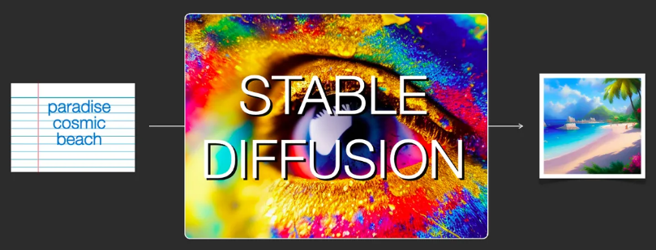
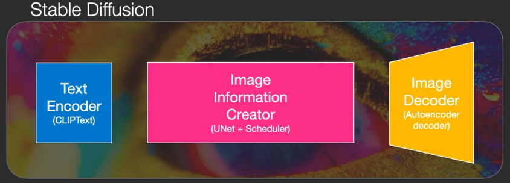
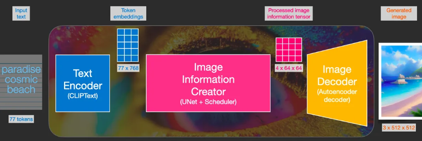
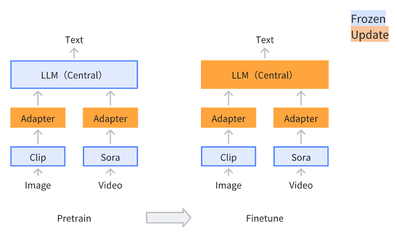
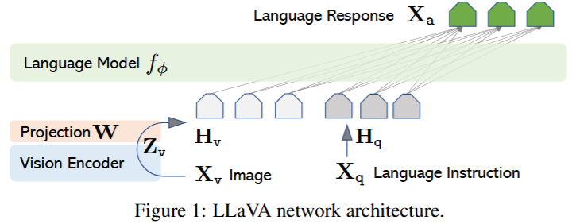
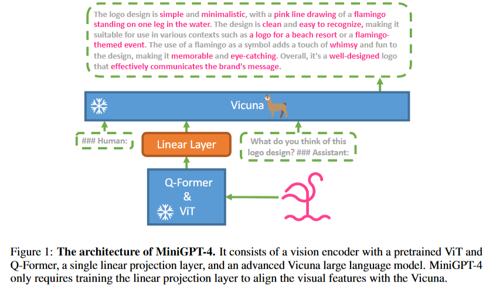
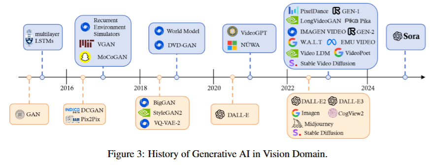
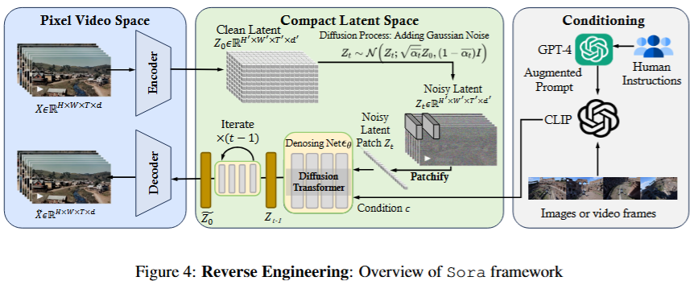

# Multimodal Large Models
  - Multimodal Tasks
  - Training of Multimodal Large Models
  - Stable Diffusion
  - LLaVA
<!-- more -->

## 1. Multimodal
Modality: The type of signal (or type/form of data)
- Text
- Image
- Video
- Audio
- Further subdivisions
  - Graph
  - Table

Multimodal: Designing with two or more different types of modalities (real-world scenarios often involve multiple signals).

Multimodal Model: An AI model capable of processing and integrating multiple modality data.

Multimodal System: A system that can handle multiple types of input and output modalities.

Multimodal Large Models (MLLMs): Large language models (LLMs) extended to handle multiple data types by incorporating additional modalities.

Multimodal large models are used to solve: Conversion between modalities
- Text → Image
- Text → Video
- Text → Table
- Text → Graph
- Image/Video → Text

## 2. Multimodal Tasks
The two most prominent modalities are language and vision. Related tasks can be divided into two categories: Generation and Vision-Language Understanding.

- Language Modality + Visual Modality (Text + Image)
  - Generation
    - Text-to-Image: Generate an image from input text
      - DALL-E series
        - Proposed by OpenAI
        - API available
        - [API Documentation](https://platform.openai.com/docs/guides/images?context=node)
      - Midjourney
        - Produces the best image effects
        - Paid service
        - [Official Documentation](https://docs.midjourney.com/)
        - [Prompt Reference Library](https://midlibrary.io/)
      - Stable Diffusion
        - Open-source, can run on personal PCs
        - Web UI: [Stable Diffusion Web UI](https://github.com/AUTOMATIC1111/stable-diffusion-webui)
        - Model download site: Civitai, a great AI model library designed for Stable Diffusion models [Civitai](https://civitai.com/)
        - Plugin for interface localization: [Chinese Interface](https://github.com/VinsonLaro/stable-diffusion-webui-chinese)
        - Plugin - ControlNet: [ControlNet Plugin](https://github.com/Mikubill/sd-webui-controlnet)
        - OpenPose: Generate images based on human pose skeletons
        - Canny Edge Detection: Generate images based on sketch contours
    - Modify Image: Input original image and text to generate a modified image
  - Understanding
    - Visual Question Answering
      - Input image and text, and answer questions based on the image-text pair
    - Image Captioning
      - Input image and generate a textual description of the image
    - Image Classification
      - For example, OCR to extract text from images or classify images
    - Text-based Image Retrieval
      - Method 1: Generate image descriptions, and when users input text queries, find the image description that matches the query text, then retrieve the corresponding image
        - **BLIP Model**: Converts images into textual descriptions
      - Method 2: Train a joint vector space for image and text, generate a vector for the input text, and find the image with the most similar vector
        - **CLIP Model**: Maps images and text into a shared vector space
- Language Modality + Auditory Modality (Text + Audio)
  - Various audio-related tasks: [AudioGPT GitHub](https://github.com/AIGC-Audio/AudioGPT)
  - Text-to-Speech (TTS)
    - edge-tts
      - [edge-tts GitHub](https://github.com/rany2/edge-tts)
      - Uses Microsoft Edge's online text-to-speech service without needing Microsoft Edge, Windows, or API keys
    - MeloTTS
      - [MeloTTS GitHub](https://github.com/myshell-ai/MeloTTS)
      - [MeloTTS Hugging Face](https://huggingface.co/spaces/mrfakename/MeloTTS)
      - High-quality multilingual TTS library by MyShell.ai. Supports English, Spanish, French, Chinese, Japanese, and Korean.
      - Features
        - Fast, real-time speech synthesis even on CPUs
        - Multilingual support
        - Chinese-English mixed language support
        - Easy installation      
  - Speech-to-Text (STT), Automatic Speech Recognition (ASR)
  - Voice Cloning
    - GPT-SoVITS
      - [GPT-SoVITS GitHub](https://github.com/RVC-Boss/GPT-SoVITS)
  - Music Generation
    - Suno
      - [Suno AI](https://www.suno.ai/): Generate full lyrics and melodies based on text prompts

## 3. Stable Diffusion (SD)

Stable Diffusion is a system composed of multiple components and models, rather than a single model.
- Text Encoder
  - Vectorizes text to capture the semantic information in the text
- Image Generator
  - The image generator works entirely in the latent space of image information, which makes diffusion models faster compared to earlier pixel-space diffusion models.
  - Components
    - Image Information Creator
    - Image Decoder

Three main components of the diffusion model (each with its own neural network):
- Clip Text (blue)
  - For text encoding
  - Input: Text
  - Output: 77 feature vectors, each with 768 dimensions
- Grid Network + UNet + Scheduler (pink)
  - Gradually diffuses information into the latent space
  - Diffusion process: Step-by-step transformation of information, gradually adding more related information until a high-quality image is generated.
  - The diffusion process contains multiple steps, each processing the latent matrix and generating a new latent matrix to better match the "input text" and "visual information" from the model's image bank.
  - Input: Text vector and random initial image information matrix (latent)
  - Output: Processed information array (dimension: (4, 64, 64))
- Autoencoder Decoder (orange)
  - Draws the final image
  - Input: Processed information array
  - Output: Resulting image (dimension: (3, 512, 512))

Diffusion model working principle:
- Forward Diffusion
  - Adds noise to training images, gradually turning them into noise images without distinct features.
- Reverse Diffusion
  - Starts with noisy, meaningless images and gradually restores images of cats or dogs by reversing the diffusion process.

## 4. Training of Multimodal Large Models

- Traditional Training Methods
  - End-to-End Training
    - Image Captioning Task: Image → Description/Caption
    - Image → CNN → Vector (shared) → RNN/LSTM → Text (Encoder-Decoder structure)
    - Training Data: (Image1, Des1), (Image2, Des2), ..., (ImageN, DesN)
  - Problems
    - Training from scratch is costly
    - Each task requires large datasets, and manually annotating data is difficult without large models
- Training Multimodal Large Models
  - Foundation Models
    - Text Domain
      - GPT-4, LLaMA, ChatGLM, Qwen
    - Image Domain
      - CLIP
    - Video Domain
      - Sora
    - Graph Domain
      - GNN
  - Multimodal Systems
    - Text (language models) as the intermediary (since all other modalities reduce to expressing meaning)
    - Image/Video/Graph → Each modality has its adapter → Align Language model, Image model, Video model, and Graph model (making modalities aligned)
    - Advantages
      - Lower training costs
        - Only the adapters for each modality are trained, while the foundation model parameters remain frozen
          - Stage 1: Pre-training for Feature Alignment
            - Only the adapter parts are updated
            - This step is necessary because the adapters are newly introduced and initially have no effect
            - Large amounts of data are required for this stage
          - Stage 2: Fine-tuning End-to-End
            - Both the adapter and the language model parts are updated
            - This stage requires a smaller amount of data
      - Easier adaptation for each task

## 5. Flamingo
Github: https://github.com/lucidrains/flamingo-pytorch

- Input: image + text + image + text (Images and text alternate)
- Vision Encoder: Base model for processing images - Foundation Models
- Perceiver Resampler: Adapter
- LM block: Language Model

## 6. LLaVA
Github: https://github.com/haotian-liu/LLaVA

Paper Name: Visual Instruction Tuning
Paper: https://arxiv.org/pdf/2304.08485

- Vision Encoder: Base model for processing images - Clip
  - provides the visual feature $Z_v = g(X_v)$
- Projection W: Adapter, converts to a vector with the same dimension as text
  - apply a trainable projection matrix W to convert $Z_v$ into
language embedding tokens H
  - $H_v = W · Z_v$
- Language Model: Vicuna

Only the adapters for each modality need to be trained, while the parameters of the base models for each modality remain frozen.
  - Stage 1: Pre-training for Feature Alignment
    - Only the adapter parts are updated
  - Stage 2: Fine-tuning End-to-End
    - Both the adapter parts and the language model parts are updated

Data Generation: GPT-assisted Visual Instruction Data Generation
- The prompts provided to GPT include text descriptions (Captions) and bounding boxes, but do not include the images themselves. The GPT used is also a pure language model.
  - Text Description Caption 
  - Bounding Box
- GPT's responses include
  - Q&A pairs (QA Conversation)
  - Detailed Description
  - Complex Reasoning

## 7. MiniGPT-4
Github: https://github.com/Vision-CAIR/MiniGPT-4

Paper Name: MINIGPT-4:
ENHANCING VISION-LANGUAGE UNDERSTANDING
WITH ADVANCED LARGE LANGUAGE MODELS

Paper: https://arxiv.org/pdf/2304.10592

## 8. Sora Video Generation Large Model

Paper Name: Sora: A Review on Background, Technology, Limitations, and Opportunities of Large Vision Models

Paper: https://arxiv.org/pdf/2402.17177

Github: https://github.com/lichao-sun/SoraReview

Note: This is not an official technical report from OpenAI.

Sora is essentially a diffusion transformer model with flexible sampling dimensions. It consists of three parts:
- 1. Time-Space Compressor: Maps the original video into latent space
  - A time-space compressor: maps the original video into latent space.
- 2. Vision Transformer (ViT): Processes the tokenized latent representation and outputs the denoised latent representation
  - A ViT then processes the tokenized latent representation and outputs the denoised latent representation.
- 3. CLIP-like Model: Guides the video generation process, creating videos with specific styles or themes 
  - A CLIP-like conditioning mechanism receives LLM-augmented user instructions and potentially visual prompts to guide the diffusion model to generate styled or themed videos. 

## 9. Prospects of Multimodal Large Models
Current Status
- In the early stages
- Rapid technological iteration
- In the long run, it is the endpoint of large models

Analysis of Development in the Field of Large Models
- The foundation of multimodal large models is text large models
  - The upper limit of text large models determines the upper limit of other large models
  - Text large models will promote the development of other modalities
  - Other modalities will subsequently develop the text large models

Opportunities in 2024
- Agent
- Small Model/Model Quantization/Fine-tuning Small Models (Models embedded in smart devices, 0.5B, 1B)
  - Smart hardware, such as smartwatches
  - How to run models on CPUs
- Multimodal
- Inference acceleration, reducing inference costs

## 10. Reference
- [The Illustrated Stable Diffusion](https://jalammar.github.io/illustrated-stable-diffusion/?spm=a2c6h.12873639.article-detail.7.412f5124rpbR0C)