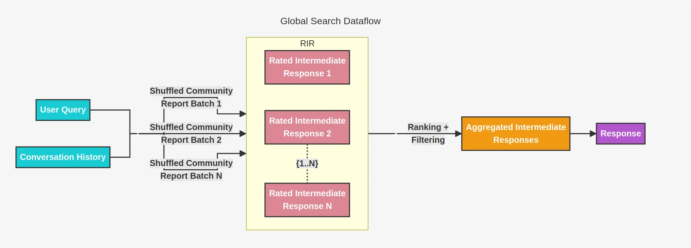

# Microsoft GraphRAG Source Code Interpretation
<!-- more -->
## 1. Official Documentation
GitHub: [https://github.com/microsoft/graphrag](https://github.com/microsoft/graphrag)

Get Started: [https://microsoft.github.io/graphrag/get_started/](https://microsoft.github.io/graphrag/get_started/)

Paper: https://arxiv.org/pdf/2404.16130

## 2. Entry Point
> graphrag.cli.main.py

Five functions correspond to five commands:
- init => def _initialize_cli()
    - graphrag init --root ./ragtest
- index => def _index_cli()
    - graphrag index --root ./ragtest
- query => def _query_cli()
    - global search
        - graphrag query --root ./ragtest --method global --query "What are the top themes in this story?"
    - local search
        - graphrag query --root ./ragtest --method local --query "Who is Scrooge and what are his main relationships?"
- update => def _update_cli()
    - graphrag update
- prompt-tune => def _prompt_tune_cli()
    - graphrag prompt-tune

Principle: Uses Python's Typer library to create a command-line interface (CLI). Take index as an example:
- @app.command("index") is a decorator syntax used to register the _index_cli function below as a CLI command, creating a subcommand named "index".
- When the user runs "graphrag index" on the command line, the decorated def _index_cli() function is called.
- Typer automatically converts function parameters into command-line options and handles parameter parsing and validation.

### 2.1. init
```
@app.command("init")
def _initialize_cli(
    root, 
    force,
):
    """Generate a default configuration file."""
    from graphrag.cli.initialize import initialize_project_at

    initialize_project_at(path=root, force=force)
```
### 2.2. index
```
@app.command("index")
def _index_cli(
    config,
    root,  
    method,
    verbose,
    memprofile,
    logger,
    dry_run,
    cache,
    skip_validation,
    output,
):
    """Build a knowledge graph index."""
    from graphrag.cli.index import index_cli

    index_cli(
        root_dir=root,
        verbose=verbose,
        memprofile=memprofile,
        cache=cache,
        logger=LoggerType(logger),
        config_filepath=config,
        dry_run=dry_run,
        skip_validation=skip_validation,
        output_dir=output,
        method=method,
    )
```

### 2.3. query
```
@app.command("query")
def _query_cli(
    method,
    query,
    config,
    data,
    root,  
    community_level,
    dynamic_community_selection,
    response_type,
    streaming,
):
    """Query a knowledge graph index."""
    from graphrag.cli.query import (
        run_basic_search,
        run_drift_search,
        run_global_search,
        run_local_search,
    )

    match method:
        case SearchMethod.LOCAL:
            run_local_search(
                config_filepath=config,
                data_dir=data,
                root_dir=root,
                community_level=community_level,
                response_type=response_type,
                streaming=streaming,
                query=query,
            )
        case SearchMethod.GLOBAL:
            run_global_search(
                config_filepath=config,
                data_dir=data,
                root_dir=root,
                community_level=community_level,
                dynamic_community_selection=dynamic_community_selection,
                response_type=response_type,
                streaming=streaming,
                query=query,
            )
        case SearchMethod.DRIFT:
            run_drift_search(
                config_filepath=config,
                data_dir=data,
                root_dir=root,
                community_level=community_level,
                streaming=streaming,
                response_type=response_type,
                query=query,
            )
        case SearchMethod.BASIC:
            run_basic_search(
                config_filepath=config,
                data_dir=data,
                root_dir=root,
                streaming=streaming,
                query=query,
            )
        case _:
            raise ValueError(INVALID_METHOD_ERROR)
```
## 3. init Source Code Logic
- Generate initialization files in the specified root directory
    - Generate configuration file settings.yaml
    - Generate environment variable file .env
    - Generate multiple xxx_prompt.txt files in the prompts path of the root directory

## 4. index Source Code Logic

### 4.1. Load Configuration File
```
# graphrag.cli.index.py -> def index_cli()

config = load_config(root_dir, config_filepath, cli_overrides)
```
### 4.2. Build Index  
```
# graphrag.api.index.py -> def build_index()

async def build_index(
    config: GraphRagConfig,
    method: IndexingMethod = IndexingMethod.Standard,
    is_update_run: bool = False,
    memory_profile: bool = False,
    callbacks: list[WorkflowCallbacks] | None = None,
    progress_logger: ProgressLogger | None = None,
) -> list[PipelineRunResult]:

    # Create pipeline
    pipeline = PipelineFactory.create_pipeline(config, method)

    # Execute pipeline
    async for output in run_pipeline(
        pipeline,
        config,
        cache=pipeline_cache,
        callbacks=callbacks,
        logger=progress_logger,
        is_update_run=is_update_run,
    ):
        outputs.append(output)
    return outputs
```

### 4.3. Create Pipeline

The parameter method determines the type of pipeline:
- Standard Pipeline: IndexingMethod.Standard => full LLM
    - "create_base_text_units",
    - "create_final_documents",
    - "extract_graph",
    - "finalize_graph",
    - *(["extract_covariates"] if config.extract_claims.enabled else []),
    - "create_communities",
    - "create_final_text_units",
    - "create_community_reports",
    - "generate_text_embeddings",
- Fast Pipeline: IndexingMethod.Fast => NLP + LLM
    - "create_base_text_units",
    - "create_final_documents",
    - "extract_graph_nlp",
    - "prune_graph",
    - "finalize_graph",
    - "create_communities",
    - "create_final_text_units",
    - "create_community_reports_text",
    - "generate_text_embeddings",

```
# graphrag.index.workflows.factory.py -> def create_pipeline()

class PipelineFactory:
    """A factory class for workflow pipelines."""

    workflows: ClassVar[dict[str, WorkflowFunction]] = {}

    @classmethod
    def create_pipeline(
        cls, config: GraphRagConfig, method: IndexingMethod = IndexingMethod.Standard
    ) -> Pipeline:
        """Create a pipeline generator."""
        workflows = _get_workflows_list(config, method)
        for name in workflows:
            yield name, cls.workflows[name]


def _get_workflows_list(
    config: GraphRagConfig, method: IndexingMethod = IndexingMethod.Standard
) -> list[str]:
    """Return a list of workflows for the indexing pipeline."""
    if config.workflows:
        return config.workflows
    match method:
        case IndexingMethod.Standard:
            return [
                "create_base_text_units",
                "create_final_documents",
                "extract_graph",
                "finalize_graph",
                *(["extract_covariates"] if config.extract_claims.enabled else []),
                "create_communities",
                "create_final_text_units",
                "create_community_reports",
                "generate_text_embeddings",
            ]
        case IndexingMethod.Fast:
            return [
                "create_base_text_units",
                "create_final_documents",
                "extract_graph_nlp",
                "prune_graph",
                "finalize_graph",
                "create_communities",
                "create_final_text_units",
                "create_community_reports_text",
                "generate_text_embeddings",
            ]
```
### 4.4. Load Input Dataset 
- Load files in the input folder of the root directory
- Currently supports txt and csv file types
```
# graphrag.index.run.run_pipeline.py -> def run_pipeline()

dataset = await create_input(config.input, logger, root_dir)
```

### 4.5. Generate documents.parquet File

- Rows: Each file in the input folder is a row
- Columns:
    - 'text' : Text content in the document
    - 'id' : Document ID
    - 'title' : Document name
    - 'creation_date' : Creation date

```
# graphrag.index.run.run_pipeline.py -> def _run_pipeline()

await write_table_to_storage(dataset, "documents", context.storage)
```

### 4.6. Execute Pipeline: create_base_text_units (Document Chunking)
- Load documents.parquet file
- Generate text_unit.parquet file
    - Rows: Each row in documents.parquet is chunked, each chunk is a row
    - Columns:
        - 'id' : Chunk ID
        - 'text' : Chunk text
        - 'document_ids' : Associated document ID
        - 'n_tokens' : Number of tokens

### 4.7. Execute Pipeline: create_final_documents (Aggregate Chunk ID List to documents.parquet File)
- Load documents.parquet and text_unit.parquet files
- create_final_documents
    - Merge documents.parquet and text_unit.parquet files with document ID as the association for inner join
    - Group by document ID, aggregate chunk IDs as text_unit_ids column
- Update documents.parquet file
    - Rows: Each file in the input folder is a row
    - Columns:
        - 'id' : Document ID (unique unordered ID)
        - 'human_readable_id' : Readable sequential ID (sequentially numbered ID)
        - 'text' : Text content in the document
        - 'text_unit_id' : List of chunk IDs
        - 'creation_date' : Creation date

### 4.8. Execute Pipeline: extract_graph
- Load text_unit.parquet file
- extract_graph (see code below)
    - load_llm
    - run_extract_graph to extract entities and relationships (see code below)
    - run_summarize_descriptions to generate summary descriptions (see code below)
    - return (entities, relationships)
        - entities
            - "title", Entity name
            - "type",  Entity type
            - "description", Entity description
            - "text_unit_ids", List of chunk IDs
            - "frequency", Frequency of entity occurrence
        - relationships
            - "source", Starting entity ID of the relationship
            - "target", Ending entity ID of the relationship
            - "description", Description of the relationship
            - "weight", Weight of the relationship (strength of connection)
            - "text_unit_ids", List of chunk IDs
- Generate entities.parquet and relationships.parquet files

```
graphrag.index.workflows.extract_graph.py -> def extract_graph()

async def extract_graph(
    text_units: pd.DataFrame,
    callbacks: WorkflowCallbacks,
    cache: PipelineCache,
    extraction_strategy: dict[str, Any] | None = None,
    extraction_num_threads: int = 4,
    extraction_async_mode: AsyncType = AsyncType.AsyncIO,
    entity_types: list[str] | None = None,
    summarization_strategy: dict[str, Any] | None = None,
    summarization_num_threads: int = 4,
) -> tuple[pd.DataFrame, pd.DataFrame]:
    """All the steps to create the base entity graph."""
    # this returns a graph for each text unit, to be merged later
    extracted_entities, extracted_relationships = await extractor(
        text_units=text_units,
        callbacks=callbacks,
        cache=cache,
        text_column="text",
        id_column="id",
        strategy=extraction_strategy,
        async_mode=extraction_async_mode,
        entity_types=entity_types,
        num_threads=extraction_num_threads,
    )

    entity_summaries, relationship_summaries = await summarize_descriptions(
        entities_df=extracted_entities,
        relationships_df=extracted_relationships,
        callbacks=callbacks,
        cache=cache,
        strategy=summarization_strategy,
        num_threads=summarization_num_threads,
    )

    relationships = extracted_relationships.drop(columns=["description"]).merge(
        relationship_summaries, on=["source", "target"], how="left"
    )

    extracted_entities.drop(columns=["description"], inplace=True)
    entities = extracted_entities.merge(entity_summaries, on="title", how="left")

    return (entities, relationships)
```

```
# graphrag.index.operations.extract_graph.graph_intelligence_strategy.py -> def run_extract_graph()

async def run_extract_graph(
    llm: ChatLLM,
    docs: list[Document],
    entity_types: EntityTypes,
    callbacks: WorkflowCallbacks | None,
    args: StrategyConfig,
) -> EntityExtractionResult:
    """Run the entity extraction chain."""
    tuple_delimiter = args.get("tuple_delimiter", None)
    record_delimiter = args.get("record_delimiter", None)
    completion_delimiter = args.get("completion_delimiter", None)
    extraction_prompt = args.get("extraction_prompt", None)
    encoding_model = args.get("encoding_name", None)
    max_gleanings = args.get("max_gleanings", defs.EXTRACT_GRAPH_MAX_GLEANINGS)

    extractor = GraphExtractor(
        llm_invoker=llm,
        prompt=extraction_prompt,
        encoding_model=encoding_model,
        max_gleanings=max_gleanings,
        on_error=lambda e, s, d: (
            callbacks.error("Entity Extraction Error", e, s, d) if callbacks else None
        ),
    )
    text_list = [doc.text.strip() for doc in docs]

    results = await extractor(
        list(text_list),
        {
            "entity_types": entity_types,
            "tuple_delimiter": tuple_delimiter,
            "record_delimiter": record_delimiter,
            "completion_delimiter": completion_delimiter,
        },
    )

    graph = results.output
    # Map the "source_id" back to the "id" field
    for _, node in graph.nodes(data=True):  # type: ignore
        if node is not None:
            node["source_id"] = ",".join(
                docs[int(id)].id for id in node["source_id"].split(",")
            )

    for _, _, edge in graph.edges(data=True):  # type: ignore
        if edge is not None:
            edge["source_id"] = ",".join(
                docs[int(id)].id for id in edge["source_id"].split(",")
            )

    entities = [
        ({"title": item[0], **(item[1] or {})})
        for item in graph.nodes(data=True)
        if item is not None
    ]

    relationships = nx.to_pandas_edgelist(graph)

    return EntityExtractionResult(entities, relationships, graph)
```

```
# graphrag.index.operations.summarize_descriptions.graph_intelligence_strategy.py -> def run_summarize_descriptions()

async def run_summarize_descriptions(
    llm: ChatLLM,
    id: str | tuple[str, str],
    descriptions: list[str],
    callbacks: WorkflowCallbacks,
    args: StrategyConfig,
) -> SummarizedDescriptionResult:
    """Run the entity extraction chain."""
    # Extraction Arguments
    summarize_prompt = args.get("summarize_prompt", None)
    entity_name_key = args.get("entity_name_key", "entity_name")
    input_descriptions_key = args.get("input_descriptions_key", "description_list")
    max_tokens = args.get("max_tokens", None)

    extractor = SummarizeExtractor(
        llm_invoker=llm,
        summarization_prompt=summarize_prompt,
        entity_name_key=entity_name_key,
        input_descriptions_key=input_descriptions_key,
        on_error=lambda e, stack, details: (
            callbacks.error("Entity Extraction Error", e, stack, details)
            if callbacks
            else None
        ),
        max_summary_length=args.get("max_summary_length", None),
        max_input_tokens=max_tokens,
    )

    result = await extractor(id=id, descriptions=descriptions)
    return SummarizedDescriptionResult(id=result.id, description=result.description)
```

### 4.9. Execute Pipeline: finalize_graph
- Load entities.parquet and relationships.parquet files
- finalize_graph
    - finalize_entities
        - "id", Entity ID
        - "human_readable_id", Readable ordered entity ID
        - "title", Entity name
        - "type",  Entity type
        - "description", Entity description
        - "text_unit_ids", List of chunk IDs
        - "frequency", Frequency of entity occurrence
        - "degree", Number of connections in the graph (degree of the entity node)
        - "x", X-coordinate of the visualization layout
        - "y", Y-coordinate of the visualization layout
    - finalize_relationships
        - "id", Relationship ID
        - "human_readable_id", Readable ordered relationship ID
        - "source", Starting entity ID of the relationship
        - "target", Ending entity ID of the relationship
        - "description", Description of the relationship
        - "weight", Weight of the relationship (strength of connection)
        - "combined_degree", Combined degree (sum of degrees of both nodes, reflecting the importance of the relationship)
        - "text_unit_ids", List of chunk IDs
- Update entities.parquet and relationships.parquet files

### 4.10. Execute Pipeline: create_communities (Cluster Nodes into Communities)
- Load entities.parquet and relationships.parquet files
- create_communities
- Generate communities.parquet
    - "id", Community ID
    - "human_readable_id", Readable ordered community ID
    - "community", Community parent-child relationship link ID
    - "level", Current level
    - "parent", Parent
    - "children", Children
    - "title", Community name
    - "entity_ids", List of entity IDs
    - "relationship_ids", List of relationship IDs
    - "text_unit_ids", List of chunk IDs
    - "period", Timestamp
    - "size", Community size

### 4.11. Execute Pipeline: create_final_text_units
- Load text_units.parquet, entities.parquet, and relationships.parquet files
- create_final_text_units
- Update text_units.parquet
    - 'id' : Chunk ID
    - 'human_readable_id' : Readable ordered chunk ID
    - 'text' : Chunk text
    - 'document_ids' : Associated document ID
    - 'n_tokens' : Number of tokens
    - 'entity_ids' : List of entity IDs
    - 'relationship_ids' : List of relationship IDs

### 4.12. Execute Pipeline: create_community_reports (Generate Community Reports)
- Load entities.parquet, relationships.parquet, and communities.parquet
- create_community_reports
- Generate community_reports.parquet
    - "id",
    - "human_readable_id",
    - "community",
    - "level",
    - "parent",
    - "children",
    - "title",
    - "summary",
    - "full_content",
    - "rank",
    - "rank_explanation",
    - "findings",
    - "full_content_json",
    - "period",
    - "size",

### 4.13. Execute Pipeline: generate_text_embeddings
- Load documents.parquet file, text_unit.parquet, entities.parquet, relationships.parquet, and community_reports.parquet
- generate_text_embeddings


## 5. query Source Code Logic

Four search methods:
- local
- global
- drift
- basic
### 5.1. local_search -> Search for detailed questions about entities or relationships

### 5.2. global_search -> Search for broad questions about communities

### 5.3. drift_search -> Combines local_search and global_search
https://microsoft.github.io/graphrag/query/drift_search/

 