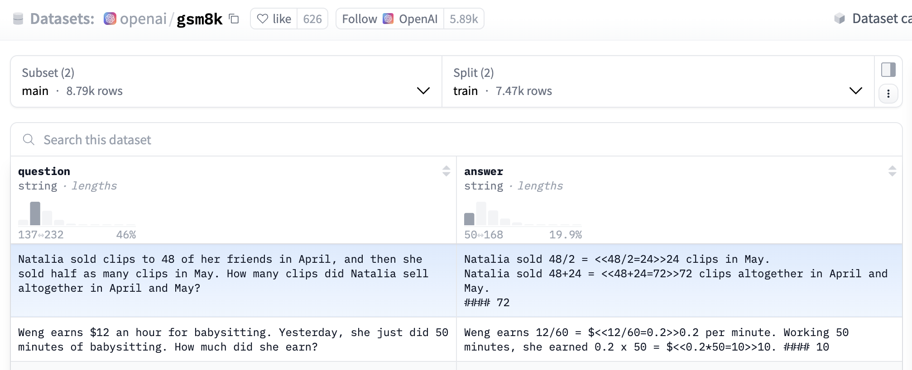

# GRPO + Unsloth + vLLM 
<!-- more -->
- GRPO (Group Relative Policy Optimization): A reinforcement learning method focused on optimizing model performance based on a specific reward function.
- Unsloth: A framework for efficiently fine-tuning large language models.
- vllm: An inference framework optimized for large language models.

## 1. GRPO
GRPO (Group Relative Policy Optimization)

GRPO was first introduced in [DeepSeek's Math paper](https://arxiv.org/pdf/2402.03300) from February to April 2024, and later utilized by DeepSeek in creating [DeepSeek R1](https://arxiv.org/pdf/2501.12948) as described in their paper.

### 1.1. What GRPO Can Do
GRPO can transform standard models into fully functional inference models.

The main goal of GRPO is to maximize rewards and learn how answers are derived, rather than simply memorizing and reproducing answers from training data.

Conventional fine-tuning (without GRPO) only maximizes the prediction probability of the next word, without optimizing for rewards. GRPO optimizes the reward function, not just the next word prediction.

Initially, a large amount of data was needed to fill in the reasoning process or chain of thought. But GRPO or other reinforcement learning algorithms can guide the model to automatically exhibit reasoning abilities and generate reasoning trajectories, relying on GRPO or other reinforcement learning algorithms to create good reward functions or validators.

The application scenarios of GRPO are not limited to code or mathematics. Its reasoning process can also enhance tasks such as email automation, database retrieval, legal, and medical tasks, greatly improving accuracy based on the datasets and reward functions used in training!

### 1.2. How GRPO Works
1. For each question-answer pair, the model generates multiple responses as a group (e.g., 8 different responses).
2. Each response is scored based on the reward function.
3. The average score of the group of responses is calculated as a baseline.
4. Each response's score is compared to the average score, and each response's advantage value is determined by the difference between its score and the baseline.
5. The model is enhanced to favor higher-scoring responses.

### 1.3. GRPO vs PPO
#### 1.3.1. The "Double Teacher Dilemma" of PPO
In traditional reinforcement learning methods, PPO (Proximal Policy Optimization) is widely used, where the training system requires two "teachers" to work together: the policy model (student) is responsible for generating answers, and the value model (scoring teacher) is responsible for evaluating quality. This architecture has three fundamental flaws:
- Resource consumption black hole: The parameter size of the value model is often comparable to the policy model, requiring additional storage of gradient parameters during training, doubling memory usage.
- Evaluation standard drift: Asynchronous updates of the two models can easily lead to inconsistent "teaching standards."
- Absolute scoring trap: The absolute score of a single output is difficult to reflect the relative merits of answers.
These problems are particularly prominent in complex reasoning tasks. When dealing with multi-step mathematical proofs, traditional methods are like using the same ruler to measure answers of different dimensions, easily causing evaluation bias.

#### 1.3.2. GRPO's Improvements Over PPO
Imagine you are teaching a student to solve math problems. Traditional methods may require another teacher (value function model) to evaluate the student's performance. GRPO adopts a smarter approach: letting the student generate multiple answers and then guiding learning by comparing the merits of these answers. This method is not only more intuitive but also greatly improves learning efficiency. It is closer to the human cognitive way of "comparative learning," where the merits of answers are no longer determined by absolute scores but are generated through group comparison.

GRPO is a reinforcement learning method developed on the popular PPO (Proximal Policy Optimization). Its biggest innovation is the introduction of the "intra-group relative evaluation" mechanism, while removing the need for a value function model in traditional methods, making the entire training process more efficient and stable.


### 1.4. Three Revolutionary Designs of GRPO
#### 1.4.1. From Decisive Evaluation Mechanism to Relative Evaluation Mechanism
This relative evaluation mechanism brings three major advantages:
- Evaluation dimension normalization: Automatically eliminates the impact of differences in question difficulty.
- Error compensation effect: Random fluctuations are naturally smoothed in group comparisons.
- Implicit knowledge mining: The model learns implicit rules beyond the scoring standard through comparison.

#### 1.4.2. Removal of the Value Function Model
- GRPO's success validates the "less is more" technical philosophy.
- GRPO, a reinforcement learning technology, efficiently optimizes responses without the need for a value function model, reducing memory and computational costs compared to PPO.
- By replacing complex model inference with simple matrix operations, training speed is increased by 40%, and memory usage is reduced by 55%. This design is especially suitable for training today's large models with billions of parameters.

```python
# Traditional PPO advantage calculation
advantage = reward - value_model.predict(state)

# GRPO advantage calculation
group_rewards = [r1, r2, ..., rn]
baseline = np.mean(group_rewards)
advantages = [r - baseline for r in group_rewards]
```
In the GSM8K math benchmark test, models empowered by GRPO showed amazing breakthroughs:


#### 1.4.3. KL Intelligent Constraint
GRPO directly integrates the KL divergence constraint into the loss function, creatively solving the "catastrophic forgetting" problem in reinforcement learning.
```
Loss = -E[log(π(a|s)) * A] + β*KL(π||π_ref)
```
Where the β parameter is dynamically adjusted through an adaptive algorithm, achieving a subtle balance between exploration and convergence. Experiments show that this design improves the training stability of mathematical reasoning tasks by 70%.

### 1.5. Comparison of Different LLM Training Methods
- SFT
    - Standardizes model output format (with reasoning and answer tags).
    - Difficult to learn the mathematical rules and meta-thinking behind the data, still only learns the generation probability of the next token.
    - Poor generalization ability, somewhat rote memorization.
- Traditional RL
    - A large amount of high-quality data containing problem-solving steps and precise reward functions, then training with brute force.
    - Has long-cot, belongs to the type with standard answers, so the model completely fits and approaches the long-cot, essentially learning according to the standard answers and problem-solving process of the training data.
    - No mutual comparison between multiple answers (no distinction between the merits of answers), somewhat like cramming education.
- GRPO
    - Encourages the model to learn the rules behind reasoning in the process of maximizing rewards through trial and error.
    - GRPO only looks at the result, the process is explored and attempted by the model itself. There is no standard cot answer (only the final answer), requiring the model to do a lot of exploration to find the optimal cot, so the model has an aha moment, with better generalization.
    - Flexible rewards, generating multiple responses for each question, finding the optimal ones, guiding the model towards the optimal direction.
    - Doing so results in a very chaotic reasoning format in the first 100+ steps, so R1 first uses long-cot for SFT on the basis of R1-zero, allowing the model's response to output according to a predetermined template, appropriately reducing some exploration steps, and improving training efficiency.
    - Higher upper bound on generalization and reasoning performance.

## 2. Efficient GRPO Training with Unsloth
- With the help of 15GB of VRAM, Unsloth can transform any model with up to 17B parameters, such as Llama 3.1 (8B), Phi-4 (14B), Mistral (7B), or Qwen2.5 (7B), into an inference model.
- In extreme cases, only 5G of VRAM is needed to train your own inference model locally, reaching the "aha" moment (suitable for any model with 1.5B parameters or less).
- Previously, GRPO only supported full fine-tuning, Unsloth AI enables compatibility with QLoRA and LoRA.
- Unsloth x vLLM: vLLM achieves fast inference, can increase throughput (up to 20 times), allows fine-tuning and inference to occur simultaneously, and magically eliminates the double memory consumption when loading vLLM and Unsloth simultaneously.
- Unsloth cleverly reduces VRAM usage by over 90% compared to standard implementations (HuggingFace TRL + Flash Attention 2), significantly optimizing. For example, with a 20K context length, generating 8 times per prompt, Unsloth uses only 54.3GB of VRAM for Llama 3.1 8B, while the standard implementation requires 510.8GB (Unsloth saves 90% of VRAM).
    - Unsloth's new memory-efficient linear kernel for GRPO reduces memory usage by 8 times or more. This cuts 68.5GB of memory while achieving num_generations = 8 and 20K context length with torch.compile, actually faster.
    - Unsloth uses the [smart Unsloth gradient checkpoint algorithm](https://unsloth.ai/blog/long-context), intelligently offloading intermediate activations to system memory asynchronously, slowing down by only 1%. Since we need num_generations = 8, up to 372GB of VRAM can be saved. We can further reduce this memory usage through intermediate gradient accumulation.
    - Unsloth also uses the same GPU/CUDA memory space as the underlying inference engine (vLLM), unlike implementations from other packages, cutting 16GB of VRAM.


## 3. GRPO Training Tips
- Wait at least 300 steps to see substantial reward growth.
- Train the model with at least 500 rows of data.
- A standard model with at least 1.5B parameters is required to generate a chain of thought with GRPO; too small a model may not generate a chain of thought.
- For GRPO's GPU VRAM requirements in QLoRA 4-bit mode, the general rule is that the model parameter size equals the required VRAM size.
- The longer the context length set, the more VRAM is required. LoRA 16-bit will use at least 4 times more VRAM.
- One major advantage of GRPO is that you don't even need a lot of data. You only need a good reward function/validator, and the longer the training time, the better the model becomes. The reward value increases with the number of training steps.
- Reward functions and validators:
    - Reward function: scoring
        - Correctness verification is not necessary.
        - Reward functions can use validators.
    - Validator: correctness verification
        - Does not score.
        - Validators can also execute code to verify logic or syntax and other correctness.
- There is no single correct way to design reward functions or validators—the possibilities are endless. However, they must be well-designed and meaningful, as poorly designed rewards may inadvertently degrade model performance.

## 4. Code Implementation
### 4.1. Install Required Libraries
```python
%%capture # Jupyter magic command to capture cell output to avoid displaying lengthy installation processes
import sys; modules = list(sys.modules.keys()) # Get the names of all currently loaded modules
for x in modules: sys.modules.pop(x) if "PIL" in x or "google" in x else None # Remove cached modules related to PIL (Pillow) and google

!pip install unsloth vllm # Install unsloth and vllm
!pip install --upgrade pillow # Upgrade pillow
```

### 4.2. Load Llama-3.1-8B-Instruct Model
```python
# Import core libraries
from unsloth import FastLanguageModel # Library for efficiently loading models
import torch # PyTorch deep learning framework

# Model configuration parameters
max_seq_length = 1024 # Maximum input sequence length (affects VRAM usage)
lora_rank = 32 # LoRA rank, the larger the value, the stronger the model capability, but also slower

# Load the base model
model, tokenizer = FastLanguageModel.from_pretrained(
    model_name = "meta-llama/meta-Llama-3.1-8B-Instruct", # Base model is the 8B parameter Llama3 instruction fine-tuned version
    max_seq_length = max_seq_length,
    load_in_4bit = True, # True for 4bit quantization (VRAM optimization), False for 16bit
    fast_inference = True, # Enable vLLM accelerated inference
    max_lora_rank = lora_rank, # Maximum LoRA rank limit
    gpu_memory_utilization = 0.6, # GPU VRAM utilization (can be adjusted lower if OOM)
)
```

### 4.3. Inference Before GRPO Training
```python
# Create chat template
text = tokenizer.apply_chat_template([ 
    {"role" : "user", "content" : "Calculate pi."},
], 
tokenize = False, # Indicates not to tokenize the input
add_generation_prompt = True)

# Set sampling parameters
from vllm import SamplingParams
sampling_params = SamplingParams( 
    temperature = 0.8,
    top_p = 0.95,
    max_tokens = 1024, # Maximum length of generated text
)

# Generate text
output = model.fast_generate( 
    [text],
    sampling_params = sampling_params,
    lora_request = None, # Indicates not to use LoRA (low-rank adaptation) request
)[0].outputs[0].text

output
```

### 4.4. Load and Prepare Dataset
OpenAI's GSM8K dataset



```python
import re # Regular expressions
from datasets import load_dataset, Dataset

SYSTEM_PROMPT = """
Respond in the following format:
<reasoning>
...
</reasoning>
<answer>
...
</answer>
"""

def extract_hash_answer(text: str) -> str | None:
    if "####" not in text:
        return None
    return text.split("####")[1].strip()

# uncomment middle messages for 1-shot prompting
def get_gsm8k_questions(split = "train") -> Dataset:
    data = load_dataset('openai/gsm8k', 'main')[split] # Load dataset
    data = data.map(lambda x: { # Construct as dict format
        'prompt': [
            {'role': 'system', 'content': SYSTEM_PROMPT},
            {'role': 'user', 'content': x['question']}
        ],
        'answer': extract_hash_answer(x['answer'])
    }) # type: ignore
    return data # type: ignore

dataset = get_gsm8k_questions()
```

### 4.5. Set LoRA Fine-tuning Configuration
```python
model = FastLanguageModel.get_peft_model(
    model,
    r = lora_rank, 
    target_modules = [ # Modules to apply LoRA (can remove QKVO if OOM)
        "q_proj", "k_proj", "v_proj", "o_proj",
        "gate_proj", "up_proj", "down_proj",
    ], 
    lora_alpha = lora_rank, # LoRA scaling factor, usually the same as rank, used to adjust the impact of LoRA
    use_gradient_checkpointing = "unsloth", # Apply activation recomputation/gradient checkpointing for long text fine-tuning, set to "unsloth", possibly referring to a library-specific gradient checkpointing implementation (VRAM optimization technique)
    random_state = 3407, # Random seed (ensures experiment reproducibility)
)
```

### 4.6. Define Reward Functions
```python
# Reward if LLM-generated answer matches the standard answer
def correctness_reward_func(prompts, completions, answer, **kwargs) -> list[float]:
    responses = [completion[0]['content'] for completion in completions] # List of LLM-generated results
    q = prompts[0][-1]['content'] # Question
    extracted_responses = [extract_xml_answer(r) for r in responses] # List of LLM-generated answers
    print('-'*20, f"Question:\n{q}", f"\nAnswer:\n{answer[0]}", f"\nResponse:\n{responses[0]}", f"\nExtracted:\n{extracted_responses[0]}")
    return [2.0 if r == a else 0.0 for r, a in zip(extracted_responses, answer)] # Compare each LLM-generated answer with the standard answer

# Reward if LLM-generated answer is a number
def int_reward_func(completions, **kwargs) -> list[float]:
    responses = [completion[0]['content'] for completion in completions]
    extracted_responses = [extract_xml_answer(r) for r in responses]
    return [0.5 if r.isdigit() else 0.0 for r in extracted_responses]

# Reward if LLM-generated result meets the format requirements of the system prompt (strict version)
def strict_format_reward_func(completions, **kwargs) -> list[float]:
    """Reward function that checks if the completion has a specific format."""
    pattern = r"^<reasoning>\n.*?\n</reasoning>\n<answer>\n.*?\n</answer>\n$"
    responses = [completion[0]["content"] for completion in completions]
    matches = [re.match(pattern, r) for r in responses]
    return [0.5 if match else 0.0 for match in matches]

# Reward if LLM-generated result meets the format requirements of the system prompt (lenient version)
def soft_format_reward_func(completions, **kwargs) -> list[float]:
    """Reward function that checks if the completion has a specific format."""
    pattern = r"<reasoning>.*?</reasoning>\s*<answer>.*?</answer>"
    responses = [completion[0]["content"] for completion in completions]
    matches = [re.match(pattern, r) for r in responses]
    return [0.5 if match else 0.0 for match in matches]

# Reward if LLM-generated result meets the format requirements of the system prompt (reward by point), and the shorter the content between <answer> and </answer> tags, the higher the reward
def xmlcount_reward_func(completions, **kwargs) -> list[float]:
    contents = [completion[0]["content"] for completion in completions]
    return [count_xml(c) for c in contents]

def count_xml(text) -> float:
    count = 0.0
    if text.count("<reasoning>\n") == 1:
        count += 0.125
    if text.count("\n</reasoning>\n") == 1:
        count += 0.125
    if text.count("\n<answer>\n") == 1:
        count += 0.125
        count -= len(text.split("\n</answer>\n")[-1])*0.001
    if text.count("\n</answer>") == 1:
        count += 0.125
        count -= (len(text.split("\n</answer>")[-1]) - 1)*0.001
    return count

def extract_xml_answer(text: str) -> str:
    answer = text.split("<answer>")[-1]
    answer = answer.split("</answer>")[0]
    return answer.strip()
```

### 4.7. Configure GRPO Parameters
```python
max_prompt_length = 256 # Maximum prompt length for model input

from trl import GRPOConfig, GRPOTrainer

training_args = GRPOConfig(
    learning_rate = 5e-6, # Learning rate, the step size for optimizer to adjust model parameters at each update
    adam_beta1 = 0.9, # Beta parameter for Adam optimizer, used to control momentum calculation
    adam_beta2 = 0.99, # Beta parameter for Adam optimizer, used to control momentum calculation
    weight_decay = 0.1, # Weight decay, used to prevent overfitting by reducing the size of weights at each update
    warmup_ratio = 0.1, # Learning rate warm-up ratio, indicating that the learning rate will gradually increase to the set learning rate at the beginning of training
    lr_scheduler_type = "cosine", # Learning rate scheduler type, set to "cosine," indicating that the learning rate will gradually decrease according to a cosine function
    optim = "paged_adamw_8bit", # Optimizer, "paged_adamw_8bit" is a variant of the optimizer, possibly used to reduce memory usage
    logging_steps = 1, # Set logging steps to 1, indicating that logs are recorded at every step
    per_device_train_batch_size = 1, # Set the training batch size per device to 1
    gradient_accumulation_steps = 1, # Gradient accumulation steps, can be increased to 4 for smoother training
    num_generations = 6, # Number of generations (can be reduced if OOM)
    max_prompt_length = max_prompt_length,
    max_completion_length = max_seq_length - max_prompt_length, # Maximum completion length, ensuring that the generated text does not exceed the model's maximum sequence length
    # num_train_epochs = 1, # Set to 1 for a full training run
    max_steps = 250, # Maximum training steps
    save_steps = 250, # Steps to save the model, indicating that the model is saved every 250 steps
    max_grad_norm = 0.1, # Maximum gradient norm, used for gradient clipping to prevent gradient explosion
    report_to = "none", # Can use Weights & Biases
    output_dir = "outputs", # Output directory for storing training results and model checkpoints
)
```

### 4.8. Define GRPOTrainer
```python
trainer = GRPOTrainer(
    model = model, # Base model
    processing_class = tokenizer, # Embedding model
    reward_funcs = [ # Reward functions
        xmlcount_reward_func,
        soft_format_reward_func,
        strict_format_reward_func,
        int_reward_func,
        correctness_reward_func,
    ],
    args = training_args, # Training parameters
    train_dataset = dataset, # Dataset
)
```

### 4.9. Start GRPO Training
```python
trainer.train()
```


### 4.10. Save LoRA Weights
```python
model.save_lora("grpo_saved_lora") # Save LoRA weights to grpo_saved_lora file
```

### 4.11. Inference After GRPO Training
```python
text = tokenizer.apply_chat_template([
    {"role" : "system", "content" : SYSTEM_PROMPT}, # Difference from pre-training inference 1: Added system prompt
    {"role" : "user", "content" : "Calculate pi."},
], tokenize = False, add_generation_prompt = True)

from vllm import SamplingParams
sampling_params = SamplingParams(
    temperature = 0.8,
    top_p = 0.95,
    max_tokens = 1024,
)
output = model.fast_generate(
    text,
    sampling_params = sampling_params,
    lora_request = model.load_lora("grpo_saved_lora"), # Difference from pre-training inference 2: Load LoRA weights
)[0].outputs[0].text

output
```
## 5. References
https://colab.research.google.com/github/unslothai/notebooks/blob/main/nb/Llama3.1_(8B)-GRPO.ipynb

https://www.kaggle.com/code/kingabzpro/fine-tuning-deepseek-r1-reasoning-model

https://colab.research.google.com/github/wandb/examples/blob/master/colabs/intro/Intro_to_Weights_%26_Biases.ipynb

https://www.51cto.com/aigc/4216.html

https://unsloth.ai/blog/grpo

[What is the GRPO technology behind the popular Deepseek](https://blog.csdn.net/simoncool23/article/details/145400144)

[LLM Large Model: Shallow Analysis of Deepseek (Part 2): The Principle of R1's GRPO](https://www.cnblogs.com/theseventhson/p/18696408) 