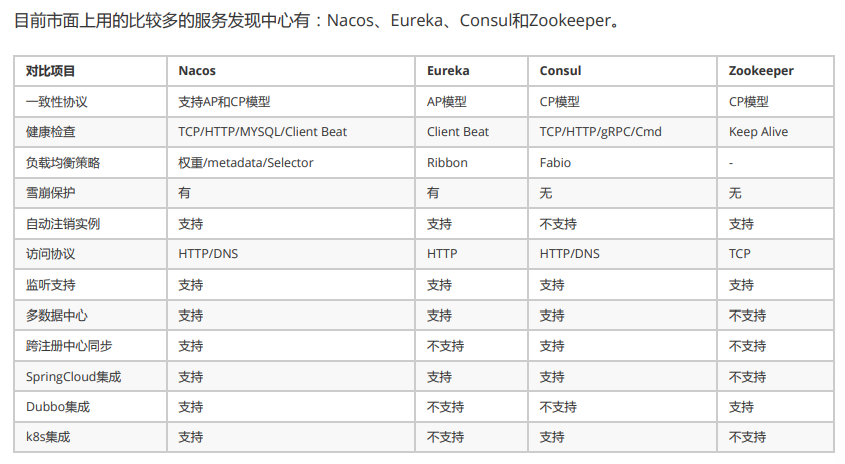

# 微服务
## 1、对微服务的理解

按业务拆分，每个服务只关注一个业务，具有独立性，独立进程，独立部署，独立数据存储

## 2、服务注册与服务发现、以及服务间调用

相关概念：服务与实例

服务名称：每个服务在服务注册中心的标识，相当于Java中的类名。
服务实例：网络中提供服务的实例，具有IP和端口，相当于Java中的对象，一个实例即为运行在服务器上的一个进
程。

场景：

注册中心（服务端）

服务A有多实例，实现了负载均衡（作为客户端，注册到注册中心）

服务B有多实例，实现了负载均衡（作为客户端，注册到注册中心）

服务A调用服务B（服务A通过注册中心发现服务B，然后通过RESTful或RPC进行服务调用）

重点：为什么不能用配置文件进行配置

由于**服务运行实例的网络地址**是不断动态变化的，**服务实例的数量**也是动态变化的

所以必须使用动态的服务发现机制来实现微服务间的相互感知

实现：

1）所有微服务以及它们的所有实例，都注册到注册中心，这里的注册是指上报自己的网络位置

2）注册中心内部会形成一个**服务注册表**，包含了所有服务的所有实例的网络地址的数据库。

3）所有微服务以及它们的所有实例，会定期从注册中心同步服务注册表进行缓存

4）当某个服务实例需要调用其他服务，就通过缓存的服务注册表定位目标服务的网络地址。

5）若目标服务存在多个实例，即多个网络地址，则使用负载均衡算法从多个实例中选择一个，然后进行调用

## 3、注册中心产品对比

从上面对比可以了解到，Nacos作为服务发现中心，具备更多的功能支持项，且从长远来看Nacos在以后的版本会支持SpringCLoud+Kubernetes的组合，填补 2 者的鸿沟，在两套体系下可以采用同一套服务发现和配置管理的解决方案，这将大大的简化使用和维护的成本。另外，Nacos 计划实现 Service Mesh，也是未来微服务发展的趋势。

## 4、配置中心

1）什么是配置

应用程序在启动和运行的时候往往需要读取一些配置信息，配置基本上伴随着应用程序的整个生命周期，比如：数据库连接参数、启动参数等。

2）配置的主要特点

3）什么是配置中心

配置中心是一种统一管理各种应用配置的基础服务组件

       在传统巨型单体应用纷纷转向细粒度微服务架构的历史进程中，配置中心是微服务化不可缺少的一个系统组件，在这种背景下中心化的配置服务即配置中心应运而生，一个合格的配置中心需要满足如下特性：

- 配置项容易读取和修改
- 分布式环境下应用配置的可管理性，即提供远程管理配置的能力
- 支持对配置的修改的检视以把控风险
- 可以查看配置修改的历史记录
- 不同部署环境下应用配置的隔离性

4）主流配置中心对比

## 5、Nacos（阿里开源）

1）Nacos是阿里的一个开源产品，它是针对微服务架构中的服务发现、配置管理、服务治理的综合型解决方案。

**重点：同时作为注册中心和配置中心**

可以使用外部mysql存储nacos数据

2）Namespace隔离设计（命名空间隔离设计）

- 多个租户（用户）使用nacos client，可以通过不同的namespace，来实现多租户间的数据隔离，不同租户间不可见

- 单个租户（用户）使用nacos client，可以通过不同的namespace，来实现多环境（开发环境、测试环境、生产环境）的数据隔离

3）数据模型

服务：对外提供的软件功能，通过网络访问预定义的接口

服务名：服务提供的标识，通过该标识可以唯一确定要访问的服务

实例：提供一个或多个服务的具有可访问网络地址（IP:Port）的进程，启动一个服务，就产生了一个服务实例

集群：服务实例的集合，多个服务实例组成一个集群，相同集群下的实例才能相互感知

元信息：Nacos数据（如配置和服务）描述信息，如服务版本、权重、容灾策略、负载均衡策略、鉴权配置、各种自定义标签（label）。从作用范围来看，分为服务级别的元信息、集群的元信息以及实力的元信息

**应用通过Namespace（命名空间）、Service（服务）、Cluster（集群）的配置，描述了该服务向哪个环境的哪个集群注册实例。**

4）Nacos作为配置中心

spring-cloud-starter-alibaba-nacos-config 支持配置的动态更新（无须重新部署，实现更新配置）

可以通过配置spring.cloud.nacos.config.refresh.enabled=false来关闭动态刷新

4.1）配置管理模型

Namespace（命名空间）：隔离不同环境

Group（配置分组）：隔离不同项目（项目也称应用），如不指定默认为 DEFAULT_GROUP

Data ID（配置集）：一个配置集可以包含多个配置项，配置项就是一个个key-value的配置内容

## 6、负载均衡

负载均衡就是将用户请求（流量）通过一定的策略，分摊在多个服务实例上执行，它是系统处理高并发、缓解网络压力和进行服务端扩容的重要手段之一。

分为服务端负载均衡（如Nginx）和客户端负载均衡（如Ribbon）

两者的目标是一致的，只是实现不同。服务端负载均衡，将负载均衡策略放在服务端。客户端负载均衡，将负载均衡策略放在客户端。

## 7、Dubbo（阿里开源的RPC框架）

Spring Cloud Alibaba微服务开发框架集成了Dubbo，可实现微服务对外暴露Dubbo协议的接口，Dubbo协议相比RESTful协议速度更快。

RPC：RPC是远程过程调用（Remote Procedure Call）的缩写形式，调用RPC远程方法就像调用本地方法一样，非常方便。

下图是微服务采用Dubbo协议的系统架构图

