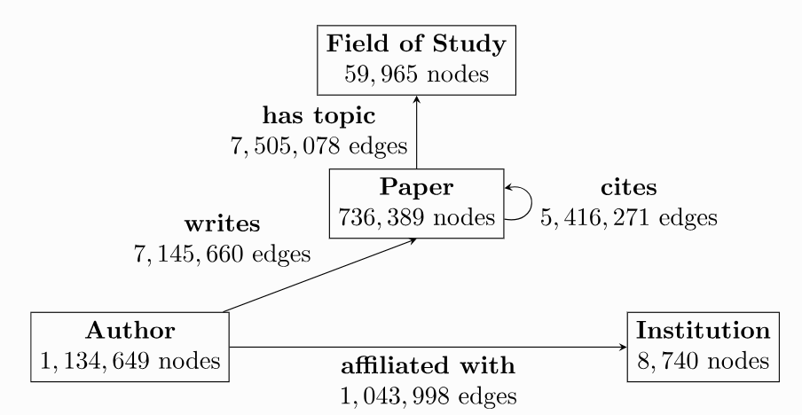

# PyG Heterogeneous Graph Practice
## Homogeneous Graph and Heterogeneous Graph
### Homogeneous graph
Without distinguishing between node and edge types, there is only one type of node and one type of edge.

Node Type + Edge Type = 2

For example, in a social network, it can be imagined that nodes only have one category 'person', and edges only have one type of connection 'knows'. And people either know each other or they do not.

### Heterogeneous Graph
The type of node or edge exceeds one kind.

Node Type + Edge Type > 2

In the real world, most graphs are heterogeneous, representing information about different types of entities and their different types of relationships. The feature representations of different types of nodes and edges can have distinct types and dimensions.

## Graph Neural Network Framework
### PyG
[PyG Heterogeneous Graph Guide](https://pytorch-geometric.readthedocs.io/en/latest/notes/heterogeneous.html?highlight=Heterogeneous#creating-heterogeneous-gnns)
### DGL
[DGL Heterogeneous Graph Guide](https://docs.dgl.ai/en/1.1.x/guide/graph-heterogeneous.html)

## Example

The given heterogeneous graph has 1,939,743 nodes, split between the four node types author, paper, institution and field of study. 

It further has 21,111,007 edges, which also are of one of four types:
- writes: An author writes a specific paper
- affiliated with: An author is affiliated with a specific institution
- cites: A paper cites another paper
- has topic: A paper has a topic of a specific field of study

## Neighbor Loader
https://pytorch-geometric.readthedocs.io/en/latest/tutorial/neighbor_loader.html