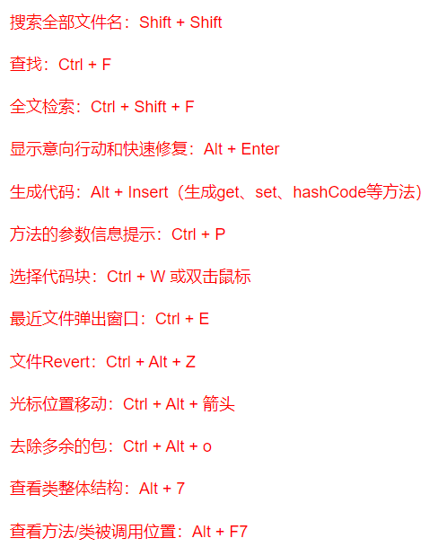

# IDEA快捷键

## 查看一个类的构造函数有哪些
方法一：类前面加new，类后面不要加括号，按住ctrl点一下该类，会出现它的构造函数如下图

方法二：类前面加new，类后面加括号，ctrl+p，会出现它的构造函数如下图

## 常用快捷键按重要性依次排序:   

- Ctrl+Z: 撤销更改   
- Ctrl+Shift+Z: 恢复被撤销的内容   
- Ctrl+E: 查看最近改过的各种文件(以及各种好用的快捷键)   
- Alt+Enter: 显示IDEA推测你要完成的操作，高级的代码补全   
- Ctrl+Shift+F: 查找代码片段用   
- Alt+F7: 跟踪一个Object的usage，一个个检查，比ctrl + 左键点击好用得多   
- Shift Shift: 查找文件或类用   
- Alt+9: 查看Git的历史提交记录   
- 拖黑后Ctrl+"/": 注释，取消注释   
- F2: 跳到当前代码下一个报错的地方   
- Alt+ ←/→: 在打开的文件中切换   
- Ctrl+Alt+←/→: 跳到上一次/下一次看过的代码段   
- Ctrl+Alt+L: 自动优化当前文件代码格式   

| 继承体系                           | ctrl + h                                                     |
| ---------------------------------- | ------------------------------------------------------------ |
| 方法被调用                         | alt + F7                                                     |
| 接口实现类                         | ctrl + alt + b                                               |
| 上/下一个方法                      | alt + up/down                                                |
| 消除无效import                     | ctrl + alt + o                                               |
| 看源码                             | ctrl + 鼠标左键                                              |
| 提示补全                           | alt + /                                                      |
| 万能解错（提示，修复，返回值生成） | alt + enter                                                  |
| 单行注释                           | ctrl + /                                                     |
| 多行注释                           | ctrl + shift + /                                             |
| 单元测试                           | ctrl + shift + t                                             |
| 全局搜索                           | ctrl + shift + f      （不起作用一般是快捷键被输入法的繁简切换占用，取消输入法的快捷键即可生效） |
| 当前文件查找                       | ctrl + f                                                     |
| 回到上/下一级                      | ctrl + alt + left/right                                      |
| 显示错误信息                       | ctrl + F1                                                    |
| 文件结构图                         | ctrl + F12                                                   |
| 类的结构                           | ctrl + o                                                     |
| 快速查找类                         | ctrl + n                                                     |
| 复制当前行                         | ctrl + d                                                     |
| 删除当前行                         | ctrl + y                                                     |
| 搜索文件                           | 双击Shift                                                    |
| 同时编辑多行                       | ctrl+shift+alt+鼠标左键                                      |
| 递进式选择代码块                   | ctrl+w                                                       |
| 递进式取消选择代码块               | ctrl+shift+w                                                 |
| 格式化代码（某个类或某个包下的）   | ctrl+alt+l                                                   |
| 展开所有代码                       | ctrl+shift++                                                 |
| 折叠所有代码                       | ctrl+shift+-                                                 |
| 自动结束代码，行末自动添加分号     | ctrl+shift+回车                                              |
| xml注释快捷键（添加或取消）        | ctrl+shift+/                                                 |
| 按行号搜索                         | ctrl+g                                                       |

| 断点               |      |
| ------------------ | ---- |
| 单步执行，不进方法 | F8   |
| 进入方法           | F7   |
| 下一个断点         | F9   |

| 快速生成代码                      |                |
| --------------------------------- | -------------- |
| 输出                              | sout           |
| main方法                          | psvm           |
| surround with(if,while,try catch) | ctrl + alt + t |
| 生成构造器，getset,重写，toString | alt + insert   |

  
