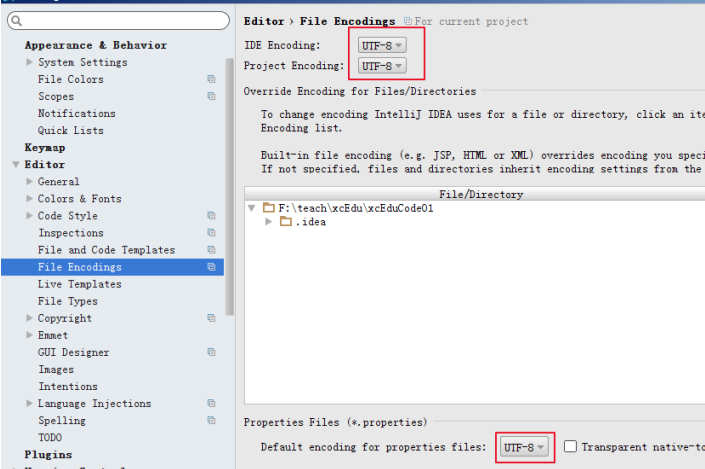
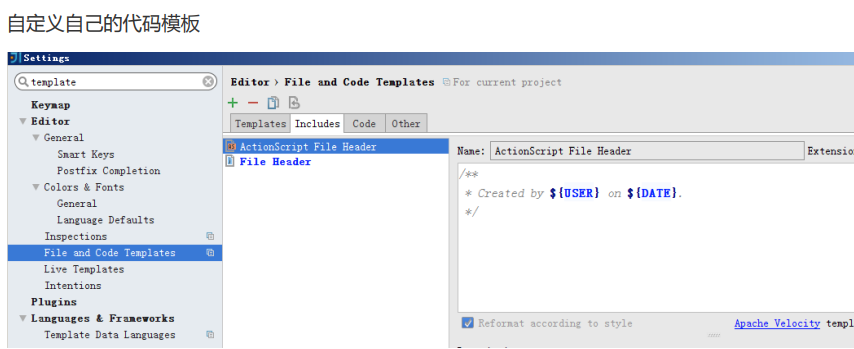
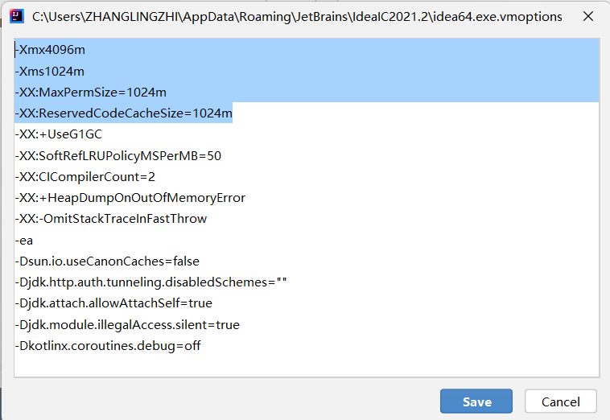
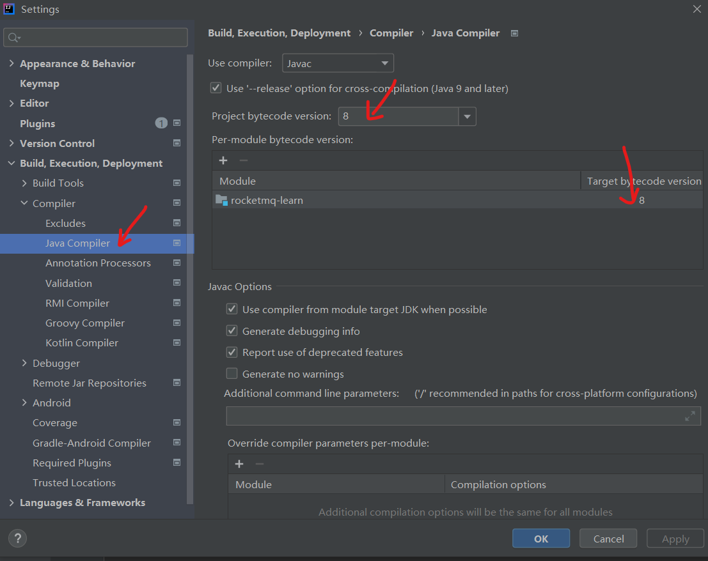
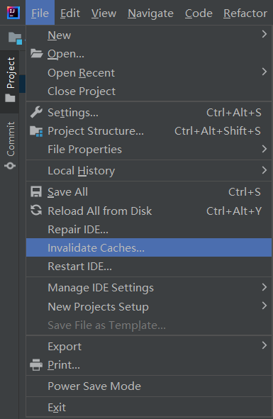
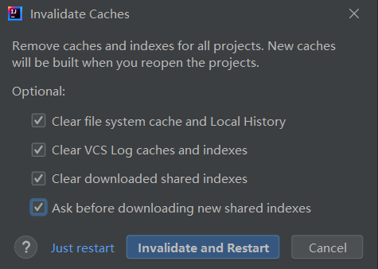
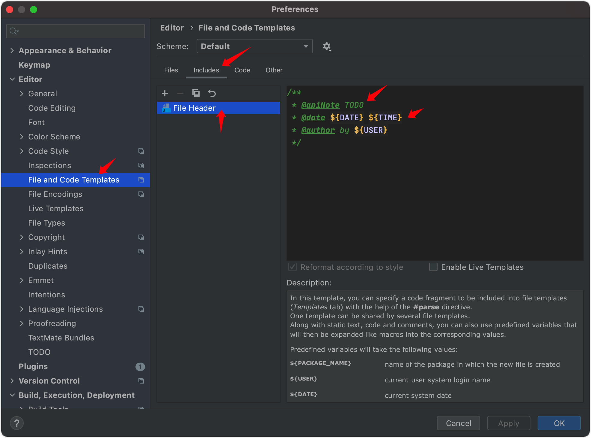

# IDEA常见问题及插件

## 一、常用插件

- Alibaba Java Coding Guidelines(XenoAmess TPM) : 代码检查用这个  <br/>
- RestfulTool: 通过URL直接定位到对应controller代码 <br/>
- Maven Helper: 分析Maven项目的package依赖冲突 <br/>
- POJO to JSON: 要为类生成代码直接在类定义处右键就能copy json了，省时省力 <br/>
- Github Copilot: AI补全代码，学生可以免费申请 <br/>
- Sonar Lint: 扫描 bug, vulnerabilities and code smell，同时也是code review好帮手 <br/>
- Database Navigator: 数据库插件，聊胜于无 （不建议使用，只能查看，无法创建表，还是用DBeaver算了） <br/>
- Git Commit Template : 提交git commit模板，有利于团队管理提交代码  <br/>
- Spring Assistant ：在idea中添加Spring Initializr工具；支持.yml提示【特别提醒：亲测很难用，maven导包会报错，直接用官网方式创建SpringBoot脚手架项目】 <br/>
- GitToolBox：查看每行代码最后一个修改的人 <br/>
- lombok：通过注解自动生成set,get,equals,constructor,toString

## 二、初始IDE配置（全局配置）
### （一）针对全局，而不是针对单个项目配置

针对单个项目：

相信很多小伙伴都是通过File-Settings，更改项目配置吧，但老司机知道每次换新的项目，你还得重新设置一遍（常见例如maven/jdk编译版本），这显然不科学。


针对全局：

如果打开了项目，先Close Project

在IDEA的Customize页面，找到All setting，这里进行配置，才是全局生效的


### （二）IDEA初始配置

#### 1、配置maven

- maven home path（maven主路径）
- setting file（setting.xml文件路径，在maven主路径的conf下）
- local repository（maven仓库地址，这个自定义，之后会把所有导入的包放这个路径下）
- setting.xml中配置阿里云镜像

```xml
<mirror>
	<id>alimaven</id>
	<name>aliyun maven</name>
	<url>http://maven.aliyun.com/nexus/content/groups/public</url>
	<mirrorOf>central</mirrorOf>
</mirror>
```

#### 2、配置编码



#### 3、配置快捷键


#### 4、配置自动导包


#### 5、配置代码模板



#### 6、配置JVM内存


默认值如下:


修改后如下：




## 三、常见问题
### 更改项目JDK版本

1. 按Ctrl+Alt+S，打开【Settings】，修改Java Compiler配置: <br/>

 <br/>

2. 改Maven的JDK版本 <br/>

打开pom.xml，更改如下字段: <br/>
 <br/>

3. 点击左上角【File】，点击【Project Structure】，更改项目设置 <br/>
  
 <br/>
 <br/>

### 项目文件出不来
点击左上角【File】，点击【Project Structure】，更改【Modules】 <br/>
   如果项目没有展示出来，就是模块module没有弄好

 <br/>

### Terminal中按ESC切回主编辑器窗口

这样非常不利于在terminal中进行vim编辑 <br/>
解决办法: <br/>
使用Ctrl+Alt+S快捷键打开idea全局配置，在快捷键映射配置Settings -> keymap中，找到 Plugins -> Terminal -> Switch Focus To Editor，删除其ESC快捷键绑定即可。 <br/>


### 用IDEA插件database连接数据库
报错：The Server time zone value 'XXXXX' 乱码 <br/>
解决：连接时，加上serverTimezone=GMT即可解决 <br/>
### 配置文件（.yml/.properties）没有提示
旗舰版 <br/>
添加Spring Boot插件后重启，配置文件显示为绿叶 <br/>
社区版（无Spring Boot插件） <br/>
添加Spring Assistant插件后重启，支持.yml提示，但.properties无法有提示 <br/>
### 设置字符集为utf-8
 <br/>

### 处理全局搜索不到确实存在的文件
解决：清理缓存 <br/>
 <br/>
 <br/>
### 多实例
一个类运行多个实例 <br/>
点击要运行的类上面的【Edit Configuration】 <br/>
 <br/>
在Build and run栏的【Modify options】里勾上【Allow multiple instances】 <br/>
 <br/>

### 自动生成序列化ID
设置：Files -> Settings -> Inspections -> 搜索 UID -> 勾选 “Serializable class without 'serialVersionUID'” -> Apply <br/>

在需要生成序列化ID的类中：选中类名 -> alt+enter -> 点击Add 'serialVersionUID'即可生成 <br/>
 <br/>

### 远程debug
Edit Run Configuration <br/>
 <br/>
填目标主机的ip port <br/>
```
参数里填-agentlib:jdwp=transport=dt_socket,server=y,suspend=n <br/>
```
如果连不通，尝试看目标机器是否开启debug模式，端口是否暴露出来 <br/>
如果连通，会看到类似如下 <br/>
```
Connected to the target VM, address: '<ip>:<port>', transport: 'socket' <br/>
```
### 更改自动生成的author
 <br/>

另一种办法: <br/>
```
点击IDE上面的【Help】 -> 【Edit Custom VM Options】，添加一行配置: <br/>
> -Duser.name=<username> <br/>

即可解决 <br/>
```
### 自动生成serialVersionUID
 <br/>

### 查看字节码

1. 编译后可以直接去查看target文件夹下，找到对应的class文件，这里看到的是.class文件被IDE 解析后的结果。可以看到一些自动生成的代码如@Lombok等生成的 <br/>
2. 安装jclasslib Bytecode Viewer插件，点击IDE 顶部的【View】 -> 【Show bytecode】，可以看对应类的真实字节码 <br/>

### 打开多个文件显示在多行且不隐藏
File -> settings ->Editor ->General ->Editor tabs <br/>
-> 不勾选show tabs in single row -> 确认 <br/>

### 远程调试
前置条件：IDEA下载arthas插件 <br/>
1.找到要监控的方法，右键，Arthas Command->Watch <br/>
2.打开容器（Note：在容器里粘贴快捷键：ctrl+shift+v） <br/>
su admin #进入admin账号 <br/>
bash /home/admin/arthas/as.sh  然后一直回车，直到看到[arthas@xxxx]$ <br/>
输入刚才复制的命令 <br/>
3.在线上环境操作调该方法 <br/>
4.即可在容器里监控到信息 <br/>

### IDEA解决冲突
pull之后有冲突-->找到冲突的文件-->到编辑页面-->去掉报错的部分-->点击Git中add-->全选所有文件-->commit-->再pull一次-->然后push-->结束 <br/>

## 容器里查看日志
tail -f a.log  #动态读取最后10行（默认是10行） <br/>
tail -200f a.log  #动态读取最后200行数据 <br/>
tail -f a.log |grep -E --color 'order|product' <br/>
#动态展示文件中出现的 order或者product字符 不区分大小写，并且高亮显示

容器里查看数据库表 <br/>
cd bin <br/>
sh dbshell.sh <br/>
## DBeaver导出数据
[https://blog.csdn.net/WTUDAN/article/details/120767542](https://blog.csdn.net/WTUDAN/article/details/120767542) <br/>
## SQL
[查询重复记录](https://blog.csdn.net/haoui123/article/details/80562835) <br/>
[分组返回map](https://www.cnblogs.com/eternityz/p/12284808.html)   <br/>
## 判空
注解 <br/>
 <br/>
集合判空 <br/>
CollectionUtils._isNotEmpty(list)_ <br/>
_对象判空_ <br/>
java.util.function.Supplier.Objects._nonNull_ <br/>
java.util.function.Supplier.Objects.isNull <br/>
通用代码积累 <br/>

| 对象复制 | org.springframework.beans.BeanUtils#_copyProperties(src,dest)_ |
| --- | --- |
| _对象转json_ | JSONObject._toJSONString_(result) |
| 字符串相等 | org.apache.commons.lang.StringUtils#equals |
| 新建数组 | com.google.common.collect.Lists.newArrayList() |
| 遍历枚举 | Stream._of_(MeasurementItemEnum._values_()).map(MeasurementItemEnum::getId).collect(Collectors._toList_()); |


toB <br/>
产品出一个正式的GA版本才能部署到客户环境 <br/>
初始化任务，很多变更的都是代码里配置好，初始化到数据库里，然后从数据库里查 <br/>
如预案原子操作及其分类，系统配置，功能切换开关 <br/>

本来的一些手动操作，做成原子操作，一些风险场景能自动触发执行预案 <br/>


