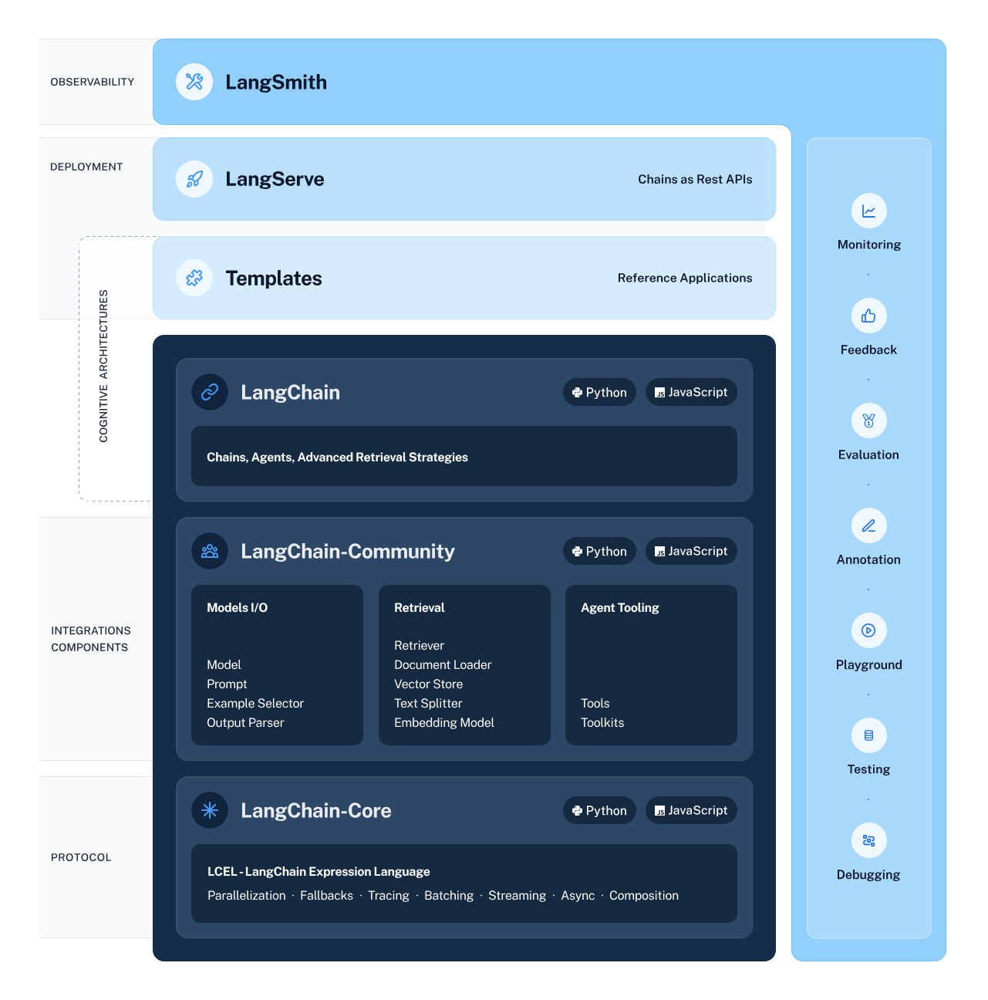

# 一文带你了解LangChain: 使用大语言模型构建强大的应用程序
> 从架构图入手，一步步带你了解LangChain的方方面面

<!-- more -->

## LangChain是什么
LangChain是一个用于快速构建LLM应用的开源框架。

它将一些使用LLM时的通用行为进行了抽象，封装为API，统一了使用方式，简化了开发流程。

## LangChain的架构图告诉了我们什么信息
LangChain的架构图如下：



从架构图中, 我们可以获取什么信息呢？
### LangChain的生态
LangChain的生态除了LangChain本身，还包括LangServe和LangSmith。
- LangChain聚焦于开发
- LangServe用于部署
- LangSmith是作为可观测平台

Note：LangServe和LangSmith对于初学者来说可以先略过，本文只关注LangChain本身。
### LangChain源码的开发语言
LangChain的源码有两种开发语言，分别是Python和JavaScript。
- Python源码对应的Github仓库：[https://github.com/langchain-ai/langchain](https://github.com/langchain-ai/langchain)
- JavaScript源码对应的Github仓库：[https://github.com/langchain-ai/langchainjs](https://github.com/langchain-ai/langchainjs)

Note：本文将以LangChain的Python源码进行讲解。
### LangChain源码的组织结构
LangChain源码的libs目录为主要的目录，其中包含三个主要的包，分别是LangChain包、LangChain-Community包和LangChain-Core包。
- Langchain-Core包：框架的基础
- LangChain-Community包：集成组件/第三方组件
- LangChain包：核心组件，Langchain-Core包和LangChain-Community包中的内容都会引入到此LangChain包里，由LangChain包作为入口，调用Langchain-Core包和LangChain-Community包的组件

## 你不得不知的一些核心模块
### Model I/O(模型交互模块)
作用：与LLM进行交互的抽象，细分为Prompts模块、Language Model模块(LLM模块)和Output Parsers模块。
#### Prompts
作用：使用Prompt模板作为LLM的输入。
#### Language Model(LLM)
作用：语言模型的一个抽象，通过通用接口调用LLM。
#### Output Parsers
作用：将LLM的输出结果进行解析，可以解析为不同格式。
### Chains(链，工作流模块)
作用：将多个组件组合在一起以创建一个单一连贯的任务，可以将多个Chain嵌套使用，或将Chain与其他组件组合来构建更复杂的Chain。
### Agents(代理模块)
作用：根据用户的输入, 由LLM进行规划与决策，可以将任务细分，也可以决定每一步的行为，集成了各类工具，动态的选择要不要使用工具以及使用什么工具。

核心概念：
- **Agent**：Agent为一次决策，根据当前的情形，Agent会动态做出决策，决定是否直接答复还是调用工具，如果调用工具是选择哪个工具
- **AgentExecutor**：AgentExecutor本质是一个Chain，它是Agent的迭代器，会反复调Agent进行决策，直到达到规定上限或返回满意的结果为止
  
可以把AgentExecutor视为一个智能体，Agent视为智能体的大脑，用户询问一个问题，AgentExecutor会进行一次或多次思考，即调用Agent进行决策，直到达到规定的上限或返回满意的结果为止。
### Retrieval(检索模块)
作用：集成数据源的抽象，包括数据加载、数据处理、数据向量化、数据存储以及数据检索等，使用户可以有自己的知识库。
### Callbacks(回调模块)
作用：在执行Chain的过程中，记录下一些执行的相关信息，一般用于记录日志、记录执行的中间步骤、记录用于计费的token使用量以及进行流速控制。
### Memory(记忆模块)
作用：记录历史对话，以便在之后的对话中补充历史上下文，使模型能够连续对话。

## 通过简单的示例代码感受下各模块的作用
Note：不必关注代码细节，只关注代码流程即可。
### Model I/O模块与Chains模块的应用：将Prompt，LLM和Output Parser组合为一个Chain
```python
from langchain_core.prompts import ChatPromptTemplate
from langchain_openai import ChatOpenAI
from langchain_core.output_parsers import StrOutputParser

# 设置Prompt
prompt = ChatPromptTemplate.from_messages([
    ("system", "You are world class technical documentation writer."),
    ("user", "{input}")
])

# 设置LLM
llm = ChatOpenAI(openai_api_key="...")

# 设置Output Parser
output_parser = StrOutputParser()

# 将Prompt，LLM和Output Parser组合为一个Chain
chain = prompt | llm | output_parser

# Chain的调用
chain.invoke({"input": "how can langsmith help with testing?"})
```
### Retrieval模块的应用：建立知识库并检索相关信息作为Prompt的一部分
- 本案例可以看到Chain的嵌套组合使用
- Retrieval Chain将接收用户的输入，查找相关的文档，
然后将这些文档连同原始用户的输入组合为一个Prompt, 一起传递给大语言模型（LLM），并请它回答原始问题
```python
from langchain_community.document_loaders import WebBaseLoader
from langchain_openai import OpenAIEmbeddings
from langchain_community.vectorstores import FAISS
from langchain.text_splitter import RecursiveCharacterTextSplitter
from langchain.chains.combine_documents import create_stuff_documents_chain
from langchain.chains import create_retrieval_chain

# 数据加载器
loader = WebBaseLoader("https://docs.smith.langchain.com/overview")

# 加载数据
docs = loader.load()

# 文档分割器
text_splitter = RecursiveCharacterTextSplitter()

# 分割文档
documents = text_splitter.split_documents(docs)

# 嵌入模型（向量化模型）
embeddings = OpenAIEmbeddings()

# 将文档向量化并存储到向量数据库中
vector = FAISS.from_documents(documents, embeddings)

# 将向量数据库作为检索器
retriever = vector.as_retriever()

# 设置Prompt
prompt = ChatPromptTemplate.from_template("""Answer the following question based only on the provided context:
<context>
{context}
</context>
Question: {input}""")

# 将LLM与Prompt组合为一个Chain，其中llm为第一个案例的
document_chain = create_stuff_documents_chain(llm, prompt)

# 将检索器和其他Chain组合为一个可以检索的Chain
retrieval_chain = create_retrieval_chain(retriever, document_chain)

# 可检索的Chain的调用
response = retrieval_chain.invoke({"input": "how can langsmith help with testing?"})

# 输出结果
print(response["answer"])
```
### Agents模块的应用：将检索知识库的能力和搜索能力以及其他的能力作为一个个工具供AgentExecutor使用，AgentExecutor根据用户的问题，拆解为多个步骤，由Agent决定每一步做什么
- retriever可以作为一个工具
```python
from langchain.tools.retriever import create_retriever_tool
from langchain_community.tools.tavily_search import TavilySearchResults
from langchain.agents import create_openai_functions_agent
from langchain.agents import AgentExecutor
from langchain import hub

# 检索工具（检索向量数据库），其中retriever为第二个案例的
retriever_tool = create_retriever_tool(
    retriever,
    "langsmith_search",
    "Search for information about LangSmith. For any questions about LangSmith, you must use this tool!"
)

# 搜索工具（浏览器搜索实时信息）
search_tool = TavilySearchResults(tavily_api_key="...")

# 工具列表
tools = [retriever_tool, search_tool]

# 获取langchain hub预定义的prompt
prompt = hub.pull("hwchase17/openai-functions-agent")

# 设置Agent，其中llm为第一个案例的，其中tools用于告诉Agent有哪些工具可用以及每个工具是做什么的
agent = create_openai_functions_agent(llm, tools, prompt)

# 设置AgentExecutor，拆解任务为多个步骤，每一步由agent决策做什么
agent_executor = AgentExecutor(agent=agent, tools=tools, verbose=True)

# 询问langsmith
agent_executor.invoke({"input": "how can langsmith help with testing?"})

# 询问天气
agent_executor.invoke({"input": "what is the weather in SF?"})
```