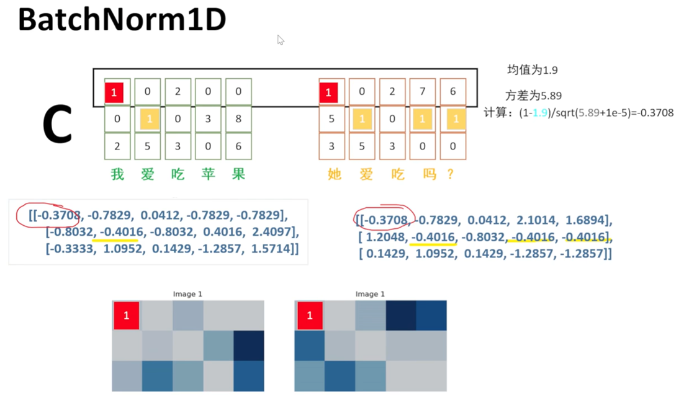
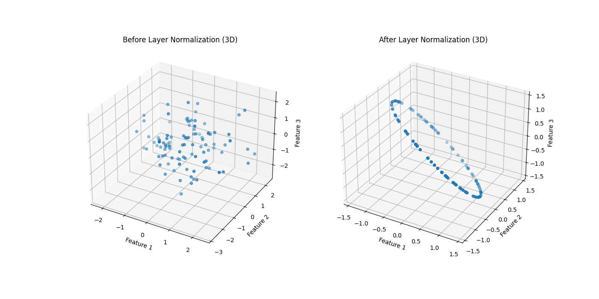

# Llama进阶

  - 1. LayerNorm(Layer Normalization，层归一化)
  - 2. Attention
  - 3. 超参数
  - 4. 张量维度转换
  - 5. 可训练参数量     
  - 6. 源码
   
<!-- more -->
苏剑林

https://spaces.ac.cn/archives/10091
## 1. LayerNorm(Layer Normalization，层归一化)  
### 1.1. LayerNorm的计算公式
Normalization（归一化）要求：均值Mean为0，方差Deviation为1

计算步骤：

1.计算均值和方差

均值Mean：
$$\mu = \frac{1}{N} \sum_{i=1}^{N} x_i$$

方差Deviation:
$$\sigma^2 = \frac{1}{N} \sum_{i=1}^{N} (x_i - \mu)^2$$

2.归一化

使用计算出的均值和方差来归一化每个特征值。
$$\hat{x} = \frac{x - \mu}{\sqrt{\sigma^2 + \epsilon}}$$

其中，$x$是原始输入值，$\hat{x}$是归一化后的值，$\epsilon$是一个非常小的数值，防止除0的情况发生。

归一化后的$\hat{x}$达到了均值为0方差为1的要求

3.缩放和平移

引入两个可学习参数$\gamma$和$\beta$进行缩放和平移变换，以保持网络的表达能力。

$$y = \gamma * \hat{x} + \beta$$

其中，$y$表示LayerNorm的输出，$\gamma$和$\beta$在训练过程中学习得到。

缩放和平移操作不会影响均值和方差，所以依旧满足均值为0方差为1的要求

4.总的公式

$$y = \gamma * \frac{x - \mu}{ \sqrt{\sigma^2 + \epsilon}} + \beta$$

### 1.2. BatchNorm和LayerNorm
思考：要在哪一维度上做Normalization，为什么

LayerNorm与BatchNorm的区别是在哪一维度上进行归一化。

LayerNorm是在特征维度进行归一化，而BatchNorm是在批次维度上，如下图BatchNorm1D和LayerNorm的示例所示。

适用场景：

LayerNorm与BatchNorm的适用场景略有不同。

LayerNorm通常用于循环神经网络（RNNs）以及Transformer架构中, 不要求批量数据大小固定，可以对小批量数据（或在线学习中的单个样本）进行高效的归一化，更适用于NLP领域。

BatchNorm通常用在卷积神经网络（CNNs）中，并且适用于处理大小固定的批量数据，比较适合训练大规模数据集，更适用于CV领域。

### 1.3. Normalization的几何意义

### 1.4. RMSNorm

### 1.4. Normalization对Attention的重要性
思考：Normalization要在计算层(attention和mlp)的前面还是后面，为什么

参考论文：https://arxiv.org/pdf/2305.02582

上述论文将LayerNorm分解为两个几何操作：1）将输入向量投影到与向量[1,1,...,1]正交的子空间上，2）以及将投影后的向量缩放到相同的范数$\sqrt{d}$。

图1a展示了在没有LayerNorm的情况下，Transformers中的Keys和queries并没有明显的几何结构。相比之下，图1b显示LayerNorm已经将所有keys投影到了与向量[1,1,...,1]正交的超平面上。
LayerNorm的第二个组成部分是缩放：我们展示了LayerNorm如何将投影后的输入缩放到具有确切的$\sqrt{d}$的L2范数。在第3节中，我们展示了缩放输入向量可以防止“不可选”的keys的问题，其中一些keys向量被包含在由其他keys形成的凸包内，因此永远无法获得最高的注意力得分。图1c和1d显示了在100次运行中平均有多少份“不可选”的向量是从正态分布中随机抽取的。如图1c所示，在没有LayerNorm的情况下，某些设置中获得“不可选”keys的概率可能非常高。然而，如图1d所示，有了LayerNorm，每个keys向量始终是可选的。
这些结果揭示了常用的LayerNorm的新方面，并展示了它对于Transformers中的注意力机制的重要性。

示例：Q和K做矩阵相乘

先计算后norm：求点积，随机分布，有遮挡，看不到一些权重，准确率会降低，训练速度会慢3倍以上

先norm后计算：使用了norm后，全都能看到，不会有遮挡

Normalization（归一化）是深度学习中用于加速训练过程、稳定学习、防止过拟合的技术，把数据进行缩放，避免大的特别大，小的特别小，造成模型训练的时候过于拟合或者是过于爆炸，让训练速度变得很慢。

效果：queries和keys矩阵相乘时，分布的更均匀，把数据空间拉近，保持数据空间的特征存在的情况下，取值更集中，方便计算，减少梯度爆炸和梯度消失的问题，提高训练稳定性和加速收敛。

LayerNorm对于其后的多头注意力层的表达能力是至关重要的。这与人们通常认为LayerNorm唯一的作用是在正向传播过程中规范化激活值，在反向传播时规范化它们的梯度的观点相反。
我们从几何角度解释LayerNorm，并展示它由两部分组成：（a）将输入向量投影到与向量[1, 1, ..., 1]正交的维空间；（b）将所有向量缩放到相同的规范化尺度上。我们展示了在Transformers中，这些组成部分对其后的注意力层有多么重要:（a）投影允许注意力机制创建一个平等对待所有键的注意力查询，免除了注意力层需要学习这一操作的负担；（b）缩放允许每个键都有可能获得最高的注意力，并防止键被“选不上”。

常用的LayerNorm组件不仅对于优化过程至关重要，同时对于Transformers中的注意力表达能力也非常关键。

## 3. llama为什么不用encoder-decoder,而只用decoder

## 4. attention计算为什么要除根号d

## 5. attention公式的计算优化

## 6. kv_cache,group+kv_cache省了哪一部分计算，省了多少

## 7. 旋转位置编码的长度外推是怎么做的

## 8. 能不能自定义特殊token

## 9. pytorch的通用算子汇总(公式和输入输出)
