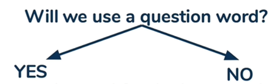
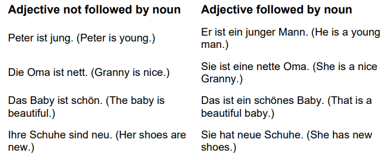

# Grammar 

> Don't think that mastering the entire set of grammar rules is necessary to learn Language well.  Once you've grasped the core grammar, you're already well on your way. The rest is just about continuous accumulation and improvement.
>
>Remember, the sole purpose of grammar is to build sentences.
   
<!-- more -->
## 1. English Core Grammar
### 1.1. Core Theory
Two basic sentence components: subject + verb 

The core of English grammar: verb

### 1.2. Verb Classification (Predicate Verbs and Non-Predicate Verbs)
- Predicate Verbs
  - Infinitive (do)
- Non-Predicate Verbs
  - To + Indinitive (to do)
  - Gerund (doing)

### 1.3. Five Predicate Verbs and Five Simple Sentences
Five Predicate Verbs
- Intransitive Verbs (Verbs without an object)
  - eg. Nick sleeps.
- Monotransitive Verbs (Verbs with one object)
  - eg. Nick loves me.
- Ditransitive Verbs (Verbs with two objects: a direct object and an indirect object)
  - eg. Nick teaches me AI. 
    - (Saying "Nick teaches me" feels incomplete, while saying "Nick teaches AI" feels somewhat complete, so "AI" is the direct object and "Me" is the indirect object)
- Complex-Transitive Verbs (Verbs with one object, but need a complement)
  - eg. Nick considers me smart. 
    - (While there's only one object, saying "Nick considers me" feels incomplete. However, "smart" doesn't act as another object like in ditransitive verbs. It provides additional information about the existing object.)
- Linking Verbs (Acting as an "equal"(=) sign)
  - eg. Nick is/looks tall.
    - Nick = tall (assigns the quality of "tall" to Nick)
  - eg. Nick is in a room.
    - Nick = in a room (assigns the state of "being in a room" to Nick)

Five Simple Sentences (Dividing by the calssification of predicate verbs)
- Subject + Intransitive Verbs
- Subject + Monotransitive Verbs + Object
- Subject + Ditranstive Verbs + Indirect Object + Direct Object
- Subject + Complex-transitive Verbs + Object + Object Complement
- Subject + Linking Verbs + Subject Complement

### 1.4. Four Dimensions of Predicate Verbs (TAMV)
Tense (T) x Aspect (A) x Mood (M) x Voice(V)
- Tense (4)
  - Past
  - Present
  - Future
  - Past Future 
    - (The future from a past perspective is unrelated to the present. It could be a point in time before the present, or it could be a point in time after the present.)
- Aspect (4)
  - Simple
  - Continuous
  - Perfect
  - Perfect Continuous
    - (A portion has been completed, while the rest is still ongoing; it's a state of being completed yet continuing forward.)
- Mood (3)
  - Indicative Mood (most common)
    - Lisa is quiet.
    - Is Lisa quiet?
  - Imperative Mood (commands, requests, advice)
    - Lisa, be quiet.
  - Subjunctive Mood (contrary to fact)
    - If Lisa were quiet, I might study.
- Voice (2)
  - Active Voice
  - Passive Voice


⚠︎  "will" can be replaced with "shall"; "would" can be replaced with "should."  
⚠︎  The tenses in gray are less commonly used.

### 1.5. Non-simple Sentences (Compound Sentence and Complex Sentence) and Non-Predicate Verbs
Non-simple Sentences (Compound Sentence and Complex Sentence)
- Compound Sentence
  - Explanation: Use conjunctions for coordination
- Complex Sentence
  - Explanation: Replace elements (except the predicate) in the main clause with a subordinate clause (Note: can be embedded infinitely)
    - nouns
      - Subject Clause
      - Object Clause
      - Subject Complement Clause
      - Appositive Clause
    - adjectives
      - Attributive Clause
    - adverbs
      - Adverbial Clause

Non-Predicate Verbs (to do or doing)
- Purpose: To simplify subordinate clauses.
- Scope: Non-Predicate Verbs can replace almost all types of subordinate clauses.
- Note: Non-predicate verbs lack the three dimensions of predicate verbs.


### 1.6. Elements of Sentences and Parts of Speech
Ten Parts of Speech (10)
- Nouns
- Pronouns
- Verbs
- Adjectives
- Adverbs
- Articles
- Numerals
- Prepositions
- Conjunctions
- Interjections

Eight Elements of Sentences (8)
|Elements of Sentences|Parts of Speech|
|--|--|
|Subject|Noun/Pronouns|
|Predicate|Verb (100%)|
|Object|Noun/Pronouns|
|Object Complement|Adjective|
|Subject Complement|Noun/Adjective/Adverb|
|Attributive (decorating a noun)|Adjective|
|Adverbial (decorating a verb)|Adverb|
|Appositive (refer to the same person or thing)|Noun|

### 1.7. Asking a question
#### 1.7.1. Four Structures for Asking a Question in the Present Simple Tense


- YES + YES
  - What does she like? --- She likes flowers.
- YES + NO
  - Who are you? --- I am Lisa.
- NO + YES
  - Do they sing? --- Yes, they do. / No, they don't.
- NO + NO
  - Am I happy? --- Yes, I am. / No, I'm not.

#### 1.7.2. Two Structures for Asking a Question in the Present Continuous Tense

⚠︎  There is just a verb 'be' in present continuous tense.


- YES
  - What are you doing?
- NO
  - Are you sleeping?

#### 1.7.3. Ask a more Specific Question in Present Simple Tense and Present Continuous Tense
- What/Which/How much/How many + Noun
  - What **activity** are you doing? (Present Continuous Tense)
  - What **colour** is this?
  - Which **colour** is your favourite?
  - How much **chocolate** do you eat?
- How + Adjective
  - How **old** are you?

## 2. English Detail Grammar
### 2.1. Nouns
Countable vs Uncountable  
Common Noun vs Proper Noun  
Person vs Thing

### 2.2. Pronouns
#### 2.2.1. All Pronouns
Frist vs Second vs Third   
Person Pronouns vs Possessive Pronouns vs Demonstrative Pronouns   
Possessive Adjectives vs Possessive Nouns  

||Subject Pronouns|Object Pronouns|Possessive Adjectives|Possessive Pronouns|Reflexive Pronouns|
|--|--|--|--|--|--|
|1st person|I|me|my|mine|myself|
|2nd person|you|you|yours|yours|yourself|
|3rd person(male)|he|him|his|his|himself|
|3rd person(female)|she|her|her|hers|herself|
|3rd thing|it|it|its|-|itself|
|1st person(plural)|we|us|our|ours|ourselves|
|2nd person(plural)|you|you|your|yours|yourselves|
|3rd person and thing(plural)|they|them|their|theirs|themselves|

#### 2.2.2. Personal Pronouns (7)
||Subject|Object|
|--|--|--|
|1st person|I|me|
|2nd person|you|you|
|3rd person(male)|he|him|
|3rd person(female)|she|her|
|3rd thing|it|it|
|1st person(plural)|we|us|
|2nd person(plural)|you|you|
|3rd person and thing(plural)|they|them|

#### 2.2.3. Possessive Adjectives
Possessive Adjectives (7)
- my
- your
- his
- her
- its
- our
- their

Possessive S
- xxx's
  - Lisa's brother is called Bart.
  - Sam's car is blue
- xxx' (Elimate 's' if the name ends with 's'.)
  - Charles' phone is black.
- xxx, yyy and zzz's (Add ''s' only after the last name if there are multiple names.)
  - Lisa and Bart's mother is called Marge.

#### 2.2.4. Possessive Pronouns

- mine
- yours
- his
- hers
- (not used)
- ours
- theirs

```
Whose book is this? --- It's mine!
This book is mine.
That phone is yours.
That pen is his.
The dog is hers.
The house is ours.
The children are theirs.
```

Possessive Pronouns Usage  

⚠︎  Using a possessive pronoun to replace an object that has already been mentioned earlier can avoid repetition.

- Asking a question about possession
  - Why are there **keys** here. Are they **yours**?
- Answering a question about possession
  - Whose **book** is this? --- It's **mine**!
  - Whose **keys** are these? --- They are **mine**.
- To avoid repetition
  - This is my **dog** and that is **hers**. (avoid repetition: This is my dog and that is her dog.) 

#### 2.2.5. Demonstrative Pronouns
- this/that
- these/those


### 2.3. Plural Noun Rules & Third Person Singular Verb Conjugation
#### 2.3.1. Commen Rules
Normal:
- +s
  
Exceptions:
- Ending in ['ch', 'sh', 'x', 's', 'z'] => +es
- Ending in ['o']
  - consonant + 'o' => +es
  - vowel + 'o' => +s
- Ending in ['y']
  - consonant + 'y' => eliminate 'y' and add 'ies'
  - vowel + 'y' => +s
- Ending in ['f', 'fe'] => change 'f'/'fe' to 'ves'
---
Examples for Plural Noun
```
- Ending in ['ch', 'sh', 'x', 's', 'z'] => +es (eg. buses, churches, burshes, boxes, waltzes, potatoes)
- Ending in ['o']
  - consonant + 'o' => +es (eg. potato => potatoes; tomato => tomatoes)
  - vowel + 'o' => +s (eg. radio => radios; kangaroo => kangaroos)
- Ending in ['y']
  - consonant + 'y' => eliminate 'y' and add 'ies' (eg. lady => ladies)
  - vowel + 'y' => +s (eg. boy => boys)
- Ending in ['f', 'fe'] => change 'f'/'fe' to 'ves' (eg. loaf => loaves; knife => knives)
```
Examples for Third Person Singular Verb Conjugation


#### 2.3.2. Two Exception Verbs: have & be
|Personal Pronouns|be|have|
|--|--|--|
|I|am/'m|have|
|you|are/'re|have|
|he|is/'s|has|
|she|is/'s|has|
|it|is/'s|has|
|we|are/'re|have|
|they|are/'re|have|

#### 2.3.3. Negative Sentence and Auxiliary verb 'do'
|Personal Pronouns|be|others|
|--|--|--|
|I|'m not|don't|
|you|aren't|don't|
|he|isn't|doesn't|
|she|isn't|doesn't|
|it|isn't|doesn't|
|we|aren't|don't|
|they|aren't|don't|

### 2.4. Verbs
#### 2.4.1. Present Participle
Usages:
- tenses
- adjectives
- verb formation
- verb -> noun
- participial phrases

Rules:
- General Rule
  - verb + 'ing' (eg. drink->drinking; eat->eating)
- Enging in 'c'
  - verb + 'king' (eg. picnic->picnicking; mimic->mimicking)
- Ending in 'e'
  - General Rule
    - eliminate 'e' + 'ing' (eg. drive->driving; dance->dancing)
  - Ending in 'ee'
    - verb + 'ing' (eg. see->seeing)
  - Ending in 'ie'
    - change 'ie' to 'y' + 'ing' (eg. lie->lying; die->dying)
- Ending in ['w','x','y']
    - verb + 'ing' (eg. draw->drawing; relax->relaxing; play->playing)
- CVC Rule (Consonant Vowel Consonant Rule)
  - General Rule
    - double the final letter + 'ing' (eg. swim->swimming; skip->skipping)
  - the stress is on the first syllable 
    - verb + 'ing' (eg. visit->visiting)

#### 2.4.2. Top 20 Verbs
- be
- have
- come
- do
- go
- find
- give
- know
- like
- look
- make
- need
- run
- say
- see
- take
- tell
- think
- use
- want

### 2.5. Adjectives
#### 2.5.1. Adjective Order
- 1. Quantity
- 2. Opinion
- 3. Size
- 4. Physical Quality
- 5. Age
- 6. Shape
- 7. Colour
- 8. Origin
- 9. Material
- 10. Purpose

```
This is a beautiful(2) round(6) British(8) wooden(9) table.

This ia an amazing(2), new(5) cleaning(10) tool.
```

#### 2.5.2. Negative Prefixes
Main Negative Prefixes
- un
  - unhappy
  - unfriendly
  - unhealthy
- in
  - inaccurate
  - insecure
  - incorrect
- im (usage: only start with 'p' or 'm')
  - impatient
  - impolite
  - immoral
- il (usage: only start with 'l')
  - illogical
  - illegal
  - illegitimate
- ir (usage: only start with 'r')
  - irresponsible
  - irregular
  - irrational

Other Negative Prefixes
- non
- a
- de
- dis
- mis
- anti
- dys

#### 2.5.3. Comparative and Superlative Form


### 2.6. Adverbs
#### 2.6.1. Frequency Adverbs (FA)
- "single adverb" vs "long adverb"
- "to be" vs "other verbs"
- "Affirmative" vs "Negative" vs "Question"
---
"single adverb" & "to be"
```
I am always dancing.
---
I am not usnally happy.
He isn't always working.
---
Are you always smoking?
```
"single adverb" & "other verbs"
```
I always dance.
---
He doesn't always work.
---
Do you always smoke?
```
"long adverb" & "to be"
```
I am dancing three times a week.
---
I am not dancing three times a week.
---
Are you smoking three times a day?
```
"long adverb" & "other verbs"
```
I dance three times a week.
---
I don't dance three times a week.
--- 
Do you eat three times a day?
```

### 2.7. Articles
#### 2.7.1. Indefinite articles
- a
- an
- some
##### 2.7.1.1. 'a' or 'an'
⚠︎  The use of 'a' or 'an' depends on the sound, not the written letter, being a consonant or vowel.

```
a microwave
an oven

a university/union/unique/European
an hour/honour
```

#### 2.7.2. zero articles
- Proper Noun
  - country
  - festival
- breakfast, lunch, dinner
- time （year, month, weekend）
  
- uncountable nouns
- plurals

### 2.8. Numerals
#### 2.8.1. Cardinal Numbers

#### 2.8.2. Ordinal Numbers


### 2.9. Prepositions
#### 2.9.1. Most Common Prepositions
- in
  - space
    - I am in the room.
  - time (time period)
    - We are in 2023.
    - You go to school in August.
    - She eats in the morning.
    - in the morning/afternoon/evening
    - in that time
- on
  - space
    - It is on the table.
    - on the road
    - on my way to work
    - on my way to and from work
  - time (one day)
    - I go home on Friday.
    - My birthday is on August first. (August 1th)
    - on Monday/Sunday
    - on Monday morning || on Staurday afternoon
    - on my 9th birthday
    - on my birthday
    - on the weekend || on weekends (at the weekend || at weekends)
- at
  - space
    - She is at home.
    - I am at the school.
    - He waits at the tree.
  - time (moment)
    - Meet me at three thrity.
    - at three o'clock
    - at five p.m.
    - at night
    - at that time
    - at the party
    - at my birthday party
    - at the weekend || at weekends (on the weekend || on weekends)
- during
  - time
    - during the day
- under
  - space
    - The dog is under the sofa.
  - time
    - I go home in under one hour.
  - relation
    - I learn well under that teacher.
- with
  - relation
    - I eat lunch with him.
    - She is not with them.
  - way
    - He eats with a fork.
  - no preposition
    - space
    - It's beautiful there.
    - time
      - last year
      - last week
      - next month

### 2.10. Conjunctions
#### 2.10.1. Most Common Conjunctions
- and
- or
- but 
- so

### 2.11. Imperative Sentence
Features:
- No subjects
- Same form
- Add 'please' to be more police 

Examples:
- START
- STOP
- GO
- WATCH OUT
- DO NOT COPY
- DO NOT ENTER
- DO NOT STACK
- DO NOT PASS
- Sit down, please!

Advanced Usage: Do + verb (express three things):
- To be more polite (eg. Do sit down!)
- To show frustration or anger (eg. Do shut up!)
- To persuade somebody (eg. Do eat something!)

## 3. German Core Grammar

### 3.1. Part of Speech


### 3.2. Germen Order
#### 3.2.1. Four Simple Sentences
- declarative sentence
  - verb is on the 2nd case，end in "."  
- general questions sentence
  - verb is on the 1st case, end in "?" 
- special questions sentence (start with "w-")
  - "w-" is on the 1st case and verb is on the 2nd case，end in "?"  
- Imperative sentence
  - verb is on the 1st case，end in "!" 


Note： 70% of German verbs are placed in the second position, and 30% are placed in the first position.

#### 3.2.2. Modal Verb Sentence
Structure(hamburger structure) : Modal verbs are placed in the position where the verb should be placed, and the true verb prototype is always placed at the end of the sentence

Note: If there is "nicht" in modal verb sentence, the base form of the verb takes priority and is placed at the end of the sentetnce, while nicht becomes the penultimate form.
  
#### 3.2.3. The order of A and D
```
D(noun),A(noun): D + A
eg. Der Mann schenkt der Frau Blumen.
---
D(noun),A(pronoun) || D(pronoun),A(noun): pronoun + noun
eg. Der Mann schenkt ihr Blumen.
eg. Der Mann schenkt sie der Frau.
---
D(pronoun),A(pronoun): A + D
eg. Der Mann schenkt sie ihr.
``` 

### 3.2.4. Complex and Compound Clauses Order
- Complex Clauses
  - Verb second
  - Past participle to the end 
  - Infinitive to the end
  - Verb to the end in subordinate clauses 
    - Subordinate clauses begin with conjunctions such as 'if' ('wenn'), 'that' ('daß'),
  'until' ('bis'), 'because' ('weil'), so that ('damit'), when ('wenn'). The rule is that
  the verb goes to the end in a subordinate clause. 
    - NB: In written German (eg if you are putting up classroom notices), there is
  always a comma between a principal clause and a subordinate clause. 
  - Subordinate clause before main clause
- Compound Clauses
  - If you join two principal clauses together in German with und (and), aber (but),
oder (or) or denn (for), that does not affect word order; it does not invoke the
verb second rule. 

#### 3.2.5. Adverbial Order: Time, manner, place

When there is more than one adverbial phrase in a sentence, the rule is that
time (T) comes before manner (M), which comes before place (P). 

time > manner(reason) > place  

Examples
```
Ich fahre heute abend (T) mit dem Auto (M) nach Glasgow (P). - I am going
by car to Glasgow this evening.
Ich bin letztes Jahr (T) mit dem Zug (M) nach Paris (P) gefahren. - I went to
Paris last year by train.
Letztes Jahr (T) sind wir mit dem Rad (M) durch den Schwarzwald (P)
gefahren. - Last year, we went by bike through the Black Forest.
```
NB: Note that the word order in English for the second of these examples is quite different from the German. 

  
### 3.3. The 3rd case : Dative
#### 3.3.1. As Indirect Objects (90%)
People are in 3rd case and things are in 4th case.

Commen Verbs that make the 3rd case as indirect objects.
- geben (give)
- schenken (give gift)
- schreiben (write)
- schicken (send)
- kaufen (buy)
- bringen (take)
- erzählen (tell)
- erklären (explain)
- verkaufen (sell)
#### 3.3.2. As Direct Objects (10%)
There are 10 verbs make the 3rd case as direct objects.
- danken (thanks)
- helfen (help)
- antworten (reply)
- gratulieren (celebrate)
- schaden (harm)
- gehören (belong to)
- schmecken (give someone an appetite)
- passen (suitable)
- gefalien (let someone like)
- fehlen (lack)

### 3.4. Modal Verbs

- müssen - to have to/must
- sollen - to be supposed to/ought
- dürfen - to be allowed/may
- können - to be able to/can
- möchten - to really want to
- wollen - to want to/to intend to
- mögen - to like 

||müssen|sollen|dürfen|können|möchten|wollen|
|--|--|--|--|--|--|--|
|ich|muss|soll|darf|kann|möchte|will|
|du|musst|sollst|darfst|kannst|möchtest|willst|
|er/es/sie|muss|soll|darf|kann|möchte|will|
|wir/sie/Sie/Sie|müssen|sollen|dürfen|können|möchten|wollen|
|ihr|müsst|sollt|dürft|könnt|möchtet|wollt|

### 3.5. Imperative Sentences
What mood is showed?
- command (if there is no "bitte")
- advice
- request

What position should to place the "bitte"?
- Beginning of sentence
- before the object
- Put it last, with a comma in front

How to change declarative into imperative sentence? 
- For 'Sie'
  - Sie nehmen bitte Platz. -> Nehmen Sie bitte Platz!
    - begin at the conjugated verb
    - end in "!"
- For 'ihr'
  - Ihr kommt doch herein. -> Kommt doch herein!
    - begin at the conjugated verb
    - omit subject
    - end in "!"
- For 'du'
  - Du kommst herein. -> Komm herein!
    - begin at the stem of conjugated verb
    - omit subject
    - end in "!"

### 3.6. Negative
#### 3.6.1. kein
- Scope
  - nouns with indefinite articles 
  - nouns with zero articles
- Usage
  - Position
    - always before the noun
  - Change
    - same as indefinite articles, but have plurals forms

||Masculine|Feminine|Neuter|Plural|
|--|--|--|--|--|
|Nominative|kein|keine|kein|keine|
|Accusative|keinen|keine|kein|keine|
|Dative|keinem|keiner|keinem|keiner|
|Genitive|keines|keiner|keines|keiner|

#### 3.6.2. nicht
- Scope 
  - nouns with definite articles
  - nouns with possessive articles
  - other part of speech
- Usage
  - Position
    - for verb: put "nicht" to the end
    - for other: when negating a certain component, put it before the component
  - Change 
    - there is no change in there.  

## 4. German Detail Grammar
### 4.1. Nouns
Key Points:
- gender
  - masculine
  - feminine
  - neuter
- plurals
  - singular
  - plural
- cases
  - (1)Nominative (subject)
  - (4)Accusative (direct objects)
  - (3)Dative (indirect objects)
  - (2)Genitive (indicates possession or relationship)

---
All nouns in German are capitalized in writing.

Two of the three nouns are similar in English and German.

There is no logic to explain which noun will have which gender in German.

There are different ways of
forming the plural of nouns and no rules to memorise. 

The only solution is, each time you learn a new noun, to learn the gender and the plural form at the same time.
#### 4.1.1. Gender
|der|die|das|
|--|--|--|
|-ig|-ung|-o|
|-ich|-tion|-um|
|-ing|-tät|-zeug|
|-ling|-schaft (collection, eg. Mannschaft(team))|-chen ( little，eg.Mädchen(little girl))|
|-er/-ist/-ent/-or/eur (Profession)|-heit (adj. to noun, end in -lich,-ig,-bar)|-lein (little)|
|months|-keit (adj. to noun, other)|-nis (90%)|
|seasons|-ie|Foreign origin nouns|
|days|-ei|Verb to noun (essen （eat, verb） ->  Essen （meals, noun）)|
|some metals|-e (80%)||
|most precious stones|-t (80%)||
|-mus|
|The stem of verb to noun (Beginnen(Verb) -> Beginn(Noun))|


There is no logic to explain which noun will have which gender in German.

- masculine
  - Male persons or animals, the seasons, months, and days
  -  ending in -ant, -ast, -ich, -ig, -ismus, -ling, -or and -us
- feminine
  - Female persons or animals, and numerals
  - ending in
-a, -anz, -ei, -enz, -heit, -ie, -ik, -in, -keit, -schaft, -sion, -sis, -tät, -tion, -ung and -ur
- neuter
  - Young persons or animals, metals, chemical elements, letters of the alphabet,
hotels, restaurants, cinemas, continents, countries and provinces
  - end in -chen, -icht, -il, -it, -lein, -ma, -ment, -tel, -tum, and -um. Nouns
referring to things that end in -al, -an, -ar, -ät, -ent, -ett, -ier, -iv, -o and -on
  - most words with the prefix ge-
  - most nouns ending in -nis and -sal
#### 4.1.2. Plurals Rules
Plural nouns in German are unpredictable, so it's best to memorize the plural form
with the singular. However, here are some rules that can help:
- Feminine nouns usually add -n or -en. Nouns that end in -in (such as the female
equivalents of masculine nouns) add-nen.
  - eine Lampe zwei Lampen
  - eine Tür zwei Türen
  - eine Studentin zwei Studentinnen
  - eine Gabel zwei Gabeln
- Masculine and neuter nouns usually add -e or -er. Many masculine plural nouns
ending in -e add an umlaut as well, but neuter plural nouns ending in -e don't. Plurals
that end in -er add an umlaut when the stem vowel is a, o , u or au.
  - Masculine
    - ein Rock zwei Röcke
    - ein Mann zwei Männer
  - Neuter
    - ein Heft zwei Hefte
    - ein Buch zwei Bücher
- Masculine and neuter singular nouns that end in -er either add an umlaut or change
nothing at all. Many nouns with a stem vowel of a, o, u or au add an
umlaut. Masculine and neuter singular nouns that end in -el also add nothing at all
(with three exceptions: Pantoffel, Stachel, Muskel).
  - Masculine
    - ein Bruder zwei Brüder
    - ein Kegel zwei Kegel 
  - Neuter
    - ein Fenster zwei Fenster
    - ein Mittel zwei Mittel
- Nouns that end in a vowel other than an unstressed -e and nouns of foreign origin
add -s.
  - ein Hobby zwei Hobbys
  - ein Hotel zwei Hotels


### 4.1.3. Cases
Four Cases:
- 1. Nominative (subject)
- 4. Accusative (direct objects)
- 3. Dative (indirect objects)
- 2. Genitive (indicates possession or relationship)

All nouns (as well as pronouns and adjectives) have a case depending on what
function they serve in the sentence.

The nouns you look up in a dictionary will be in the nominative case.


### 4.2. Pronouns
#### 4.2.1. All Pronouns
Frist vs Second vs Third   
Person Pronouns vs Possessive Pronouns vs Demonstrative Pronouns   
Possessive Adjectives vs Possessive Nouns


|Person Pronouns Nominative|Person Pronouns Accusative|Possessive Adjectives|
|--|--|--|
|ich|mich|mein|
|du|dich|dein|
|Sie|Sie|Ihr|
|er|ihn|sein|
|es|es|sein|
|sie|sie|ihr|
|wir|uns|unser|
|ihr|euch|euer|
|Sie|Sie|Ihr|
|sie|sie|ihr|

#### 4.2.2. Person Pronouns

|Nominative|Accusative|Dative|Genitive|Reflexive|
|--|--|--|--|--|
|ich|mich|mir|mein|mich|
|du|dich|dir|dein|dich|
|Sie|Sie|Ihnen|Ihr|Sich|
|er|ihn|ihm|sein|sich|
|es|es|ihm|sein|sich|
|sie|sie|ihr|ihr|sich|
|wir|uns|uns|unser|uns|
|ihr|euch|euch|euer|euch|
|Sie|Sie|Ihnen|Ihr|Sich|
|sie|sie|ihnen|ihr|sich|

#### 4.2.3. Possessive Adjectives

||Masculine|Feminine|Neuter|Plural|
|--|--|--|--|--|
|Nominative|mein|meine|mein|meine|
|Accusative|meinen|meine|mein|meine|
|Dative|meinem|meiner|meinem|meinen|
|Genitive|meines|meiner|meines|meiner|

Other words that are formed like mein (my) are: ein - a/an, dein-your (du form), seinhis/its, ihr-her, unser-our, euer-your (ihr form), ihr-their, Ihr-your (Sie form),
and kein-no/not any.

||Masculine|Feminine|Neuter|Plural|
|--|--|--|--|--|
|Nominative|dein|dein|deine|deine|
|Accusative|deinen|dein|deine|deine|

Exception:
||Masculine|Feminine|Neuter|Plural|
|--|--|--|--|--|
|Nominative|euer|euer|eure|eure|
|Accusative|euren|euer|eure|eure|

#### 4.2.4. Demonstrative Pronouns
|This/These|Masculine|Feminine|Neuter|Plural|
|--|--|--|--|--|
|Nominative|dieser|diese|dieses|diese|
|Accusative|diesen|diese|dieses|diese|
|Dative|diesem|dieser|diesem|diesen|
|Genitive|dieses|dieser|dieses|dieser|

'That/Those' is same as 'The'.


|That/Those|Masculine|Feminine|Neuter|Plural|
|--|--|--|--|--|
|Nominative|der|die|das|die|
|Accusative|den|die|das|die|
|Dative|dem|der|dem|den|
|Genitive|des|der|des|der|

### 4.3. Articles
- Indefinite Articles
- Definite Articles
- Zero Articles (same as English)
#### 4.3.1. Definite Articles
- der (masculine)
- die (feminine)
- das (neuter)
- die (plural)

|The|Masculine|Feminine|Neuter|Plural|
|--|--|--|--|--|
|Nominative|der|die|das|die|
|Accusative|den|die|das|die|
|Dative|dem|der|dem|den|
|Genitive|des|der|des|der|
#### 4.3.2. Indefinite Articles

|A/An|Masculine|Feminine|Neuter|Plural|
|--|--|--|--|--|
|Nominative|ein|eine|ein|-|
|Accusative|einen|eine|ein|-|
|Dative|einem|einer|einem|-|
|Genitive|eines|einer|eines|-|

##### 4.3.2.1. plural
In both English and German, you do not always need to use the indefinite article in the plural form.

Two way:
- with numbers
- with the indefinite article missing

```
eg. Braune Augen sind schön. (Brown eyes are nice. )
```
### 4.4. Adjectives
- Original Form
- Comparative Form
- Superlative Form
#### 4.4.1. Adjective Rules
- followed by noun
  - To add various endings according to whether the noun is
masculine, feminine, neuter or plural. 
- unfollowd by noun
  - have no endings



#### 4.4.2. Adjective Declination
||Nom|Acc|Dat|Gen|
|--|--|--|--|--|
|Definite M |-e |-en |-en |-en|
|Definite F |-e |-e |-en |-en|
|Definite N |-e |-e |-en |-en|
|Definite P |-en |-en |-en |-en|
||||||
|Indefinite M |-er |-en |-en |-en|
|Indefinite F |-e |-e |-en |-en|
|Indefinite N |-es |-es |-en |-en|
|Indefinite P |-en |-en |-en |-en|
||||||
|No Article M |-er |-en |-em |-en|
|No Article F |-e |-e |-er |-er|
|No Article N |-es |-es |-em |-en|
|No Article P |-e |-e |-en |-er|

#### 4.4.3. Comparative adjectives
Change Rules
- adding '-er' at the end
- adding '-er' at the end and adding Umlaut((a double dot above a letter) to the vowel
  - groß     größer
  - alt      älter
- irregular forms
  - gut      besser
  - viel     mehr
  - gern     lieber


#### 4.4.4. Superlative adjectives
- adding '-st' at the end
- Ending in 't','d','s' => adding '-est' at the end
- adding '-st/est' at the end and adding Umlaut((a double dot above a letter) to the vowel
  - groß   größt
- irregular forms
  - gut     best
  - viel    meist
  - gern    liebst

### 4.5. Verbs
In German, almost all infinitives end in '-en'.

#### 4.5.1. Separable Verbs

In German, some verbs have two parts to them: the main part of the verb plus a separable prefix.  
Some common examples are:  
- zumachen (to close)
- anfangen (to begin)
- aufmachen (to open)
- anmalen (to paint/colour in)
- aufstehen (to stand up) 

#### 4.5.2. Reflexive Verbs (doing something to oneself)


### 4.6. Verb Rules
#### 4.6.1. Verb Regular Rules
||Basic Rules|Stem ends in [-t,-d,-ffn,-chn]|Stem ends in [-s,-ss,-ß,-z,-x,-tz]|
|--|--|--|--|
|ich|-e|-e|-e|
|du|-st|-est|-t|
|er/sie/es/ihr|-t|-et|-t|
|wir/Sie/Sie/sie|-en|-en|-en|

#### 4.6.2. Verb Irregular Rules
##### 4.6.2.1. Vowel Change (for [du,er,es,sie])
- a => ä (6)
  - fahren (drive/ride)
  - schlagen (hit)
  - schlafen (sleep)
  - gefallen (let someone like)
  - laufen (run)
  - tragen (bear/wear)
- e => i (4)
  - sprechen (speak)
  - essen (eat)
  - geben (give)
  - treffen (meet)
- e => ie (3)
  - lesen (read)
  - sehen (see)
  - empfehlen (recommend)

##### 4.6.2.2. To Be (sein), To Have (haben), To Become
||Present tense of sein|Past tense of sein|Present tense of haben|Past tense of haben|Present tense of werden|Past tense of werden|
|--|--|--|--|--|--|--|
|ich|bin|war|habe|hatte|werde|wurde|
|du|bist|warst|hast|hattest|wirst|wurdest|
|er/sie/es|ist|war|hat|hatte|wird|wurde|
|wir/Sie/Sie/sie|sind|waren|haben|hatten|werden|wurden|
|ihr|seid|wart|habt|hattet|werdet|wurdet|

### 4.7. Verb Tenses
- the present tense
- the past tense
- the future tense

#### 4.7.1. Present Tense
Key Points:
- How do you express the present tense?
- Regular (weak) verbs
- Irregular (strong) verbs
- The negative
- Separable Verbs
- Impersonal Verbs 


The Type of Verbs

- Common Verbs
  - In German, there is only one way of saying present tense.
- Weak Verbs (stem ends in '-t', - Examples include: 'arbeiten' (to work), 'warten' (to wait), 'kosten' (to cost). )
  - Weak Verbs add an extra '-e' in the second person familiar form, singular and plural, and in the third person
singular. 
- Strong Verbs
  - Strong verbs change the vowel in the stem of the infinitive, but only in the
second and third person singular; and then add the normal endings.
    - Some change the vowel in the stem
    - Some add an Umlaut to the vowel in the stem
    - Some are just irregular, such as the verb 'to have' - 'haben' - and the verb 'to
know' - (facts/information, not people) - 'wissen':

The negative
- nicht
- kein


#### 4.7.2. Past Tense
In German, there are two main past tenses:
- the perfect tense
- the simple past tense

The perfect tense in German has two parts: the present tense of 'haben' (to
have) or 'sein' (to be) plus the past participle. 

The past participle
- common verbs
- weak verbs
  - add 'ge-' at the beginning and '-t' at the end
- strong verbs
  - add 'ge-' at the
beginning and '-en' at the end
  - Note also that strong verbs mostly change the
vowel in the stem

The perfect tence
- separable verbs
- reflexive verbs
- 'sein'
- 'haben'

The simple past tense 
- 'sein'
- 'haben'
- some modal verbs

#### 4.7.3. Future Tense and Conditional Tense (werden)

### 4.8. Asking a question
#### 4.8.1. Question Words
- wer (who)
- was (what)
- warum (why)
- wann (when)
- wo (where)
- wie (how)
- wen (whom acc.)
- wem (whom dat.)
- wieso (how come)
- woher (where from)
- wohin (where to)
- welche/-r/-s (which)

### 4.9. Adverbs
In German, there is no difference between the adjective and the adverb. 

Examples
```
Dornröschen ist schön. - Sleeping Beauty is beautiful.
Sie singt schön. - She sings beautifully. 
```
#### 4.9.1. 'gern'
You can add the adverb 'gern' to a verb in German to convey the meaning of
'liking to do something'. Used in this way it has very much the same meaning
as the modal verb 'mögen'. 

### 4.10. Prepositions
|Acc|Dat|Acc+Dat|
|--|--|--|
|gegen|aus|an|
|entlang|mit|auf|
|ohne|seit|hinter|
|um|zu|unter|
|für|bei|über|
|durch|nach|zwischen|
|bis|von|neben|
||gegenüber|vor|
|||in|
### 4.11. Numbers
#### 4.11.1. Cardinal Numbers


Note: German uses a comma, in both the spoken and the written language, where English uses the decimal point.

#### 4.11.2. Ordinal Numbers
Ordinal numbers are 'first', 'second', 'third', etc. They are, in effect, adjectives.
In German they take normal adjective endings.

Rules:
- 1-19 : -te
  - Exception: 1st(erste), 3rd(dritte), 8th(achte)
- 20- : -ste


### 4.12. Time
What’s the time?
- Wie spät ist es? 
- Wieviel Uhr ist es?

#### 4.12.1. Days and weeks
The days of the week:
- 'Montag' - 'Monday'
- 'Dienstag' - 'Tuesday'
- 'Mittwoch' - 'Wednesday'
- 'Donnerstag' - 'Thursday'
- 'Freitag' - 'Friday'
- 'Samstag' (or sometimes 'Sonnabend') - 'Saturday'
- 'Sonntag' - 'Sunday'

NB: All the days of the week are masculine in German, and have a capital letter as in English. 

#### 4.12.2. Months of the year
- Januar 
- Februar 
- März 
- April
- Mai 
- Juni 
- Juli 
- August
- September 
- Oktober 
- November 
- Dezember

NB: All the months are masculine in German, and start with a capital letter as
in English. 

#### 4.12.3. Year
For years, you use the hundreds: 1972 is neunzehn hundert
zweiundsiebzig; or the thousands: 2005 is zwei tausend fünf.
```
Wann sind Sie geboren? (When were you born?)
Ich bin in 1982 geboren. (I was born in 1982.)
```

#### 4.12.4. Seasons
- Frühling
- Sommer
- Herbst
- Winter

NB: The four seasons are masculine in German, and start with a capital
letter - unlike in English - as they are nouns. 

### 4.13. Weather
```
Wie ist das Wetter heute? --- What’s the weather like today?
Es regnet. --- It’s raining.
Es hat gestern viel geregnet. --- It rained a lot yesterday.
Es schneit. --- It’s snowing
Es hat dieses Jahr noch nicht
geschneit. --- It hasn’t snowed yet this year.
Es donnert und blitzt. --- There’s thunder and lightning.
Es ist kalt/warm/kühl/sonnig/windig/wolkig/nebelig. --- It is
cold/warm/cool/sunny/windy/cloudy/foggy.
Die Sonne scheint. --- The sun is shining.
Der Himmel ist blau/grau/dunkel. --- The sky is blue/grey/dark. 
```

### 4.15. Conjunctions
- Single Conjunctions  
  - und
  - aber
  - order
  - sondern
  - denn  
- Compound Conjunctions  
  - nicht…，sondern
  - zwar…，aber 
  - sowohl…，als auch… 
  - nicht nur…，sondern auch…  
  - weder…noch…   
  - entweder…oder…
