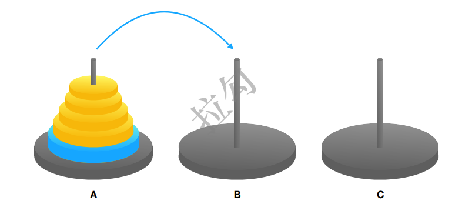
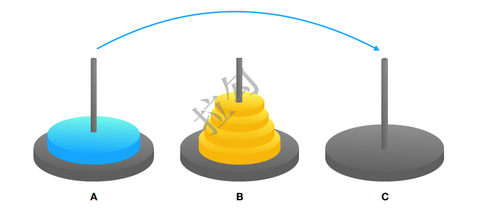

# 分治思想与递归实现

## 算法的两种实现方式
正如数据结构中，所有的数据结构都由数组或链表实现。 <br/>
Note：数据结构的底层存储只有数组和链表两种 <br/>
数组：栈、队列、堆、树、图(邻接矩阵) <br/>
链表：栈、队列、堆、树、图(邻接表) <br/>

在算法中，所有的算法都由迭代或递归实现。 <br/>
迭代：可以实现所有算法，所有的递归都可转换为迭代。动态规划可以看做是通过迭代实现分治思想的别称。 <br/>
递归：分治思想的算法，也就是有子问题的算法，除了动态规划是自底向上通过迭代实现，其他的算法都是自顶向下，都可用递归实现 <br/>
### 递归（自顶向下）
基本性质：直接或间接的调用自身 <br/>
本质：分治思想，将原问题拆分成具有相同性质的子问题 <br/>
优点：可以使一个看似复杂的问题变得简洁和易于理解。 <br/>
缺点：空间复杂度高、有堆栈溢出风险、存在重复计算、过多函数调用会耗时较多等问题。 <br/>
#### 理解递归的正确思维方式
对于递归代码，这种试图想清楚整个递和归过程的做法，实际上是进入了一个思维误区。很多时候，我们理解起来比较吃力，主要原因就是自己给自己制造了这种理解障碍。那正确的思维方式应该是怎样的呢 ？**把要实现的递归函数，看成已经实现好的。假设子问题已经解决的情况下，思考原问题怎么解决。**如一个问题 A 可以分解为若干子问题 B、C、D，你可以假设子问题 B、C、D 已经解决，在此基础上思考如何解决问题 A。而且，你只需要思考问题 A 与子问题 B、C、D 两层之间的关系即可，不需要一层一层往下思考子问题与子子问题，子子问题与子子子问题之间的关系。屏蔽掉递归细节，这样理解起来就简单多了。 <br/>
理解递归思维方式经典案例：汉诺塔 <br/>
```java
void hano(char A, char B, char C, int n) { // 把A上的n个塔，借助B,移到C上 <br/>
    if(n > 0) { <br/>
        hano(A, C, B, n-1); // 把A上的n-1个塔,借助C,移到B上 <br/>
        print(A+"->"+C); // 把A上的1个塔移到C上 <br/>
        hano(B, A, C, n-1); // 把B上的n-1个塔,借助A,移到C上 <br/>
    } <br/>
} <br/>
```
 <br/>
 <br/>
 <br/>
 <br/>

#### 是否可以用递归来解决

1. 可拆分子问题，子问题和原始问题做同样的事 <br/>
2. 存在递归终止条件 <br/>
#### 如何编写递归代码

1. 写出递推公式 <br/>
2. 找到终止条件 <br/>
#### 递归代码隐患问题
##### 堆栈溢出
函数调用会使用栈来保存临时变量。每调用一个函数，都会将临时变量封装为栈帧压入内存栈，等函数执行完成返回时，才出栈。系统栈或者虚拟机栈空间一 般都不大。如果递归求解的数据规模很大，调用层次很深，一直压入栈，就会有堆栈溢出的风险。   <br/>
堆栈溢出解决：限制递归调用的最大深度。超过一定深度后，直接报错。 <br/>
```java
int depth = 0; // 全局变量，表示递归的深度 <br/>
int f(int n) { <br/>
depth++; <br/>
if(depth > 1000) throw exception; // 超过一定深度后，直接报错 <br/>
if(n == 1) return 1; <br/>
return f(n-1) + 1; <br/>
} <br/>
```
##### 重复计算
重复计算经典案例：爬楼梯（这个实际上是斐波那契数列） <br/>
有 n 个台阶，每次你可以跨 1 个台阶或者 2 个台阶，请问走这 n 个台阶有多少种走法？   <br/>
 <br/>
重复计算解决：“备忘录”的解决方式，避免冗余计算（记忆递归） <br/>
```java
class Solution { <br/>
    int[] a = new int[50]; // 备忘录 <br/>
    public int climbStairs(int n) { <br/>
        if(n == 1 || n == 2) { // 递归终止条件 <br/>
            return n; <br/>
        } <br/>
        if(a[n] != 0) return a[n]; // 重复子问题从备忘录里取 <br/>
        a[n] = climbStairs(n-1) + climbStairs(n-2); // 递推公式 <br/>
        return a[n]; <br/>
    } <br/>
} <br/>
```
##### 空间复杂度高
在空间复杂度上，因为递归调用一次就会在内存栈中保存一次现场数据，所以在分析递归代码空间复杂度时，需要额外考虑这部分的开销，比如f(n)=f(n-1)+1的递归代码，空间复杂度并不是 O(1)，而是 O(n)。   <br/>
### 迭代（自底向上）
递归都能转换为迭代，能用递归解的问题（eg.遍历二叉树），一般都有两种解法：递归和迭代 <br/>
## 分治思想（有子问题的算法）
分治法，字面意思是“分而治之”，就是把一个复杂的问题拆分出相同或相似的子问题，所以凡是涉及子问题的算法，姑且都视为分治思想。 <br/>
分治是一种算法思想，递归是一种实现方式 <br/>
递归算法从本质上来说都是分治算法（递归都是分治） <br/>
分治算法不一定使用递归结构，用迭代也可实现，动态规划就是迭代实现的方式（分治不一定用递归实现） <br/>
排序算法中，快排和归并排序是分治算法的体现 <br/>
## 分治思想的两种实现方式
### 递归（自顶向下）
凡是递归能实现的，都是分治思想 <br/>
#### 回溯（递归的一种）
回溯算法是一种试探算法，与暴力搜索最大的区别是：在回溯算法中，是一步步向前试探，对每一步探测的情况评估，再决定是否继续，可避免走弯路。 <br/>
**想采用回溯算法，就必须保证：每次都有多种尝试的可能。** <br/>
**有很多选择**，选择了一种走下去，走完了再回到原来的状态选择第二种走法 <br/>
这种**回到原来的状态选择下一种**的情况就是**回溯** <br/>
发现已经不符合条件，再走下去没有必要，**提前结束**，就是**剪枝**（只有回溯这里才有剪枝） <br/>
回溯算法的特征： <br/>

1. 深度优先搜索：回溯算法一般采用dfs求解 <br/>
2. 终止条件判定：是否不满足条件或达到最优解 <br/>
3. 遍历空间集 <br/>
4. 剪枝：在遍历空间集是，提前将不符合条件的除掉（搜索过程中的优化，避免做无用功导致超时） <br/>
5. 加入元素：表明选择当前空间，然后进行该空间的dfs <br/>
6. 移除元素（回溯）：表明当前空间以dfs完成，需要返回上一轮，重新选择一个空间进行探索 <br/>

回溯应用场景：正则表达式匹配、编译原理中的语法分析。 <br/>
经典算法场景：数独、八皇后、0-1背包、图的着色、旅行商问题、全排列等等。 <br/>
##### 八皇后问题
```java
int[] result = new int[8];// 全局或成员变量, 下标表示行, 值表示 queen 存储在哪一列 <br/>
public void cal8queens(int row) { // 调用方式：cal8queens(0); <br/>
if (row == 8) { // 8 个棋子都放置好了，打印结果 <br/>
    printQueens(result); <br/>
    return; // 8 行棋子都放好了，已经没法再往下递归了，所以就 return <br/>
} <br/>
for (int column = 0; column < 8; ++column) { // 每一行都有 8 中放法 <br/>
    if (isOk(row, column)) { // 有些放法不满足要求 <br/>
        result[row] = column; // 第 row 行的棋子放到了 column 列 <br/>
        cal8queens(row+1); // 考察下一行 <br/>
    } <br/>
} <br/>
} <br/>
private boolean isOk(int row, int column) {// 判断 row 行 column 列放置是否合适 <br/>
    int leftup = column - 1, rightup = column + 1; <br/>
    for (int i = row-1; i >= 0; --i) { // 逐行往上考察每一行 <br/>
        if (result[i] == column) return false; // 第 i 行的 column 列有棋子吗？ <br/>
        if (leftup >= 0) { // 考察左上对角线：第 i 行 leftup 列有棋子吗？ <br/>
            if (result[i] == leftup) return false; <br/>
        } <br/>
        if (rightup < 8) { // 考察右上对角线：第 i 行 rightup 列有棋子吗？ <br/>
            if (result[i] == rightup) return false; <br/>
        } <br/>
        --leftup; ++rightup; <br/>
    } <br/>
    return true; <br/>
} <br/>
private void printQueens(int[] result) { // 打印出一个二维矩阵 <br/>
    for (int row = 0; row < 8; ++row) { <br/>
        for (int column = 0; column < 8; ++column) { <br/>
            if (result[row] == column) System.out.print("Q "); <br/>
            else System.out.print("* "); <br/>
        } <br/>
        System.out.println(); <br/>
    } <br/>
    System.out.println(); <br/>
} <br/>
```
##### 0-1背包
这个问题的经典解法是动态规划，不过还有一种简单但没有那么高效的解法，那就是回溯算法。   <br/>
0-1 背包问题有很多变体，我这里介绍一种比较基础的。我们有一个背包，背包总的承载重 量是 Wkg。现在我们有 n 个物品，每个物品的重量不等，并且不可分割。我们现在期望选 择几件物品，装载到背包中。在不超过背包所能装载重量的前提下，如何让背包中物品的总 重量最大？   <br/>
```java
public int maxW = Integer.MIN_VALUE; // 存储背包中物品总重量的最大值 <br/>
// cw 表示当前已经装进去的物品的重量和；i 表示考察到哪个物品了； <br/>
// w 背包重量；items 表示每个物品的重量；n 表示物品个数 <br/>
// 假设背包可承受重量 100，物品个数 10，物品重量存储在数组 a 中，那可以这样调用函数： <br/>
// f(0, 0, a, 10, 100) <br/>
public void f(int i, int cw, int[] items, int n, int w) { <br/>
    if (cw == w || i == n) { // cw==w 表示装满了 ;i==n 表示已经考察完所有的物品 <br/>
        if (cw > maxW) maxW = cw; <br/>
        return; <br/>
    } <br/>
    f(i+1, cw, items, n, w); <br/>
    if (cw + items[i] <= w) {// 已经超过可以背包承受的重量的时候，就不要再装了 <br/>
        f(i+1,cw + items[i], items, n, w); <br/>
    } <br/>
} <br/>
```
##### 正则表达式
正则表达式里最重要的一种算法思想就是回溯。  <br/>
假设正表达式中只包含“*”和“?”这两种通配符，其中，“*”匹配任意多个（大于等于 0 个）任意字符，“?”匹配零个或者一个任意字符。基于以上背景假设，我们看下，如何用回溯算法，判断一个给定的文本，能否跟给定的正则表达式匹配？    <br/>
我们依次考察正则表达式中的每个字符，当是非通配符时，我们就直接跟文本的字符进行匹 配，如果相同，则继续往下处理；如果不同，则回溯。  <br/>
如果遇到特殊字符的时候，我们就有多种处理方式了，也就是所谓的岔路口，比如“*”有 多种匹配方案，可以匹配任意个文本串中的字符，我们就先随意的选择一种匹配方案，然后 继续考察剩下的字符。如果中途发现无法继续匹配下去了，我们就回到这个岔路口，重新选 择一种匹配方案，然后再继续匹配剩下的字符。   <br/>
```java
public class Pattern { <br/>
    private boolean matched = false; <br/>
    private char[] pattern; // 正则表达式 <br/>
    private int plen; // 正则表达式长度 <br/>
    public Pattern(char[] pattern, int plen) { <br/>
        this.pattern = pattern; <br/>
        this.plen = plen; <br/>
    } <br/>
    public boolean match(char[] text, int tlen) { // 文本串及长度 <br/>
        matched = false; <br/>
        rmatch(0, 0, text, tlen); <br/>
        return matched; <br/>
    } <br/>
    private void rmatch(int ti, int pj, char[] text, int tlen) { <br/>
        if (matched) return; // 如果已经匹配了，就不要继续递归了 <br/>
        if (pj == plen) { // 正则表达式到结尾了 <br/>
            if (ti == tlen) matched = true; // 文本串也到结尾了 <br/>
            return; <br/>
        } <br/>
        if (pattern[pj] == '*') { // * 匹配任意个字符 <br/>
            for (int k = 0; k <= tlen-ti; ++k) { <br/>
                rmatch(ti+k, pj+1, text, tlen); <br/>
            } <br/>
        } else if (pattern[pj] == '?') { // ? 匹配 0 个或者 1 个字符 <br/>
            rmatch(ti, pj+1, text, tlen); <br/>
            rmatch(ti+1, pj+1, text, tlen); <br/>
        } else if (ti < tlen && pattern[pj] == text[ti]) { // 纯字符匹配才行 <br/>
            rmatch(ti+1, pj+1, text, tlen); <br/>
        } <br/>
    } <br/>
} <br/>
```
### 动态规划（自底向上，属于迭代）
迭代实现分治思想，称为动态规划。 <br/>
递归和动态规划是从保存过程信息角度划分的。 <br/>
动态规划可以解决递归时重复子问题反复求解超时的问题。 <br/>
每个动态规划，都能用递归实现，比循环更容易理解。 <br/>
动态规划特征： <br/>

1. 最优子结构：求得每个子问题的全局最优解 <br/>
2. 重叠子问题 <br/>
3. 状态初始化 <br/>
4. 状态转移方程 <br/>

动态规划理论：一个模型三个特征 <br/>
 一个模型：多阶段决策最优解模型（动态规划适合解决的问题的模型） <br/>
三个特征（需要满足才可用动态规划求解）： <br/>

1. 最优子结构：可以通过子问题的最优解，推导出问题的最优解。 <br/>
2. 无后效性： 前面阶段的状态确定之后，不会被后面阶段的决策所改变。   <br/>
3. 重复子问题：可能存在重复子问题。 <br/>

动态规划解题思路 <br/>

1. 状态转移矩阵 <br/>
2. 状态转移方程 <br/>

动态规划是空间换时间的解决思路 <br/>
降低空间消耗：二维转一维数组。如果每层的计算只用到已经计算好的一层数据，那就可以把二维转为一维。用到上一层，从小到大遍历。用到本层，从大到小遍历。 <br/>
#### 贪心（动态规划的一种）
**贪心和动态规划是从全局最优角度划分的： <br/>
能从局部最优推导出全局最优就是贪心，否则就是动态规划。** <br/>
局部最优解 <br/>
性质：只适用于求解可行解，不适用于求最值以及所有解 <br/>
贪心算法中，作出的每步贪心决策都无法改变，因为贪心策略是由上一步的最优解推导下一步的最优解，而上一部之前的最优解则不作保留。 <br/>
贪心算法特征： <br/>

1. 最优子结构：求得每个子问题的局部最优解 <br/>
2. 无后效性：某个状态以后的过程不会影响以前的状态，只与当前状态有关 <br/>
3. 贪心选择性：能从局部最优推导出全局最优 <br/>
