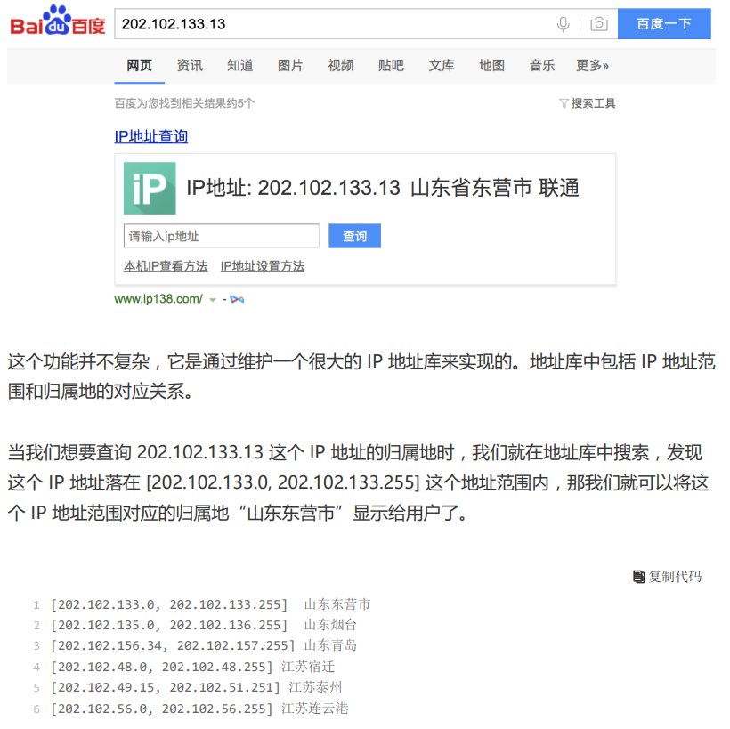

# 二分查找
## 对数列的要求
1. 有序的（排好序的，无序的需要提前排序） <br/>
2. 存在上下界（限定数量或区间范围。否则需要对不定长的边界做处理，来找到明确上下界） <br/>
3. 能够通过索引访问其中的元素（数组适合，链表非常不适合） <br/>
4. 不常变动的，不要求动态增删的情形下查找（否则，应采用AVL树，即自平衡的二叉查找树） <br/>
5. 数据量不能超级大（针对实际应用，要考虑内存限制） <br/>

数据量太大就不适合二分查找了。 <br/>
二分查找的底层需要依赖数组这种数据结构，而数组为了支持随机访问的特性，要求内存空 间连续，对内存的要求比较苛刻。比如，我们有 1GB 大小的数据，如果希望用数组来存 储，那就需要 1GB 的连续内存空间。   <br/>
注意这里的“连续”二字，也就是说，即便有 2GB 的内存空间剩余，但是如果这剩余的 2GB 内存空间都是零散的，没有连续的 1GB 大小的内存空间，那照样无法申请一个 1GB 大小的数组。而我们的二分查找是作用在数组这种数据结构之上的，所以太大的数据用数组 存储就比较吃力了，也就不能用二分查找了。   <br/>
## 复杂度分析
时间复杂度是 O(logN) <br/>
若要求对数组进行动态地删除和插入操作并完成查找，平均复杂度会变为O(N) <br/>
 <br/>
## 不定长的边界的处理
背景 <br/>
 <br/>
处理 <br/>
 <br/>
## while(left <= right)和while(left < right)
在二分搜索算法中，while(left <= right)和while(left < right)两种条件都是有实际应用场景的，它们各自对应不同的二分搜索变体。

while(left <= right):

这种条件通常用在我们需要找到目标值的确切位置时。
循环会继续执行，直到left和right重叠，这意味着我们检查了每一个可能的位置。
如果数组中有目标值，这个条件可以保证找到；如果没有，最终left会停在目标值应该插入的位置。<br/>
while(left < right):

这种条件用在当我们需要找到满足某个条件的最左侧或最右侧的边界时，例如"第一个大于等于目标值的位置"或者"最后一个小于等于目标值的位置"。
这种情况下，循环结束时left和right不会重叠，循环结束后，通常还需要一些额外的判断来确定答案。

## 分类（前提：有序数据集合中不存在重复的数据）
### 整数二分
用i来做边界，不能取到l；用j来做边界，不能取到r。 <br/>
#### 递归实现
优点是简洁 <br/>
缺点是执行消耗大 <br/>
 <br/>
```shell
int binarySearch(int[] nums, int target, int low, int high) { <br/>
		if(low > high) return -1; <br/>
    int middle = low + (high - low) / 2; <br/>
    if(nums[middle] == target) { <br/>
      return middle; <br/>
    } <br/>
    if(target < nums[middle]) { <br/>
      return binarySearch(nums, target, low, middle-1); <br/>
    } else { <br/>
      return binarySearch(nums, target, middle+1, high); <br/>
    }    <br/>
} <br/>
```
#### 迭代实现
```shell
int binarySearch(int[] nums, int target, int low, int high) { <br/>
	while(low <= high) { <br/>
     int middle = low + (high - low) / 2; <br/>
     if(nums[middle] == target) { <br/>
       return middle; <br/>
     } <br/>
     if(target < nums[middle]) { <br/>
       high = middle - 1; <br/>
     } else { <br/>
       low = middle + 1; <br/>
     } <br/>
  } <br/>
  return -1; <br/>
} <br/>
```
### 浮点数二分
如果结果是保留5位小数，那么while(r-l>1e-7)；如果结果是保留6位小数，那么while(r-l>1e-8)；差2位 <br/>
或者直接循环100次 <br/>
## 二分查找变体（前提：有序数据集合中存在重复的数据）
变体的二分查找算法写起来非常烧脑，很容易因为细节处理不好而产生 Bug，这些容易出 错的细节有：终止条件、区间上下界更新方法、返回值选择。   <br/>
### 查找第一个值等于给定值的元素
```java
public int bsearch(int[] a, int n, int value) { <br/>
    int low = 0; <br/>
    int high = n - 1; <br/>
    while (low <= high) { <br/>
        int mid = low + ((high - low) >> 1); <br/>
        if (a[mid] > value) { <br/>
            high = mid - 1; <br/>
        } else if (a[mid] < value) { <br/>
            low = mid + 1; <br/>
        } else { <br/>
            if ((mid == 0) || (a[mid - 1] != value)) return mid; <br/>
            else high = mid - 1; <br/>
        } <br/>
    } <br/>
    return -1; <br/>
} <br/>
```
### 查找最后一个值等于给定值的元素
```java
public int bsearch(int[] a, int n, int value) { <br/>
    int low = 0; <br/>
    int high = n - 1; <br/>
    while (low <= high) { <br/>
        int mid = low + ((high - low) >> 1); <br/>
        if (a[mid] > value) { <br/>
            high = mid - 1; <br/>
        } else if (a[mid] < value) { <br/>
            low = mid + 1; <br/>
        } else { <br/>
            if ((mid == n - 1) || (a[mid + 1] != value)) return mid; <br/>
            else low = mid + 1; <br/>
        } <br/>
    } <br/>
    return -1; <br/>
} <br/>
```
### 查找第一个大于等于给定值的元素
```java
public int bsearch(int[] a, int n, int value) { <br/>
    int low = 0; <br/>
    int high = n - 1; <br/>
    while (low <= high) { <br/>
        int mid = low + ((high - low) >> 1); <br/>
        if (a[mid] >= value) { <br/>
            if ((mid == 0) || (a[mid - 1] < value)) return mid; <br/>
            else high = mid - 1; <br/>
        } else { <br/>
            low = mid + 1; <br/>
        } <br/>
    } <br/>
    return -1; <br/>
} <br/>
```
### 查找最后一个小于等于给定值的元素
```java
public int bsearch7(int[] a, int n, int value) { <br/>
    int low = 0; <br/>
    int high = n - 1; <br/>
    while (low <= high) { <br/>
        int mid = low + ((high - low) >> 1); <br/>
        if (a[mid] > value) { <br/>
            high = mid - 1; <br/>
        } else { <br/>
            if ((mid == n - 1) || (a[mid + 1] > value)) return mid; <br/>
            else low = mid + 1; <br/>
        } <br/>
    } <br/>
    return -1; <br/>
} <br/>
```
#### 应用：如何快速定位出一个 IP 地址的归属地？   
在庞大的地址库中逐一比对 IP 地址所在的区间，是非常耗时的。假设我们有 12 万条这样的 IP 区间与归属地的对应关系，如何快速定位出一个 IP 地址的归属地呢？   <br/>
 <br/>
将起始地址按照对应的整型值的大小关系， 从小到大进行排序。 当我们要查询某个 IP 归属地时，我们可以先通过二分查找，找到最后一个起始 IP 小于等于 这个 IP 的 IP 区间，然后，检查这个 IP 是否在这个 IP 区间内，如果在，我们就取出对应的归属地显示；如果不在，就返回未查找到。 <br/>
