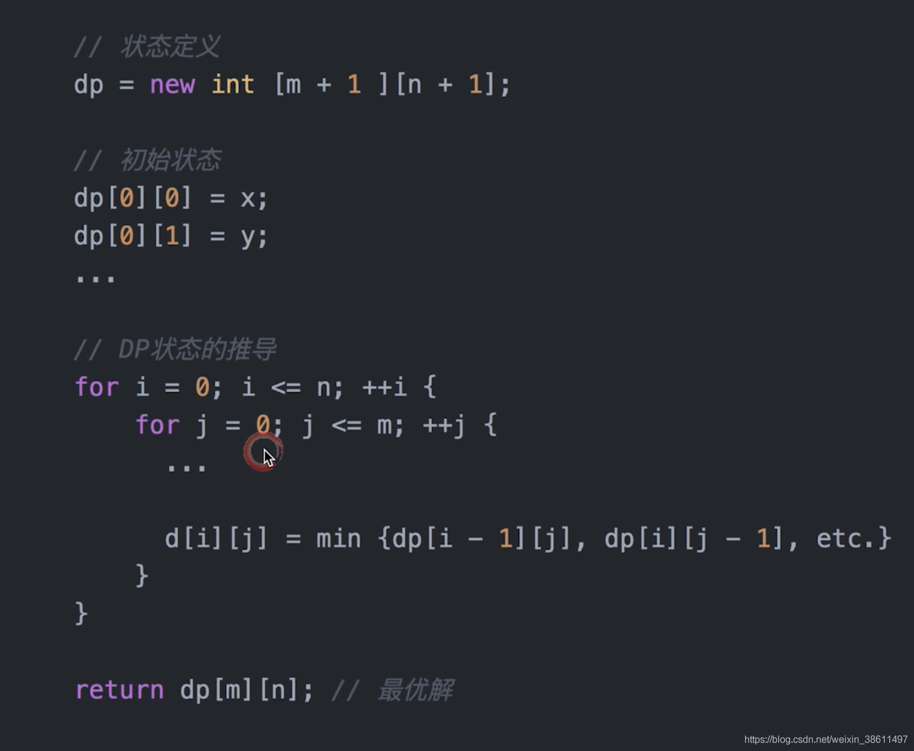
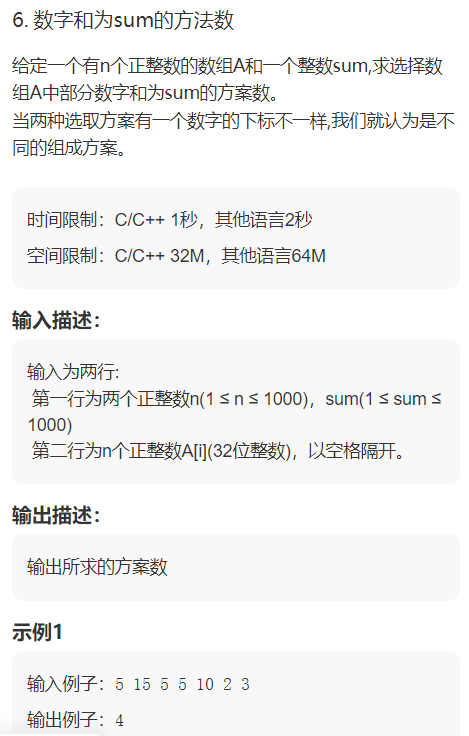

# 动态规划与贪心
动态规划适合用来求解最优问题，比如求最大值、最小值等。 <br/>
## 动态规划基础步骤
 <br/>
1.建立dp数组（确定是一维、二维还是多维，也可后续进行变更。从小往大考虑，1维能不能表示出来，1维不行的话，考虑2维） <br/>
2.根据题意，描述dp数组每一个格的含义 <br/>
3.已知dp[i][j]能推出哪些格，或者通过哪些格能推出dp[i][j]，推导动态转移矩阵 <br/>
4.根据dp[i][j]能推导出的位置，确定往dp数组填入内容的顺序（是从上到下，从左到右，从左下角到右上角，还是从左上角到右下角） <br/>
5.初始化dp数组 <br/>
6.循环填满dp数组 <br/>
7.根据需要从dp数组获取对应信息 <br/>
## 背包DP（约束规划）
01背包问题：每件物品仅有一个，也就是每件物品要么拿，要么不拿，只有两种情况 <br/>
完全背包问题：每件物品有无限个 <br/>
多重背包问题：每件物品个数不一样   <br/>
分组背包问题：从分组的物品中取 <br/>

优化 <br/>
01背包问题优化 <br/>
完全背包问题优化 <br/>
分组背包问题优化 <br/>
这三个问题都可以转为一维dp数组。用上层状态，从大到小枚举；用本层状态，从小到大枚举。因为使用一维数组，上层本层都在同一个地方存储，从大到小枚举，可以确保使用时上层数据不被覆盖。用本层状态时，从小到大枚举，可以确保使用时本层前面的数据已经生成。 <br/>
 
多重背包问题优化： <br/>
经典优化：二进制优化 <br/>
多重背包问题可用二进制方式优化，将s个物品用1,2,4,8，...,2^k个只能拿一个的物品来表示（如果不足，最后补一个数凑齐），这些每个转化为了01背包，可以理解为把物品打包成一组组，看每一组要不要拿，可以等价于拿0-物品个数任意个。将s个物品转为logs个物品，且logs个物品，每个只能拿一次。 <br/>
优化前时间复杂度：O(n·v·s) <br/>
优化后时间复杂度：O(n·v·logs) <br/>
## 线性DP（线性规划）
各个子问题的规模以线性的方式分布 <br/>
子问题的最佳状态或结果可以存储在一维线性的数据结构中，一维数组，哈希表等。 <br/>
基本形式：当前所求的值仅仅依赖于先前计算的值 <br/>

 <br/>
```shell
import java.util.Scanner; <br/>

// 注意类名必须为 Main, 不要有任何 package xxx 信息 <br/>
public class Main { <br/>
    public static void main(String[] args) { <br/>
        Scanner in = new Scanner(System.in); <br/>
        // 注意 hasNext 和 hasNextLine 的区别 <br/>
        while (in.hasNextInt()) { // 注意 while 处理多个 case <br/>
            int n = in.nextInt(); <br/>
            int[] dp = new int[n+1]; <br/>
            dp[0] = 0; <br/>
            int max = Integer.MIN_VALUE; <br/>
            for(int i = 1; i <= n; i++) { <br/>
                int k = in.nextInt(); <br/>
                dp[i] = Math.max(k,dp[i-1]+k); <br/>
                if(dp[i] > max) max = dp[i]; <br/>
            }             <br/>
            System.out.println(max); <br/>
        } <br/>
    } <br/>
} <br/>
```
 <br/>
```java
import java.util.*; <br/>

// 注意类名必须为 Main, 不要有任何 package xxx 信息 <br/>
public class Main { <br/>
    static int[] A; <br/>
    static int n; <br/>
    static int sum; <br/>
    static int count = 0; <br/>
    public static void main(String[] args) { <br/>
        Scanner in = new Scanner(System.in); <br/>
        // 注意 hasNext 和 hasNextLine 的区别 <br/>
        while (in.hasNextInt()) { // 注意 while 处理多个 case <br/>
            n = in.nextInt(); <br/>
            sum = in.nextInt(); <br/>
            A = new int[n]; <br/>
            for(int i = 0; i < n; i++) { <br/>
                A[i] = in.nextInt(); <br/>
            } <br/>
            long[][] dp = new long[1000][1010]; <br/>
            for(int i = 0; i < n; i++) { <br/>
                if(i == 0) { <br/>
                    dp[i][0] = 1; <br/>
                    dp[0][A[0]] = 1; <br/>
                } else { <br/>
                    for(int j = 0; j <= sum; j++) { <br/>
                        if(dp[i-1][j] > 0) { <br/>
                            dp[i][j] += dp[i-1][j]; <br/>
                            if(j+A[i] <= sum) { <br/>
                                dp[i][j+A[i]] += dp[i-1][j]; <br/>
                            }                             <br/>
                        } <br/>
                    } <br/>
                } <br/>
            }  <br/>
            System.out.println(dp[n-1][sum]); <br/>
        } <br/>
    } <br/>
} <br/>
```
## 区间DP（区间规划）
先循环区间长度，再循环区间的左端点 <br/>

区间规划： <br/>
各个子问题的规模由不同区间来定义。 <br/>
子问题的最佳状态或结果可以存储在二维数组中。 <br/>
这类问题的时间复杂度一般为多项式时间，即对一个大小为n的问题，时间复杂度不会超过n的多项式倍数。 <br/>
## DP进阶
### DAG上的DP


### 树形DP


### 状态压缩DP
用一个整数表示整体状态，将多个 不同的状态压缩到一个整数里。整数的二进制表示载有很多信息，每一位的0或1表示一个状态。 <br/>
用二进制表示状态，也就是将状态压缩为2进制数 <br/>
特点：如果n比较小（eg.20），可以考虑用状态压缩 <br/>

### 概率DP


### DP优化

#### 单调队列/单调栈优化


#### 斜率优化


#### 四边形不等式优化


#### 状态设计优化


## Acwing笔记
 <br/>

线性DP：递推顺序有方向的DP，例如背包DP都是一行一行的递推出的。 <br/>

最长公共子序列：状态计算的4种划分有重复，但是不影响，求最大值可以重复，不漏掉就好 <br/>

记忆化搜索：用递归代替循环 <br/>


## CSDN
动态规划（Dynamic programming，简称DP），通过把原问题分解为相对简单的子问题的方式求解复杂问题的方法。常适用于有重叠子问题和最优子结构性质的问题，并且记录所有子问题的结果，因此动态规划方法所耗时间往往远少于朴素解法。 <br/>
动态规划有自定向上和自顶向下两种解决问题的方式。自顶向下即记忆化递归，自底向上就是递推。 <br/>
使用动态规划解决的问题有个明显的特点，一旦一个子问题的求解得到结果，以后的计算过程就不会修改它，这样的特点叫做无后效性。 <br/>
最优子结构 <br/>
最优子结构规定的是子问题与原问题的关系。 <br/>
一个问题的最优解是由它的各个子问题的最优解决定的。将子问题的解进行组合可以得到原问题的解是动态规划可行性的关键。 <br/>
在解题中一般用**状态转移方程**f(n)描述原问题与子问题的组合关系。 <br/>
重复子问题 <br/>
重复子问题规定的是子问题与子问题的关系。 <br/>
动态规划可以保证每个重叠的子问题只会被求解一次。当重复的问题很多的时候，动态规划可以减少很多重复的计算。 <br/>
重复子问题不是保证解的正确性必须的，但是如果递归求解子问题时，没有出现重复子问题，则没有必要用动态规划，直接普通的递归就可以了。 <br/>
记忆化递归法：若能事先确定子问题的范围就可以建表存储子问题的答案。 <br/>
解决动态规划问题的核心：找出子问题及其子问题与原问题的关系 <br/>

## 贪心
贪心算法是一种比较直观的算法，难以证明它的正确性。 <br/>