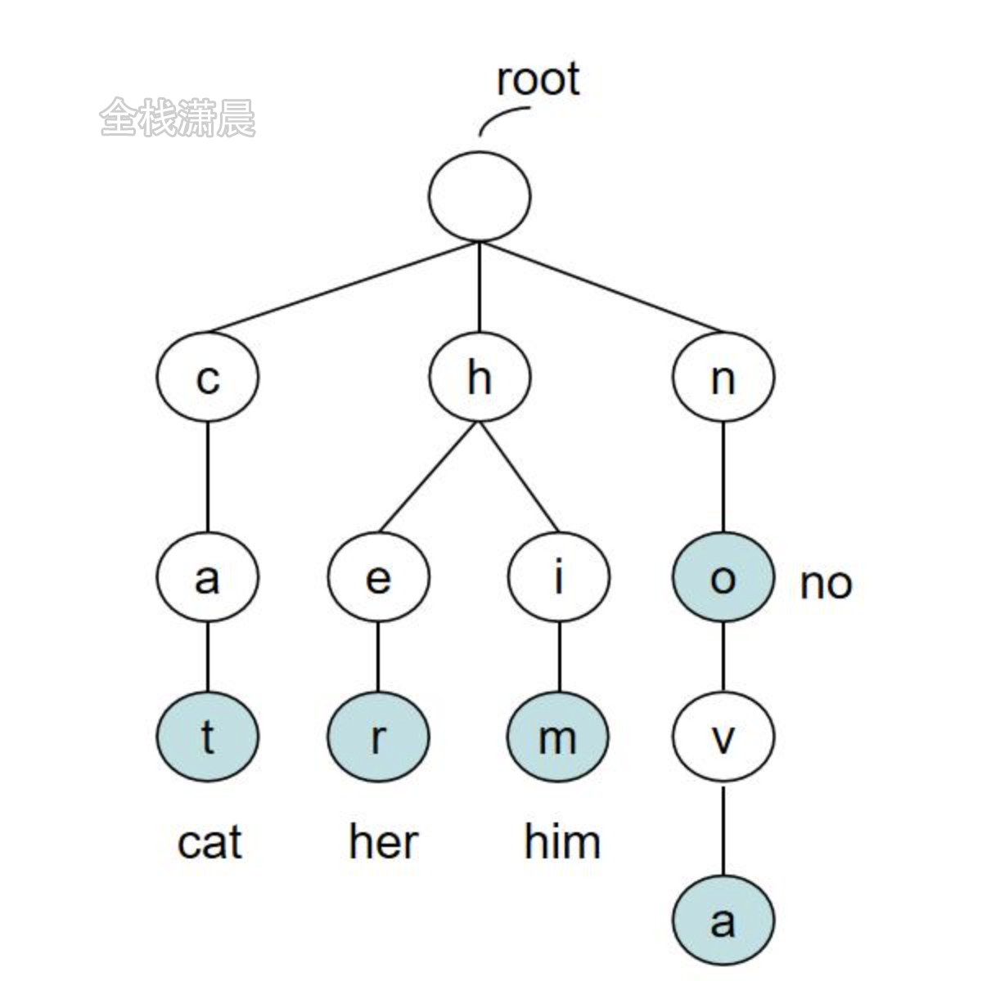
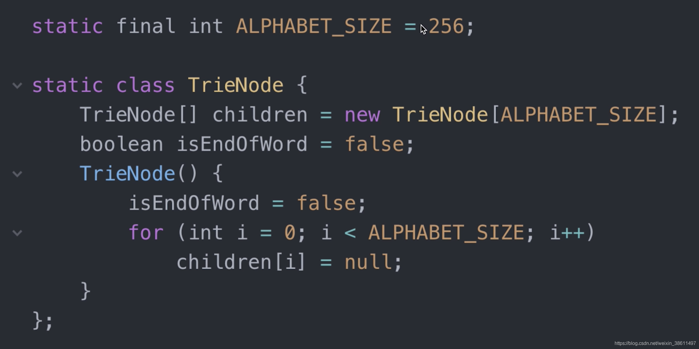
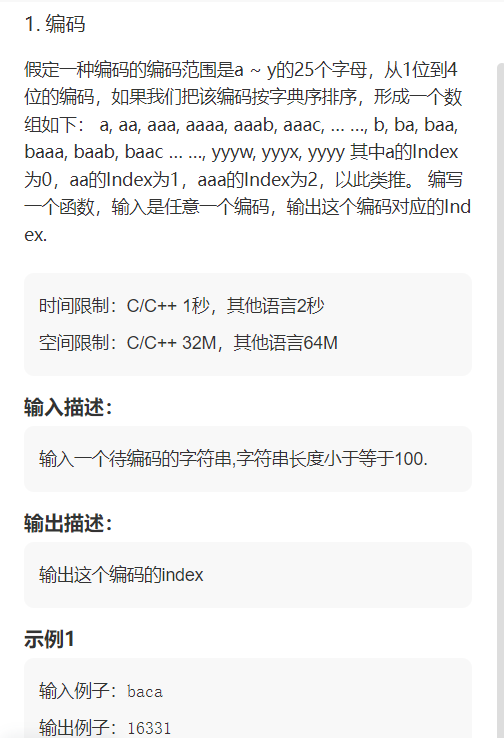

# 字符串
## 哈希
假如要把字符串映射到数组中的某个地方: <br/>
```java
private int hash(String s, int n) { <br/>
    char[] arr = s.toCharArray(); <br/>
    int h = 0; <br/>
    for (int i=0; i<arr.length; ++i) { <br/>
        h = h * 31 + arr[i]; <br/>
    } <br/>
    return Math.abs(h) % n; <br/>
} <br/>
```

字符串前缀哈希法 <br/>
应用：判断字符串截取两段子串是否相等 <br/>

## 字符串匹配算法


### KMP

后缀和前缀相等，长度最大是多少 <br/>
### Boyer-Moore


## 自动机


## AC自动机


## 后缀数组


## [滑动窗口](https://leetcode-cn.com/circle/article/9gcJBk/)
双指针，左右指针区间[left,right]称为一个窗口，左右指针轮流不断向右滑动。 <br/>

例题： <br/>
[力扣-无重复字符的最长字串](https://leetcode-cn.com/problems/longest-substring-without-repeating-characters/) <br/>
Note：无重复：可用set存储滑动窗口内的每个字符实现 <br/>
## 字典树（Trie树，前缀树）
Trie树，又称字典树，单词查找树，键树 <br/>
 <br/>
高效存储和查找字符串集合的数据结构 <br/>
是一种树形结构，是一种哈希树的变种。典型应用是统计和排序大量的字符串（但不仅限于字符串），所以经常被搜索引擎系统用于文本词频统计。 <br/>
 <br/>
经典应用，例如搜索 <br/>
搜索框输入搜索文字，会罗列以搜索词开头的相关搜索 <br/>
 <br/>
核心思想：空间换时间。利用字符串的公共前缀来降低查询时间的开销以达到提高效率的目的。 <br/>
优点：最大限度的减少无谓的字符串比较，查询效率比哈希表高。 <br/>
基本性质： <br/>
１ 根节点是空的，不包含字符，除根节点外每一个节点都只包含一个字符。 <br/>
２ 从根节点到某一节点，路径上经过的字符连接起来，为该节点对应的字符串。 <br/>
３ 每个节点的所有子节点包含的字符都不相同。 <br/>
 4 除根节点外每一个节点都可能是单词的结尾，叶子节点一定都是单词的结尾 <br/>
 5 每个节点至少包含两个基本属性： <br/>
children：数组或者集合，罗列出每个分支当中包含的所有字符 <br/>
isEnd：布尔值，表示该节点是否为某字符串的结尾 <br/>

基本操作：创建&搜索 <br/>
创建步骤： <br/>
1 遍历一遍输入的字符串，对每个字符串的字符进行遍历 <br/>
2 从前缀树的根节点开始，将每个字符加入到节点的children字符集当中 <br/>
3 如果字符集已经包含了这个字符，跳过 <br/>
4 如果当前字符是字符串的最后一个，把当前节点的isEnd标记为真 <br/>
搜索步骤： <br/>
1 从前缀树的根节点出发，逐个匹配输入的前缀字符 <br/>
2 如果遇到了，继续往下一层搜索 <br/>
3 如果没遇到，立即返回 <br/>

代码实现，256指的是ACII码的数量 <br/>
 <br/>
## 后缀树


## 编程题
 <br/>
[编码](https://www.nowcoder.com/exam/test/73467615/detail?pid=5582994&examPageSource=Company&testCallback=https%3A%2F%2Fwww.nowcoder.com%2Fexam%2Fcompany%3FcurrentTab%3Drecommand%26jobId%3D100%26selectStatus%3D0%26tagIds%3D138&testclass=%E8%BD%AF%E4%BB%B6%E5%BC%80%E5%8F%91) <br/>
```java
import java.math.*; <br/>
import java.util.*; <br/>

// 注意类名必须为 Main, 不要有任何 package xxx 信息 <br/>
public class Main { <br/>
    public static void main(String[] args) { <br/>
        Scanner in = new Scanner(System.in); <br/>
        String s = in.nextLine(); <br/>
        int len = s.length(); <br/>
        BigInteger bi = new BigInteger("0"); <br/>
        for(int i = 0; i < 4; i++) { <br/>
            bi = new BigInteger("1").add(bi.multiply(new BigInteger("25"))); <br/>
        } <br/>
        BigInteger sum = new BigInteger("0"); <br/>
        for(int i = 0; i < len; i++) { <br/>
            int k = s.charAt(i) - 'a'; <br/>
            sum = sum.add(bi.multiply(new BigInteger(String.valueOf(k)))); <br/>
            bi = bi.subtract(new BigInteger("1")).divide(new BigInteger("25")); <br/>
        } <br/>
        System.out.println(sum.add(new BigInteger(String.valueOf(len - 1)))); <br/>
    } <br/>
} <br/>
```
