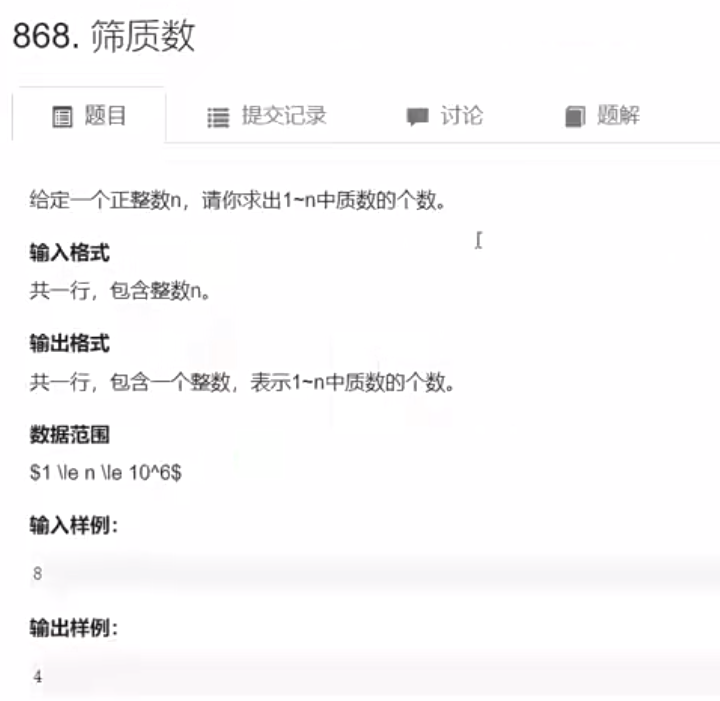
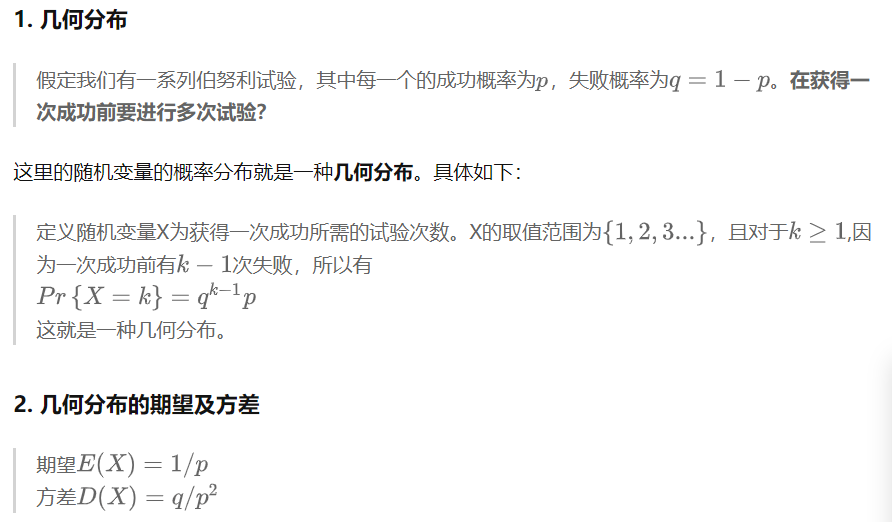

# 数学
## Acwing
[参考笔记](https://zhuanlan.zhihu.com/p/643391309) <br/>
数论：质数、约数、欧拉函数、快速幂、扩展欧几里得算法、中国剩余定理 <br/>
高斯消元 <br/>
组合计数 <br/>
容斥原理 <br/>
简单博弈论 <br/>
 <br/>
### 质数（又称素数）
概念：在大于1的整数中，如果只包含1和本身这两个约数，则称为质数或素数。 <br/>
#### 质数的判定——试除法   时间复杂度：O(sqrt(n))
 <br/>
```java <br/>
boolean isPrime(int n) { <br/>
    if(n < 2) return false; <br/>
    for(int i = 2; i < n; i++) { //这个是小于 <br/>
        if(n % i == 0) return false; <br/>
    } <br/>
    return true; <br/>
} <br/>
```
上述的时间复杂度为O(n)，可以改进为O(sqrt(n)) <br/>
理论：能够整除n的数都是成对出现的，只要判断其中一个除数即可 <br/>
i和n / i是n的两个除数：若i是n的除数，那么n / i也是n的除数 <br/>
```java <br/>
boolean isPrime(int n) { <br/>
    if(n < 2) return false; <br/>
    for(int i = 2; i <= n / i; i++) { // 这个是小于等于 <br/>
        if(n % i == 0) return false; <br/>
    } <br/>
    return true; <br/>
} <br/>
```
```java
// 不要写成i * i这样，数字太大会超范围 <br/>
for(int i = 2; i * i <= n; i++)  <br/>
// 不要写成Math.sqrt(n)这样，每次都需要算一次，耗性能 <br/>
for(int i = 2; i <= Math.sqrt(n); i++)  <br/>
```
#### 分解质因数——试除法   时间复杂度：O(sqrt(n))
概念：分解质因数，就是把一个普通的数拆解为多个质数的乘积 <br/>
Note：质数的判定时间复杂度一定是O(sqrt(n))；分解质因数的时间复杂度最坏是O(sqrt(n))，最好是O(logn)。 <br/>
 <br/>
```java
void divide(int n) { <br/>
    for(int i = 2; i <= n; i++) { <br/>
        if(n % i == 0) {  <br/>
            // 因为把前面质数的全部因子都去掉了，所以之后能进来一定是质数 <br/>
            // 非质数可拆成前面的质数，所以不会有了 <br/>
            int index = 0; <br/>
            while(n % i == 0) { <br/>
                n /= i; <br/>
                index++; <br/>
            } <br/>
            System.out.printf("%d %d\n",i,index); <br/>
        } <br/>
    } <br/>
} <br/>
```
上述的时间复杂度为O(n)，可以改进为O(sqrt(n)) <br/>
理论：n中最多只包含一个大于sqrt(n)的质因子（Note：如果有2个就比n大了） <br/>
```java
void divide(int n) { <br/>
    for(int i = 2; i <= n / i; i++) { <br/>
        if(n % i == 0) { <br/>
            int index = 0; <br/>
            while(n % i == 0) { <br/>
                n /= i; <br/>
                index++; <br/>
            } <br/>
            System.out.printf("%d %d\n",i,index); <br/>
        } <br/>
    } <br/>
    if(n > 1) System.out.printf("%d %d\n",n,1); <br/>
} <br/>
```
#### 筛质数
 <br/>
##### 朴素筛法  
理论：从2往后，依次把2的倍数去掉，把3的、4的、5的...倍数去掉，留下来的数就是质数 <br/>
（Note：如果一个数是其他数的倍数，那它不是质数；如果一个数不是其他数的倍数，那它是质数） <br/>
时间复杂度O(nlogn) <br/>
求时间复杂度理论： <br/>
1/2+1/3+...+1/n 为调和级数，当n趋于∞，等于lnn+C（lnn是以e为底） <br/>
其中C是欧拉常数，等于0.577 <br/>
时间复杂度=n/2+n/3+...+n/n = n(1/2+1/3+...+1/n)=nlnn=nlogn <br/>
```java
void selectps(int n) { <br/>
    boolean[] combine = new boolean[n+1]; <br/>
    int[] primes = new int[n]; <br/>
    int index = 0; <br/>
    long time = 0; <br/>
    for(int i = 2; i <= n; i++) { <br/>
        if(!combine[i]) primes[index++] = i; <br/>
        for(int j = i + i;j <= n;j += i) { <br/>
            time++; <br/>
            combine[j] = true; <br/>
        } <br/>
    } <br/>
    System.out.println(time); <br/>
    System.out.println(index); <br/>
} <br/>
```
##### 埃氏筛法
理论：朴素筛法的优化，只把质数的倍数去掉即可    <br/>
时间复杂度O(nloglogn)，大概时间复杂度为O(n) <br/>
求时间复杂度理论： <br/>
质数定理：1~n中有n/lnn个质数 <br/>
用n/lnn替代朴素筛法的n后，大概时间复杂度=nlnn/lnn=n <br/>
```java
void selectas(int n) { <br/>
    boolean[] combine = new boolean[n+1]; <br/>
    int[] primes = new int[n]; <br/>
    int index = 0; <br/>
    long time = 0; <br/>
    for(int i = 2; i <= n; i++) { <br/>
        if(!combine[i]) { <br/>
            primes[index++] = i; <br/>
            for(int j = i + i;j <= n;j += i) { <br/>
                time++; <br/>
                combine[j] = true; <br/>
            } <br/>
        } <br/>
    } <br/>
    System.out.println(time); <br/>
    System.out.println(index); <br/>
} <br/>
```
##### 线性筛法（实际运用中，大多用此）
理论：合数都被其最小质因子筛掉，因为只有一个最小质因子，所以每个合数只会被筛掉一次，所以她是线性的 <br/>
用 i 枚举2~n中所有数，用 j 从小到大枚举2~n中已知的质数，每次把当前质数与i的乘积筛掉，因为这个乘积一定是合数 <br/>
当前质数与i的关系，有两种情况： <br/>

1. 当i % primes[j] == 0时，表示primes[j]一定是i的最小质因子，同时一定是i * primes[j]的最小质因子，筛除i * primes[j] <br/>
2. 当i % primes[j] != 0时，表示primes[j]一定小于i的最小质因子，也一定是i * primes[j]的最小质因子，也筛除i * primes[j] <br/>
3. 综上，因为i * primes[j]必定是一个合数，所以可以将其筛除 <br/>
4. 当i % primes[j] == 0时，说明primes[j]是i的最小质因子，再往后的primes都不符合了，由于线性筛法只用每个合数的最小质因子筛选，所以break退出筛选 <br/>
```java
void selectxx(int n) { <br/>
    boolean[] combine = new boolean[n+1]; <br/>
    int[] primes = new int[n]; <br/>
    int index = 0; <br/>
    long time = 0; <br/>
    for(int i = 2; i <= n; i++) { <br/>
        if(!combine[i]) primes[index++] = i; <br/>
        for(int j = 0; primes[j] <= n / i; j++) { <br/>
            time++; <br/>
            combine[i*primes[j]] = true; <br/>
            if(i % primes[j] == 0) break; <br/>
        } <br/>
    } <br/>
    System.out.println(time); <br/>
    System.out.println(index); <br/>
} <br/>
```
当n为107时，线性筛法比埃氏筛法快3倍 <br/>
### 约数
#### 试除法求约数    时间复杂度O(sqrt(n))
 <br/>
```java
void getYs(int n) { <br/>
        List<Integer> list = new ArrayList<>(); <br/>
        for(int i = 1; i <= n / i; i++) { <br/>
            if(n % i == 0) { <br/>
                list.add(i); <br/>
                if(i != n/i) list.add(n / i); <br/>
            } <br/>
        } <br/>
        list.sort(null); <br/>
        for(int i = 0; i < list.size(); i++) { <br/>
            if(i != 0) System.out.print(" "); <br/>
            System.out.print(list.get(i)); <br/>
        } <br/>
        System.out.println(); <br/>
    } <br/>
```
#### 约数个数&约数之和
常识：int范围内的数，约数最多的大概有1500个 <br/>
**约数个数和约数之和的求解，可以通过分解质因数的结果套公式获得** <br/>
**约数个数：** <br/>
**每个约数是由多个质因子相乘而得，所以总个数为各个质因子的多种组合数** <br/>
 <br/>
**约数之和：** <br/>
**每个质因子的a+1种选择相加，再与其他质因子相乘，通过结合律，就可获得约数之和** <br/>
 <br/>
 <br/>
Note：分解多个数乘积的质因数==分解每个数的质因数然后加一起 <br/>
```java
import java.util.*; <br/>

public class Hello { <br/>
    static Map<Long,Long> map; <br/>
    public static void main(String[] args) { <br/>
        Scanner in = new Scanner(System.in); <br/>
        int n = in.nextInt(); <br/>
        map = new HashMap(); <br/>
        for(int i = 0; i < n; i++) { <br/>
            primes(in.nextLong()); <br/>
        } <br/>
        long res = 1; <br/>
        for(Long key:map.keySet()){ <br/>
            res = res * (map.get(key) + 1) % (10e9+7); <br/>
        } <br/>
        System.out.println((long)res); <br/>
    } <br/>

    static void primes(long k) { <br/>
        for(long i = 2; i <= k/i; i++) { <br/>
            if(k % i == 0) { <br/>
                long count = 0; <br/>
                while(k % i == 0) { <br/>
                    k /= i; <br/>
                    count++; <br/>
                } <br/>
                if(map.containsKey(i)) { <br/>
                    map.put(i,count+map.get(i)); <br/>
                } else { <br/>
                    map.put(i,count); <br/>
                } <br/>
            } <br/>
        } <br/>
        if(k > 1) { <br/>
            if(map.containsKey(k)) { <br/>
                map.put(k,1+map.get(k)); <br/>
            } else { <br/>
                map.put(k,1L); <br/>
            } <br/>
        } <br/>
    } <br/>
} <br/>
```
 <br/>
```java
import java.util.*; <br/>

public class Hello { <br/>
    static Map<Long,Long> map; <br/>
    public static void main(String[] args) { <br/>
        Scanner in = new Scanner(System.in); <br/>
        int n = in.nextInt(); <br/>
        map = new HashMap(); <br/>
        for(int i = 0; i < n; i++) { <br/>
            primes(in.nextLong()); <br/>
        } <br/>
        long res = 1; <br/>
        for(Long key:map.keySet()){ <br/>
            long sum = 0; <br/>
            for(int i = 0; i <= map.get(key); i++) { <br/>
                sum += Math.pow(key,i); <br/>
            } <br/>
            res *= sum; <br/>
        } <br/>
        System.out.println((long)(res % (10e9+7))); <br/>
    } <br/>

    static void primes(long k) { <br/>
        for(long i = 2; i <= k/i; i++) { <br/>
            if(k % i == 0) { <br/>
                long count = 0; <br/>
                while(k % i == 0) { <br/>
                    k /= i; <br/>
                    count++; <br/>
                } <br/>
                if(map.containsKey(i)) { <br/>
                    map.put(i,count+map.get(i)); <br/>
                } else { <br/>
                    map.put(i,count); <br/>
                } <br/>
            } <br/>
        } <br/>
        if(k > 1) { <br/>
            if(map.containsKey(k)) { <br/>
                map.put(k,1+map.get(k)); <br/>
            } else { <br/>
                map.put(k,1L); <br/>
            } <br/>
        } <br/>
    } <br/>
} <br/>
```
#### 最大公约数&最小公倍数
```shell
举例： <br/>
6 与 8  <br/>
最小公倍数 24 <br/>
最大公约数 2 <br/>
```
欧几里得算法/辗转相除法  <br/>
 <br/>
```java
import java.util.*; <br/>

public class Hello { <br/>

    public static void main(String[] args) { <br/>
        Scanner in = new Scanner(System.in); <br/>
        int n = in.nextInt(); <br/>
        for(int i = 0; i < n; i++) { <br/>
            int a = in.nextInt(); <br/>
            int b = in.nextInt(); <br/>
            System.out.println(gcd(a,b)); <br/>
        } <br/>
    } <br/>

    // 传入时，无须让a>b，a<b也是可以的，第一步就会变过来 <br/>
    static int gcd(int a,int b) { <br/>
        return b != 0 ? gcd(b,a%b):a; <br/>
    } <br/>
} <br/>
```
```shell
//求 最小公倍数 <br/>
public static long lcm(long a, long b) { <br/>
    long c = gcd(a,b); <br/>
    return a / c * b; <br/>
} <br/>
```
## 高精度计算
Note：c++中没有大整数类，需要学大整数。java和python都用不着，Java自带BigInteger,BigDecimal；python默认数为无限大 <br/>
## 分数取模1e9+7（快速幂）
```java
static long m = 1000000007; <br/>
static long mod(long up, long down) { <br/>
    return up * qmi(down,m-2,m) % m; <br/>
}  <br/>
static long qmi(long a, long k, long p) { <br/>
    if(a == 1) return 1; <br/>
    long res = 1; <br/>
    while (k > 0) { <br/>
        if ((k & 1) == 1) res = res * a % p; <br/>
        a = (long)a * a % p; <br/>
        k >>= 1; <br/>
    } <br/>
    return res; <br/>
} <br/>

// 调用 System.out.println(mod(9,2)); <br/>
```
## 快速幂
「快速幂算法」的本质是分治算法。 <br/>
偶数：x^64=x^32 · x^32 ; <br/>
奇数：x^77=x^38 ·_ x^38 · x ;_ <br/>
[力扣题-50. Pow(x, n)](https://leetcode-cn.com/problems/powx-n/) <br/>
由于每次递归都会使得指数减少一半，因此递归的层数为O(logn)，算法可以在很快的时间内得到结果。 <br/>

## n!末尾0的个数
 <br/>
方案一：问题可以转变为求：将n个数都分解质因数后，有多少5 <br/>
能被5（5^1）整除的提供1个0  <br/>
能被25（5^2）整除的提供2个0  <br/>
能被125（5^3）整除的提供3个0  <br/>
能被625（5^4）整除的提供4个0  <br/>
所以 结果= n/5 + n/25 + n/125 + n/625 <br/>
Note：因为n/125提供了3个0，前面n/5和n/25算过其中的2个0了，所以这里直接加1个n/125。其他同理。 <br/>
```shell
import java.util.Scanner; <br/>

// 注意类名必须为 Main, 不要有任何 package xxx 信息 <br/>
public class Main { <br/>
    public static void main(String[] args) { <br/>
        Scanner in = new Scanner(System.in); <br/>
        // 注意 hasNext 和 hasNextLine 的区别 <br/>
        while (in.hasNextInt()) { // 注意 while 处理多个 case <br/>
            int n = in.nextInt(); <br/>
            int res = n/5 + n/25 + n/125 + n/625; <br/>
            System.out.println(res); <br/>
        } <br/>
    } <br/>
} <br/>
```

方案二：用BigInteger来计算出n!的结果，然后统计结尾的0 <br/>
BigInteger不管多大的整型都能放下 <br/>
```shell
import java.util.Scanner; <br/>
import java.math.*; <br/>

// 注意类名必须为 Main, 不要有任何 package xxx 信息 <br/>
public class Main { <br/>
    public static void main(String[] args) { <br/>
        Scanner in = new Scanner(System.in); <br/>
        // 注意 hasNext 和 hasNextLine 的区别 <br/>
        while (in.hasNextInt()) { // 注意 while 处理多个 case <br/>
            int n = in.nextInt(); <br/>
            BigInteger b = new BigInteger("1"); <br/>
            for(int i = n; i >= 2; i--){ <br/>
                b = b.multiply(BigInteger.valueOf(i)); <br/>
            } <br/>
            String s = b.toString(); <br/>
            int index = s.length() - 1; <br/>
            int count = 0; <br/>
            while(s.charAt(index) == '0'){ <br/>
                count++; <br/>
                index--; <br/>
            } <br/>
            System.out.println(count); <br/>
        } <br/>
    } <br/>
} <br/>
```
## 概率
### 几何分布
 <br/>
例题： <br/>
 <br/>
 <br/>
题解：取到ssr的概率是p = i/(n+i)，取到ssr的期望是E=1/p次，那么在取到ssr之前，取了normal=1/p-1次。 <br/>
那么从n个普通和i个ssr中取到一个ssr的期望是normal次普通 * 1金币 + 1次ssr * 2金币。 <br/>
```shell
import java.util.Scanner; <br/>

// 注意类名必须为 Main, 不要有任何 package xxx 信息 <br/>
public class Main { <br/>
    public static void main(String[] args) { <br/>
        Scanner in = new Scanner(System.in); <br/>
        // 注意 hasNext 和 hasNextLine 的区别 <br/>
        while (in.hasNextInt()) { // 注意 while 处理多个 case <br/>
            int n = in.nextInt(); <br/>
            int m = in.nextInt();   <br/>
            double sum = 0;           <br/>
            for(int i = 1; i <= m; i++) { <br/>
                double p = (double)i/(n+i); <br/>
                sum += 1/p + 1; <br/>
            } <br/>
            System.out.printf("%.2f\n",sum); <br/>
        } <br/>
    } <br/>
} <br/>
```
## 等比数列
等比数列求和公式：Sn=a1 (1-q^n)/ (1-q) <br/>


