# 树
## 概念
高度、深度、层 <br/>
 <br/>
 <br/>
## 二叉树
### 二叉树的存储：链表与数组
 顺序存储法： 一般情况下，为了方便计算子节点，根节点会存储在下标为 1 的位置。如果节点 X 存储在数组中下标为 i 的位置，下标为 2 * i 的位置存储的就是左子节点，下标为 2 * i + 1 的位置存储的就是右子节点。反过来，下标为 i/2 的位置存储就是它的父节点。  <br/>
### 完全二叉树   
 满二叉树是完全二叉树的一种特殊情况 <br/>
如果某棵二叉树是一棵完全二叉树，那用数组存储无疑是最节省内存的一种方式。   <br/>
 这也是为什么完全二叉树会单独拎出来的原因，也是为什么完全二叉树要求最后一层的子节点都靠左的原因。   <br/>
 当我们讲到堆和堆排序的时候，你会发现，堆其实就是一种完全二叉树，最常用的存储方式就是数组。   <br/>
### 二叉树的遍历：前序遍历、中序遍历、后序遍历、层次遍历（递归与非递归）
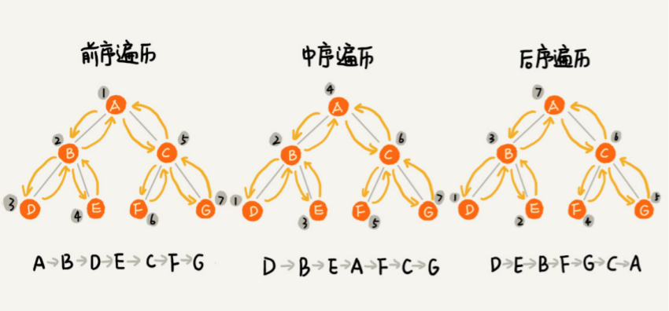 <br/>
 从前、中、后序遍历的顺序图，可以看出来，每个节点最多会被访问两次，所以 遍历操作的时间复杂度，跟节点的个数 n 成正比，也就是说二叉树遍历的时间复杂度是 O(n)。    <br/>
### 二叉查找树（二叉搜索树，二叉排序树）
#### 概念
每一个节点，其左子树中的每个节点的值，都要小于这个节点的值，而右子树节点的值都大于这个节点的值。 <br/>
#### 中序遍历
中序遍历二叉查找树， 可以输出有序的数据序列，时间复杂度是 O(n)，非常高效。 <br/>

#### 不支持重复数据的二叉查找树

二叉查找树的查找：比较根节点，小往左子树搜索，大往右子树搜索 <br/>
二叉查找树的插入：类似查找， 新插入的数据一般都是在叶子节点上 <br/>
二叉查找树的删除：比较复杂，需要分三种情况处理 <br/>
第一种情况是，如果要删除的节点没有子节点，我们只需要直接将父节点中，指向要删除节点的指针置为 null。比如图中的删除节点 55。 <br/>
第二种情况是，如果要删除的节点只有一个子节点（只有左子节点或者右子节点），我们只需要更新父节点中，指向要删除节点的指针，让它指向要删除节点的子节点就可以了。比如图中的删除节点 13。 <br/>
第三种情况是，如果要删除的节点有两个子节点，这就比较复杂了。我们需要找到这个节点 的右子树中的最小节点，把它替换到要删除的节点上。然后再删除掉这个最小节点，因为最小节点肯定没有左子节点（如果有左子结点，那就不是最小节点了），所以，我们可以应用 上面两条规则来删除这个最小节点。   比如图中的删除节点 18。 <br/>
实际上，关于二叉查找树的删除操作，还有个非常简单、取巧的方法，就是单纯将要删除的节点标记为“已删除”，但是并不真正从树中将这个节点去掉。这样原本删除的节点还需要 存储在内存中，比较浪费内存空间，但是删除操作就变得简单了很多。而且，这种处理方法 也并没有增加插入、查找操作代码实现的难度。 <br/>

#### 支持重复数据的二叉查找树


第一种方法比较容易。我们通过链表或支持动态扩容的数组等数据结构，把值相同的数据都存储在同一个节点上。 <br/>
第二种方法比较不好理解，不过更加优雅。每个节点仍然只存储一个数据。在查找插入位置的过程中，如果碰到一个节点的值，与要插 入数据的值相同，我们就将这个要插入的数据放到这个节点的右子树，也就是说，把这个新插入的数据当作大于这个节点的值来处理。 <br/>

#### 散列表与二叉查找树对比


散列表的插入、删除、查找操作的时间复杂度可以做到常量级的 O(1)，非常高效。而二叉查找树在比较平衡的情况下，插入、删除、查找操作时间复杂度 才是 O(logn)，相对散列表，好像并没有什么优势，那我们为什么还要用二叉查找树呢？ <br/>
第一，散列表中的数据是无序存储的，如果要输出有序的数据，需要先进行排序。而对于二 叉查找树来说，我们只需要中序遍历，就可以在 O(n) 的时间复杂度内，输出有序的数据序列。 第二，散列表扩容耗时很多，而且当遇到散列冲突时，性能不稳定，尽管二叉查找树的性能不稳定，但是在工程中，我们最常用的平衡二叉查找树的性能非常稳定，时间复杂度稳定在 O(logn)。 第三，笼统地来说，尽管散列表的查找等操作的时间复杂度是常量级的，但因为哈希冲突的 存在，这个常量不一定比 logn 小，所以实际的查找速度可能不一定比 O(logn) 快。加上哈 希函数的耗时，也不一定就比平衡二叉查找树的效率高。 第四，散列表的构造比二叉查找树要复杂，需要考虑的东西很多。比如散列函数的设计、冲 突解决办法、扩容、缩容等。平衡二叉查找树只需要考虑平衡性这一个问题，而且这个问题 的解决方案比较成熟、固定。最后，为了避免过多的散列冲突，散列表装载因子不能太大，特别是基于开放寻址法解决冲 突的散列表，不然会浪费一定的存储空间。 综合这几点，平衡二叉查找树在某些方面还是优于散列表的，所以，这两者的存在并不冲 突。我们在实际的开发过程中，需要结合具体的需求来选择使用哪一个。 <br/>
### 平衡二叉树
二叉搜索树的退化：退化成一条链表，时间复杂度降至O(N) <br/>
解决方法：使用平衡二叉树，如AVL Tree，红黑树，Splay Tree，KD Tree <br/>
Note：Java和C++标准库中的二叉搜索树都是用红黑树来实现的  <br/>
为了避免时间复杂度的退化，针对二叉查找树，我们又设计了一种更加复杂的树，平衡二叉查找树   ，平衡二叉查找树的高度接近 logn，所以插入、删除、查找操作的时间复杂度也比较稳定，是 O(logn)。    <br/>
 “平衡”的意思可以等价为性能不退化。“近似平衡”就等价为性能不会退化的太严重。   <br/>
#### AVL树(高度平衡的二叉查找树)
概念：二叉树中**任意一个节点**的左右子树的高度相差不能大于 1。 <br/>

**最小失衡子树**：在新插入的结点向上查找，以第一个平衡因子的**绝对值**超过 1 的结点为根的子树称为最小不平衡子树。也就是说，一棵失衡的树，是有可能有多棵子树同时失衡的。而这个时候，我们只要调整最小的不平衡子树，就能够将不平衡的树调整为平衡的树。 <br/>
**平衡二叉树的失衡调整主要是通过旋转最小失衡子树来实现的**。 <br/>
根据旋转的方向有两种处理方式，**左旋** 与 **右旋** 。 <br/>
旋转的目的就是减少高度，通过降低整棵树的高度来平衡。哪边的树高，就把那边的树向上旋转。 <br/>

**最小失衡子树的不平衡的情况**有如下4种情况。 <br/>
情形1：LL（新插入的节点位置，在左子树的左子树上） <br/>
情形2：RL（新插入的节点位置，在右子树的左子树上） <br/>
情形3：LR（新插入的节点位置，在左子树的右子树上） <br/>
情形4：RR（新插入的节点位置，在右子树的右子树上） <br/>
 <br/>

使情况1和4变平衡，**单次旋转**可实现。 <br/>
LL：根节点右旋 <br/>
RR：根节点左旋 <br/>
 <br/>
使情况2和3变平衡，**双次旋转**可实现。 <br/>
LR：左子树左旋，根节点右旋 <br/>
RL：右子树右旋，根节点左旋 <br/>
 <br/>
例题： <br/>
 <br/>
插入30后,30会插在37的左子树上。 <br/>
 <br/>
这时是RL的情形，需要进行两次旋转。 <br/>
右旋：把原左节点当顶点，原顶点当右子树，原左节点的右子树作为原顶点的左子树。 <br/>
左旋：把原右节点当顶点，原顶点当左子树，原右节点的左子树作为原顶点的右子树。 <br/>
本题：将插入20后不再平衡的树，先将53的子树右旋；后将24的子树左旋。 <br/>
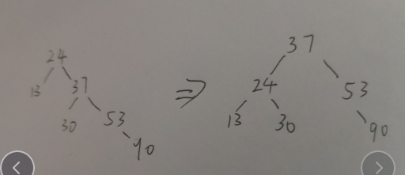 <br/>
#### 红黑树(不严格的平衡二叉查找树)
> Java中，TreeMap就是红黑树的实现 <br/>

它从根节点到各个叶子节点的最长路径，有可能会比最短路径大一倍 <br/>
##### 概念：
1.每个节点都是红色或者黑色    <br/>
2.根节点是黑色  <br/>
3.每个叶节点都是黑色的空节点 <br/>
4.任何相邻的节点都不能同时为红色  <br/>
5.从任意节点到达其可达叶子节点的所有路径，都包含相同数目的黑色节点； <br/>
##### 红黑树是“近似平衡”
“平衡”的意思可以等价为性能不退化。“近似平衡”就等价为性能不会退化的太严重。   <br/>
##### 为什么在工程中大家都喜欢用红黑树这种平衡二叉查找树？  
 AVL 树是一种高度平衡的二叉树，所以查找的效率非常高，但是，有利就有弊，AVL 树为了维持这种高度的平衡，就要付出更多的代价。每次插入、删除都要做调整，就比较复杂、耗时。所以，对于有频繁的插入、删除操作的数据集合，使用 AVL 树的代价就有点高了。 <br/>
红黑树只是做到了近似平衡，并不是严格的平衡，所以在维护平衡的成本上，要比 AVL 树要低。  <br/>
所以，红黑树的插入、删除、查找各种操作性能都比较稳定。对于工程应用来说，要面对各种异常情况，为了支撑这种工业级的应用，我们更倾向于这种性能稳定的平衡二叉查找树。   <br/>
我认为，我们其实不应该把学习的侧重点，放到它的实现上。  我们学习数据结构和算法，要学习它的由来、特性、适用的场景以及它能解决的问题。对于红黑树，也不例外。你如果能搞懂这几个问题，其实就已经足够了。 <br/>
##### 课后思考 
动态数据结构支持动态地数据插入、删除、查找操作，除了红黑树，我们前面还学习过哪些呢？能对比一下各自的优势、劣势，以及应用场景吗？     <br/>
### 哈夫曼树（又称，最优二叉树）
**哈夫曼树是带权路径达到最小的二叉树，也叫最优二叉树。它不一定是完全二叉树，也不一定是平衡二叉树，它们描述的完全不是一件事情，完全没有概念上的重叠关系。** <br/>
#### 哈夫曼编码
 <br/>
解析： <br/>
Step1：构造哈夫曼树（总是取最小的两个数作为两个子树，小的作为左子树，大的作为右子树，两数之和作为父节点，将父节点放进序列里；循环进行n-1次比较大小，直到构造完成） <br/>
特点：所有原序列里的数都在叶子结点位置 <br/>
{2,3,4,6,8,10} <br/>
 <br/>
{4,5,6,8,10} <br/>
 <br/>
{6,8,9,10} <br/>
 <br/>
{9,10,14} <br/>
 <br/>
{14,19} <br/>
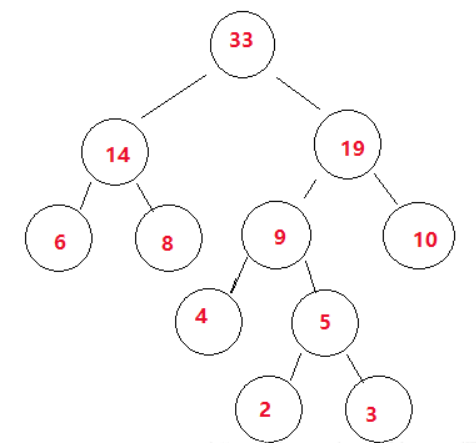 <br/>
Step2：左分支是0，右分支是1，从根节点到叶子节点的路径，即为每个叶子结点的哈夫曼编码 <br/>
 <br/>
 <br/>
#### 应用：压缩字符串
**哈夫曼（Huffman）编码算法**是基于二叉树构建编码压缩结构的，它是数据压缩中经典的一种算法。算法根据文本字符出现的频率，重新对字符进行编码。因为为了缩短编码的长度，我们自然希望频率越高的词，编码越短，这样最终才能最大化压缩存储文本数据的空间。 <br/>
 假设现在我们要对下面这句歌词“we will we will r u”进行压缩。我们可以想象，如果是使用ASCII码对这句话编码结果则为：119 101 32 119 105 108 108 32 119 101 32 119 105 108 108 32 114 32 117（十进制表示）。我们可以看出需要19个字节，也就是至少需要152位的内存空间去存储这些数据。 <br/>
 很显然直接ASCII码编码是很浪费空间的，Unicode就更不用说了，下面我们先来统计一下这句话中每个字符出现的频率。如下表，按频率高低已排序： <br/>

 <br/>
得到以下的哈夫曼二叉树结构，也就是一个带有权重的二叉树： <br/>

 <br/>
有了上面带权重的二叉树之后，我们就可以进行编码了。我们把二叉树分支中左边的支路编码为0，右边分支表示为1，如下图： <br/>

 <br/>

 这样依次遍历这颗二叉树就可以获取得到所有字符的编码了。例如：‘ ’的编码为10，‘l’的编码为00，‘u’的编码为11100等等。**经过这个编码设置之后我们可以发现，出现频率越高的字符越会在上层，这样它的编码越短；出现频率越低的字符越会在下层，编码越短。经过这样的设计，最终整个文本存储空间才会最大化的缩减。** <br/>
 最终我们可以得到下面这张编码表： <br/>

 <br/>
有了上面的编码表之后，”we will we will r u”这句重新进行编码就可以得到很大的压缩，编码表示为：01 110 10 01 1111 00 00 10 01 110 10 01 1111 00 00 10 11101 10 11100。这样最终我们只需50位内存，比原ASCII码表示节约了2/3空间，效果还是很理想的。当然现实中不是简单这样表示的，还需要考虑很多问题。 <br/>
#### 例题
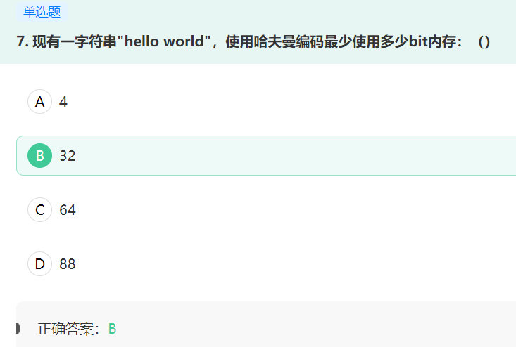 <br/>
## 多叉树
### B树

### B+树

## 树状数组（Fenwick Tree / Binary Indexed Tree）
 <br/>
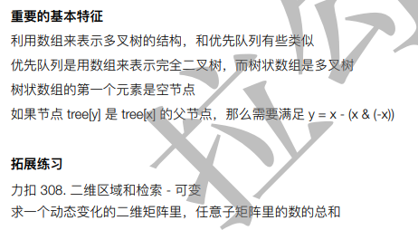 <br/>
## 线段树（Segment Tree）
 <br/>
 <br/>
 <br/>
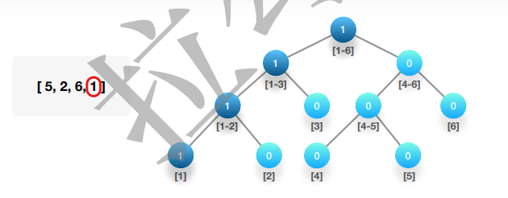 <br/>
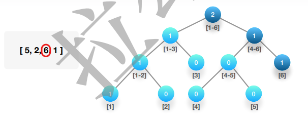 <br/>
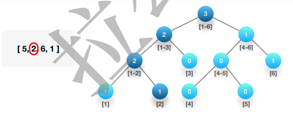 <br/>
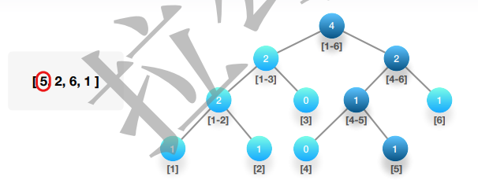 <br/>

## CSDN
一、树的相关概念 <br/>
（一）树的定义 <br/>
树（Tree）是n（n>=0）个结点的有限集。n=0时称为空树。在任意一棵非空树中： <br/>
（1）有且仅有一个特定的称为根（Root）的结点； <br/>
（2）当n>1时，其余结点可分为m（m>0）个互不相交的有限集T1、T2、...、Tm，其中每一个集合本身又是一棵树，并且称为根的子树（SubTree）。 <br/>
注意：子树的个数没有限制，但它们一定是互不相交的。 <br/>
（二）结点 <br/>
**树的结点**：包含一个数据元素及若干指向其子树的分支。 <br/>
**结点的度**：结点拥有的子树。 <br/>
**叶节点（Leaf）或终端结点**：度为0的结点。 <br/>
**非终端结点或分支结点**：度不为0的结点。 <br/>
**内部结点**：除了根节点外的分支结点。 <br/>
**树的度**：树内各结点的度的**最大值**。 <br/>
（三）结点间关系 <br/>
结点的子树的根称为该结点的**孩子**（Child）,相应地，该结点称为孩子的**双亲**（Parent）。 <br/>
同一个双亲的孩子之间互称**兄弟**（Sibling）。结点的**祖先**是从根到该结点所经分支上的所有结点。反之，以某结点为根的子树中的任一结点都称为该结点的**子孙**。 <br/>
 <br/>
（四）层次 <br/>
**结点的层次**（Level）从根开始定义起，根为第一层，根的孩子为第二层。 <br/>
**树的深度（Depth）或高度**：树中结点的最大层次。 <br/>
 <br/>
如果将树中结点的各子树看成从左至右是有次序的，不能互换的，则称该树为**有序树**，否则称为**无序树**。 <br/>
**森林**（Forest）是m（m>0）棵互不相交的**树的集合**。对树中每个结点而言，其子树的集合即为森林。 <br/>

二、线性表与树的结构的区别 <br/>
 <br/>
四、树的存储结构 <br/>
充分利用顺序存储和链式存储结构的特点，完全可以实现对树的存储结构的表示。这里介绍三种不同的表示法：双亲表示法、孩子表示法、孩子兄弟表示法。 <br/>
（一）双亲表示法 <br/>

```c <br/>
/*树的双亲表示法结点结构定义*/ <br/>
#define MAX_TREE_SIZE 100
typedef int TElemType;/*树结点的数据类型，目前暂定为整型*/ <br/>
typedef struct PTNode{/*结点结构*/ <br/>
	TElemType data;/*结点数据*/ <br/>
	int parent;/*双亲位置*/  <br/>
} PTNode; <br/>
typedef struct{/*树结构*/ <br/>
	PTNode nodes[MAX_TREE_SIZE];/*结点数组*/  <br/>
	int r,n; /*根的位置和结点树*/ <br/>
}PTree; <br/>
```

由于根结点没有双亲，所以我们约定根结点的位置域设置为-1。 <br/>
如下图的树结构和下表的树双亲表示。 <br/>
 <br/>
 <br/>
我们也可增加一个结点最左边孩子的域，不妨叫它长子域，这样就可以很容易得到结点的孩子。如果没有孩子的结点，这个长子域就设置为-1。 <br/>
 <br/>
我们也可以增加一个右兄弟来体现兄弟关系，每一个结点如果它存在右兄弟，则记录下右兄弟的下标。 <br/>
 <br/>
我们又关注结点的双亲、又关注结点的孩子、还关注结点的兄弟，而且对时间遍历要求还比较高，那么我们还可以把此结构扩展为有双亲域、长子域、右兄弟域。存储结构的设计是一个非常灵活的过程，一个存储结构设计得是否合理，取决于基于该存储结构的运算是否适合、是否方便，时间复杂度好不好等。注意也不是越多越好，有需要时再设计相应的结构。 <br/>
（二）孩子表示法 <br/>
我们为了遍历整棵树，把每个结点放到一个顺序存储结构的数组中，但每个结点的孩子有多少是不确定的，所以我们再对每个结点的孩子建立一个单链表体现它们的关系。这就是我们要讲的孩子表示法。把每个结点的孩子结点排列起来，以单链表作存储结构，则n个结点有n个孩子链表，如果是叶子结点则此单链表为空。然后n个头指针又组成一个线性表，采用顺序存储结构，存放进一个一维数组中。 <br/>
 <br/>
为此设计两种结点结构，一个是孩子链表的孩子结点，如下图： <br/>
 <br/>
其中child是数据域，用来存储某个结点在表头数组中的下标。next是指针域，用来存储指向某结点的下一个孩子结点的指针。 <br/>

另一个是表头数组的表头结点，如下图： <br/>
 <br/>
其中data是数据域，存储某结点的数据信息。firstchild是头指针，存储该结点的孩子链表的头指针。 <br/>

```c <br/>
/*树的孩子表示法结构定义*/ <br/>
#define MAX_TREE_SIZE 100
typedef struct CTNode{/*孩子结点*/ <br/>
	int child; <br/>
	struct CTNode *next; <br/>
} *ChildPtr; <br/>
typedef struct{/*表头结点*/ <br/>
	TElemType data; <br/>
	ChildPtr firstchild; <br/>
} CTBox; <br/>
typedef struct{/*树结构*/ <br/>
	CTBox nodes[MAX_TREE_SIZE];/*结点数组*/  <br/>
	int r,n; /*根的位置和结点树*/ <br/>
}CTree; <br/>
```

这样的结构对于我们要查找某个结点的某个孩子，或者找某个结点的兄弟，只需要查找这个结点的孩子单链表即可。对于遍历整棵树也是很方便的，对头结点的数组循环即可。 <br/>
但是这也存在着问题，我如何知道某个结点的双亲是谁呢？比较麻烦，需要整棵树遍历才行。 <br/>
我们把双亲表示法和孩子表示法综合一下，称为双亲孩子表示法，如下： <br/>
 <br/>
（三）孩子兄弟表示法 <br/>
设置两个指针，分别指向该结点的第一个孩子和此结点的右兄弟。 <br/>
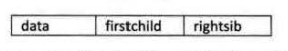 <br/>
其中data是数据域，firstchild为指针域，存储该结点的第一个孩子结点的存储地址，rightsib是指针域，存储该结点的右兄弟结点的存储地址。 <br/>

```c
/*树的孩子兄弟表示法结构定义*/ <br/>
typedef struct CSNode{ <br/>
	TElemType data; <br/>
	struct CSNode *firstchild,*rightsib; <br/>
}CSNode,*CSTree; <br/>
```

这种方法实现的示意图如下： <br/>
 <br/>

这种表示法，给查找某个结点的某个孩子带来了方便，只需要通过firstchild找到此结点的长子，然后再通过长子结点的rightsib找到它的二弟，接着一直下去直到找到具体的孩子。当然，如果想找某个结点的双亲，这个表示法也是有缺陷的。 <br/>
其实这个表示法的最大好处是它把一棵复杂的树变成了一棵二叉树，这样就可以充分利用二叉树的特性和算法来处理这棵树了。变形如下图： <br/>
 <br/>
五、二叉树 <br/>
（一）二叉树的定义 <br/>
对于在某个阶段都是两种结果的情形，比如开和关、0和1、真和假、上和下、对与错、正面与反面等，都适合用树状结构来建模，而这种树是一种很特殊的树状结构，叫做二叉树。 <br/>
**二叉树**（Binary Tree）是 n（n>=0）个结点的有限集合，该集合或者为空集（称为空二叉树），或者由一个根结点和两棵互不相交的、分别称为根结点的左子树和右子树的二叉树组成。 <br/>
（二）二叉树的特点 <br/>
每个结点最多有两棵子树，所以二叉树中不存在度大于2的结点。 <br/>
左子树和右子树是有顺序的，次序不能任意颠倒。 <br/>
即使树中某结点只有一棵子树，也要区分它是左子树还是右子树。如下图，树1和树2是同一棵树，但它们却是不同的二叉树。 <br/>
 <br/>
（三）二叉树具有五种基本形态： <br/>
1.空二叉树。 <br/>
2.只有一个根结点。 <br/>
3.根结点只有左子树。 <br/>
4.根结点只有右子树。 <br/>
5.根结点既有左子树又有右子树。 <br/>
（四）特殊二叉树 <br/>
1）斜树 <br/>
所有的结点都只有左子树的二叉树叫做左斜树。所有的结点都是只有右子树的二叉树叫右斜树。这两者统称为斜树。 <br/>
斜树有很明显的特点，就是每一层都只有一个结点，结点的个数与二叉树的深度相同。 <br/>
这与线性表结构一样，其实线性表结构就可以理解为是树的一种极其特殊的表现形式。 <br/>

2）满二叉树 <br/>
在一棵二叉树中，如果所有分支结点都存在左子树和右子树，并且所有叶子都在同一层上，这样的二叉树称为满二叉树。 <br/>
 <br/>
单是每个结点都存在左右子树，不能算是满二叉树，还必须要所有的叶子都在同一层上，这就做到了整棵树的平衡。因此，满二叉树的特点有： <br/>
1.叶子只能出现在最下一层。出现在其他层就不可能达成平衡。 <br/>
2.非叶子结点的度一定是2。 <br/>
3.在同样深度的二叉树中，满二叉树的结点个数最多，叶子数最多。 <br/>

3）完全二叉树 <br/>
对一棵具有n个结点的二叉树按层序编号，如果编号为i（1<=i<=n）的结点与同样深度的满二叉树中编号为i的结点在二叉树中位置完全相同，则这棵二叉树称为完全二叉树。 <br/>
首先从字面上要区分，“完全”和“满”的差异，满二叉树一定是一棵完全二叉树，但完全二叉树不一定是满的。 <br/>
完全二叉树的特点： <br/>
1.叶子结点只能出现在最下两层。 <br/>
2.最下层的叶子一定集中在左部连续位置。 <br/>
3.倒数二层，若有叶子结点，一定都在右部连续位置。 <br/>
4.如果结点度为1，则该结点只有左孩子，即不存在只有右子树的情况。 <br/>
5.同样结点树的二叉树，完全二叉树的深度最小。 <br/>
（五）二叉树的性质 <br/>
（1）性质一：在二叉树的第i层上至多有2i-1个结点（i>=1）。 <br/>
（2）性质二：深度为k的二叉树至多有2k-1个结点（k>=1）。 <br/>
（3）性质三：对任何一棵二叉树T，如果其终端结点数（叶子结点数）为n0，度为2的结点数为n2，则**n0=n2+1**。 <br/>
设n1为度是1的结点数，则数T结点总数**n=n0+n1+n2**。 <br/>
连接线数(分支线总数)=n-1=n1+2n2。 <br/>
把结点和上面的连接线看成一个火柴棒，由于只有根结点只有火柴头没有火柴棒，所以总分支线总数为结点总数减去1，即为连接线数(分支线总数)=n-1。 <br/>
一、树的相关概念 <br/>
（一）树的定义 <br/>
树（Tree）是n（n>=0）个结点的有限集。n=0时称为空树。在任意一棵非空树中： <br/>
（1）有且仅有一个特定的称为根（Root）的结点； <br/>
（2）当n>1时，其余结点可分为m（m>0）个互不相交的有限集T1、T2、...、Tm，其中每一个集合本身又是一棵树，并且称为根的子树（SubTree）。 <br/>
注意：子树的个数没有限制，但它们一定是互不相交的。 <br/>
（二）结点 <br/>
**树的结点**：包含一个数据元素及若干指向其子树的分支。 <br/>
**结点的度**：结点拥有的子树。 <br/>
**叶节点（Leaf）或终端结点**：度为0的结点。 <br/>
**非终端结点或分支结点**：度不为0的结点。 <br/>
**内部结点**：除了根节点外的分支结点。 <br/>
**树的度**：树内各结点的度的**最大值**。 <br/>
（三）结点间关系 <br/>
结点的子树的根称为该结点的**孩子**（Child）,相应地，该结点称为孩子的**双亲**（Parent）。 <br/>
同一个双亲的孩子之间互称**兄弟**（Sibling）。结点的**祖先**是从根到该结点所经分支上的所有结点。反之，以某结点为根的子树中的任一结点都称为该结点的**子孙**。 <br/>
 <br/>
（四）层次 <br/>
**结点的层次**（Level）从根开始定义起，根为第一层，根的孩子为第二层。 <br/>
**树的深度（Depth）或高度**：树中结点的最大层次。 <br/>
 <br/>
如果将树中结点的各子树看成从左至右是有次序的，不能互换的，则称该树为**有序树**，否则称为**无序树**。 <br/>
**森林**（Forest）是m（m>0）棵互不相交的**树的集合**。对树中每个结点而言，其子树的集合即为森林。 <br/>

二、线性表与树的结构的区别 <br/>
 <br/>

四、树的存储结构 <br/>
充分利用顺序存储和链式存储结构的特点，完全可以实现对树的存储结构的表示。这里介绍三种不同的表示法：双亲表示法、孩子表示法、孩子兄弟表示法。 <br/>
（一）双亲表示法 <br/>

```c
/*树的双亲表示法结点结构定义*/ <br/>
#define MAX_TREE_SIZE 100
typedef int TElemType;/*树结点的数据类型，目前暂定为整型*/ <br/>
typedef struct PTNode{/*结点结构*/ <br/>
	TElemType data;/*结点数据*/ <br/>
	int parent;/*双亲位置*/  <br/>
} PTNode; <br/>
typedef struct{/*树结构*/ <br/>
	PTNode nodes[MAX_TREE_SIZE];/*结点数组*/  <br/>
	int r,n; /*根的位置和结点树*/ <br/>
}PTree; <br/>
```

由于根结点没有双亲，所以我们约定根结点的位置域设置为-1。 <br/>
如下图的树结构和下表的树双亲表示。 <br/>
 <br/>
 <br/>
我们也可增加一个结点最左边孩子的域，不妨叫它长子域，这样就可以很容易得到结点的孩子。如果没有孩子的结点，这个长子域就设置为-1。 <br/>
 <br/>
我们也可以增加一个右兄弟来体现兄弟关系，每一个结点如果它存在右兄弟，则记录下右兄弟的下标。 <br/>
 <br/>
我们又关注结点的双亲、又关注结点的孩子、还关注结点的兄弟，而且对时间遍历要求还比较高，那么我们还可以把此结构扩展为有双亲域、长子域、右兄弟域。存储结构的设计是一个非常灵活的过程，一个存储结构设计得是否合理，取决于基于该存储结构的运算是否适合、是否方便，时间复杂度好不好等。注意也不是越多越好，有需要时再设计相应的结构。 <br/>
（二）孩子表示法 <br/>
我们为了遍历整棵树，把每个结点放到一个顺序存储结构的数组中，但每个结点的孩子有多少是不确定的，所以我们再对每个结点的孩子建立一个单链表体现它们的关系。这就是我们要讲的孩子表示法。把每个结点的孩子结点排列起来，以单链表作存储结构，则n个结点有n个孩子链表，如果是叶子结点则此单链表为空。然后n个头指针又组成一个线性表，采用顺序存储结构，存放进一个一维数组中。 <br/>
 <br/>
为此设计两种结点结构，一个是孩子链表的孩子结点，如下图： <br/>
 <br/>
其中child是数据域，用来存储某个结点在表头数组中的下标。next是指针域，用来存储指向某结点的下一个孩子结点的指针。 <br/>

另一个是表头数组的表头结点，如下图： <br/>
 <br/>
其中data是数据域，存储某结点的数据信息。firstchild是头指针，存储该结点的孩子链表的头指针。 <br/>

```c
/*树的孩子表示法结构定义*/ <br/>
#define MAX_TREE_SIZE 100
typedef struct CTNode{/*孩子结点*/ <br/>
	int child; <br/>
	struct CTNode *next; <br/>
} *ChildPtr; <br/>
typedef struct{/*表头结点*/ <br/>
	TElemType data; <br/>
	ChildPtr firstchild; <br/>
} CTBox; <br/>
typedef struct{/*树结构*/ <br/>
	CTBox nodes[MAX_TREE_SIZE];/*结点数组*/  <br/>
	int r,n; /*根的位置和结点树*/ <br/>
}CTree; <br/>
``` 

这样的结构对于我们要查找某个结点的某个孩子，或者找某个结点的兄弟，只需要查找这个结点的孩子单链表即可。对于遍历整棵树也是很方便的，对头结点的数组循环即可。 <br/>
但是这也存在着问题，我如何知道某个结点的双亲是谁呢？比较麻烦，需要整棵树遍历才行。 <br/>
我们把双亲表示法和孩子表示法综合一下，称为双亲孩子表示法，如下： <br/>
 <br/>
（三）孩子兄弟表示法 <br/>
设置两个指针，分别指向该结点的第一个孩子和此结点的右兄弟。 <br/>
 <br/>
其中data是数据域，firstchild为指针域，存储该结点的第一个孩子结点的存储地址，rightsib是指针域，存储该结点的右兄弟结点的存储地址。 <br/>

```c
/*树的孩子兄弟表示法结构定义*/ <br/>
typedef struct CSNode{ <br/>
	TElemType data; <br/>
	struct CSNode *firstchild,*rightsib; <br/>
}CSNode,*CSTree; <br/>
```

这种方法实现的示意图如下： <br/>
 <br/>

这种表示法，给查找某个结点的某个孩子带来了方便，只需要通过firstchild找到此结点的长子，然后再通过长子结点的rightsib找到它的二弟，接着一直下去直到找到具体的孩子。当然，如果想找某个结点的双亲，这个表示法也是有缺陷的。 <br/>
其实这个表示法的最大好处是它把一棵复杂的树变成了一棵二叉树，这样就可以充分利用二叉树的特性和算法来处理这棵树了。变形如下图： <br/>
 <br/>
五、二叉树 <br/>
（一）二叉树的定义 <br/>
对于在某个阶段都是两种结果的情形，比如开和关、0和1、真和假、上和下、对与错、正面与反面等，都适合用树状结构来建模，而这种树是一种很特殊的树状结构，叫做二叉树。 <br/>
**二叉树**（Binary Tree）是 n（n>=0）个结点的有限集合，该集合或者为空集（称为空二叉树），或者由一个根结点和两棵互不相交的、分别称为根结点的左子树和右子树的二叉树组成。 <br/>
（二）二叉树的特点 <br/>
每个结点最多有两棵子树，所以二叉树中不存在度大于2的结点。 <br/>
左子树和右子树是有顺序的，次序不能任意颠倒。 <br/>
即使树中某结点只有一棵子树，也要区分它是左子树还是右子树。如下图，树1和树2是同一棵树，但它们却是不同的二叉树。 <br/>
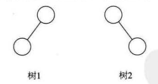 <br/>
（三）二叉树具有五种基本形态： <br/>
1.空二叉树。 <br/>
2.只有一个根结点。 <br/>
3.根结点只有左子树。 <br/>
4.根结点只有右子树。 <br/>
5.根结点既有左子树又有右子树。 <br/>
（四）特殊二叉树 <br/>
1）斜树 <br/>
所有的结点都只有左子树的二叉树叫做左斜树。所有的结点都是只有右子树的二叉树叫右斜树。这两者统称为斜树。 <br/>
斜树有很明显的特点，就是每一层都只有一个结点，结点的个数与二叉树的深度相同。 <br/>
这与线性表结构一样，其实线性表结构就可以理解为是树的一种极其特殊的表现形式。 <br/>

2）满二叉树 <br/>
在一棵二叉树中，如果所有分支结点都存在左子树和右子树，并且所有叶子都在同一层上，这样的二叉树称为满二叉树。 <br/>
 <br/>
单是每个结点都存在左右子树，不能算是满二叉树，还必须要所有的叶子都在同一层上，这就做到了整棵树的平衡。因此，满二叉树的特点有： <br/>
1.叶子只能出现在最下一层。出现在其他层就不可能达成平衡。 <br/>
2.非叶子结点的度一定是2。 <br/>
3.在同样深度的二叉树中，满二叉树的结点个数最多，叶子数最多。 <br/>

3）完全二叉树 <br/>
对一棵具有n个结点的二叉树按层序编号，如果编号为i（1<=i<=n）的结点与同样深度的满二叉树中编号为i的结点在二叉树中位置完全相同，则这棵二叉树称为完全二叉树。 <br/>
首先从字面上要区分，“完全”和“满”的差异，满二叉树一定是一棵完全二叉树，但完全二叉树不一定是满的。 <br/>
完全二叉树的特点： <br/>
1.叶子结点只能出现在最下两层。 <br/>
2.最下层的叶子一定集中在左部连续位置。 <br/>
3.倒数二层，若有叶子结点，一定都在右部连续位置。 <br/>
4.如果结点度为1，则该结点只有左孩子，即不存在只有右子树的情况。 <br/>
5.同样结点树的二叉树，完全二叉树的深度最小。 <br/>
（五）二叉树的性质 <br/>
（1）性质一：在二叉树的第i层上至多有2i-1个结点（i>=1）。 <br/>
（2）性质二：深度为k的二叉树至多有2k-1个结点（k>=1）。 <br/>
（3）性质三：对任何一棵二叉树T，如果其终端结点数（叶子结点数）为n0，度为2的结点数为n2，则**n0=n2+1**。 <br/>

设n1为度是1的结点数，则数T结点总数**n=n0+n1+n2**。 <br/>
**连接线数(分支线总数)=n-1=n1+2n2**。 <br/>
把结点和上面的连接线看成一个火柴棒，由于只有根结点只有火柴头没有火柴棒，所以总分支线总数为结点总数减去1，即为连接线数(分支线总数)=n-1。 <br/>
 <br/>
上图有9个分支，对于A、B、C、D结点来说，它们都有两个分支线出去，而E结点只有一个分支线出去，所以有，连接线数(分支线总数)=n1+2n2。 <br/>
把 <br/>
**n - 1 = n0 + n1 + n2 - 1 = n1 + 2n2 <br/>
推导出n0=n2+1** <br/>
（4）性质四：具有n个结点的完全二叉树的深度为 <br/>
 <br/>
 <br/>
（5）性质五： <br/>
 <br/>
（六）二叉树的存储结构 <br/>
（1）顺序存储结构 <br/>
前面我们已谈到树的存储结构，并且谈到顺序存储对树这种一对多的关系结构实现起来是比较困难的。但是二叉树是一种特殊的树，由于它的特殊性，使得用顺序存储结构也可以实现。 <br/>
二叉树的顺序存储结构就是用一维数组存储二叉树中的结点，并且结点的存储位置，也就是数组的下标要能体现结点之间的逻辑关系，比如双亲与孩子的关系，左右兄弟的关系等。 <br/>
顺序存储结构一般只用于完全二叉树。当然对于一般的二叉树，也可以将其按完全二叉树编号，只不过，把不存在的结点设置为“^”而已，但会出现存储空间的浪费。 <br/>
（2）二叉链表 <br/>
二叉树每个结点最多有两个孩子，所以为它设计一个数据域和两个指针域，我们称这样的链表叫做二叉链表。 <br/>
 <br/>

```c
/*二叉树的二叉链表结点结构定义*/  <br/>
typedef struct BiTNode{	/*结点结构*/ <br/>
	TELemType data;	/*结点数据*/  <br/>
	struct BiTNode *lchild,*rchild;/*左右孩子指针*/  <br/>
}BiTNode,*BiTree; <br/>
```

 <br/>
（七）遍历二叉树 <br/>
二叉树的遍历是指从根结点出发，按照某种次序依次访问二叉树中所有结点，使得每个结点被访问一次且仅被访问一次。 <br/>
（1）前序遍历（根左右） <br/>

```c
/*二叉树的前序遍历递归算法*/ <br/>
void PreOrderTraverse(BiTree T){ <br/>
	if(T == NULL){ <br/>
		return; <br/>
	} <br/>
	printf("%c",T->data);/*显示结点数据，可以更改为其他对结点的操作*/ <br/>
	PreOrderTraverse(T->lchild);/*再先序遍历左子树*/  <br/>
	PreOrderTraverse(T->rchild);/*最后先序遍历右子树*/  <br/>
} <br/>
```

 <br/>
（2）中序遍历（左根右） <br/>

```c
/*二叉树的中序遍历递归算法*/ <br/>
void InOrderTraverse(BiTree T){ <br/>
	if(T == NULL){ <br/>
		return; <br/>
	} <br/>
	InOrderTraverse(T->lchild);/*中序遍历左子树*/  <br/>
	printf("%c",T->data);/*显示结点数据，可以更改为其他对结点的操作*/ <br/>
	InOrderTraverse(T->rchild);/*最后中序遍历右子树*/  <br/>
} <br/>
```

 <br/>
（3）后序遍历（左右根） <br/>

```c
/*二叉树的后序遍历递归算法*/ <br/>
void PostOrderTraverse(BiTree T){ <br/>
	if(T == NULL){ <br/>
		return; <br/>
	} <br/>
	PostOrderTraverse(T->lchild);/*先后序遍历左子树*/  <br/>
	PostOrderTraverse(T->rchild);/*再后序遍历右子树*/  <br/>
	printf("%c",T->data);/*显示结点数据，可以更改为其他对结点的操作*/ <br/>
} <br/>
```

 <br/>
二叉树遍历的性质： <br/>
已知前序遍历序列和中序遍历序列，可以唯一确定一棵二叉树。 <br/>
已知后序遍历序列和中序遍历序列，可以唯一确定一棵二叉树。 <br/>
注意： <br/>
已知前序和后序遍历，是不能确定一棵二叉树的。 <br/>
（4）层序遍历 <br/>
 <br/>
（八）二叉树的建立 <br/>
把前序遍历序列AB#D##C##用键盘挨个输入。 <br/>

```c
/*按前序输入二叉树中结点的值(一个字符)*/ <br/>
/* #表示空树，构造二叉链表表示二叉树T */  <br/>
void CreateBiTree(BiTree *T){ <br/>
	TelemType ch; <br/>
	scanf("%c",&ch); <br/>
	if(ch=='#'){ <br/>
		*T = NULL; <br/>
	}else{ <br/>
		*T = (BiTree)malloc(sizeof(BiTNode)); <br/>
		if(!*T){ <br/>
			exit(OVERFLOW); <br/>
		} <br/>
		(*T)->data = ch;/*生成根结点*/ <br/>
		CreateBiTree(&(*T)->lchild);/*构造左子树*/  <br/>
		CreateBiTree(&(*T)->rchild);/*构造右子树*/  <br/>
	} <br/>
} <br/>
```

（九）线索二叉树 <br/>
对于一个有n个结点的二叉链表，每个结点有指向左右孩子的两个指针域，所以一共是2n个指针域。而n个结点的二叉树一共有n-1条分支线数，也就是说，其实是存在2n-(n-1)=n+1个空指针域。在二叉链表上，我们只能知道每个结点指向其左右孩子结点的地址，而不知道某个结点的前驱是谁，后继是谁。要想知道，必须遍历一次。以后每次需要知道时，都必须先遍历一次。为什么不考虑在创建时就记住这些前驱和后继呢，那将是多大的时间上的节省。线索二叉树给二叉树的结点查找和遍历带来了高效率。 <br/>
指向前驱和后继的指针称为线索，加上线索的二叉链表称为线索链表，相应的二叉树就称为线索二叉树。 <br/>
将所有的空指针域中的rchild，改为指向它的后继结点。 <br/>
 <br/>
将所有的空指针域中的lchild，改为指向当前结点的前驱。 <br/>
 <br/>
如下图（空心箭头实线为前驱，虚线黑箭头为后继），就很容易看出，其实线索二叉树，等于是把一棵二叉树转变成了一个双向链表，这样对我们的插入删除结点、查找某个结点都带来了方便。 <br/>
对二叉树以某种次序遍历使其变为线索二叉树的过程称做是线索化。 <br/>
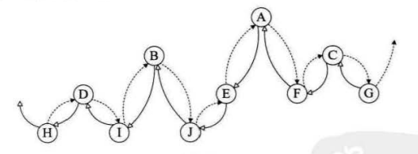 <br/>
问题并没有彻底解决。我们如何知道某一结点的 lchild是指向它的左孩子还是指向前驱? rchild是指向右孩子还是指向后继?。因此，我们在每个结点再增设两个标志域 ltag 和 rtag。 <br/>
 <br/>
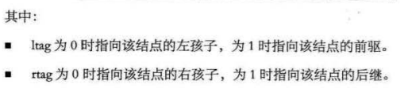 <br/>

```c
/*二叉树的二叉线索存储结构定义*/ <br/>
typedef enum{ <br/>
	Link,Thread <br/>
}PointerTag;/*Link==0表示指向左右孩子指针；Thread==1表示指向前驱或后继的线索*/ <br/>

typedef struct BiThrNode{/*二叉线索存储结点结构*/  <br/>
	TElemType data;/*结点数据*/ <br/>
	struct BiThrNode *lchild,*rchild;/*左右孩子指针*/ <br/>
	PointerTag LTag; <br/>
	PointerTag RTag; /*左右标志*/  <br/>
}BiThrNode,*BiThrTree; <br/>
```

线索化的实质就是将二叉链表中的空指针改为指向前驱或后继的线索。由于前驱和后继的信息只有在遍历该二叉树时才能得到，所以线索化的过程就是在遍历的过程中修改空指针的过程。由于它充分利用了空指针域的空间(这等于节省了空间) ，又保证了创建时的一次遍历就可以终生受用前驱后继的信息(这意味着节省了时间)。所以在实际问题中，如 <br/>
果所用的二叉树需经常遍历或查找结点时需要某种遍历序列中的前驱和后继，那么采用线索二叉链表的存储结构就是非常不错的选择。 <br/>
（十）树、森林与二叉树的转换 <br/>
对于树来说，在满足树的条件下可以是任意形状，一个结点可以有任意多个孩子，显然对树的处理要复杂得多，去研究关于树的性质和算法，真的不容易。树、森林看似复杂，其实它们都可以转化为简单的二叉树来处理，二叉树的很多性质和算法都被研究出来了。 <br/>
树转换为二叉树 <br/>
 <br/>
森林转换为二叉树 <br/>
 <br/>
二叉树转换为树 <br/>
 <br/>
二叉树转换为森林 <br/>
 <br/>
森林的遍历： <br/>
前序遍历：先访问森林中第一棵树的根结点，然后再依次先根遍历根的每棵子树，再依次用同样方式遍历除去第一棵树的剩余树构成的森林。比如上图的三棵树的森林，前序遍历序列的结果就是 ABCDEFGHJI。 <br/>
后序遍历：是先访问森林中第一棵树，后根遍历的方式遍历每棵子树，然后再访问根结点，再依次同样方式遍历除去第一棵树的剩余树构成的森林。比如上图的三棵树的森林，后序遍历序列的结果就是 BCDAFEJHIG。 <br/>
对照二叉树就会发现，森林的前序遍历和二叉树的前序遍历结果相同，森林的后序遍历和二叉树的中序遍历结果相同。这也就告诉我们，当以二叉链表作树的存储结构时，树的先根遍历和后根遍历完全可以借用二叉树的前序遍历和中序遍历的算法来实现。 <br/>
（十一）赫夫曼树和赫夫曼编码 <br/>
（1）最基本的压缩编码方式——赫夫曼编码。我们平时所用的压缩和解压缩技术也都是基于赫夫曼的研究之上发展而来。 <br/>
从树中一个结点到另一个结点之间的分支构成两个结点之间的路径，路径上的分支数目称做 **路径长度**。 <br/>
**树的路径长度**就是从树根到每一结点的路径长度之和。 <br/>
**结点的带权的路径长度**为从该结点到树根之间的路径长度与结点上权的乘积。 <br/>
**树的带权路径长度**为树中所有叶子结点的带权路径长度之和。 <br/>

（2）赫夫曼树（最优二叉树） <br/>
带权路径长度WPL最小的二叉树称做**赫夫曼树**。 <br/>
如何构造： <br/>
 <br/>
（3）赫夫曼编码 <br/>
一般地，设需要编码的字符集为{d1，d2，…，dn}，各个字符在电文中出现的次数或频率集合为 {w1，w2，…，wn} ，以 d1，d2，…，dn作为叶子结点，以w1，w2，…，wn作为相应叶子结点的权值来构造一棵赫夫曼树。规定赫夫曼树的左分支代表 0，右分支代表1，则从根结点到叶子结点所经过的路径分支组成的0和1的序列便为该结点对应字符的编码，这就是赫夫曼编码。  <br/>

