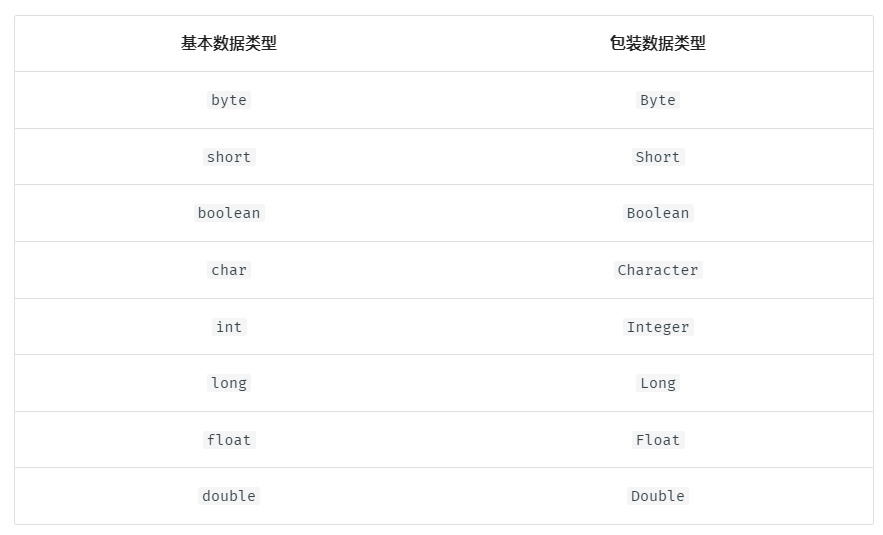

# Java语言基础
"对语言的熟悉程度" <br/>
- [Java语言基础](#java语言基础)
  - [导包汇总](#导包汇总)
    - [基本/包装数据类型](#基本包装数据类型)
    - [继承](#继承)
    - [多态-父类引用指向子类对象](#多态-父类引用指向子类对象)
    - [接口](#接口)
    - [泛型-类型参数化](#泛型-类型参数化)
    - [lambda表达式- 函数参数化](#lambda表达式--函数参数化)
    - [IO](#io)
      - [输出](#输出)
      - [输入](#输入)
    - [BigInteger](#biginteger)
    - [Character\*](#character)
    - [String\*](#string)
    - [StringBuilder\*](#stringbuilder)
    - [sort](#sort)
    - [Arrays](#arrays)
    - [Collections 通用\*](#collections-通用)
    - [List\*](#list)
    - [Queue\&Stack\*\&PirorityQueue（堆==优先队列）](#queuestackpirorityqueue堆优先队列)
    - [Map](#map)
    - [Set](#set)
    - [Objects](#objects)
  - [网易语法总结](#网易语法总结)
  - [编码规范](#编码规范)

## 导包汇总
```java
import java.util.*; // 可以用普通IO和所有数组、集合以及工具类 <br/>
import java.math.*; // 需要BigInteger导入此，一般算术运算无须此，例如Math.sqrt(n)，是在java.lang.math包里 <br/>
import java.io.*;//需要快速IO导入此 <br/>
```
### 基本/包装数据类型
 <br/>
### 继承
除了构造方法，子类**继承**父类的所有成员变量和成员方法，但子类**使用**父类的变量或方法需要看父类的访问权限，如下图。 <br/>
 <br/>
### 多态-父类引用指向子类对象
父类/接口  = 子类/实现类 <br/>
### 接口
除非实现接口的类是抽象类，否则该类要实现接口内的所有方法。 <br/>
### 泛型-类型参数化
**定义时**不设具体类型 <br/>
**使用时**指定具体类型 <br/>
泛型本质是类型参数化，即所操作的数据类型被指定为一个参数。 <br/>
### lambda表达式- 函数参数化
lambda表达式又称闭包 <br/>
 <br/>
函数式接口是只包含一个抽象方法的接口，这个可以用lambda表达式进行实现。 <br/>
 <br/>
### IO
#### 输出
非格式化输出 <br/>
**println** <br/>
```java
System.out.println("error"); <br/>
```

格式化输出 <br/>
**printf** <br/>
```java
System.out.printf("总价：%.2f,折扣：%.2f，满减：%.2f\n",total,discount,mj); <br/>
```
#### 输入
```java
// 非快速IO <br/>
import java.util.*; <br/>

Scanner in = new Scanner(System.in); <br/>

int in.nextInt(); <br/>
String in.nextLine(); <br/>
boolean in.hasNextInt(); <br/>
boolean in.hasNextLine(); <br/>
```

```java
// 快速IO <br/>
import java.io.*; <br/>

BufferedReader in = new BufferedReader(new InputStreamReader(System.in)); <br/>
BufferedWriter out = new BufferedWriter(new OutputStreamWriter(System.out)); <br/>

int in.read() <br/>
String in.readLine() <br/>

out.write(xxx) <br/>

// 关闭 <br/>
in.close() <br/>
out.close() <br/>
```
### BigInteger
```java
import java.math.*; <br/>

BigInteger bi = new BigInteger("1"); <br/>
BigInteger a = new BigInteger("12345678910");  // 将字符串以十进制的形式创建 BigInteger 对象 <br/>
BigInteger b = new BigInteger("1E", 16);  // 将字符串以指定进制的形式创建 BigInteger 对象 <br/>

BigInteger bi.add(BigInteger.valueOf(i)); <br/>
BigInteger bi.subtract(BigInteger.valueOf(i)); <br/>
BigInteger bi.multiply(BigInteger.valueOf(i)); <br/>
BigInteger bi.divide(BigInteger.valueOf(i)); <br/>
BigInteger bi.remainder(BigInteger.valueOf(i)); <br/>
BigInteger bi.abs(BigInteger.valueOf(i)); // 绝对值 <br/>
BigInteger bi.negate(BigInteger.valueOf(i)); // 相反数 <br/>
BigInteger bi.pow(BigInteger.valueOf(i)); // 幂 <br/>
BigInteger bi.max(BigInteger.valueOf(i));  <br/>
BigInteger bi.min(BigInteger.valueOf(i)); <br/>

BigInteger bi.gcd(BigInteger.valueOf(i)); // 两数绝对值的最大公约数 <br/>
BigInteger bi.nextProbablePrime(); // 比bi大的第一个素数  <br/>

boolean bi.isProbablePrime(1); // 是否是素数  //写死参数值取1即可，想要精度大一点，可取值>1   // 基于米勒罗宾判定该数是否是素数，参数越大准确性越高，复杂度越高。 <br/>
boolean bi.equals(BigInteger.valueOf(i)); <br/>

long bi.longValue(); <br/>
String bi.toString(); <br/>
String bi.toString(int radix); //  raidx 进制字符串表示形式 <br/>
```

 <br/>
### Character*
```shell
Character.isDigit(char) <br/>
Character.isLetter(char) <br/>
Character.isLetterOrDigit(char) <br/>
Character.isLowerCase(char) <br/>
Character.isUpperCase(char) <br/>
```
### String*
```shell
// String和StringBuilder通用
s.length()
s.substring(start)
s.substring(start,end)
s.charAt(index)
s.indexOf(str)
s.indexOf(str,fromIndex)
s.lastIndexOf(str) 
s.lastIndexOf(str,fromIndex) 

// 特有的
s.toCharArray();
s.split(",");// 特殊字符要用2个反斜杠转义,如"\\|"
s.toLowerCase()
s.toUpperCase()
s.trim()
startsWith("xxx") //注意start后有s
endsWith("xxx") //注意end后有s
contains("xxx")
boolean matches(String regix); // 正则匹配
//注意区分
replaceAll(oldStr,newStr)
replaceFirst(oldStr,newStr)
```

### StringBuilder*
```shell
// 构造函数
StringBuilder sb = new StringBuilder();
StringBuilder sb = new StringBuilder("xxx");

// String和StringBuilder通用
sb.length()
sb.substring(start)
sb.substring(start,end)
sb.charAt(index); 
sb.indexOf(str)
sb.indexOf(str,fromIndex)
sb.lastIndexOf(str)
sb.lastIndexOf(str,fromIndex)  

// 特有的，增，删，改，反转
sb.reverse();
sb.append("xxx"); 
s.insert(index,"xxx");
s.delete(fromIndex, endIndex)
//注意区分
sb.replace(fromIndex,endIndex,"xxx");
```
### sort
```
// int compare(T o1, T o2) “比较o1和o2的大小”。
升序：当o1<o2时return -1， o1=o2时return 0， o1 > o2时return 1。
降序：当o1<o2时return 1， o1=o2时return 0， o1 > o2时return -1。

// 默认是升序
Arrays.sort(arr); 等价于 Arrays.sort(arr,(a,b)->(a<b?-1:1));
Collections.sort(list);


// 降序
Collections.sort(list,(o1,o2)->(o1.getValue() < o2.getValue()?1:-1));
// Arrays.sort(arr,(a,b)->b-a); // 最好不要用减法，而要用比较符，避免减法结果越界
```
### Arrays
```java
import java.util.*; <br/>

// 新建 <br/>
int[] a = new int[n]; <br/>

// 长度 <br/>
a.length <br/>

// 数组转字符串 <br/>
// [1, 3, 9, 27, 81, 243, 729] <br/>
// 转换好的左右有[],每个元素后有,和空格 <br/>
Arrays.toString(arr) <br/>
System.out.println(Arrays.toString(arr));// 快速打印 int[] <br/>

// int[] 转 List <br/>
Arrays.stream(nums).boxed().collect(Collectors.toList()); <br/>
Arrays.asList(array); <br/>

// 二分查找 <br/>
// 前提是数组必须有序 <br/>
// 存在则返回下标，不存在返回负数 <br/>
int Arrays.binarySearch(arr, key);  <br/>
int Arrays.binarySearch(arr, firstIdx, lastIdx, key);  <br/>

// 填充 <br/>
Arrays.fill(arr,k); <br/>
Arrays.fill(arr,fromIndex,endIndex,k); <br/>
```
### Collections 通用*
 <br/>
Java 中的 Collection 元素类型定义时必须为对象，不能为基本数据类型。 <br/>

注意 java.util.Collections 是个工具类，而java.util.Collection是个接口 <br/>
```java
import java.util.*; 

// Collection 通用 
size()
isEmpty()
contains(Object o)
add(E e) 
remove(Object o) 
clear() 
iterator()

// Collections工具 
Collections.reverse(list);  // 反转
int index = Collections.binarySearch(list,"c");  // 二分查找List
Collections.swap(list, i, j); // 交换 
Collections.shuffle(list);  // 随机洗牌
```
### List*
ArrayList是动态扩容的数组 <br/>
LinkedList是双向链表 <br/>
```shell
import java.util.*; 

// 创建list 
//前面List加泛型，后面LinkedList，ArrayList不加泛型 
List<Long> list = new LinkedList<>();  
List<String> list = new ArrayList<>(); 

// 增 
add(Object o) // 在末尾添加元素 
void add(int index,Object o) // 在指定位置添加元素 
// 删 
Object remove(int index) // 删除指定位置元素并返回 
// 改 
Object set(int index, Object o) // 修改指定位置的值并返回旧值 
// 查 
int indexOf(Object o) // 返回某元素第一次出现的索引 
Object get(int index) // 获取指定位置的元素 

// LinkedList特有 
addFirst()
addLast()
removeFirst()
removeLast()
getFirst()
getLast()


// 迭代器遍历与迭代器删除元素（不要在 for/foreach 遍历 List 的过程中删除其中的元素，否则会抛出并发修改异常。 可以用迭代器来删除元素）    
Iterator<Student> iterator = students.iterator(); 
while (iterator.hasNext()) {   
    Student student = iterator.next(); 
    if (iterator.getId() % 2 == 0) 
        iterator.remove();//这里要使用Iterator的remove方法移除当前对象，如果使用List的remove方法，则同样会出现ConcurrentModificationException
}
```
### Queue&Stack*&PirorityQueue（堆==优先队列）
Deque是 Java 中的双端队列，我们通常用其进行队列的操作以及栈的操作。
```shell
import java.util.*; 

// 创建Queue&Stack
Deque<Integer> stack/queue = new ArrayDeque<>(); # 力扣官方题解采用，底层是数组
Deque<String> stack/queue = new LinkedList<>();  # 力扣官方题解采用，底层是双向链表
# 不要用Stack<Integer> s = new Stack();了。底层是vector，vector底层是动态数组，线程安全的，效率低


// 创建PriorityQueue - 堆（优先队列） 优先队列的入队出队，时间复杂度为O(logn)
PriorityQueue<Integer> queue = new PriorityQueue<>(); //默认是小根堆
PriorityQueue<Integer> queue = new PriorityQueue<>((a,b)->b-a); // 大根堆

// stack API (只对队尾元素进行操作)
stack.push(xxx); 
stack.pop(); 
stack.peek(); 

// queue&priorityQueue API （在队尾添加，在队头查看和删除）
queue.offer("1") 
queue.poll(); 
queue.peek(); 

// deque 特有API (Note:priorityQueue没有这些API)
deque.offerFirst(xxx);
deque.offerLast(xxx);
deque.pollFirst();
deque.pollLast();
deque.peekFirst();
deque.peekLast();
``` 
### Map
HashMap		随机位置插入的 Map <br/>
LinkedHashMap 	保持插入顺序或访问顺序的 Map <br/>
TreeMap 		保持容器中元素有序的 Map，默认为升序 <br/>
```shell
import java.util.*;

Map<Character,Double> map = new HashMap<>();

map.containsKey(k)
map.containsValue(v)
map.put(k,v)
map.get(k)
map.remove(k)

// 遍历Map
// 遍历Map:需要key信息或map全部信息
for (Integer key : map1.keySet()) {
    System.out.println(key + " " + map1.get(key));
}
// 遍历Map:仅需要value信息
for (Integer value : map1.values()) {
    System.out.println(value);
}

// 与Collection通用的
size()
isEmpty()
clear()
 
// map 转 list <br/>
List<Map.Entry<Character,Double> > mapList = new ArrayList<>(map.entrySet());
```
### Set
HashSet		随机位置插入的 Set <br/>
LinkedHashSet 	保持插入顺序的 Set <br/>
TreeSet 		保持容器中元素有序的 Set，默认为升序 <br/>
```java
import java.util.*; <br/>

Set<Integer> s1 = new HashSet<>(); <br/>

Set<Integer> s2 = new LinkedHashSet<>(); <br/>

// TreeSet有些特殊方法，所以引用也用TreeSet <br/>
TreeSet<Integer> s3 = new TreeSet<>(); // 升序 <br/>
TreeSet<Integer> s4 = new TreeSet<>((x, y) -> {return y - x;});  // 降序 <br/>

s3.first();// 排序后的第一个元素 <br/>

```
```java
import java.io.PrintWriter; <br/>
import java.util.HashSet; <br/>
import java.util.LinkedHashSet; <br/>
import java.util.Set; <br/>

public class Main { <br/>
    static PrintWriter out = new PrintWriter(System.out); <br/>
    static Set<Integer> s1 = new HashSet<>(); <br/>
    static Set<Integer> s2 = new LinkedHashSet<>(); <br/>

    static void add() { <br/>
        s1.add(1); <br/>
    } <br/>

    static void contains() {  // 判断 set 中是否有元素值为 2，有则返回 true，否则返回 false  <br/>
        s1.contains(2); <br/>
    } <br/>

    static void test1() {  // s1 与 s2 的并集  <br/>
        Set<Integer> res = new HashSet<>(); <br/>
        res.addAll(s1); <br/>
        res.addAll(s2); <br/>
    } <br/>

    static void test2() {  // s1 与 s2 的交集  <br/>
        Set<Integer> res = new HashSet<>(); <br/>
        res.addAll(s1); <br/>
        res.retainAll(s2); <br/>
    } <br/>

    static void test3() {  // 差集：s1 - s2  <br/>
        Set<Integer> res = new HashSet<>(); <br/>
        res.addAll(s1); <br/>
        res.removeAll(s2); <br/>
    } <br/>
} <br/>

```
TreeSet特有方法 <br/>
 <br/>
// 将List排序并去重 <br/>
new TreeSet<>(list);  <br/>
### Objects
```java
import java.util.*; <br/>

// 判空 <br/>
Objects.notNull(obj) <br/>
Objects.isNull(obj) <br/>
```
## 网易语法总结
1.数据库 <br/>
//获取Example的Criteria <br/>
TestExample.Criteria criteria = example.createCriteria(); <br/>
等价于 <br/>
TestExample.Criteria criteria = example.or(); <br/>
2.集合 <br/>
```
//映射到不完全一一对应的实体 <br/>
List<TestEntity> list = mapper.selectByExample(example).stream().map(TestEntity::of).collect(Collectors.toList()); <br/>
//筛选过滤 <br/>
List<TestEntity> list = list.stream().filter(this::checkExist).collect(Collectors.toList()); <br/>
```
//list转map <br/>
//若使Map的value 为对象本身，valueMapper写为 t->t 或Functions.identity() <br/>
list.stream().collect(Collectors.toMap(TestEntity::getName, Function.identity())); <br/>
3.校验 <br/>
boolean bool = StringUtils.isBlank(str); <br/>
boolean bool = StringUtils.isNotBlank(str); <br/>
4.guava（全局搜索总结一下） <br/>
Guava是谷歌提供的一个核心Java类库，其中包括新的集合类型、不可变集合、图库，以及用于并发、I/O、Hash、缓存、字符串等的实用工具。它在谷歌中的大多数Java项目中被广泛使用，也被许多其他公司广泛使用，熟练掌握这些工具类能帮助我们快速的处理日常开发中的一些问题，比如，不可变集合、集合的转换、字符串处理、本地缓存等。 <br/>
[想学Google Guava看这篇就够了](https://blog.csdn.net/pzjtian/article/details/106910046?ops_request_misc=%257B%2522request%255Fid%2522%253A%2522163826295216780274154225%2522%252C%2522scm%2522%253A%252220140713.130102334..%2522%257D&request_id=163826295216780274154225&biz_id=0&utm_medium=distribute.pc_search_result.none-task-blog-2~all~top_positive~default-1-106910046.first_rank_v2_pc_rank_v29&utm_term=guava&spm=1018.2226.3001.4187) <br/>
```
<!-- guava--> <br/>
<dependency> <br/>
    <groupId>com.google.guava</groupId> <br/>
    <artifactId>guava</artifactId> <br/>
</dependency> <br/>
//新建list <br/>
List list = Lists.newArrayList(); <br/>
//新建set <br/>
Set set = Sets.newTreeSet(); <br/>
Set<String> set = Sets.newHashSet(Splitter.on(",").split("test1,test2,test3")); <br/>
Table <br/>
```

//通过rowKey获取columnKey->value的映射关系 <br/>
System.out.println(table.row("a1")); <br/>
//通过columnKey获取rowKey ->value的映射关系 <br/>
System.out.println(table.column("c2")); <br/>
5.时间 <br/>
long now = System.currentTimeMillis(); <br/>
6.字符串比较（区分大小写和不区分大小写） <br/>
**compareTo()方法** <br/>
int n1 = str1.compareTo(str2);//比较的是str1和str2的大小，返回两者之间的差值 <br/>
**compareToIgnoreCase方法** <br/>
int n1 = str1.compareToIgnoreCase(str2);//按字典比较两个字符串，不区分大小写 <br/>
## 编码规范
1、包名统一使用单数形式，但是类名如果有复数含义，类名可以使用复数形式。 <br/>
2、为达到望文知义，代码自解释，任何自定义编程元素在命名时，使用尽量完整的单词。 <br/>
3、组合来表达其意，不要怕长。 <br/>
