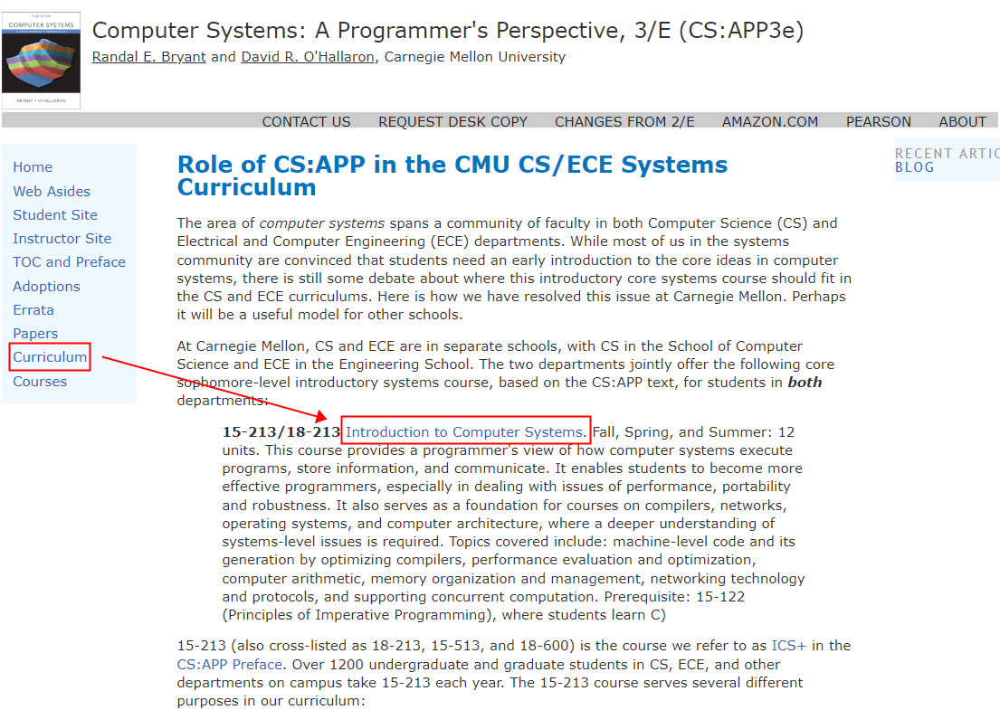

# CSAPP
英文版：CSAPP（Computer Systems: A Programmer's Perspective）  
中文版：深入理解计算机系统  
讲义：[CSAPP重点解读](https://fengmuzi2003.gitbook.io/csapp3e/)  
官网：[CS:APP3e](http://csapp.cs.cmu.edu/)  
自学关心的地方：Student Site（有一些推荐的不错的书和工具，也有实验链接）  
  

  

[2015年秋季课程](https://www.cs.cmu.edu/afs/cs/academic/class/15213-f15/www/index.html)  
  
CS:APP3e->菜单Curriculum->Introduction to Computer Systems->菜单Resources->Fall 2015->菜单Scedule  
Schedule菜单下可下载课程的PDF和PPT  
