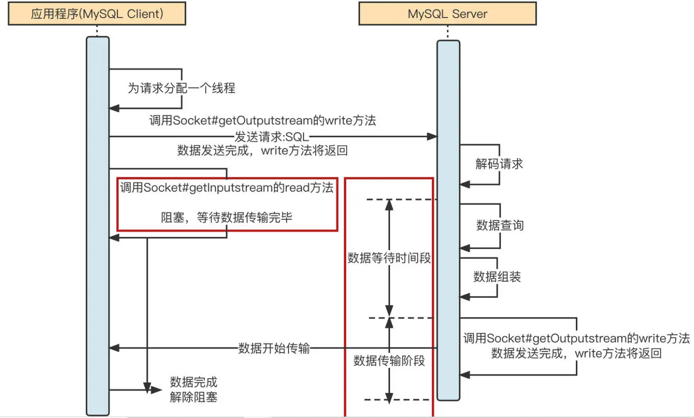
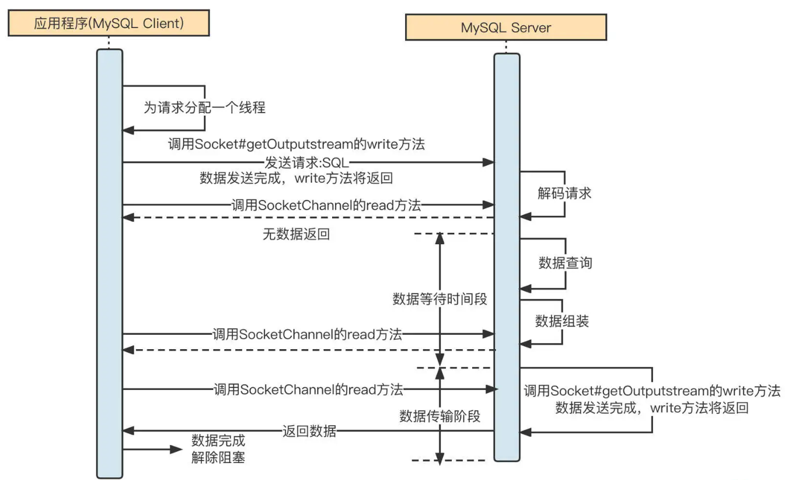
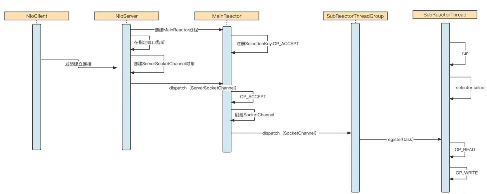
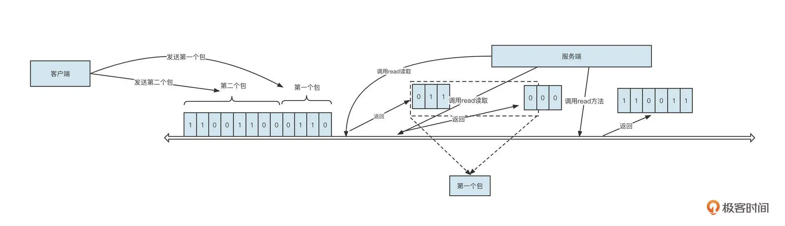
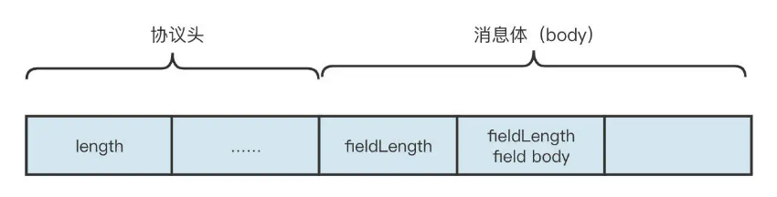
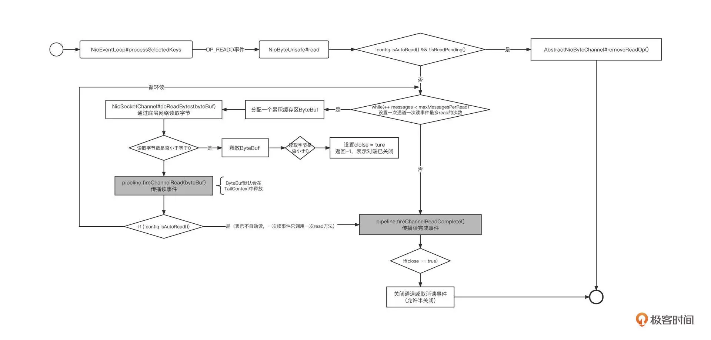
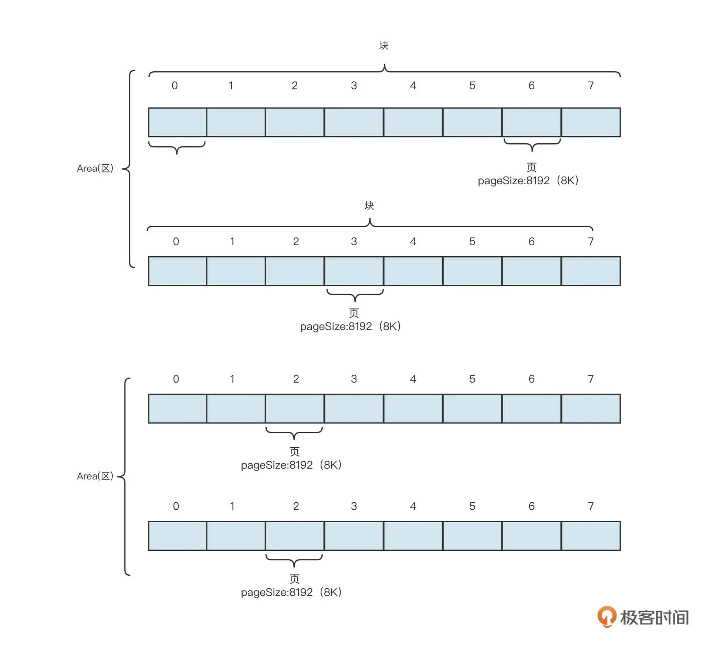

# Netty

## 同步/异步，阻塞非阻塞

在等待数据阶段：发起网络调用后，在服务端没准备好数据的情况下。客户端阻塞，则为阻塞IO；网络调用立即返回，则为非阻塞IO <br/>

在数据传输阶段: 如果发起网络调用的线程还可以做其它事情则为异步，否则为同步 <br/>


## BIO

下图为MySQL Connector-Java 的架构，为典型的BIO: <br/>

 <br/>


如果把这个架构改成NIO的: <br/>
 <br/>

为什么MySQL 不使用NIO的模式: <br/>

1. 业务层往往会实现连接池，复用TCP长连接 <br/>
2. 与此同时，为了保证数据库服务端的可用性，通常限制了客户端连接数，这就注定了数据库客户端没有需要支持大量连接的需求 <br/>
3. 如果执行一个很慢的SQL，正好可以阻塞住这个连接，不让他持续发新的请求，以保护数据库的可用性，而不是被突增的连接打得完全不可用。所以连接少的时候使用BIO反而是有优势的 <br/>


## NIO 基础
Non blocking IO，即为同步非阻塞IO <br/>


### 三大组件

Java NIO系统的核心在于：**通道(Channel)**和**缓冲区(Buffer)** <br/>
#### Channel
这是个双向的通道，不像InputStream和OutputStream是单向的 <br/>
通道表示打开到 IO 设备(例如：文件、套接字) 的连接，有一点类似于Stream，而且它是多线程安全的。一旦通道关闭，任何对它的操作都会抛出IO异常，所以建议先调用isOpen() <br/>

```java <br/>
public interface Channel extends Closeable { <br/>
    public boolean isOpen(); <br/>

    public void close() throws IOException; <br/>
} <br/>
```

常见的Channel有以下四种，其中FileChannel主要用于文件传输，其余三种用于网络通信 <br/>

- FileChannel (文件传输通道) <br/>
- DatagramChannel   (对应UDP数据包传输通道) <br/>
- SocketChannel (TCP数据传输通道) <br/>
- ServerSocketChannel (TCP数据传输通道) <br/>


#### Buffer
用来缓冲读写数据，和Channel交互 <br/>

- ByteBuffer （常用的其实也就是这个了） <br/>
   - MappedByteBuffer  (通过FileChannel.map创建，代表了文件的一个region在内存里的映射，所以映射的内容可能在任意时刻被别的程序所更改，也有可能在任意时刻变得inaccessable，所以强烈建议不要多线程的对mapped byte buffer进行修改) <br/>
   - DirectByteBuffer <br/>
   - HeapByteBuffer <br/>
- ShortBuffer <br/>
- IntBuffer <br/>
- LongBuffer <br/>
- FloatBuffer <br/>
- DoubleBuffer <br/>
- CharBuffer <br/>

 <br/>


#### Selector

Selector的概念源于服务端IO模型的演化: <br/>

1. 简单的多线程，为每个socket连接一个线程 <br/>

太多线程，执行效率也不高，因为经常要做线程上下文切换。内存占用也高，一个线程至少1MB <br/>

2. 线程池，N个线程处理M个socket连接	 <br/>

缺点: 阻塞模式下，一个线程处理一个socket连接请求的同时，哪怕这个socket并没读写事件，线程也腾不开手去做其他事情 <br/>

每个thread只能处理一个socket    ? <br/>

 <br/>


3. selector设计 <br/>

 <br/>
一个线程管理多个channel，I/O事件驱动 (selector的select( )会阻塞直到channel发生了读写就绪事件)，这些Channel是非阻塞的，不会让线程吊死在一个channel上 <br/>
适用场景: 连接数多、流量低 <br/>


## Reactor线程模型

 <br/>


各个角色的说明: <br/>

- Acceptor: 请求接收者，一直监听着某个端口 <br/>
- Main Reactor Thread Pool: 主 Reactor 模型，主要负责处理 OP_ACCEPT 事件（创建连接），通常一个监听端口使用一个线程。在具体实践时，如果创建连接需要进行授权校验（Auth）等处理逻辑，也可以直接让 Main Reactor 中的线程负责 <br/>
- NIO Thread Group: 在 Reactor 模型中也叫做从 Reactor，主要负责网络的读与写。当 Main Reactor Thread 线程收到一个新的客户端连接时，它会使用负载均衡算法从 NIO Thread Group 中选择一个线程，将 OP_READ、OP_WRITE 事件注册在 NIO Thread 的事件选择器中。接下来这个连接所有的网络读与写都会在被选择的这条线程中执行 <br/>
- NIO Thread：IO 线程。负责处理网络读写与解码。IO 线程会从网络中读取到二进制流，并从二进制流中解码出一个个完整的请求 <br/>
- 业务线程池：通常 IO 线程解码出的请求将转发到业务线程池中运行，业务线程计算出对应结果后，再通过 IO 线程发送到客户端 <br/>

 <br/>
网络通信的交互过程通常包括下面六个步骤: <br/>

1. 启动服务端，并在特定端口上监听，例如，web 应用默认在 80 端口监听 <br/>
2. 客户端发起 TCP 的三次握手，与服务端建立连接。这里以 NIO 为例，成功建立连接后会创建 NioSocketChannel 对象 <br/>
3. 服务端通过 NioSocketChannel 从网卡中读取数据 <br/>
4. 服务端根据通信协议从二进制流中解码出一个个请求 <br/>
5. 根据请求执行对应的业务操作，例如，Dubbo 服务端接受了请求，并根据请求查询用户 ID 为 1 的用户信息 <br/>
6. 将业务执行结果返回到客户端（通常涉及到协议编码、压缩等） <br/>

主从多Reactor的分工如下: <br/>

1. Main Reactor 线程池，主要负责连接建立（OP_ACCEPT），即创建 NioSocketChannel 后，将其转发给 SubReactor <br/>
2. SubReactor 线程池，主要负责网络的读写（从网络中读字节流、将字节流发送到网络中），即监听 OP_READ、OP_WRITE，并且同一个通道会绑定一个 SubReactor 线程 <br/>


Reactor模型的时序图: <br/>
 <br/>

这里核心的流程有三个。 <br/>

1. 服务端启动，会创建 MainReactor 线程池，在 MainReactor 中创建 NIO 事件选择器，并注册 OP_ACCEPT 事件，然后在指定端口监听客户端的连接请求。 <br/>
2. 客户端向服务端建立连接，服务端 OP_ACCEPT 对应的事件处理器被执行，创建 NioSocketChannel 对象，并按照负载均衡机制将其转发到 SubReactor 线程池中的某一个线程上，注册 OP_READ 事件。 <br/>
3. 客户端向服务端发送具体请求，服务端 OP_READ 对应的事件处理器被执行，它会从网络中读取数据，然后解码、转发到业务线程池执行具体的业务逻辑，最后将返回结果返回到客户端。 <br/>


## Netty
要直接基于 NIO 编写网络通讯层代码，需要开发者拥有很强的代码功底(各种多线程和异常case处理)和丰富的网络通信理论知识。Netty是为了降低网络编程门槛而生的，对NIO做了高级的封装。 <br/>

### 通信协议

 <br/>

这里服务端分为3次读取，分别读到011, 000, 110011 。而客户端发的第一个包是0110 <br/>


**粘包问题**: <br/>
服务端错误的把011当成第一个包，或把011000110011当成第一个包 <br/>

解决方案: 客户端与服务端都制定好通信协议。 <br/>
 <br/>

通信协议制定方法有多种: <br/>

1. 特殊符号标识请求的结束。缺点: 转义风险 <br/>
2. 固定长度表示一个包，不足这个长度做padding。缺点：浪费空间 <br/>
3. 业界常用: 协议**Header + body** <br/>

 <br/>
其中协议头长度固定，协议头中会包含一个长度字段，用来标识一个完整包的长度，用来表示长度字段的字节位数直接决定了一个包的最大长度。消息体中存储业务数据。 <br/>

一个简单的RPC协议设计: <br/>
 <br/>

**粘包的解决**: <br/>
服务接收端读数据都是放在缓冲区里的。首先判断读到的字节数，若<6字节，继续等待。若>=6字节，则取前6个字节，进行协议Header的解析，了解到这次数据传输一共有多少个字节，接下来继续等待直到累计缓冲区里的字节数包含完整的包长度，再解析消息体。 <br/>


### 线程模型
Netty的线程模型: 1主多从 Reactor 模型 <br/>
 <br/>

- **主Reactor**: Boss Group，默认为1个线程，处理OP_ACCEPT事件。接收到一个客户端连接时，创建一个Channel(里面带有缓冲区)    然后选择从Reactor中的一个线程来处理，注册读事件 <br/>
- **从Reactor**: Work Group，默认为CPU核数*2，处理OP_READ、OP_WRITE事件。 <br/>
- **Handl**er: 编码、解码等功能对应一个独立的 Handler，这些 Handler 默认在 IO 线程中执行，但 Netty 支持将 Handler 的执行放在额外的线程中执行，实现与 IO 线程的解耦合，避免 IO 线程阻塞。这是责任链模式，方便进行扩展。 <br/>
- **业务线程池**: Business Thread Group，处理读到的数据包，或者把数据写回Channel里的缓冲区，并注册写事件。 <br/>

注意: 读写都由从Reactor中的IO线程来处理。专司其职，避免多线程编程的复杂性。 <br/>

### 读流程
 <br/>
### 写流程

核心是AbstractUnsafe的flush0()中的3点: <br/>

1. 获取写缓存队列。( 其他线程调用 Channel 向网络中写数据时，首先会写入到写缓存区，等到写事件被触发时，再将写缓存区中的数据写入到网络中。)   <br/>
2. 如果通道处于未激活状态，需要清理写缓存区，避免数据污染。 <br/>
3. 通过调用 doWrite 方法将写缓存中的数据写入网络通道中。 <br/>

doWrite: 由NioSocketChannel # doWrite实现，使用NIO完成数据的写入: <br/>

1. 如果通道的写缓存区中没有可写数据，需要取消写事件，也就是说，这时候不必关注写事件。 <br/>
2. .... <br/>
3. ... <br/>

流程图如下: <br/>
 <br/>


### 用Netty写RocketMQ网络层

RocketMQ网络交互流程: <br/>
 <br/>

我们通常需要编写客户端代码、服务端代码和通信协议 <br/>

#### 客户端


#### 服务端


#### 通信协议
 

## 中间件通用设计理念
高性能原因: <br/>
 <br/>

### 内存管理
GC在回收时会出现Stop The World的停顿，所以往往中间件都是申请一块内存，自己来维护 (主要防止频繁GC） <br/>

以Channel中的累计缓冲区(各类ByteBuffer)为例: <br/>
 <br/>
如果 Netty 直接使用 Java 的垃圾回收机制，那 ByteBuf 对象还有内部持有的内存 (byte[]) 就会频繁地创建与销毁，而且这些对象都是朝生暮死的，这会导致频繁的 GC，高性能、高并发基本就成为奢望了。 <br/>

Netty的解决方案: <br/>

1. 启动时就向OS申请指定大小的内存( 独占，且在 JVM 存活期间一直可达) 。JVM GC 不需要关注这部分内存，由 Netty 负责管理释放和分配。 <br/>
2. 对ByteBuf 对象本身采用对象池技术，避免频繁创建与销毁 ByteBuf 对象本身 <br/>

操作系统的内存管理: 段页式 <br/>
Netty中的内存管理: 区 (Area)- 块 (chunk)- 页 (page) <br/>
 <br/>
为什么这块内存得分这么细： 是因为多线程下如果申请同一块内存得加锁，这样划分的话加锁粒度就细。 <br/>
上图一个Chunk有8个Page，Netty采用将这些Page映射到一棵完全二叉树，来对这些页进行管理（怎么表示这些页是已分配还是未分配，怎么根据分配情况找到适合的连续内存）： <br/>
 <br/>
一个块的内存是 8 页，也就是 2 的 3 次幂，我们把 3 称作 maxOrder，maxOrder 的值越大，一个块中包含的页就越多，管理的内存就越多。这棵树的每个叶子节点就是一页。 <br/>
具体的映射方法是：创建一个数组，长度为叶子节点的 2 倍，然后将完成二叉树按照每一层从左到右的顺序依次存储在数组中。注意，第一个节点要空出来，这样做的好处是根据数组下标能很方便地计算出父节点和两个子节点的下标。 <br/>
具体的计算方法是：如果节点的下标为 n，则父节点的下标 n>>1，即 n/2。如果父节点的下标为 n，则其左节点下标 n << 1，即 2n，右节点下标 n << 1 + 1，即 2n+1。 <br/>

申请和 <br/>

### 文件编程

参考RocketMQ的消息体设置 <br/>

文件存储设计的三个要点，也就是长度字段、魔数和 CRC 校验码。 <br/>

1. 长度字段指的是存储一条消息的长度。这个字段通常使用一个定长字段来存储。比方说，一个字段有 4 个字节，那一条消息的最大长度为 2 的 32 次幂。有了长度字段，就能标识一条消息总共包含多少个字节，用 len 表示，然后我们在查找消息时只需要从消息的开始位置连续读取 len 个字节就可以提取一条完整独立的消息。 <br/>
2. 魔数: 魔数不是强制的设计，设计它的目的是希望能够快速判断我们是否需要这些文件，通常情况下，魔数会取一个不太常用的值。 <br/>
3. CRC 校验码它是一种循环冗余校验码，用于校验数据的正确性。消息存储到磁盘之前，对消息的主体内容计算 CRC，然后存储到文件中。当从磁盘读取一条消息时，可以再次对读取的内容计算一次 CRC，如果两次计算的结果不一样，说明数据已被破坏。 <br/>

创建索引: <br/>
RocketMQ 具体的做法是，为每一个主题、队列创建不同的文件夹，例如 /topic/queue。然后，在该文件夹下再创建多个索引文件，每一个索引文件中存储数据的格式为：8 字节的起始偏移量、4 字节的数据长度、8 字节的 tag 哈希值。 <br/>
这样，写的时候顺序写+MappedByteBuffer，但是消费的时候按照Topic来 <br/>

MappedByteBuffer 内存映射文件 <br/>
