# Docker
# 运维工作进化论
## 小试牛刀
 <br/>
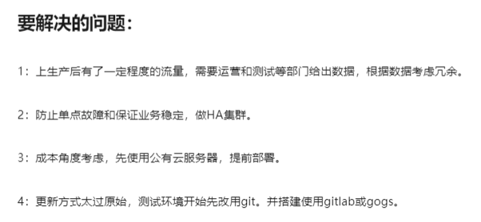 <br/>
## 初露锋芒
 <br/>
 <br/>
 <br/>
## 小有名气
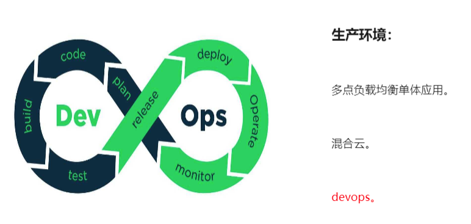 <br/>
 <br/>
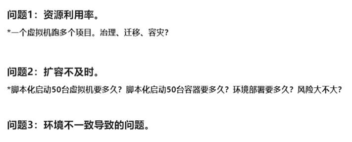 <br/>
## 名动一方
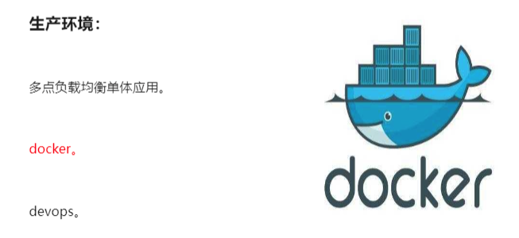 <br/>
 <br/>
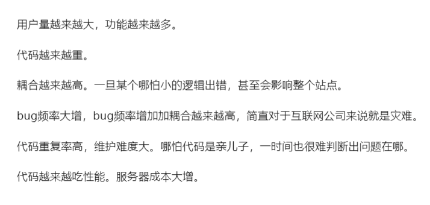 <br/>
## 一派宗师
 <br/>
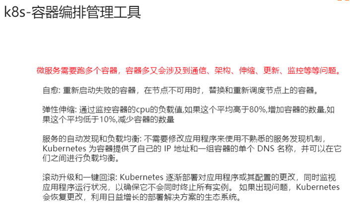 <br/>
## 千古留名
 <br/>
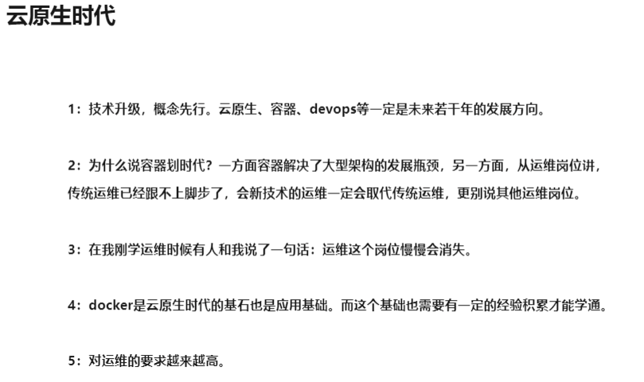 <br/>
# 容器
## 什么是容器
 <br/>
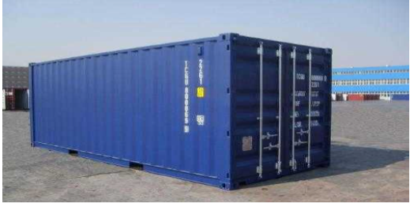 <br/>
 <br/>
 <br/>
## 容器和虚拟化
容器和VM之间的差异 <br/>
VM就是利用虚拟化技术来模拟硬件资源，比如CPU内存等等，在这样模拟的硬件的情况之下就可以在一个输入机上建立guest os，也就是常说的安装一个虚拟机，每一个guest os都有独立的内核。在guest os之下，每个应用，都是相互独立的，因为在一个guest os内，看不见其他guest os的应用，VM可以提供一个更好的隔离效果。当然，这样的隔离效果也要有一定的代价，需要把一部分资源交给虚拟化，这样就很难充分利用现有的计算资源，而且每个guest os都需要大量的磁盘空间，每个操作系统可能占用比较大的磁盘空间。这样的缺点就催生了容器技术。 <br/>
容器是针对进程而言的，所以容器无需guest os，只需要一个独立的文件系统提供他所需要运行的所有文件集合即可。所有的隔离都是进程级别的，所以容器的启动时间快于VM，容器消耗的磁盘空间也小于VM，隔离效果比VM差很多，因为容器消耗的资源少，所以提供的隔离效果比VM差很多。 <br/>
容器和VM之间各有优势、劣势，在这种情况下，容器也在向着强隔离的方向进行发展。 <br/>
 <br/>
 <br/>
 <br/>
## 回顾操作系统如何管理进程
首先登录到一个操作系统内，可以通过PS等操作来看到各式各样的进程，这些进程包括系统自带的或属于自身应用的或属于其他应用。 <br/>
这些进程的特点： <br/>
1.可以相互看见，相互通信； <br/>
2.使用同样的文件系统； <br/>
3.使用同样的系统资源。 <br/>

三个特点会带来的问题： <br/>
1.相互看见，能相互通信：意味着这些进程具有高级权限的进程，可以攻击其他进程； <br/>
2.使用同样的文件系统：这些进程可以对已有的数据进行增删改查，意味着高级权限的进程可以把其他应用所需要的进程删掉，破坏掉其他进程的运行；进程跟进程之间所需要的依赖可能会存在冲突，会给运用成本带来很大的压力； <br/>
3.使用同样的数据资源：应用跟应用之间会存在资源的强占问题，应用消耗很大CPU和内存的时候它会破坏其他应用的运行会导致其他应用没法正常的提供服务。 <br/>

在这样的问题之下该如何解决： <br/>
1.资源视图隔离-namespace 可以采用这个技术来帮助对进程进行隔离，也就是在资源的视图上进行隔离； <br/>
2.独立的文件系统-chroot 给这些进程提供一个独立的运行环境，把一个子目录变成一个根目录，在视图级别进行隔离，可以有一个独立的文件系统，这样这个进程对这个文件系统的增删改查，都不会影响其他进程的使用。 <br/>
3.资源控制使用率-cgroup 为了减少对其他进程的影响，可以限制资源使用率。 <br/>
## docker底层技术
 <br/>
## 镜像和容器
容器，就是和系统的其他部分隔离开的进程集合； <br/>
镜像，就是容器所需要的所有文件集合，具备一次构建到处运行的特点。 <br/>
 <br/>

### 容器的概念
容器，是一个具有视图隔离、资源可限制、独立文件系统的进程集合。 <br/>
视图隔离就是能看见其他进程，拥有独立的主机名等；资源使用的控制率，帮助这个进程限制他的资源使用，比如两个g的内存大小，CPU的使用个数等；容器其实是一个进程集合，只不过是把系统的其他资源隔离开，拥有独立的一个视图视角；容器是具有独立的一个文件系统。 <br/>
### 容器的优势
使用系统上的资源，独立的文件系统内不需要具备内核相关的代码或者是工具，只需要提供这个容器所需的二进制以及配置文件甚至是依赖即可。 <br/>
### 什么是镜像
运行容器需要的所有集合，我们称之为容器镜像。 <br/>
采用Dockerfile来构建一个镜像，Dockerfile描述镜像构建的步骤。每一个构建步骤会对现有的文件系统进行添加文件，删除文件甚至修改已有的文件，这样会带来一个文件系统的变化，我们把这些变化成之为Changeset。 <br/>
图1-4-1表示的是一个golang 的镜像，每一个带有颜色的方框表示每一次构建步骤所带来的影响以及构建的步骤描述等，把这些构件的步骤所产生的变化，依次作用到一个空的文件夹上，就能得到一个完整的镜像，除了changeset这种描述之外还会发现，changeset是能相互复用的，图1-4-1蓝色部分表示alpine镜像，绿色部分表示golang的自身变化，golang镜像是基于alpine镜像进行构建的，镜像之间是能相互复用的。 <br/>
 <br/>
图1-4-1 <br/>
changeset所带来的分层以及复用的特点的优势： <br/>
1.提高分发效率； <br/>
2.数据共享； <br/>
3.减少磁盘压力。 <br/>
# docker
## Docker是什么
Docker 是一个开源的应用容器引擎，基于 Go 语言 并遵从Apache2.0协议开源。 <br/>
Docker 可以让开发者打包他们的应用以及依赖包到一个轻量级、可移植的容器中，然后发布到任何流行的 Linux 机器上，也可以实现虚拟化。 <br/>
容器是完全使用沙箱机制，相互之间不会有任何接口（类似 iPhone 的 app）,更重要的是容器性能开销极低。 <br/>
## Docker的应用场景

- Web 应用的自动化打包和发布。 <br/>
- 自动化测试和持续集成、发布。 <br/>
- 在服务型环境中部署和调整数据库或其他的后台应用。 <br/>
- 从头编译或者扩展现有的OpenShift或Cloud Foundry平台来搭建自己的PaaS环境。 <br/>
## Docker 的优点

- 1、简化程序： <br/>
Docker 让开发者可以打包他们的应用以及依赖包到一个可移植的容器中，然后发布到任何流行的 Linux 机器上，便可以实现虚拟化。Docker改变了虚拟化的方式，使开发者可以直接将自己的成果放入Docker中进行管理。方便快捷已经是 Docker的最大优势，过去需要用数天乃至数周的 任务，在Docker容器的处理下，只需要数秒就能完成。 <br/>
- 2、避免选择恐惧症： <br/>
如果你有选择恐惧症，还是资深患者。Docker 帮你 打包你的纠结！比如 Docker 镜像；Docker 镜像中包含了运行环境和配置，所以 Docker 可以简化部署多种应用实例工作。比如 Web 应用、后台应用、数据库应用、大数据应用比如 Hadoop 集群、消息队列等等都可以打包成一个镜像部署。 <br/>
- 3、节省开支： <br/>
一方面，云计算时代到来，使开发者不必为了追求效果而配置高额的硬件，Docker 改变了高性能必然高价格的思维定势。Docker 与云的结合，让云空间得到更充分的利用。不仅解决了硬件管理的问题，也改变了虚拟化的方式。 <br/>
## 相关链接
Docker 官网：[http://www.docker.com](http://www.docker.com/) <br/>
Github Docker 源码：[https://github.com/docker/docker](https://github.com/docker/docker) <br/>
### Docker官方英文资源
docker官网：[http://www.docker.com](http://www.docker.com/) <br/>
Docker windows入门：[https://docs.docker.com/windows/](https://docs.docker.com/windows/) <br/>
Docker Linux 入门：[https://docs.docker.com/linux/](https://docs.docker.com/linux/) <br/>
Docker mac 入门：[https://docs.docker.com/mac/](https://docs.docker.com/mac/) <br/>
Docker 用户指引：[https://docs.docker.com/engine/userguide/](https://docs.docker.com/engine/userguide/) <br/>
Docker 官方博客：[http://blog.docker.com/](http://blog.docker.com/) <br/>
Docker Hub: [https://hub.docker.com/](https://hub.docker.com/) <br/>
Docker开源： [https://www.docker.com/open-source](https://www.docker.com/open-source) <br/>
### Docker中文资源
Docker中文网站：[http://www.docker.org.cn](http://www.docker.org.cn/) <br/>
Docker安装手册：[http://www.docker.org.cn/book/install.html](http://www.docker.org.cn/book/install.html) <br/>
一小时Docker教程 ：[https://blog.csphere.cn/archives/22](https://blog.csphere.cn/archives/22) <br/>
Docker 从入门到实践：[http://dockerpool.com/static/books/docker_practice/index.html](http://dockerpool.com/static/books/docker_practice/index.html) <br/>
Docker中文指南：[http://www.widuu.com/chinese_docker/index.html](http://www.widuu.com/chinese_docker/index.html) <br/>
### 其它资源
[https://segmentfault.com/t/docker](https://segmentfault.com/t/docker) <br/>
[https://github.com/docker/docker](https://github.com/docker/docker) <br/>
[https://wiki.openstack.org/wiki/Docker](https://wiki.openstack.org/wiki/Docker) <br/>
[https://wiki.archlinux.org/index.php/Docker](https://wiki.archlinux.org/index.php/Docker) <br/>
# Docker 架构
Docker 使用客户端-服务器 (C/S) 架构模式，使用远程API来管理和创建Docker容器。 <br/>
Docker 容器通过 Docker 镜像来创建。 <br/>
容器与镜像的关系类似于面向对象编程中的对象与类。 <br/>

| Docker | 面向对象 |
| --- | --- |
| 容器 | 对象 |
| 镜像 | 类 |

| Docker 镜像(Images) | Docker 镜像是用于创建 Docker 容器的模板。 |
| --- | --- |
| Docker 容器(Container) | 容器是独立运行的一个或一组应用。 |
| Docker 客户端(Client) | Docker 客户端通过命令行或者其他工具使用 Docker API ([https://docs.docker.com/reference/api/docker_remote_api](https://docs.docker.com/reference/api/docker_remote_api)) 与 Docker 的守护进程通信。 |
| Docker 主机(Host) | 一个物理或者虚拟的机器用于执行 Docker 守护进程和容器。 |
| Docker 仓库(Registry) | Docker 仓库用来保存镜像，可以理解为代码控制中的代码仓库。
Docker Hub([https://hub.docker.com](https://hub.docker.com/)) 提供了庞大的镜像集合供使用。 | <br/>
| Docker Machine | Docker Machine是一个简化Docker安装的命令行工具，通过一个简单的命令行即可在相应的平台上安装Docker，比如VirtualBox、 Digital Ocean、Microsoft Azure。 |

# docker基础命令
## 安装
docker必须在linux内核上跑 <br/>
windows上要装docker，需先装wsl（相当于vmware），然后装ubuntu（linux环境），之后才能跑docker <br/>
```
#切换用户
su zlz <br/>

#获取root权限
sudo 命令 <br/>

#安装docker
sudo apt install docker.io <br/>

#验证是否安装成功:docker版本&docker信息

#docker版本
docker version <br/>

#docker信息
docker info <br/>

#docker帮助手册
docker --help <br/>
```
## 镜像与容器
镜像：U盘 <br/>
容器：电脑 <br/>
```
#查询本地镜像
docker images <br/>

#查找镜像
docker search [images] <br/>
eg.	docker search nginx <br/>
Note：一般找官方的镜像，靠谱 <br/>
Note：镜像从哪来 <br/>
1.官方镜像仓库 <br/>

#下载镜像
docker pull [images:tag] <br/>
eg. docker pull nginx <br/>

#启动docker
systemctl start docker <br/>

#查看已启动的容器
docker ps <br/>

#查看所有状态的容器
docker ps -a <br/>

#利用镜像直接创建容器
docker run [参数] [images:tag] [启动命令]  <br/>

#前台启动容器（利用镜像直接创建容器；前台启动，会占用终端）
docker run nginx <br/>

#启动容器并指定容器名字（--name：以nginx_1名称启动)
docker run --name nginx_1 nginx <br/>
Note:后面跟多个字母或字符，要用-- <br/>

#后台启动容器(添加-d为后台启动)
docker run -d --name nginx_2 nginx <br/>
docker run -itd --name nginx_3 nginx <br/>
Note：-d能启动的概率大概为70%， <br/>
      如果-d启动不了，加-it大概率能启动，-it一般都一起用 <br/>
Note:-it表示镜像用可交互的方式创建容器 <br/>
      -i:允许你对容器内的标准输入 (STDIN) 进行交互 <br/>
      -t:在新容器内指定一个伪终端或终端 <br/>
      -d:让容器在后台运行 <br/>
      -p:将容器内部使用的网络端口映射到我们使用的主机上 <br/>
      两种方式的区别是: <br/>
        -P :是容器内部端口随机映射到主机的高端口。 <br/>
        -p : 是容器内部端口绑定到指定的主机端口。 <br/>
      默认都是绑定 tcp 端口，如果要绑定 UDP 端口，可以在端口后面加上 /udp <br/>

#启动容器并暴露端口
docker run -itd -p 8800:80 --name nginx_4 nginx:latest <br/>
Note: 8800:80，前者8800代表宿主机对外暴露的端口， <br/>
      后者80代表找到内网的80端口进行实际的访问。 <br/>
      容器内部的 80 端口映射到我们本地主机的 8800 端口上 <br/>

#进入容器
docker exec -it [容器ID] 命令 <br/>
eg1. docker exec -it [容器ID] /bin/bash <br/>
eg2. docker exec -it [容器ID] /bin/sh <br/>
Note:/bin/bash为解释器,在启动的容器里执行的命令 <br/>
Note:退出用exit <br/>

#启动/停止/重启容器
docker start/stop/restart [容器ID] <br/>

#删除容器
（Note：已启动的容器不要删除，若要删除，先停止再删除） <br/>
docker rm [容器ID] <br/>

#停止所有的容器
docker stop `docker ps -aq` <br/>
Note： `为Tab键上面的那个 <br/>

#删除所有已停止的容器
docker rm `docker ps -aq` <br/>
Note： `为Tab键上面的那个 <br/>

#查看镜像或容器的详细信息(Docker容器的配置和状态信息)
docker inspect [容器ID/镜像名:tag] <br/>

#给镜像添加一个软连接并改名和标签
docker tag [镜像ID/镜像名:tag] [newname:newtag] <br/>

#删除镜像
docker rmi [镜像ID/镜像名:tag] <br/>

#容器和宿主机之间文件复制（前者复制到后者）
docker cp 文件目录 容器ID:内部路径 <br/>
docker cp 容器ID:内部路径 文件目录 <br/>
```
```
#查看容器内的标准输出,查看应用程序的访问日志
docker logs [容器ID] <br/>
docker logs -f [容器ID] <br/>
-f:让 dokcer logs 像使用 tail -f 一样来输出容器内部的标准输出。 <br/>

#查看Docker客户端的所有命令选项
docker <br/>

#更深入的了解指定的Docker命令使用方法
docker [command] --help <br/>
#查看 docker stats 指令的具体使用方法
eg.docker stats --help <br/>

#查看容器的端口映射(docker ps 命令也可以)
docker port [容器ID]  <br/>

#查看容器内部运行的进程
docker top [容器ID] <br/>

#查询最后一次创建的容器
docker ps -l  <br/>
```
**启动容器并暴露端口** <br/>
 <br/>
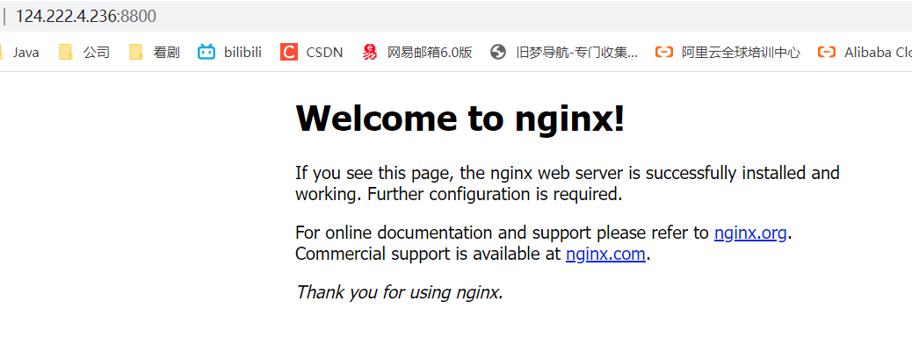 <br/>
宿主机的ip:8800即出现nginx页面 <br/>
如果出不来这个界面，可能是命令不对，也可能是防火墙的问题 <br/>

**给镜像添加一个软连接并改名和标签** <br/>
Note：软连接的IMAGE ID是同一个 <br/>
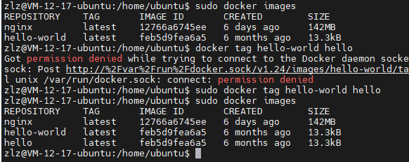 <br/>

**容器和宿主机之间文件复制** <br/>
 <br/>
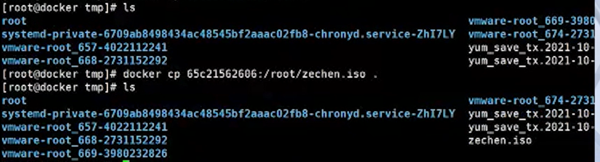 <br/>
## 更新镜像
在运行的容器内使用 apt-get update 命令进行更新 <br/>
在完成操作之后，输入 exit命令来退出这个容器。 <br/>
此时ID为e218edb10161的容器，是按我们的需求更改的容器。我们可以通过命令 docker commit来提交容器副本。 <br/>
```
docker commit -m="has update" -a="edualiyun" e218edb10161 edualiyun/ubuntu:v2 <br/>
```
各个参数说明： <br/>

- -m:提交的描述信息 <br/>
- -a:指定镜像作者 <br/>
- e218edb10161：容器 <br/>
- edualiday/ubuntu:v2:指定要创建的目标镜像名 <br/>
## 案例
 <br/>
 <br/>

案例一： <br/>
```
sudo docker search busybox <br/>
sudo docker pull busybox <br/>
sudo docker tag busybox box:v1 <br/>
sudo docker tag busybox box:v2 <br/>
sudo docker rmi box:v2 <br/>
sudo docker images <br/>
```
案例二： <br/>
```
sudo docker search centos <br/>
sudo docker pull centos:7 <br/>
sudo docker run -itd centos:7 <br/>
sudo docker ps #查看是否启动成功 <br/>
sudo touch magegood.txt #在/root/下创建文件 <br/>
sudo docker cp /root/magegood.txt 容器ID:/usr/local/ <br/>
#进入容器查看容器里对应目录下是否有了文件
sudo docker exec -it [容器ID] /bin/bash  <br/>
  ls /usr/local/ <br/>
  exit <br/>
#不进入容器查看容器里对应目录下的文件
sudo docker exec -it [容器ID] ls /usr/local/ <br/>
sudo docker cp 容器ID:/usr/local/magegood.txt /tmp/ <br/>
sudo docker stop 容器ID <br/>
sudo docker rm 容器ID <br/>
```
## 命令速查表
### 容器生命周期管理

- run <br/>
- start/stop/restart <br/>
- kill <br/>
- rm <br/>
- pause/unpause <br/>
- create <br/>
- exec <br/>
### 容器操作

- ps <br/>
- inspect <br/>
- top <br/>
- attach <br/>
- events <br/>
- logs <br/>
- wait <br/>
- export <br/>
- port <br/>
### 容器rootfs命令

- commit <br/>
- cp <br/>
- diff <br/>
### 镜像仓库

- login <br/>
- pull <br/>
- push <br/>
- search <br/>
### 本地镜像管理

- images <br/>
- rmi <br/>
- tag <br/>
- build <br/>
- history <br/>
- save <br/>
- import <br/>
### info|version

- info <br/>
- version <br/>
# dockerfile-构建镜像
 <br/>
 <br/>
参数说明： <br/>

- -t ：指定要创建的目标镜像名 <br/>
- . ：Dockerfile 文件所在目录，可以指定Dockerfile 的绝对路径 <br/>


图1-5-1所示是一个Dockerfile，是用来描述构建一个golang的application。FORM golang表示以下的构建步骤是基于golang镜像进行构建的。 <br/>
 <br/>
图1-5-1 <br/>
图1-5-2中WORKDIR表示把接下来的构建步骤都在相应的具体目录下进行. <br/>
 <br/>
图1-5-2 <br/>
图1-5-3中 copy表示可以把数集上的文件拷贝到容器内，也就是拷贝到镜像内。 <br/>
 <br/>
图1-5-3 <br/>
图1-5-4中RUN表示在这个具体的文件系统内执行相应的动作，比如go get表示下载golang程序的依赖，把它出来的二进制移到可检索的地方，比如目录下面。运行完毕之后，就可以得到golang的一个application。 <br/>
 <br/>
图1-5-4 <br/>
图1-5-5中CMD表示使用这样的一个镜像的时候，默认的程序的名字。把这里的名字叫做“app”。 <br/>
 <br/>
图1-5-5 <br/>
## 案例
 <br/>
 <br/>
 <br/>
 <br/>
 <br/>
 <br/>
制作过镜像没？用什么制作的？制作过什么镜像？ <br/>
做过；dockerfile；你看需要什么就能制作什么镜像 <br/>

官方推荐用COPY，不推荐使用ADD，类似COPY，过程可以解压，但有些压缩包无法解压，rar可以解压，tar不可解压。 <br/>

dockerfile的所有的命令都是用的越少越好。 <br/>

什么是前台执行的命令，什么是后台执行的命令？ <br/>
前台命令：如top；tail -f ，不会自动退出的 <br/>
 <br/>
后台命令：一般常用的那些命令都是后台命令，会自动退出 <br/>

为什么CMD只能写一条命令？PID为1的挂掉了，docker会自动关闭 <br/>

```
# 装apache
# 如果不加-y，交互是进行不下去的
yum -y install httpd <br/>

#启动apache
systemctl start httpd <br/>
```
nginx在装之前需要有个yum源 <br/>

# 容器运行时的生命周期
## 单进程模型
容器是一组具有隔离特性的进程集合，在docker run的时候，会选择一个镜像来提供独立的文件系统，以及指定相应的运行程序。所指定的这个运行程序称之为Init进程，使用进程的时候，会发现Init进程启动时容器也随之启动，当Init进程退出了之后，容器也随之退出了，就可以认为容器的生命周期和Init进程是一致的。 <br/>
容器内不只有一个Init进程，Init进程本身可以产生其他的执行层，或者是通过docker exec产生出来的运维操作也属于Init进程管理的范围内。当Init进程退出的时候他所负责的所有子进程也随之退出。也是为了防止资源的泄漏。 <br/>
## 可能会产生的问题？
一个应用里面的程序可能是一个有状态的，可能产生一些有非常重要的数据，当一个程序退出被删除之后的数据也就随着丢失了，这对于应用方而言是不能接受的，所以需要将容器所产生出来的重要数据，给持久化。 <br/>
## 数据持久化
容器能将数据持有化到指定的目录上把这个目录，称之为数据卷。数据卷的生命周期是独立于容器的生命周期的，也就是说容器的创建运行停止删除，都跟数据卷的生命周期没有任何关系。 <br/>
数据卷通常情况下，有两种使用方法： <br/>
1.通过bind的方式，也就是把输入集上的目录，直接bind到容器内，图2-2-1中可以通过-v加参数的方式来进行。-v左边的参数表示是宿主内的目录而右边的参数表示容器内的目录。busybox可以将当时容器运行的时间写都到tmp目录下面来可以对所有的数据进行统一管理。 <br/>
2.把这个目录的管理交给容器的运行引擎，也就是demo，首先，可以通过docker volume 方式来创建一个数据卷，这个数据卷的目录由docker来管理。采用同样的方式，这个命令的左边部分变成volume的名字。然后运行结果跟第一种是一样的。 <br/>
## 小结
数据卷是独立于容器的运行时而存在的。它可以帮助我们。快速的进行数据的持久化。这个就是我们所介绍的容器运营时的生命周期。 <br/>
# 数据持久化
想好哪些文件是要永久存储的，而不会跟着容器的消逝而消逝 <br/>
 <br/>
方式一：推荐 <br/>
 <br/>
 <br/>
方式三不用，不会持久化 <br/>
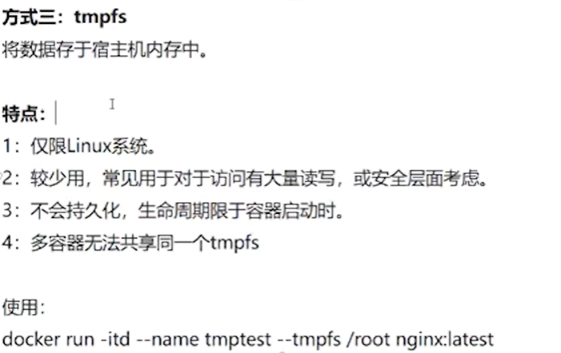 <br/>

-v /root:/tmp #把宿主机的/root目录映射到容器的/tmp目录 <br/>

# harbor仓库
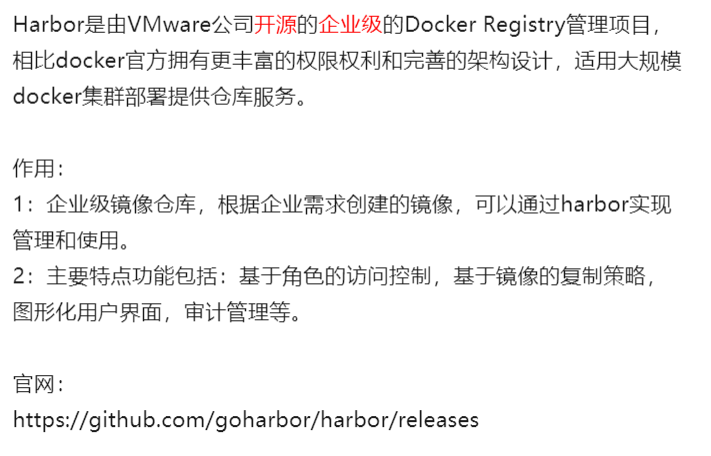 <br/>
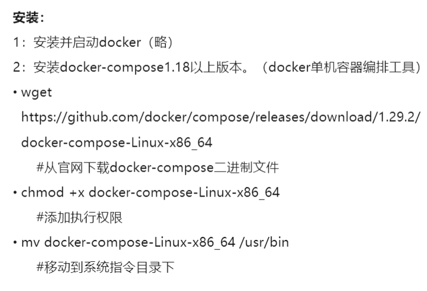 <br/>
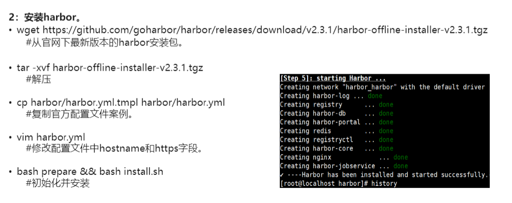 <br/>
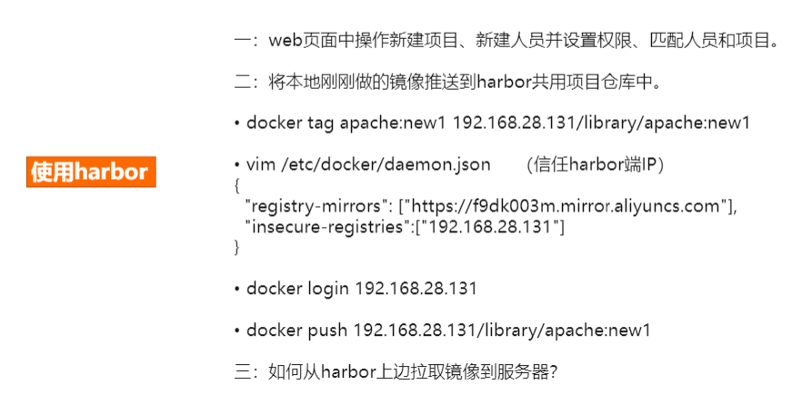 <br/>

# moby容器引擎架构
moby是目前最流行的一个容器管理引擎。moby daemon会提供有关于容器、镜像、网络以及volume的管理依赖一个最重要的组件就是containerd，containerd是一个容器引擎，是管理引擎是独立于moby daemon。可以对像提供有关于容器镜像的相关管理。 <br/>
容器可能是由不同的容器运行时所创建出来，现在具有很多种容器虚拟化技术的技术方案。在这些不同容器运行时的解决方案下，需要提供一个灵活的插件化管理，这个shim可以针对不同的容器运营时所开发的，可以从containerd中脱离出来，通过插件的形式进行管理，除了能够支持插件化之外，动态接管还具备最重要的一个特性，就是不会影响到现有的容器运行。当我们moby daemon意外退出的时候，容器就没人管理了，那么他也会随之消失退出，会影响应用的运行，所以说containerd的存在意义是非常重要的，它实现了一个动态接管的能力，这是整体的moby容器管理引擎的架构分析。 <br/>
# 微服务
## 单体应用的困境
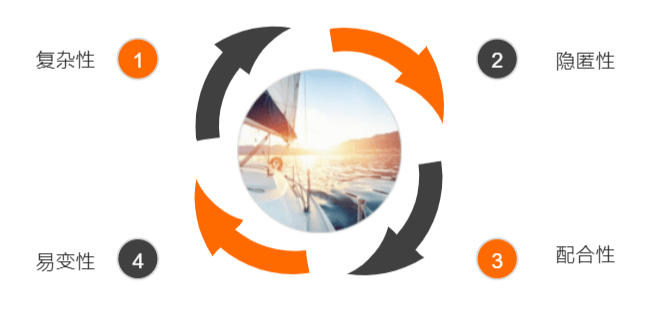 <br/>
 <br/>
 <br/>
 <br/>
 <br/>
## 微服务
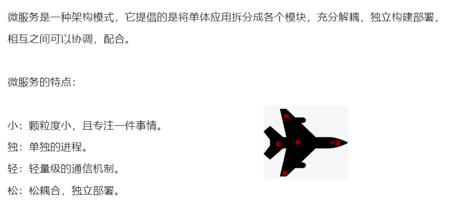 <br/>
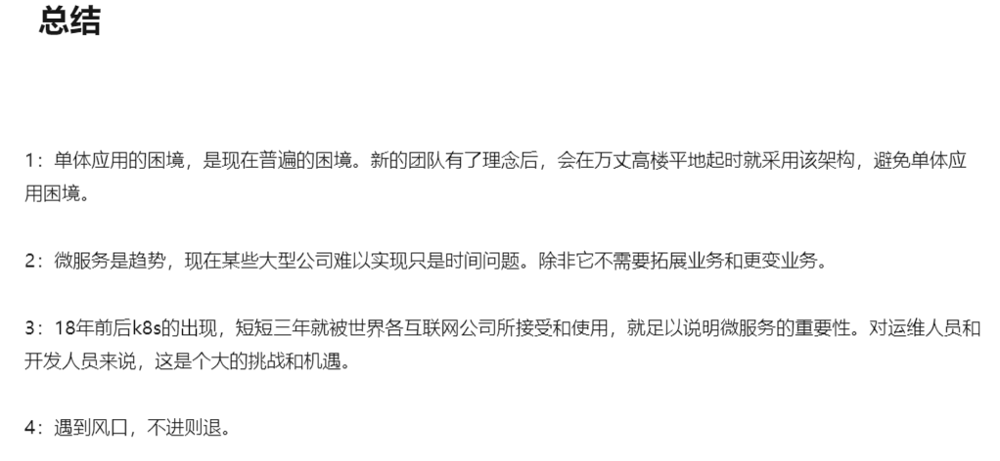 <br/>

# 云原生

 <br/>
课程预备知识 <br/>
l  Linux操作系统。通识性基础即可，能够在Linux环境下进行开发最佳； <br/>
l  计算机与程序设计基础。入门级工程师或高年级本科生水平即可； <br/>
l  容器的使用基础。能够使用Docker部署简单应用，有Docker化应用开发经验最佳。可参考[https://docs.docker.com/get-started/part2/](https://docs.docker.com/get-started/part2/) <br/>

1、云原生的定义： <br/>
云原生是一条使用户能低心智负担的、便捷的、可扩展可复制的方式，能最大化利用“云”的能力，发挥”云“的价值的最佳路线。云原生实际上是指导我们去对软件进行架构和设计的思想，云原生的愿景是让软件从诞生起就生在云上、长在云上的全新的软件开发、发布和运维模式。 <br/>
思考：集装箱（容器技术）为什么具有革命性？ <br/>
容器技术使我们的应用能够有完整的自包含的定义方式，因此应用才能有敏捷的、可扩展可复制的方式发布在云上，发挥出云的能力，这就是容器技术对云计算产生深远影响的根本原因，因此容器技术被视作云原生技术的核心地盘。 <br/>

2、云原生的技术范畴 <br/>
 <br/>

3、云原生思想的两个理论基础 <br/>
不可变基础设施，目前已实现了容器镜像。 <br/>
云应用编排理论，目前实现了容器设计模式。 <br/>

4、基础设施向云演进的过程 <br/>
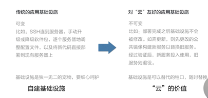 <br/>

意义： <br/>
l  基础设施一致性和可靠性：容器镜像；自包含；可漂移 <br/>
l  简单可预测的部署与运维：自描述，自运维；流程自动化；容易水平扩展；可快速复制管控系统与支撑组件 <br/>

5. 云原生关键技术点 <br/>
l  自包含、可定制的应用镜像 <br/>
l  应用快速部署与隔离能力 <br/>
l  应用基础设施创建和销毁的自动化管理 <br/>
l  可复制的管控系统与支撑组件 <br/>

本节总结： <br/>
l  云原生具备重要意义，它是云时代技术人自我提升的必备路径 <br/>
l  “云原生”定义了一条云时代应用从开发到交付的最佳路径 <br/>
