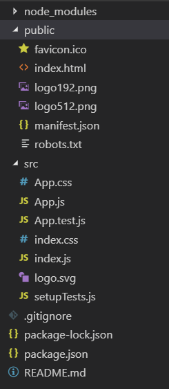
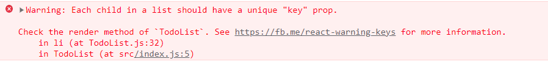
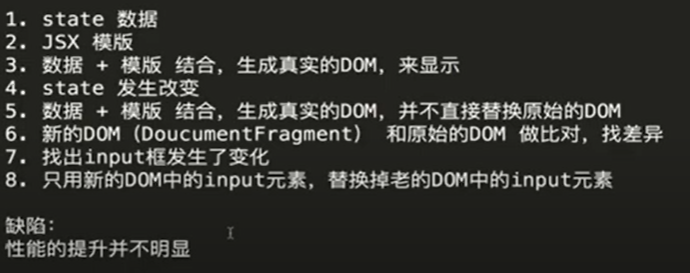
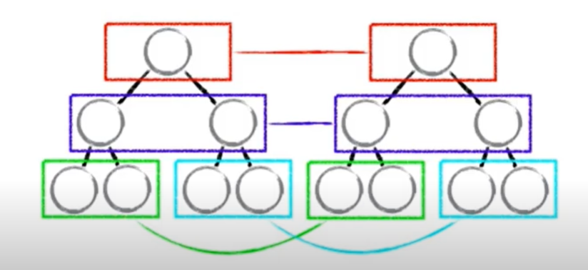
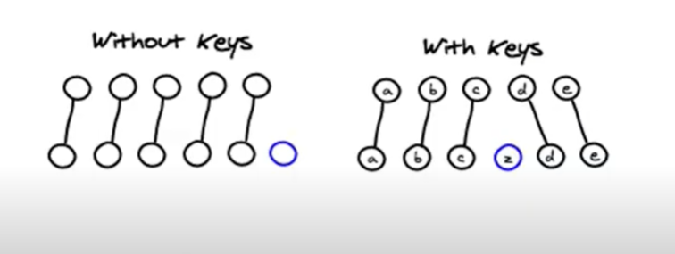
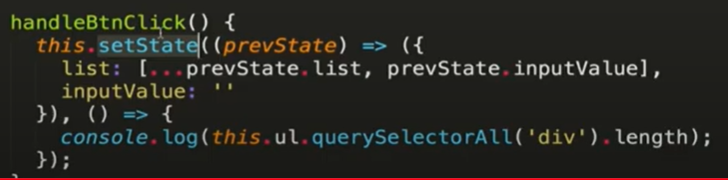
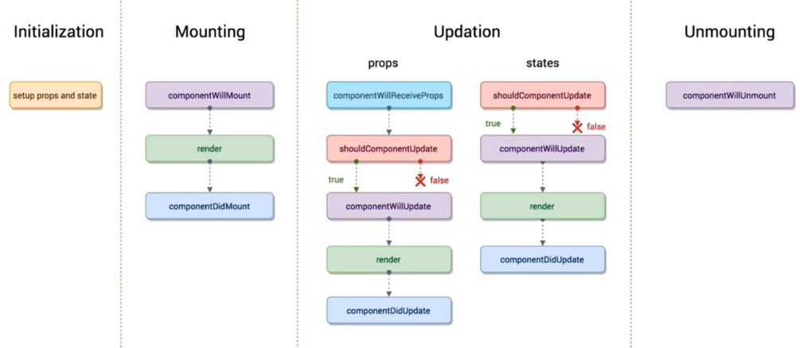
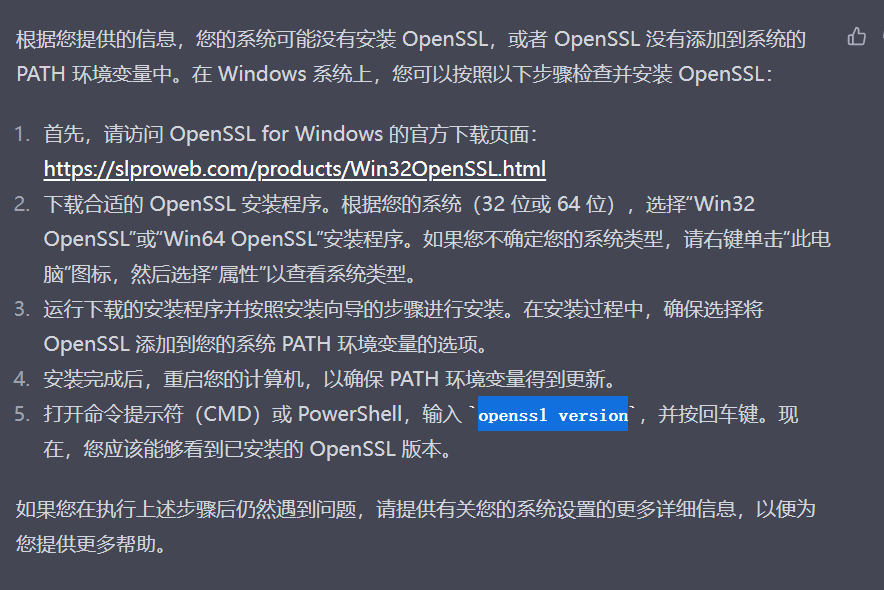

# 简书实践
# 课程导学
[https://coding.imooc.com/class/229.html#Anchor](https://coding.imooc.com/class/229.html#Anchor) <br/>
## 课程内容
 <br/>
## 项目
 <br/>
## 技术点
 <br/>
## 学习前提
 <br/>
## 课程收获
 <br/>
## React JS、React Native、React VR原理类似，一通百通
[React与React Native的区别](https://juejin.cn/post/7124620523316707341) <br/>
React Native：使用 React 来创建 Android 和 iOS 的原生应用 <br/>
React VR（React360）：使用React来创建360全景VR体验 <br/>
 <br/>
# 用脚手架工具Create-react-app来编码
## 前端开发环境准备——安装NodeJS
NodeJS <br/>
what：类似于Java运行环境JVM，NodeJS是JavaScript运行环境，也就是JS解析引擎。 <br/>
why need：在前端进入模块化开发后，需要依赖许多转换工具，将我们的源码转变为浏览器能够识别的代码。这一类工具通常都用javaScript编写，所以我们需要本地的JS解析引擎NodeJS去运行这些工具。只有安装上nodejs，才能用npm <br/>
download：[https://nodejs.org/zh-cn/download/](https://nodejs.org/zh-cn/download/) <br/>
 <br/>
安装完成后验证 <br/>
```json
node -v
npm -v
```
## Create React App
官方文档：[https://reactjs.org/docs/create-a-new-react-app.html#create-react-app](https://reactjs.org/docs/create-a-new-react-app.html#create-react-app) <br/>
### Task1  在桌面上创建脚手架工具
Step1：打开命令行定位到桌面 <br/>
Tips：Windows将命令行定位到桌面路径：Shift+鼠标右键——>在终端中打开 <br/>
 <br/>
Step2：执行命令在桌面上创建名称为todolist的脚手架 <br/>
 <br/>
```
npx create-react-app todolist
```
Step3：运行脚手架，展示localhost:3000 <br/>
```
cd todolist
npm start
```
 <br/>
### Task2 问题解决
1.当前react18，想学react16 <br/>
[create-react-app时指定react版本的方法](https://blog.csdn.net/qq_34626094/article/details/128869532)（Note：用此没有尝试成功） <br/>
Tips：node_modules太大，直接删除文件，不送入回收站的快捷键：Shift+Delete <br/>

2.nodejs版本过高报错 <br/>
[ Error: error:0308010c:digital envelope routines::unsupported](https://www.freecodecamp.org/chinese/news/error-error-0308010c-digital-envelope-routines-unsupported-node-error-solved/) <br/>
在react-scripts start中添加 --openssl-legacy-provider <br/>
```
react-scripts --openssl-legacy-provider start
```

3.端口起了很多个，不是3000了 <br/>
打开任务管理器，把所有bash（命令行）和nodejs结束任务 <br/>

4.更新依赖版本 <br/>
1）在package.json里改版本信息 <br/>
2）删除node_modules和package-lock.json <br/>
3）在该目录下打开命令行，执行npm install <br/>
4）可以看到生成了新的node_modules和package-lock.json <br/>
5）运行项目 npm start <br/>
### Task3 了解工程目录文件
 <br/>
node_modules — 项目依赖包文件夹 <br/>
public — 静态资源文件夹 <br/>

- favicon.icon — 浏览器上侧左边的图标 <br/>
- index.html — 主页面（重要） <br/>
- logo192.png — logo图 <br/>
- logo512 — logo图 <br/>
- manifest.json — 应用加壳的配置文件（如果是一个 app ，定义 app 的图标 网址 主题颜色等） <br/>
- robots.txt — 爬虫协议文件 <br/>

src — 源码文件夹 <br/>

- App.css — App组件的样式 <br/>
- App.js — App组件 （重要） <br/>
- App.test.js — 给App测试 <br/>
- index.css — 样式 <br/>
- index.js — 入口文件 （重要） <br/>
- logo.svg — logo图（页面上展示的） <br/>
- reportWebVitals.js — 页面性能分析文件（需要web-vitals库的支持） <br/>
- setupTests.js — 组件单元测试的文件（需要jest-dom库的支持） <br/>

gitignore — git的选择性上传的配置文件（配置不会上传的文件信息） <br/>
package.json — Webpack配置和项目包管理文件 <br/>

包含项目中依赖的第三方包（包的版本）和一些常用命令配置都在这个里边进行配置，当然脚手架已经为我们配置了一些了，目前位置，我们不需要改动。如果你对webpack了解，对这个一定也很熟悉。

如果你的node_modules包删掉了，也可以借助package.json内容，执行npm install 或yarn install 重新生成node_modules。 <br/>

README.md ----项目介绍文件 <br/>
### Task4 了解组件——前端组件化思想
前端组件化：页面上各个部分都是一个个组件 <br/>
 <br/>
```html <br/>
<!DOCTYPE html>
<html lang="en">
  <head>
    <meta charset="utf-8" />
    <link rel="shortcut icon" href="%PUBLIC_URL%/favicon.ico" />
    <meta name="viewport" content="width=device-width, initial-scale=1" /> 
    <meta name="theme-color" content="#000000" />
    <title>Todolist</title>
  </head>
  <body>
    <noscript>You need to enable JavaScript to run this app.</noscript> 
    <div id="root"></div>
  </body>
</html>

```
```javascript
import React from 'react';
import ReactDOM from 'react-dom';

// 引入App组件（App这个是一个组件）
// 如果不写是什么文件，脚手架工具会自动找.js的文件
import App from './App';

// 把App组件挂载到id为root的DOM节点上
// 从F12，Elements可看出，如下图
// <App />语法是JSX语法，这个需要import React from 'react';，否则没法编译
ReactDOM.render(<App />, document.getElementById('root'));
```
 <br/>
```javascript
import React, { Component } from 'react';

// import { Component } from 'react';
// 等价于 
// import React from 'react'; 
// const Component = React.Component; 

class App extends Component { 
  render() { 
    //render函数里的标签，也是JSX语法，这个需要import React from 'react';，否则没法编译 
    return ( 
      <div> 
      	hello world 
      </div> 
    ); 
  } 
} 

export default App; 
```

```javascript 
import React from 'react'; 

// 定义一个类class，extends React.Component后就是一个组件了 
class App extends React.Component { 
  // 这个组件显示什么，由render函数决定 
  // render返回什么，这个组件就展示什么内容 
  render() { 
    return ( 
      <div> 
      	hello world 
      </div> 
    ); 
  } 
} 

// 导出App组件 
export default App; 
```
### Task5 了解JSX语法
JSX语法：在js中写html的标签 <br/>
JSX语法中，如果我们要使用自己创建的组件，组件必须以大写字母开头 <br/>
```javascript 
<App /> 
```
Tips：看到标签以小写字母开头，是h5标签；看到标签以大写字母开头，是组件。 <br/>
# React基础精讲（视图层框架）
> React的基础语法，设计理念以及围绕React展开的一些编程思维 <br/>

## Task1 编写TodoList功能
```javascript 
import React, { Component } from 'react'; 

class TodoList extends Component { 
  render() { 
    return ( 
      // render函数返回，最外层有2个标签，而JSX语法要求最外层只有1个标签，所以会报如下图的错误 
      <div><input /><button>提交</button></div> 
      <ul> 
        <li>学英语</li> 
        <li>Learning React</li> 
      </ul> 
    ) 
  } 
} 

export default TodoList; 
```
 <br/>
改进1：在最外层包一层div标签 <br/>
从F12的Elements可看出，包裹的那层div在id为root的DOM节点下 <br/>
 <br/>
```javascript 
import React, { Component } from 'react'; 

class TodoList extends Component { 
  render() { 
    return ( 
      // 在最外层包一层div标签 
      <div> 
        <div><input /><button>提交</button></div> 
        <ul> 
          <li>学英语</li> 
          <li>Learning React</li> 
        </ul> 
      </div> 
    ) 
  } 
} 

export default TodoList; 
```
改进2：用Fragment替代div包裹 <br/>
从F12的Elements可看出，包裹的那层消失了 <br/>
 <br/>
```javascript 
import React, { Component, Fragment } from 'react'; 

class TodoList extends Component { 
  render() { 
    return ( 
      <Fragment> 
        <div><input /><button>提交</button></div> 
        <ul> 
          <li>学英语</li> 
          <li>Learning React</li> 
        </ul> 
      </Fragment> 
    ) 
  } 
} 

export default TodoList; 
```
## Task2 React中的响应式设计思想和事件绑定
以前直接操作DOM，而React不直接操作DOM，而是操作数据。 <br/>
```javascript 
import React, { Component, Fragment } from 'react'; 

class TodoList extends Component { 

    // constructor会优先调用 
    constructor(props) { 
        // 调用父类Component的构造器 
        super(props); 
        // React定义数据，要定义在state里面，this.state叫做组件的状态 
        this.state = { 
            inputValue: 'hello', 
            list: [] 
        } 
    } 

    render() { 
        return ( 
            <Fragment> 
                <div>                     
                    <input 
                        value={this.state.inputValue} 
                        onChange={this.handleInputChange} 
                    /> 
                    <button>提交</button> 
                </div> 
                <ul> 
                    <li>学英语</li> 
                    <li>Learning React</li> 
                </ul> 
            </Fragment> 
        ) 
    } 

    handleInputChange(e) { 
        // 在F12的Console看 
        console.log(e.target.value) 
      	// 结果是 undefined 
		console.log(this) 
        // 这行会报错，this指代错误 
        this.state.inputValue = e.target.value; 
    } 
} 

export default TodoList; 
```
 <br/>
改进：onChange={this.handleInputChange}改为onChange={this.handleInputChange.bind(this)} <br/>
```
import React, { Component, Fragment } from 'react'; 

class TodoList extends Component { 

    // constructor会优先调用 
    constructor(props) { 
        // 调用父类Component的构造器 
        super(props); 
        // React定义数据，要定义在state里面，this.state叫做组件的状态 
        this.state = { 
            inputValue: 'hello', 
            list: [] 
        } 
    } 

    render() { 
        return ( 
            <Fragment> 
                <div> 
                    <input 
                        // 用ES6的this.state.inputValue，需加花括号{} 
                        value={this.state.inputValue} 
                        // 通过事件绑定bind(this)对函数handleInputChange的作用域进行变更 
                        onChange={this.handleInputChange.bind(this)} 
                    /> 
                    <button>提交</button> 
                </div> 
                <ul> 
                    <li>学英语</li> 
                    <li>Learning React</li> 
                </ul> 
            </Fragment> 
        ) 
    } 

    handleInputChange(e) { 
        // 想要改变state里的值，要用setState函数。this.state.inputValue = e.target.value;这种写法是错的 
        this.setState({ 
            inputValue: e.target.value 
        }) 
    } 
} 

export default TodoList; 
```
## Task3 TodoList新增删除功能实现与JSX语法补充
```
.input { 
    border: 1px solid red; 
} 
```
```
import React, { Component, Fragment } from 'react'; 
import './style.css' 

class TodoList extends Component { 

    // constructor会优先调用 
    constructor(props) { 
        // 调用父类Component的构造器 
        super(props); 
        // React定义数据，要定义在state里面，this.state叫做组件的状态 
        this.state = { 
            inputValue: '', 
            list: [] 
        } 
    } 

    render() { 
        return ( 
            // Fragment是一个占位符，本质是一个组件 
            <Fragment> 
                {/* JSX中写注释，用这种写法，或紧邻的下面的写法 */} 
                <div> 
                    { 
                        // 点击'输入内容'，光标会移动到输入框里 
                        // label的for标签要替换为htmlFor 
                    } 
                    <label htmlFor="insertArea">输入内容</label> 
                    <input 
                        id="insertArea" 
                        // 用className而不是class，定义样式 
                        className='input' 
                        // 用ES6的表达式，需加花括号{} 
                        value={this.state.inputValue} 
                        // Note：onChange的第二个词要大写 
                        // 通过事件绑定bind(this)对函数handleInputChange的作用域进行变更 
                        onChange={this.handleInputChange.bind(this)} 
                    /> 
                    <button onClick={this.handleBtnClick.bind(this)}>提交</button> 
                </div> 
                <ul> 
                    { 
                        this.state.list.map((item, index) => { 
                            // 用map循环时，每个需要有一个不同的唯一的key，否则Console会有Warning，如下图1。 
                            // 现在可以用index作为key的值，但是不推荐，不太好，后续会有优化。 
                            return ( 
                                <li  
                                    key={index}  
                                    onClick={this.handleItemDelete.bind(this, index)} 
                                    // 不转义，标签会生效，外层{}代表是js表达式，内层{}代表是js对象，属性__html，内容是不想转义的内容 
                                    // eg. <h1>学习</h1>，会变大，见下图2。 
                                    dangerouslySetInnerHTML={{__html: item}} 
                                > 
                                </li> 
                            ) 
                        }) 
                    } 
                </ul> 
            </Fragment> 
        ) 
    } 

    handleInputChange(e) { 
        // 想要改变state里的值，要用setState函数。this.state.inputValue = e.target.value;的写法是错的 
        this.setState({ 
            inputValue: e.target.value 
        }) 
    } 

    handleBtnClick() { 
        this.setState({ 
            // ...是展开运算符，...this.state.list是将list的内容进行拷贝作为一个新的数组，和新添加的拼成新的list 
            list: [...this.state.list, this.state.inputValue], 
            inputValue: '' 
        }) 
    } 

    handleItemDelete(index) { 
        // React的 immutable 概念：state不允许我们做任何的改变，只能通过setState进行修改 
        console.log(index) 
        const list = [...this.state.list]; 
        // index 表示要删除元素的索引位置，1 表示要删除的元素数量
        list.splice(index, 1); 
        this.setState({ 
            list: list 
        }) 
    } 
} 

export default TodoList; 
```
图1 <br/>
 <br/>
图2 <br/>
 <br/>
## Task4 拆分组件与组件之间的传值
各个组件形成树形结构 <br/>
 <br/>
```
import React, { Component, Fragment } from 'react'; 
import './style.css'; 
import TodoItem from './TodoItem'; 

// 父组件 
class TodoList extends Component { 

    constructor(props) { 
        super(props); 
        this.state = { 
            inputValue: '', 
            list: [] 
        } 
    } 

    render() { 
        return ( 
            <Fragment> 
                <div> 
                    <label htmlFor="insertArea">输入内容</label> 
                    <input 
                        id="insertArea" 
                        className='input' 
                        value={this.state.inputValue} 
                        onChange={this.handleInputChange.bind(this)} 
                    /> 
                    <button onClick={this.handleBtnClick.bind(this)}>提交</button> 
                </div> 
                <ul> 
                    { 
                        this.state.list.map((item, index) => { 
                            return ( 
                                // 父组件如何向子组件传递值? 通过属性的形式传递，既可传递数据，又可传递方法 
                                <TodoItem content={item} index={index} deleteItem={this.handleItemDelete.bind(this)}/> 
                            ) 
                        }) 
                    } 
                </ul> 
            </Fragment> 
        ) 
    } 

    handleInputChange(e) { 
        this.setState({ 
            inputValue: e.target.value 
        }) 
    } 

    handleBtnClick() { 
        this.setState({ 
            list: [...this.state.list, this.state.inputValue], 
            inputValue: '' 
        }) 
    } 

    handleItemDelete(index) { 
        console.log(index) 
        const list = [...this.state.list]; 
        list.splice(index, 1); 
        this.setState({ 
            list: list 
        }) 
    } 
} 

export default TodoList; 
```
```
import React, { Component } from 'react'; 

// 子组件 
class TodoItem extends Component { 
    
    constructor(props) { 
        super(props); 
        this.handleClick = this.handleClick.bind(this); 
    } 

    render() { 
        // 子组件如何接收父组件传递过来的值? 通过this.props.xxx来接收 
        return (<div onClick={this.handleClick}>{this.props.content}</div>) 
    } 

    handleClick() { 
        // 子组件通过调用父组件方法，改变父组件数据 
        this.props.deleteItem(this.props.index); 
    } 
} 

export default TodoItem; 
```
## Task5 代码优化——从此开始规范代码
```javascript 
import React, { Component } from 'react'; 

// 子组件 
class TodoItem extends Component { 
    
    constructor(props) { 
        super(props); 
        this.handleClick = this.handleClick.bind(this); 
    } 

    render() { 
        const { content } = this.props; 
        // 子组件如何接收父组件传递过来的值? 通过this.props.xxx来接收 
        return ( 
            <div onClick={this.handleClick}> 
                {content} 
            </div> 
        ) 
    } 

    handleClick() { 
        // 子组件通过调用父组件方法，改变父组件数据 
        const { deleteItem, index } = this.props; 
        deleteItem(index); 
    } 
} 

export default TodoItem; 
```

```javascript 
import React, { Component, Fragment } from 'react'; 
import TodoItem from './TodoItem'; 
import './style.css'; 

// 父组件 
class TodoList extends Component { 

    constructor(props) { 
        super(props); 
        this.state = { 
            inputValue: '', 
            list: [] 
        } 
        this.handleInputChange = this.handleInputChange.bind(this); 
        this.handleBtnClick = this.handleBtnClick.bind(this); 
        this.handleItemDelete = this.handleItemDelete.bind(this); 
    } 

    render() { 
        return ( 
            <Fragment> 
                <div> 
                    <label htmlFor="insertArea">输入内容</label> 
                    <input 
                        id="insertArea" 
                        className='input' 
                        value={this.state.inputValue} 
                        onChange={this.handleInputChange} 
                    /> 
                    <button onClick={this.handleBtnClick}>提交</button> 
                </div> 
                <ul> 
                    {this.getTodoItem()} 
                </ul> 
            </Fragment> 
        ) 
    } 

    getTodoItem() { 
        return this.state.list.map((item, index) => { 
            return ( 
                // 父组件如何向子组件传递值? 通过属性的形式传递，既可传递数据，又可传递方法 
                <TodoItem  
                    key={index}  
                    content={item}  
                    index={index}  
                    deleteItem={this.handleItemDelete} 
                /> 
            ) 
        }) 
    } 

    handleInputChange(e) { 
        const value =  e.target.value; 
        // this.setState 里的() => 后面, ()代表return, {} 代表多条语句, 如有多条语句，return字样要显示出来 
        this.setState(() => ({ 
            inputValue: value 
        })); 
    } 

    handleBtnClick() { 
        this.setState((prevState) => ({ 
            list: [...prevState.list, prevState.inputValue], 
            inputValue: '' 
        })); 
    } 

    handleItemDelete(index) { 
        
        this.setState((prevState) => { 
            const list = [...prevState.list]; 
            list.splice(index, 1); 
            return {list} 
        }); 
    } 
} 

export default TodoList; 
```
## Task6 React的特点
 <br/>
- 声明式开发：比起命令式开发，可以减少很多DOM操作的代码量。声明式开发如同有图纸就行，命令式开发如同要自己垒砖块。 <br/>
- 可以与其他框架并存：除了用React操作的DOM，其他DOM可以是其他框架，互不影响。 <br/>
- 组件化：React就是一个个组件组成的组件树，组件之间相互操作。 <br/>
- 单向数据流：父组件可向子组件传值，但传的值是只读的，子组件没法修改，只能通过调用父组件的方法来间接修改父组件的值。优点：代码容易维护，避免排查定位复杂 <br/>
- 视图层框架：组件之间的传值，并不负责，交给数据层框架来做。eg.紫色向邻近右上的灰色球传值，需要传到最上层，再传给灰色球，如果光通过React来处理，需要很多组件的参与，这就需要配合数据层框架来做。 <br/>
 <br/>
- 函数式编程：代码容易维护；容易自动化测试。 <br/>
# React高级内容
> React高级部分内容，包含PropTypes，生命周期函数，虚拟Dom，数据mock，动画实现等 <br/>

## Task1 React developer tools 安装及使用
 <br/>
线上版本代码：蓝色 <br/>
本地开发代码：红色 <br/>
不使用React开发的网页：灰色 <br/>
 <br/>
## Task2 PropTypes 与 DefaultProps 的应用
PropTypes：属性接收强校验，校验类型和是否必填 <br/>
DefaultProps：属性默认值 <br/>
如果不满足校验，Console会Warning <br/>
 <br/>
```javascript 
import React, { Component } from 'react'; 
import PropTypes from 'prop-types'; 

class TodoItem extends Component { 
    
    constructor(props) { 
        super(props); 
        this.handleClick = this.handleClick.bind(this); 
    } 

    render() { 
        const { content, test } = this.props; 
        return ( 
            <div onClick={this.handleClick}> 
                {test} - {content} 
            </div> 
        ) 
    } 

    handleClick() { 
        const { deleteItem, index } = this.props; 
        deleteItem(index); 
    } 
} 

TodoItem.propTypes = { 
    test: PropTypes.string.isRequired, 
    content: PropTypes.string, 
    deleteItem: PropTypes.func, 
    index: PropTypes.number 
} 

TodoItem.defaultProps = { 
    test: 'hello world' 
} 

export default TodoItem; 
```
## Task3 props，state 与 render 函数的关系
React是数据驱动的框架：数据发生变化，页面就会跟着变化 <br/>
原理是什么呢？ <br/>

- 页面是由render函数渲染出来的，当组件的state或者props发生改变时，render函数就会重新执行 <br/>
- 当父组件的render函数被运行时，它的子组件的render都将被重新运行一次 <br/>
## Task4 React 中的虚拟DOM
1、最差 <br/>
 <br/>
2、改进 <br/>
 <br/>
减少了DOM替换的任务，增加了DOM比对的任务，所以性能提升并不明显 <br/>
3、React 中的虚拟DOM改进 <br/>
 <br/>
虚拟DOM是一个JS对象，JS创建一个JS对象很简单，JS对象相互比较也很简单，不太耗性能，但是创建DOM和DOM相互比较耗挺大性能。 <br/>
减少了对真实DOM的创建和真实DOM的对比，所以极大的提升了性能。 <br/>
## Task5 深入了解虚拟DOM
转化过程：JSX模板 --> React.createElement(xxx) --> 虚拟DOM（JS对象） --> 真实的DOM <br/>
 
虚拟DOM的优点 <br/>
1.性能提升了 <br/>
2.它使得跨端应用得以实现。React Native <br/>
## Task6 虚拟 DOM 中的 Diff 算法
setState函数是异步函数，时间相近的多个setState一起执行后看Diff差异，减少DOM比对的次数 <br/>
 <br/>
同层比对：算法简单，一层一层比较，比对速度块，虽然可能造成一些没有变的DOM部分重新渲染的浪费。 <br/>
一旦找到不匹配的，就替换掉下面的，下面的就不比对了。 <br/>
 <br/>
为什么列表循环时要引入key值？方便比对，提高比对性能 <br/>
 <br/>
不用index作为key值的原因：会导致key值不稳定（如果删掉第1项，之后项所有的key值都会发生变化，都没法按key进行比较） <br/>
 <br/>
使用一个稳定的内容作为key值才是正确的做法 <br/>
 <br/>
## Task7 React 中 ref 的使用
ref是reference的简写，引用的意思。 <br/>
ref是React里用来直接获取DOM元素的，不推荐使用，只有复杂情况只能用此时才使用。 <br/>
 <br/>
Note：setState和ref结合使用时，如果希望setState执行完成后才执行，要放在setState的第2个参数里。因为setState是异步函数，执行完才会回调第2个参数。 <br/>
 <br/>
## Task8 React 的生命周期函数（8种）
生命周期函数（又称钩子）：指在某一个时刻组件会自动调用执行的函数 <br/>
render函数就是一个React的生命周期函数。 <br/>
constructor函数是一个生命周期函数，但是在ES6语法中就有的，不是React独有的。 <br/>
一个组件的生命周期：初始化、挂载、更新、解除挂载 <br/>
每个组件都是各自的生命周期函数，componentWillReceiveProps周期函数只有子组件才有。 <br/>
 <br/>
componentWillMount：在组件即将被挂载到页面的时刻自动执行 <br/>
componentDidMount：组件被挂载到页面之后，自动被执行 <br/>
shouldComponentUpdate：组件被更新前，自动被执行，询问要不要更新组件，返回值为bool值，如果返回false，就不往下进行了。 <br/>
componentWillReceiveProps：当一个组件从父组件接收了参数；如果这个组件第一次存在于父组件中，不会执行；如果这个组件之前已经存在于父组件中，才会执行。 <br/>
componentWillUnmount：当这个组件即将被从页面中剔除的时候，会被执行 <br/>
render：自定义的组件，其他生命周期函数可以不写，render函数这个必须有。 <br/>
是因为Component里内置实现了其他生命周期函数，唯独没有内置实现render。 <br/>
ComponentWillUpdate <br/>
ComponentDidUpdate <br/>
## Task9 React 生命周期函数的使用场景
使用场景1：输入内容一直变化，子组件的值45一直没变，但随着输入内容的变化渲染父组件时，同时也会渲染子组件，导致了子组件无谓的多次渲染。 <br/>
 <br/>
```javascript 
// 在子组件TodoItem里加上shouldComponentUpdate 
shouldComponentUpdate(nextProps, nextState) { 
    if (nextProps.content !== this.props.content) { 
        return true; 
    } else { 
        return false; 
    } 
} 
```

使用场景2：ajax请求写在哪里？componentDidMount是最合理的，不会有任何问题 <br/>
```javascript 
// 在项目目录里cmd执行 
npm install axios 
```
```javascript 
import axios from 'axios'; 
```
```javascript 
componentDidMount() { 
	axios.get('/api/xxx') 
  .then(()=>{alert('success')}) 
  .catch(()=>{alert('error')}) 
} 
```
## Task10 使用axios-mock-adapter实现本地数据mock
1.安装axios和axios-mock-adapter <br/>
```javascript 
npm install axios axios-mock-adapter 
```
2.创建一个模块来配置和使用axios-mock-adapter。例如，创建一个名为apiMock.js的文件 <br/>
```javascript 
import axios from 'axios'; 
import MockAdapter from 'axios-mock-adapter'; 

// 创建axios实例 
const instance = axios.create(); 

// 创建axios-mock-adapter实例 
const mock = new MockAdapter(instance); 

// 定义mock API 
mock.onGet('/api/users').reply(200, [ 
  { id: 1, name: 'John Doe' }, 
  { id: 2, name: 'Jane Doe' }, 
]); 

mock.onGet('/api/todolist').reply(200, ["我","love","你"]); 

// 导出已配置好的axios实例 
export default instance; 

```
3.在React组件中使用已配置好的axios实例，例如在App.js中 <br/>
```javascript 
import React, { useEffect, useState } from 'react'; 
import api from './apiMock'; 

function App() { 
  const [users, setUsers] = useState([]); 

  useEffect(() => { 
    async function fetchData() { 
      try { 
        const response = await api.get('/api/users'); 
        setUsers(response.data); 
      } catch (error) { 
        console.error('Error fetching data:', error); 
      } 
    } 

    fetchData(); 
  }, []); 

  return ( 
    <div> 
      <h1>Users:</h1> 
      <ul> 
        {users.map(user => ( 
          <li key={user.id}>{user.name}</li> 
        ))} 
      </ul> 
    </div> 
  ); 
} 

export default App; 

```
拓展：本地数据mock实现方案 <br/>
 <br/>
## Task11 React 中实现 CSS 过渡动画
```javascript 
import React, { Component, Fragment } from 'react'; 
import './style.css'; 

class App extends Component { 

    constructor(props) { 
        super(props); 
        this.state = { 
            show: true 
        } 
        this.handleToggle = this.handleToggle.bind(this) 
    } 

    render() { 
        return ( 
            <Fragment> 
                <div className={this.state.show ? 'show' : 'hide'}>hello</div> 
                <button onClick={this.handleToggle}>toggle</button> 
            </Fragment> 
        ) 
    } 

    handleToggle() { 
        this.setState({ 
            show: this.state.show ? false : true 
        })             
    } 
} 

export default App; 
```
```css 
/*版本1*/ 
.show { 
  opacity: 1; 
  transition: all 1s ease-in; 
} 

.hide { 
  opacity: 0; 
  transition: all 1s ease-in; 
} 
```
```css 
/*版本2*/ 
.show { 
  /*forwards能让动画最后一帧的样式保留下来*/ 
  animation: show-item 2s ease-in forwards; 
} 

.hide { 
  /*forwards能让动画最后一帧的样式保留下来*/ 
  animation: hide-item 2s ease-in forwards; 
} 

@keyframes hide-item { 
  0% { 
    opacity: 1; 
    color: red; 
  } 
  50% { 
    opacity: 0.5; 
    color: green; 
  } 
  100% { 
    opacity: 0; 
    color: blue; 
  } 
} 

@keyframes show-item { 
  0% { 
    opacity: 0; 
    color: red; 
  } 
  50% { 
    opacity: 0.5; 
    color: green; 
  } 
  100% { 
    opacity: 1; 
    color: blue; 
  } 
} 
```
## Task12 使用 react-transition-group 实现动画
react-transition-group：一个React动画的第三方模块 <br/>
[https://github.com/reactjs/react-transition-group](https://github.com/reactjs/react-transition-group) <br/>
主文档：[https://reactcommunity.org/react-transition-group/](https://reactcommunity.org/react-transition-group/) <br/>
```css 
npm install react-transition-group --save 
```
 <br/>
此处主要讲CSSTransition、TransitionGroup <br/>
```javascript 
import React, { Component, Fragment } from 'react'; 
import { CSSTransition } from 'react-transition-group'; 
import './world.css'; 

class World extends Component { 

    constructor(props) { 
        super(props); 
        this.state = { 
            show: true 
        } 
        this.handleToggle = this.handleToggle.bind(this) 
    } 

    render() { 
        return ( 
            <Fragment> 
                <CSSTransition 
                    in={this.state.show} // 根据this.state.show的变化切换动画 
                    timeout={1000} // 动画时长，1s 
                    classNames="fade" // css样式的前缀 
                    unmountOnExit // 出场动画结束后，取消挂载 
                    onEntered={(el) => {el.style.color='green'}} // 这个onEntered是生命周期函数（钩子函数），此处el指内部的div标签 
                    appear={true} // 第一次展示，也要动画效果 
                > 
                    <div>hello</div> 
                </CSSTransition> 
                <button onClick={this.handleToggle}>toggle</button> 
            </Fragment> 
        ) 
    } 

    handleToggle() { 
        this.setState({ 
            show: this.state.show ? false : true 
        })             
    } 
} 

export default World; 
```

```javascript 
import React, { Component, Fragment } from 'react'; 
import { CSSTransition, TransitionGroup } from 'react-transition-group'; 
import './world.css'; 

class WorldGroup extends Component { 

    constructor(props) { 
        super(props); 
        this.state = { 
            list: [] 
        } 
        this.handleAdd = this.handleAdd.bind(this) 
    } 

    render() { 
        return ( 
            <Fragment> 
                <TransitionGroup> 
                    { 
                        this.state.list.map((item,index) => { 
                            return ( 
                                <CSSTransition 
                                    timeout={1000} // 动画时长，1s 
                                    classNames="fade" // css样式的前缀 
                                    unmountOnExit // 出场动画结束后，取消挂载 
                                    onEntered={(el) => {el.style.color='green'}} // 这个onEntered是生命周期函数（钩子函数），此处el指内部的div标签 
                                    appear={true} // 第一次展示，也要动画效果 
                                    key={index} 
                                > 
                                    <div>{item}</div> 
                                </CSSTransition> 
                            )                         
                        }) 
                    }                     
                </TransitionGroup> 
                <button onClick={this.handleAdd}>add</button> 
            </Fragment> 
        ) 
    } 

    handleAdd() { 
        this.setState({ 
            list: [...this.state.list, 'hello'] 
        })             
    } 
} 

export default WorldGroup; 
```
```css 
.fade-enter, .fade-appear { 
    opacity: 0; 
} 

.fade-enter-active, .fade-appear-active { 
    opacity: 1; 
    transition: opacity 1s ease-in; 
} 

.fade-enter-done { 
    opacity: 1; 
} 

.fade-exit { 
    opacity: 1; 
} 

.fade-exit-active { 
    opacity: 0; 
    transition: opacity 1s ease-in; 
} 

.fade-exit-done { 
    opacity: 0; 
} 
```
## Task13 总结React性能优化点
React自身提升 <br/>
1.setState异步函数，可以把多次改变结合成一次，降低比对虚拟DOM的频率 <br/>
2.虚拟DOM <br/>
3.同层比对，key值比对，提升比对速度 <br/>
代码提升 <br/>
1.方法改变作用域的修改（bind(this)）放在constructor里，避免多次执行 <br/>
```javascript 
    constructor(props) { 
        super(props); 
        this.state = { 
            inputValue: '', 
            list: [] 
        } 
        this.handleInputChange = this.handleInputChange.bind(this); 
        this.handleBtnClick = this.handleBtnClick.bind(this); 
        this.handleItemDelete = this.handleItemDelete.bind(this); 
    } 
```
2.父组件不断变化，子组件内容不变，不需要更着变，避免无谓的render操作，在子组件里加上shouldComponentUpdate决定要不要变 <br/>
```javascript 
// 在子组件TodoItem里加上shouldComponentUpdate 
shouldComponentUpdate(nextProps, nextState) { 
    if (nextProps.content !== this.props.content) { 
        return true; 
    } else { 
        return false; 
    } 
} 
```
# Redux入门（瑞大克斯，数据层框架）
> Redux产生背景，组成内容以及使用方式，通过实例带大家上手Redux数据管理框架的使用 <br/>

## Task1 Redux概念简述
 <br/>
Redux设计理念 <br/>
组件都不存数据，而是存在公用的Store里，Store放了所有的数据 <br/>
想要改变数据，直接改变Store里的 <br/>
数据改变，相应的组件会感知到数据的变化，会重新从Store取数据 <br/>
Redux=Reducer+Flux <br/>
Note：Flux是Facebook在发布React同时，配套的一个数据层框架，但有一些缺陷，Redux借鉴了Flux的设计理念，是在此基础上的改进。 <br/>
## Task2 Redux的工作流程
 <br/>
React Components：借书用户 <br/>
Action Creators：说的借什么书这句话 <br/>
Store：图书馆管理员 <br/>
Reducers：借书记录本 <br/>
## Task3 使用antd(Ant Design)实现TodoList页面布局
Ant Design官网：[https://ant.design/index-cn](https://ant.design/index-cn) <br/>
```css 
$ npm install antd --save 
```
```css 
import { Input, Button } from 'antd'; // 用什么导入什么 
import 'antd/dist/antd.css'; // 引入antd的css，样式才能生效 
```
根据官网使用antd的input,button和list <br/>
## Task4 安装redux和redux devtools
```css 
npm install @reduxjs/toolkit // 如果超时失败了，npm要替换国内镜像源 
```
安装Chrome插件：redux devtools <br/>
```css 
 const store = createStore( 
   reducer, /* preloadedState, */ 
   window.__REDUX_DEVTOOLS_EXTENSION__ && window.__REDUX_DEVTOOLS_EXTENSION__() 
 ); 
```
## Task5 使用Redux完成TodoList
```javascript 
import React, { Component } from 'react'; 
import 'antd/dist/antd.css'; 
import { Input, Button, List } from 'antd'; 
import store from './store'; // 默认找store文件夹下的index.js进行引入 
import { getInputChangeAction, getAddItemAction, getDeleteItemAction} from './store/actionCreators'; 

class TodoList extends Component { 

    constructor(props) { 
        super(props); 
        this.state = store.getState(); 
        this.handleInputChange = this.handleInputChange.bind(this); 
        this.handleStoreChange = this.handleStoreChange.bind(this); 
        this.handleBtnClick = this.handleBtnClick.bind(this); 
        store.subscribe(this.handleStoreChange); 
    } 

    render() { 
        return ( 
            <div style={{marginTop: '10px', marginLeft: '10px'}}> 
                <div> 
                    <Input  
                        value={this.state.inputValue}  
                        placeholder="Todo Info"  
                        style={{width: '300px', marginRight: '10px'}} 
                        onChange={this.handleInputChange}                         
                    /> 
                    <Button  
                        type="primary" 
                        onClick={this.handleBtnClick} 
                    > 
                        提交 
                    </Button> 
                </div> 
                <List 
                    style={{marginTop: '10px', width: '300px'}}                     
                    bordered 
                    dataSource={this.state.list} 
                    renderItem={(item, index) => ( 
                        <List.Item onClick={this.handleDeleteItem.bind(this, index)}> 
                            {item} 
                        </List.Item> 
                    )} 
                /> 
            </div>             
        ) 
    } 

    handleInputChange(e) { 
        const action = getInputChangeAction(e.target.value); 
        store.dispatch(action); 
    } 

    handleStoreChange() { 
        this.setState(store.getState()); 
    } 

    handleBtnClick() { 
        const action = getAddItemAction(); 
        store.dispatch(action); 
    } 

    handleDeleteItem(index) { 
        const action = getDeleteItemAction(index); 
        store.dispatch(action); 
    } 
} 

export default TodoList; 
```

```javascript 
import { createStore } from 'redux'; 
import reducer from './reducer'; 

const store = createStore( 
    reducer, 
    window.__REDUX_DEVTOOLS_EXTENSION__ && window.__REDUX_DEVTOOLS_EXTENSION__() 
    ); 

export default store; 
```

```javascript 
import { CHANGE_INPUT_VALUE, ADD_TODO_ITEM, DELETE_TODO_ITEM} from './actionTypes'; 

const defaultState = { 
    inputValue: '', 
    list: [] 
} 

// reducer可以接收state,但是绝不能修改state 
// state是store之前的数据，action是store传来的操作 
// reducer根据原有的state和当下的action, 返回newState给store 
// store拿到reducer返回的newState,然后更新自己的数据 
// 特别注意：reducer只告诉store怎么更新数据，并没有更新数据 
export default (state = defaultState, action) => { 
    if (action.type === CHANGE_INPUT_VALUE) { 
        const newState = JSON.parse(JSON.stringify(state)); // 深拷贝 
        newState.inputValue  = action.value; 
        return newState; 
    } 
    if (action.type === ADD_TODO_ITEM) { 
        const newState = JSON.parse(JSON.stringify(state)); // 深拷贝 
        newState.list.push(newState.inputValue); 
        newState.inputValue = ''; 
        return newState; 
    } 
    if (action.type === DELETE_TODO_ITEM) { 
        const newState = JSON.parse(JSON.stringify(state)); // 深拷贝 
        newState.list.splice(action.index); 
        return newState; 
    } 
    return state; // state 是 借书记录本的所有数据信息 
} 
```

```javascript 
export const CHANGE_INPUT_VALUE = 'change_input_value'; 
export const ADD_TODO_ITEM = 'add_todo_item'; 
export const DELETE_TODO_ITEM = 'delete_todo_item'; 
```

```javascript 
import { CHANGE_INPUT_VALUE, ADD_TODO_ITEM, DELETE_TODO_ITEM} from './actionTypes'; 

export const getInputChangeAction = (value) => ({ 
    type: CHANGE_INPUT_VALUE, 
    value 
}) 

export const getAddItemAction = () => ({ 
    type: ADD_TODO_ITEM 
}) 

export const getDeleteItemAction = (index) => ({ 
    type: DELETE_TODO_ITEM, 
    index 
}) 
```
## Task6 Redux知识点补充复习
Redux设计和使用的三项原则 <br/>

- store是唯一的 <br/>
- 只有store能够改变自己的内容 <br/>
- Reducer必须是纯函数  <br/>

Note：纯函数是指，给定固定的输入，就一定会有固定的输出，而且不会有任何副作用（同样输入，输出肯定一样；不会造成任何参数的改变） <br/>

Redux的核心API <br/>

- createStore（创建store） <br/>
- store.dispatch（派发action） <br/>
- store.getState（获取store数据） <br/>
- store.subscribe（订阅store的变化） <br/>

ActionTypes的拆分目的：如果拼写错误会报错，容易定位错误 <br/>
使用actionCreator统一创建action目的：便于维护和自动化测试 <br/>
# Redux进阶
> 主要讲解UI组件与容器组件基础，如何使用redux-thunk,redux-saga等Redux中间件，以及react-redux的使用方法 <br/>

## Task1 UI组件（傻瓜组件）和容器组件（聪明组件）
目前渲染和逻辑都写在了TodoList.js里，内容有点多也有点乱 <br/>
改进：用UI组件进行页面渲染，用容器组件进行逻辑处理 <br/>
## Task2 无状态组件
无状态组件：只有render函数，性能比较高 <br/>
如果一个组件只有render函数，就定义成无状态组件，提高性能 <br/>
## Task3 Redux中发送异步请求获取数据
复习axios异步请求使用 <br/>
## Task4 使用Redux-thunk中间件实现ajax数据请求
使用Redux-thunk，使action不仅仅是一个对象了，也可以是函数  <br/>
## Task5 什么是Redux的中间件
 <br/>
Redux中间件是指在Action和Store之间，对Dispatch方法的封装或升级 <br/>
Redux-thunk中间件：把异步请求放在Action中处理 <br/>
Redux-saga中间件：单独把异步请求拆分出来，放到另一个文件里管理，除了reducer，saga作为类似的接收store的地方 <br/>
Redux-logger中间件：控制台打印action信息 <br/>
Note：主流React项目处理异步请求，一般就用Redux-thunk和Redux-saga两者之一。 <br/>
## Task6 Redux-saga中间件入门
[https://github.com/zalmoxisus/redux-devtools-extension](https://github.com/zalmoxisus/redux-devtools-extension) <br/>
[https://github.com/redux-saga/redux-saga](https://github.com/redux-saga/redux-saga) <br/>
安装redux-saga <br/>
```javascript 
$ npm install redux-saga 
```
## Task7 如何使用React-redux完成TodoList功能
[https://github.com/reduxjs/react-redux](https://github.com/reduxjs/react-redux) <br/>
安装react-redux <br/>
```javascript 
npm install react-redux 
```
# 项目实战：Header组件开发
> 公用Header组件的开发，包含动画效果实现，iconfont，immutable.js，styled-components的使用以及异步数据的获取 <br/>

## Task1 Styled-Components与Reset.css的结合使用
1、安装第三方包：styled-components <br/>
优势：可以让样式只对特定组件生效，而不是全局生效，避免css样式冲突 <br/>
```javascript 
npm install --save styled-components 
```
2、引入reset.css <br/>
CSS Tools: Reset CSS <br/>
[https://meyerweb.com/eric/tools/css/reset/](https://meyerweb.com/eric/tools/css/reset/) <br/>
不同浏览器内核，对html,body等的默认样式不同，为了使代码在各个浏览器上表现一致 <br/>
## Task2 使用styled-components完成Header组件布局
```javascript 
import React, { Component } from 'react'; 
import { HeaderWrapper, Logo, Nav, NavItem, NavSearch, Addition, Button } from './style'; 

class Header extends Component { 
    render() { 
        return ( 
            <HeaderWrapper> 
                <Logo /> 
                <Nav> 
                    <NavItem className='left active'>首页</NavItem> 
                    <NavItem className='left'>下载App</NavItem> 
                    <NavItem className='right'>登录</NavItem> 
                    <NavItem className='right'>Aa</NavItem> 
                    <NavSearch></NavSearch> 
                </Nav> 
                <Addition> 
                    <Button className='writting'>写文章</Button> 
                    <Button className='reg'>注册</Button> 
                </Addition> 
            </HeaderWrapper> 
        ) 
    } 
} 

export default Header; 
```
```javascript 
import styled from 'styled-components'; 
import logoPic from '../../statics/logo.png'; 

// div标签 
export const HeaderWrapper = styled.div` 
    position: relative; 
    height: 56px; 
    border-bottom: 1px solid #f0f0f0; 
`; 

// a标签是内联标签，内联标签改成块状标签 
// 多行文本嵌变量的语法：用${} 
// Note: href的拼写，r在前，e在后 
export const Logo = styled.a.attrs({ 
    href: '/' 
})` 
    position: absolute; 
    top: 0; 
    left: 0; 
    display: block; 
    width: 100px; 
    height: 56px; 
    background: url(${logoPic}); 
    background-size: contain; 
`; 

// 水平居中：margin: 0 auto; 
export const Nav = styled.div` 
    width: 960px; 
    height: 100%; 
    padding-right: 70px; 
    box-sizing: border-box; 
    margin: 0 auto; 
`; 

// padding: 0 15px; 上下间距0，左右间距15 
export const NavItem = styled.div` 
    line-height: 56px; 
    padding: 0 15px; 
    font-size: 17px; 
    color: #333; 
    &.left { 
        float: left; 
    } 
    &.right { 
        float: right; 
        color: #969696; 
    } 
    &.active { 
        color: #ea6f5a; 
    } 
`; 

//border-radius: 19px; 半圆 
export const NavSearch = styled.input.attrs({ 
    placeholder: '搜索' 
})` 
    width: 160px; 
    height: 38px; 
    padding: 0 20px; 
    box-sizing: border-box; 
    margin-top: 9px; 
    margin-left: 20px; 
    border: none; 
    outline: none; 
    border-radius: 19px; 
    background: #eee; 
    font-size: 14px; 
    &::placeholder { 
        color: #999; 
    } 
`; 

export const Addition = styled.div` 
    position: absolute; 
    right: 0; 
    top: 0; 
    height: 56px; 
`; 

export const Button = styled.div` 
    float: right; 
    margin-top: 9px; 
    margin-right: 20px; 
    padding: 0 20px; 
    line-height: 38px; 
    border-radius: 19px; 
    border: 1px solid #ec6149; 
    font-size: 14px; 
    &.reg { 
        color: #ec6149; 
    } 
    &.writting { 
        color: #fff; 
        background: #ec6149; 
    } 
`; 


```
## Task3 使用iconfont嵌入头部图标
[https://www.iconfont.cn/](https://www.iconfont.cn/) 阿里向外提供的图标库 <br/>
## Task4 搜索框动画效果实现
 安装react-transition-group <br/>
```css 
npm install react-transition-group --save 
```

## Task5 使用React-Redux进行应用数据的管理
安装redux <br/>
```css 
npm install @reduxjs/toolkit // 如果超时失败了，npm要替换国内镜像源 
```
安装react-redux <br/>
```javascript 
npm install react-redux 
```
## Task6 使用conbineReducers完成对数据的拆分管理

## Task7 actionCreators与constants的拆分

## Task8 使用Immutable.js来管理store中的数据
immutable.js的API <br/>
[https://immutable-js.com/docs/v4.3.0](https://immutable-js.com/docs/v4.3.0) <br/>
使用目的：reducer对store的数据不可进行修改，但可能出错修改了元数据，用immutable.js可避免修改原数据 <br/>
安装Immutable.js <br/>
```javascript 
npm install immutable 
```
## Task9 使用redux-immutable统一数据格式
安装第三方库redux-immutable <br/>
```javascript 
npm install redux-immutable 
```
## Task10 热门搜索样式布局

## Task11 Ajax获取推荐数据
安装redux-thunk <br/>
避免无意义的请求发送，提升组件性能 <br/>
## Task12 热门搜索换页功能实现
handleChangePage(page, totalPage) <br/>
## Task13 换页旋转动画效果的实现

# 项目实战：首页开发
> 首页的开发，课程能容包含react-router4的使用，组件及reducer的拆分设计，首页部分的核心功能包含列表显示，加载更多，返回顶部等 <br/>

## Task1 什么是路由，如何在React中使用路由功能
路由：根据url的不同，显示不同的内容 <br/>
高版本会报错，安装低版本react-router-dom <br/>
[Error "Error: A \<Route\> is only ever to be used as the child of \<Routes\> element"](https://stackoverflow.com/questions/69832748/error-error-a-route-is-only-ever-to-be-used-as-the-child-of-routes-element) <br/>
```javascript 
npm install react-router-dom@5.3.0 
```
## Task2 首页组件的拆分

## Task3 首页专题区域布局及reducer的设计

## Task4 首页文章列表制作

## Task5 首页推荐部分代码编写

## Task6 首页异步数据获取

## Task7 异步操作代码拆分优化

## Task8 实现加载更多功能

## Task9 返回顶部功能实现

## Task10 首页性能优化及路由跳转
优化1 <br/>
如果用immutable.js，则可以把Component改成PureComponent提升性能 <br/>

优化2 <br/>
 <br/>
上图可看出加载html的变化与次数 <br/>
如果用a标签做跳转，每次跳转都会重新加载html页面 <br/>
优化：import { Link } from 'react-router-dom';用Link做跳转 <br/>
结果：从首页到详情页，再从详情页点左上角简书logo到首页，都不会重新加载html页面 <br/>
# 项目实战：详情页面和登录功能开发
> 详情页面的开发，过程中将完整介绍react-router跨页面传值的方法及登陆鉴权的实现思路。同时我们将给大家介绍异步组件和路由withRouter方法的使用方式 <br/>

## Task1 详情页布局

## Task2 使用redux管理详情页面数据

## Task3 异步获取数据

## Task4 页面路由参数的传递
两种方式 <br/>

1. /api/detail/1    动态路由方式 <br/>

2. /api/detail?id=1  参数方式 <br/>
## Task5 登录页面布局

## Task6 登录功能实现

## Task7 登录鉴权及代码优化
右上角的写文章按钮，只有登录才能进去，否则重定向到登录页 <br/>
## Task8 异步组件及withRouter路由方法的使用
点击首页和详情页等各页面，下图中bundle.js只有一个不会变化，说明在加载首页时，把详情页的内容也加载进来了，会导致首页变慢。我们希望详情页的页面，只有进入详情页才进行加载。 <br/>
 <br/>

第三方异步加载组件：react-loadable <br/>
[https://github.com/jamiebuilds/react-loadable](https://github.com/jamiebuilds/react-loadable) <br/>
```javascript 
npm install react-loadable 
```
# 项目上线流程
```javascript 
npm run build 
```
在项目里生成一个build文件夹，把这个文件夹放到后端项目里，访问后端项目就可以了 <br/>

 <br/>

Node.js版本v18.15.0，OpenSSL版本OpenSSL 3.1.0 14 Mar 2023 (Library: OpenSSL 3.1.0 14 Mar 2023)，在这两者基础上，Rebuild my project dependencies，然后运行`npm run build`，运行结果如下： <br/>

> demo01@0.1.0 build <br/>
> react-scripts build <br/>

Creating an optimized production build... <br/>
Error: error:0308010C:digital envelope routines::unsupported <br/>
    at new Hash (node:internal/crypto/hash:71:19) <br/>
    at Object.createHash (node:crypto:133:10) <br/>
    at module.exports (E:\github\demo-temp\node_modules\webpack\lib\util\createHash.js:90:53) <br/>
    at NormalModule._initBuildHash (E:\github\demo-temp\node_modules\webpack\lib\NormalModule.js:401:16) <br/>
    at handleParseError (E:\github\demo-temp\node_modules\webpack\lib\NormalModule.js:449:10) <br/>
    at E:\github\demo-temp\node_modules\webpack\lib\NormalModule.js:481:5 <br/>
    at E:\github\demo-temp\node_modules\webpack\lib\NormalModule.js:342:12 <br/>
    at E:\github\demo-temp\node_modules\loader-runner\lib\LoaderRunner.js:373:3 <br/>
    at iterateNormalLoaders (E:\github\demo-temp\node_modules\loader-runner\lib\LoaderRunner.js:214:10) <br/>
    at iterateNormalLoaders (E:\github\demo-temp\node_modules\loader-runner\lib\LoaderRunner.js:221:10) <br/>
    at E:\github\demo-temp\node_modules\loader-runner\lib\LoaderRunner.js:236:3 <br/>
    at runSyncOrAsync (E:\github\demo-temp\node_modules\loader-runner\lib\LoaderRunner.js:130:11) <br/>
    at iterateNormalLoaders (E:\github\demo-temp\node_modules\loader-runner\lib\LoaderRunner.js:232:2) <br/>
    at Array.\<anonymous\> (E:\github\demo-temp\node_modules\loader-runner\lib\LoaderRunner.js:205:4) <br/>
    at Storage.finished (E:\github\demo-temp\node_modules\enhanced-resolve\lib\CachedInputFileSystem.js:55:16) <br/>
    at E:\github\demo-temp\node_modules\enhanced-resolve\lib\CachedInputFileSystem.js:91:9 <br/>
E:\github\demo-temp\node_modules\react-scripts\scripts\build.js:19 <br/>
  throw err; <br/>
  ^ <br/>

Error: error:0308010C:digital envelope routines::unsupported <br/>
    at new Hash (node:internal/crypto/hash:71:19) <br/>
    at Object.createHash (node:crypto:133:10) <br/>
    at module.exports (E:\github\demo-temp\node_modules\webpack\lib\util\createHash.js:90:53) <br/>
    at NormalModule._initBuildHash (E:\github\demo-temp\node_modules\webpack\lib\NormalModule.js:401:16) <br/>
    at E:\github\demo-temp\node_modules\webpack\lib\NormalModule.js:433:10 <br/>
    at E:\github\demo-temp\node_modules\webpack\lib\NormalModule.js:308:13 <br/>
    at E:\github\demo-temp\node_modules\loader-runner\lib\LoaderRunner.js:367:11 <br/>
    at E:\github\demo-temp\node_modules\loader-runner\lib\LoaderRunner.js:233:18 <br/>
    at context.callback (E:\github\demo-temp\node_modules\loader-runner\lib\LoaderRunner.js:111:13) <br/>
    at E:\github\demo-temp\node_modules\babel-loader\lib\index.js:51:103 { <br/>
  opensslErrorStack: [ 'error:03000086:digital envelope routines::initialization error' ], <br/>
  library: 'digital envelope routines', <br/>
  reason: 'unsupported', <br/>
  code: 'ERR_OSSL_EVP_UNSUPPORTED' <br/>
} <br/>

Node.js v18.15.0 <br/>

请问，该怎么解决？ <br/>
这个问题似乎与 Node.js v18.x 和 webpack 之间的兼容性问题有关。在这种情况下，您可以尝试将 Node.js 降级到 v16.x（最新的 LTS 版本）。 <br/>
