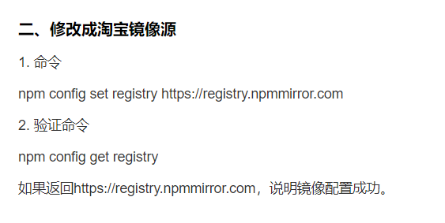

# NPM

# [npm使用国内镜像加速](https://cloud.tencent.com/developer/article/1372949)
 <br/>
npm install有依赖问题，可以尝试 <br/>
```
npm install --legacy-peer-deps <br/>
```
安装sass时，python有问题，可以尝试管理员权限 <br/>
```
npm install --global windows-build-tools <br/>
```
# 

# 前端开发环境准备
## NodeJS
what：类似于Java运行环境JVM，NodeJS是JavaScript运行环境，也就是JS解析引擎。 <br/>
why need：在前端进入模块化开发后，需要依赖许多转换工具，将我们的源码转变为浏览器能够识别的代码。这一类工具通常都用javaScript编写，所以我们需要本地的JS解析引擎NodeJS去运行这些工具。 <br/>
download：[https://nodejs.org/zh-cn/download/](https://nodejs.org/zh-cn/download/) <br/>
 <br/>
安装完成后验证 <br/>
```json <br/>
node -v <br/>
npm -v <br/>
```

## npm
why need：前端开发越来越多运用到模块化思想，我们不再需要从html页面中引入大量的js代码，而是在一个入口文件中，通过依赖关系，不断地将自己需要的模块加载进来，这种模块化的加载方式，大部分浏览器是不支持的，所以需要将模块化前端代码打包成一个浏览器能够识别的js文件包。webpack工具，其功能就是将以模块化开发的功能，打包成浏览器能够识别的静态资源。几乎前端所有模块化项目都是通过这个打包的，后面会讲到。 <br/>
npm是NodeJS的包管理工具，可以通过npm安装很多NodeJS的模块，类似于Maven。 <br/>
可以使用npm命令获取NodeJS模块。 <br/>
它有中央库，也可建立自己的私有库，还有很多第三方的公共库。 <br/>
可以在https://www.npmjs.com/搜索所有可用的包，国内访问速度较慢，npm在国内也有第三方镜像，比如淘宝镜像。 <br/>
如需使用第三方库，需要找到对应的私有地址来安装。 <br/>

## yarn
也是下载依赖包的，如果npm下载不成功，可换用此下载依赖包 <br/>
```json <br/>
#安装yarn
npm i yarn -g <br/>
#查看yarn版本
yarn -v <br/>
```

## cgr
切换npm源的工具，npm的源管理工具 <br/>
在git bash里操作 <br/>
```json <br/>
#安装cgr
npm install cgr #待补充 <br/>
#查看所有源
cgr ls <br/>
#使用某个源
cgr use xxx <br/>
```

# 开发工具：vscode
## 开发工具设置
1.切换语言为中文    <br/>
ctrl+shift+p-》language <br/>

2.切换集成终端到gitbash（默认是cmd） <br/>
ctrl+shift+p-》shell   <br/>

3.安装必备插件 <br/>
1）ESLint：检查语法，校验代码规则 <br/>
2）Prettier：代码格式化工具 <br/>

4.熟悉vscode快捷键 <br/>
ctrl+shift+p：弹出命令行界面 <br/>
全局文件跳转 <br/>
全局全文搜索 <br/>
快速展示隐藏集成终端 <br/>
代码提示建议 <br/>
快速切换上一次的编辑位置 <br/>
快速选择下一个内容 <br/>
多行一并修改 <br/>
快速格式化 <br/>
快速修复eslint错误   Ctrl+Shift+P    搜索eslint，找到fix   也可以用快捷键 <br/>

5.定义代码块（代码模板）snip <br/>

目录 <br/>
package.json   描述文件，描述项目的一些信息 <br/>
package-lock.json  锁定所有版本号，为npm服务 <br/>
yarn.lock  为yarn服务 <br/>
jsconfig.json  用于帮助vscode识别项目结构,帮助我们快速在项目文件中跳转,配置目录别名 <br/>
.umirc.js(屋 make) <br/>
UmiJS：可插拔的企业级react应用框架 <br/>
.eslintre.js：ESLint <br/>
.eslintignore：ESLint排除不检查的文件 <br/>

scripts：放打包时需要辅助的脚本 <br/>
node_modules：安装依赖后存放的依赖文件 <br/>
mock：可以进行模拟联调，配置模拟接口 <br/>

src中 <br/>
components  组件 <br/>
3部分组成  入口文件，指向（index.js）  /组件本身，业务功能逻辑（Logo.js） / 组件样式（Logo.less） <br/>
layouts是Umi约定好的展示在外层的页面，还有models，pages，global.less也是约定好的目录，会自动识别这些目录 <br/>
约定式路由：相对于配置式路由来说的，不需要每个页面配置路由 <br/>

components,models,services有全局的和局部的之分 <br/>
作用域：可以使用父目录的组件，不可使用孩子或兄弟的组件 <br/>

service存放调用接口的方法 <br/>

global.less  全局样式放这里 <br/>

react采用了一套jsx的语法 <br/>
jsx ：在js里编写xml语法的内容 <br/>

jsx与html的标签差别 <br/>
属性 <br/>
1.className替换class（避免和jsx语法中的class混淆） <br/>
2.style不能用字符串，要用对象；key用驼峰命名，不要中间分隔线 <br/>
事件（点击事件、鼠标事件、键盘事件） <br/>
1.onClick替换onclick等 <br/>


less文件：和css类似，比css有更高级的内容 <br/>
.root{//选择器，给class为root的添加样式 <br/>
//此处添加样式 <br/>
} <br/>

控制内容的变化 <br/>
react通过状态来渲染界面 <br/>
state是个对象，在react组件里是一个成员变量 <br/>

# 前端操作

[https://bigfish.antgroup-inc.cn/docs/tutorials/getting-started](https://bigfish.antgroup-inc.cn/docs/tutorials/getting-started) <br/>
下载node.js <br/>
验证： <br/>
node <br/>
node -v <br/>
npm -v <br/>

安装tnpm命令 <br/>
npm install tnpm -g --registry=[http://registry.npm.alibaba-inc.com](http://registry.npm.alibaba-inc.com) <br/>
验证： <br/>
tnpm -v <br/>

tnpm install <br/>
前提：删掉node_modules <br/>
时间很长，在下载node_modules <br/>

在git里 <br/>
npm run devs <br/>
# 端口非7001解决
在前端控制台输入 <br/>
netstat -anlp|grep 7001 <br/>
kill -9 [port(改成后面出现的长port)] <br/>
扩展：netstat -an|grep 7001 <br/>
