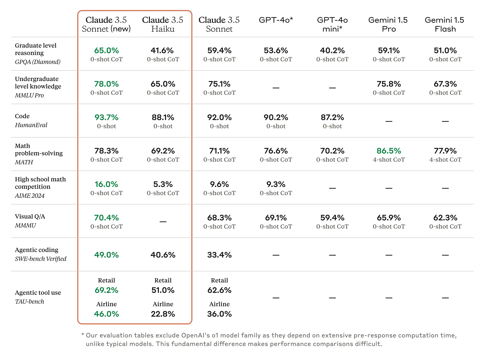

# Claude 3.5 Sonnet: Computer use
  - 1. About
  - 2. 业界benchmarks
  - 3. API支持
  - 4. Computer Use 的特点
  - 5. 未来发展方向
<!-- more -->

## 1. About
公司：Anthropic

官方文章：

[1. Introducing computer use, a new Claude 3.5 Sonnet, and Claude 3.5 Haiku](https://www.anthropic.com/news/3-5-models-and-computer-use)

[2. Developing a computer use model](https://www.anthropic.com/news/developing-computer-use)

官方演示视频：

https://www.youtube.com/playlist?list=PLf2m23nhTg1NcDu3_eZavbTJ3Dow9QQRB

代码实现：

https://github.com/anthropics/anthropic-quickstarts/tree/main/computer-use-demo

## 2. 业界benchmarks
-  SWE-bench Verified（编程能力测评）
-  TAU-bench（工具使用能力测评）
-  OSWorld (操控计算机能力测评)
  
Claude3.5性能测评结果：

 
在 OSWorld 中，Claude 3.5 Sonnet 在纯截图类别中获得了 14.9% 的评分。

## 3. API支持
支持通过Anthropic API、Amazon Bedrock和Google Cloud的Vertex AI进行调用

- Anthropic API
- Amazon Bedrock
- Google Cloud’s Vertex AI

## 4. Computer Use 的特点
像人类一样使用计算机--观看屏幕、移动光标、点击按钮和输入文本。

- 1.将用户指令拆解为计算机的一个个命令
  - 用户指令
    - 使用我的电脑和网上的数据填写这份表格
  - 转化为一系列计算机指令
    - 检查电子表格；
    - 移动光标打开网页浏览器；
    - 浏览相关网页；
    - 使用这些网页上的数据填写表格
- 2.通过屏幕截图观察任务进度，然后使用工具执行任务
- 3.将光标定位到屏幕特定的位置
    - 计算光标需要垂直或水平移动多少像素才能点击正确的位置
    - Claude在这方面做了训练，准确计算像素至关重要
- 4.自我纠正和重试

## 5. 未来发展方向
- 提高安全性
- 降成本
- 提速度
- 降低错误率，提升可靠性
- 支持更多操作
  - 如拖拽、缩放等操作还不支持
- 视觉大语言模型（VLM）的性能提升
  - 目前的VLM普遍存在“近视眼”现象，它们从图像中只能提取出近似和抽象的视觉信息，并不像人类一样真切的看到图片
- 改变观察屏幕截图到更细粒度的视频流
  - Claude观察屏幕通过截图，是 “翻书 ”式的，即截图并拼凑在一起，而不是观察更细粒度的视频流，这意味着它可能会错过短暂的操作或通知。
- 视觉和代码操作的结合
  - 光靠视觉，速度提升不上来，准确度也不够