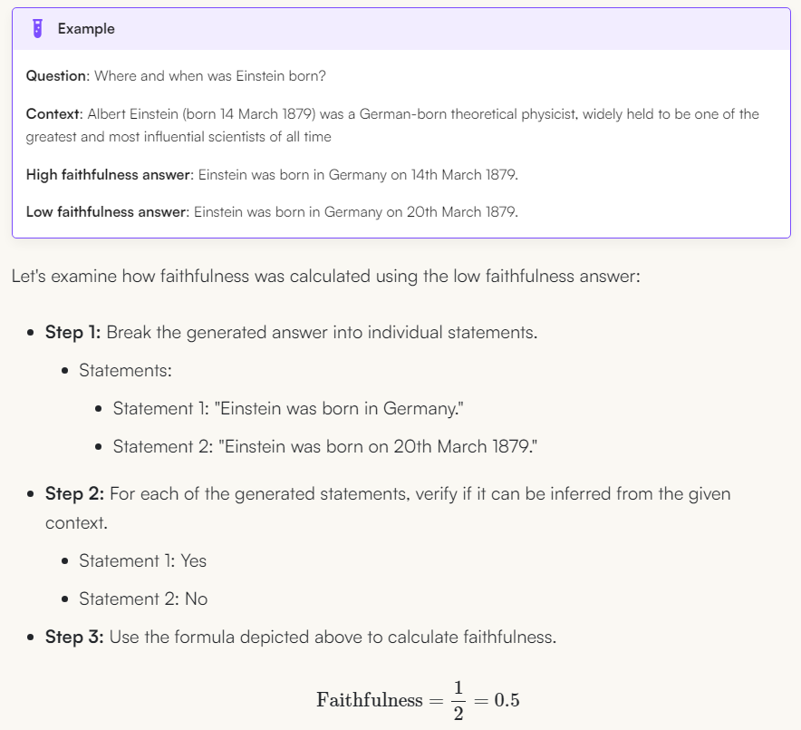
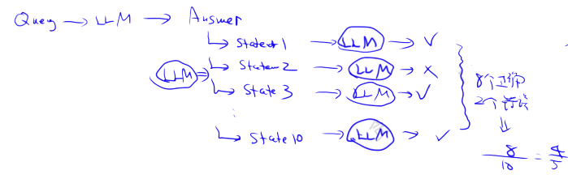
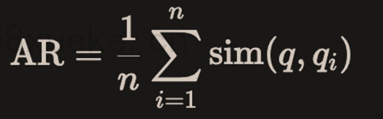
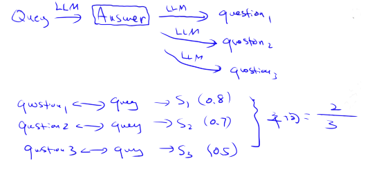
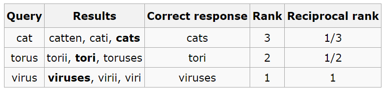

# RAG评估指标
<!-- more -->

## 1. 如何评估RAG
评估框架
- ragas 
  - https://docs.ragas.io/en/stable/concepts/metrics/available_metrics/
- RAGChecker


RAG可以通过四个指标来评估。其中两个指标偏向于LLM，另外两个偏向于上下文。

- 生成评估
  - Faithfulness 忠实性(准确性)
  - Answer Relevancy 答案相关性
  - ROUGE
    - latency of online pipeline 在线流水线的延迟
    - cost of offline pipeline 离线流水线的成本
  - BLUE
  - BertScore
  - LLM as a Judge
  - Other
    - Latency（延迟）
    - Diversity（多样性）
    - Noise Robustness（噪声鲁棒性）
    - Negative Rejection（负面拒绝）
    - Counterfactual Robustness（反事实鲁棒性）
- 检索评估
  - Context Precision 上下文准确率
  - Context Recall 上下文召回率 
  - OpenAI
    - Hit Rate 命中率 (和 Recall 一致)
    - MAP (Mean Average Precision) 均值平均精度
    - MRR (Mean Reciprocal Rank) 平均倒数排名
    - NDCG (Normalized Discounted Cumulative Gain) 归一化折扣累积增益
  - Common
    - Precision
    - Recall
    - F1
    - AUC (Area Under Curve)

## 2 与LLM相关的指标 Generation Evaluation
### 2.1. 忠实性 Faithfulness
  - 评估生成的答案与给定上下文的事实一致性（Faithfulness metric measures the factual consistency of the generated answer against the given context.）

$$\text{Faithfulness score} = {|\text{Number of claims in the generated answer that can be inferred from given context}| \over |\text{Total number of claims in the generated answer}|}$$

> 将答案拆分(采用llm)，并尝试将其与事实对照(采用llm)，与事实相符所占的比例即为结果。
> 如果答案无法与事实匹配，则视为幻觉Hallucinate 生成。





### 2.2. 答案相关性 Answer Relevancy
  - 评估生成的答案与给定Prompt的相关程度 (Response Relevancy metric focuses on assessing how relevant the generated answer is to the given prompt.)
  - 较低的分数分配给不完整或包含冗余信息的答案，较高的分数表示更好的相关性。
  - 重要的是，我们对答案相关性的评估不考虑事实性，而是对答案缺乏完整性或包含冗余细节的情况进行惩罚。
  - 假设模型提供了大量上下文，模型利用这些上下文来回答问题，但答案与用户的原始需求相差甚远，因此，此指标评估模型提供的答案的相关性。



> 从答案逆向生成对应的几个问题，然后计算生成的问题与实际问题之间的平均余弦相似度




### 2.3. ROUGE
ROUGE指标主要用于评估文本摘要的质量。它通过计算生成文本和参考文本之间的词汇重叠来衡量文本相似性，特别关注文本中单词的覆盖率。

ROUGE有几个变体，主要包括：

- ROUGE-N：计算生成文本和参考文本之间的N-gram（如ROUGE-1表示单词，ROUGE-2表示词对等）的重叠。适合评估精细的词语顺序和重复模式。
- ROUGE-L：基于最长公共子序列（LCS）计算得分，考虑了句子中词语的顺序，适合处理句子较长的情况。
- ROUGE-W：给较长的连续匹配子序列更高的权重，适用于段落级别的总结。
- ROUGE-S：统计句子中相邻词组对的共同部分，允许词之间有间隔。

ROUGE的得分包括Precision（精确率）、Recall（召回率） 和 F-Score（F值），其中ROUGE常侧重召回率，因为文本摘要中重要信息的覆盖更为重要。

应用场景：
ROUGE在文本摘要、文档生成、问答系统等任务中表现优异，尤其适合评估信息覆盖性的重要性。

- ROUGE
  - latency of online pipeline 在线流水线的延迟
  - cost of offline pipeline 离线流水线的成本

### 2.4. BLUE
BLEU是机器翻译领域中应用最广泛的评估标准之一。与ROUGE不同，BLEU主要关注生成文本和参考文本之间的n-gram精确匹配。BLEU通过计算生成句子中n-gram和参考句子中n-gram匹配的比例，反映生成内容的准确性。

BLEU的得分主要基于以下内容：

- n-gram匹配：计算生成句子和参考句子的n-gram（常用n=1到4）的匹配情况，以衡量生成内容的词汇精确性。
- Brevity Penalty（长度惩罚）：如果生成文本长度显著短于参考文本，会降低得分，防止生成过短内容以提升匹配率。
BLEU的计算通常包括对多个参考翻译的匹配，因此生成内容对某一参考文本的某些细微变化不会显著影响总分。

应用场景：
BLEU广泛应用于机器翻译、对话生成和图像描述等生成任务，适合对生成内容精确性的高要求评估。BLEU 也有其局限性，比如不能考虑生成文本的流畅性或语法性。

区别与应用总结
ROUGE侧重召回率，适合信息覆盖性评估，常用于文本摘要任务；
BLEU侧重精确率，适合内容精确性的评估，常用于机器翻译任务。

### 2.5. BertScore
BertScore利用来自预训练的(transformers)（如(BERT)）的上下文嵌入，来评估生成文本和参考文本之间的语义相似性。BertScore使用上下文嵌入计算词级别的相似性，并生成精确率(precision)、召回率(recall)和(F1)分数。与基于(n-gram)的指标不同，BertScore可以在上下文中捕捉词语的意义，因此对释义更具鲁棒性，并且对语义等价更为敏感。

### 2.6. LLM as a Judge
使用“(LLM as a Judge)”来评估生成文本是一种较新的方法。在这种方法中，LLM用于根据连贯性(coherence)、相关性(relevance)和流畅性(fluency)等标准对生成文本进行评分。此LLM可以选择性地在人工判断上进行微调，以预测未见文本的质量，或在零样本(zero-shot)或少样本(few-shot)设置中生成评估。这种方法利用了LLM对语言和上下文的理解，从而提供更细致的文本质量评估。

这种方法涵盖了内容评估的关键方面，包括连贯性(coherence)、相关性(relevance)、流畅性(fluency)、覆盖性(coverage)、多样性(diversity)和细节(detail)。

### 2.7. 其他
- Latency（延迟）
  - 测量RAG系统完成一次查询响应所需的时间。它是用户体验的关键因素，尤其是在交互式应用中，例如聊天机器人或搜索引擎。
  - **Single Query Latency（单查询延迟）**：处理单个查询的平均时间，包括检索和生成阶段。
- Diversity（多样性）
  - 评估RAG系统检索和生成信息的多样性和广度。它确保系统能够提供广泛的视角，并避免在响应中出现冗余。
  - Cosine Similarity / Cosine Distance（余弦相似度/余弦距离）：通过计算检索到的文档或生成的响应的嵌入来衡量相似性。较低的余弦相似度分数表示更高的多样性，表明系统能够检索或生成更广泛的信息。
- Noise Robustness（噪声鲁棒性）
  - 衡量RAG系统在处理无关或误导性信息时，不降低响应质量的能力
  - **Misleading Rate（误导率）** 和 **Mistake Reappearance Rate（错误重现率）** 
- Negative Rejection（负面拒绝）
  - 评估系统在可用信息不足或过于模糊无法提供准确答案时，拒绝生成响应的能力 
  - **Rejection Rate（拒绝率）**：系统拒绝生成响应的频率。
- Counterfactual Robustness（反事实鲁棒性）
  - 评估系统识别和忽略检索文档中错误或反事实信息的能力。
  - **Error Detection Rate（错误检测率）**：检索信息中检测到的反事实陈述的比例。


## 3 与上下文相关的指标 Retrieval Evaluation
### 3.1. 上下文准确率 Context Precision（误报）
  - precision = 召回docs中与query相关的doc数 / 总召回doc数
  - 从客户的角度来看是最有用的，因为在某些情况下模型的准确性可能很高，但上下文精度较低。Recall不容易计算数据库中总相关文档数
  - 经典RAG场景可以是将更多上下文加入到上下文窗口中，但当模型获得更多上下文时，可能会出现更多幻觉（参见论文：《Lost in the Middle: How Language Models Use Long Contexts》）
  - 因此，上下文精度评估检索内容的信噪比。它记录内容日志并与答案进行比较，以确定检索的内容是否符合“应有答案”。

### 3.2. 上下文召回率 Context Recall（漏报）Hit Rate 命中率
  - recall = 召回docs中与query相关的doc数 / 数据库中总相关doc数
  - 该指标常用于bootstrap阶段（初始启动阶段），后续提升几乎不可用
  - Context Relevance和Context Recall可组成F1 score:
F1 = 2 * relevance * recall / (relevance + recall)
  - 模型是否能够检索出回答问题所需的所有相关信息？
    - Recall不容易计算数据库中总相关文档数
  - 模型置顶的搜索结果是否满足问题的需求？
  - 上下文召回率显示是否需要优化搜索，可能需要增加重排 (Reranking)、微调嵌入(Fine-tune Embeddings)，或者需要使用不同的嵌入 (Embeddings) 来提取更相关的内容。

OpenAI Cookbook中提及的
https://github.com/openai/openai-cookbook/blob/main/examples/evaluation/Evaluate_RAG_with_LlamaIndex.ipynb

命中率计算的是在前 k 个检索文档中找到正确答案的查询比例。

示例：
假设一个用户在测试集中对5个项目感兴趣，推荐系统推荐了10个项目，其中3个是用户实际感兴趣的，那么命中率为 3/5 = 0.6。

### 3.3. MAP (Mean Average Precision) 均值平均精度
#### 3.3.1. AP 平均精度
$$
MAP@K = \frac{1}{K}\sum_{k=1}^K \text{precision}_k
$$
实际场景用的最多

假设一个具体例子： 用户查询："公司的休假制度" 相关文档总共3个: doc1, doc2, doc4 系统返回排序结果: [doc1, doc3, doc2, doc4, doc5]

在每个位置计算precision:

```shell
# 在每个位置计算Precision:
position1 (doc1): 1/1    (找到1个相关/已返回1个)
position2 (doc3): 1/2    (找到1个相关/已返回2个)
position3 (doc2): 2/3    (找到2个相关/已返回3个)
position4 (doc4): 3/4    (找到3个相关/已返回4个)
position5 (doc5): 3/5    (找到3个相关/已返回5个)
```
MAP@5就是上面分数的平均

#### 3.3.2. MAP 均值平均精度（多个查询的平均值）


其中，P(k) 是列表中截止 k 处的精确度，rel(k) 是一个指标函数，如果排名 k 的项目是相关文档，则该函数等于 1，否则等于 0，n 是检索文档的数量。

具体求解：

假设有两个查询，查询1有4个相关文档，查询2有5个相关文档。某系统对查询1检索出4个相关文档，其rank分别为1,2,4,7；对于查询2检索出3个相关文档，其rank分别为1,3,5。

对于查询1，AP平均正确率为:(1/1+2/2+3/4+4/7)/4=0.83

对于查询2，AP平均正确率为:(1/1+2/3+3/5)/5=0.45

则平均正确率均值为:(0.83+0.45)/2=0.64

### 3.4. Mean Reciprocal Rank (MRR) 平均倒数排名
OpenAI Cookbook中提及的
https://github.com/openai/openai-cookbook/blob/main/examples/evaluation/Evaluate_RAG_with_LlamaIndex.ipynb

$$
MRR = \frac{1}{Q} \sum_{q=1}^Q\frac{1}{rank_q}
$$

其中，Q是查询的次数，${rank_q}$是每次查询第一个相关文档的排名。

对于每个查询，MRR 通过查看排名最高的相关文档的排名来评估系统的准确性。具体来说，它是所有查询中这些排名的倒数的平均值。因此，如果第一个相关文档是最高结果，则倒数排名为 1；如果是第二个，则倒数排名为 1/2，以此类推。

示例：  
假设查询了3次，每次查询第一个出现的相关文档分别排在第3，2，1的名次，那么MRR为：
MRR=(1/3 + 1/2 + 1/1) / 3 = 11/18 = 0.611



> MRR评估的是“平均来说，系统多快能够在响应用户查询时检索到第一个相关文档？”  其对排序质量相当敏感

与MAP比较:

- MAP考虑所有相关文档的位置，MRR只考虑第一个
- MAP能更全面地评估系统性能，MRR更关注快速找到首个相关文档

### 3.5. NDCG 归一化折扣累积增益

Normalized Discounted Cumulative Gain: 归一化折扣累积增益

概念：NDCG是一种在信息检索领域中广泛使用的评价指标，用于衡量排名质量。它考虑了所有相关项目的排名，并根据排名对其赋予不同的权重（排名越靠前，权重越大）。

缺点:需要详细的相关性标注（多级相关性）

它的特点是考虑到文档的相关程度（可以是多级相关性）以及排序位置的重要性

计算组成部分:
- DCG (Discounted Cumulative Gain)：考虑位置折扣的累积增益（实际排名，考虑相关性分数和排名位置）
- IDCG (Ideal DCG)：理想情况下的DCG（理想的排名，相关文档按相关性排序）
- NDCG = DCG / IDCG：归一化，使得不同查询可比


计算过程:

假设我们对文档相关性进行0-3的评分：

- 3分：非常相关
- 2分：相关
- 1分：一般相关
- 0分：不相关

例如查询"公司休假制度"：

系统返回序列: [doc1, doc3, doc2, doc4, doc5] 

相关性评分: [3, 0, 2, 2, 0]

相比MAP和MRR：

- MAP：只考虑二元相关性（相关/不相关）
- MRR：只关注第一个相关文档
- NDCG：同时考虑多级相关性和位置权重

## 4. 参考内容
- [Evaluation of Retrieval-Augmented Generation:A Survey （By Tencent）](https://arxiv.org/abs/2405.07437)