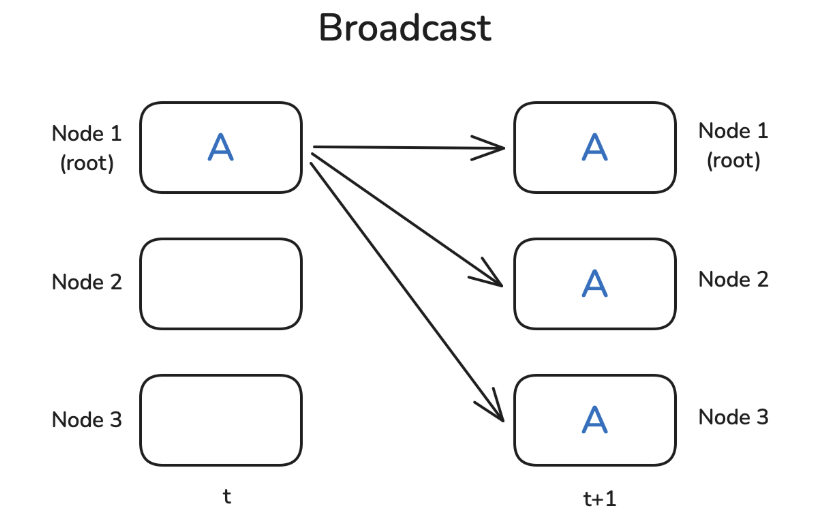
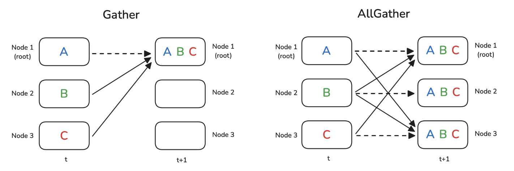
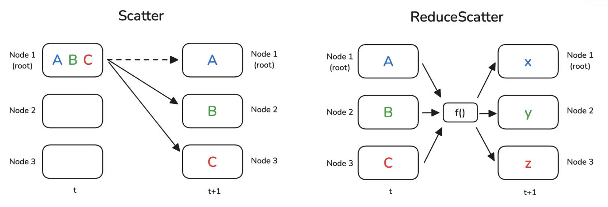

# 分布式训练之二：并行编程 Parallel Programming
<!-- more -->
## 1. 概览
- Broadcast
- Reduce
- AllReduce
- Gather
- AllGather
- Scatter
- ReduceScatter
- Barrier

Note：root节点作为服务器，它是某些操作的目标或源

关系：AllReduce = ReduceScatter + AllGather


## 2. Broadcast


## 3. Reduce & AllReduce
将每个节点的值通过函数合为一个值

函数f()常用的为求和（SUM）或求平均值（AVG）
- AVG is only available with the NCCL backend


- Reduce: 结果只发送给root节点
- AllReduce: 结果广播发送到每个节点（每个节点的值一样）

## 4. Gather & AllGather


## 5. Scatter & ReduceScatter

Scatter
- scatter不同于broadcast，scatter是将数据分片发送，broadcast是将数据完整发送
- scatter在逻辑上是gather的反向操作

ReduceScatter
- 把每个节点上的数据分片
- 每个分片的各节点的数据通过函数进行Reduce
- 把每个分片Reduce的结果Scatter到每个节点

## 6. Barrier
所有节点到达障碍Barrier之前，Barrier不会解除，都到达Barrier后才能进行后续的计算，用于同步节点


## 7. PyTorch代码实现
### 7.1. NCCL是什么
NCCL
- NVIDIA Collective Communications Library 
- NVIDIA 集体通信库
- NVIDIA的GPU间通信的优化原语
- NCCL 专为高效的 GPU-GPU 通信设计

### 7.2. Broadcast
代码
```
import torch
import torch.distributed as dist

def init_process():
    dist.init_process_group(backend='nccl')
    torch.cuda.set_device(dist.get_rank())
    
def example_broadcast():
    if dist.get_rank() == 0:
        tensor = torch.tensor([1, 2, 3, 4, 5], dtype=torch.float32).cuda()
    else:
        tensor = torch.zeros(5, dtype=torch.float32).cuda()
    print(f"Before broadcast on rank {dist.get_rank()}: {tensor}")
    dist.broadcast(tensor, src=0)
    print(f"After broadcast on rank {dist.get_rank()}: {tensor}")
    
init_process()
example_broadcats()
```
输出
```
Before broadcast on rank 0: tensor([1., 2., 3., 4., 5.], device='cuda:0')
Before broadcast on rank 1: tensor([0., 0., 0., 0., 0.], device='cuda:1')
Before broadcast on rank 2: tensor([0., 0., 0., 0., 0.], device='cuda:2')

After broadcast on rank 0: tensor([1., 2., 3., 4., 5.], device='cuda:0')
After broadcast on rank 1: tensor([1., 2., 3., 4., 5.], device='cuda:1')
After broadcast on rank 2: tensor([1., 2., 3., 4., 5.], device='cuda:2')
```

### 7.3. Reduce
代码
```
def example_reduce():
    tensor = torch.tensor([dist.get_rank() + 1] * 5, dtype=torch.float32).cuda()
    print(f"Before reduce on rank {dist.get_rank()}: {tensor}")
    dist.reduce(tensor, dst=0, op=dist.ReduceOp.SUM)
    print(f"After reduce on rank {rank}: {tensor}")
    
init_process()
example_reduce()
```
输出
```
Before reduce on rank 0: tensor([1., 1., 1., 1., 1.], device='cuda:0')
Before reduce on rank 1: tensor([2., 2., 2., 2., 2.], device='cuda:1')
Before reduce on rank 2: tensor([3., 3., 3., 3., 3.], device='cuda:2')

After reduce on rank 0: tensor([6., 6., 6., 6., 6.], device='cuda:0')
After reduce on rank 1: tensor([2., 2., 2., 2., 2.], device='cuda:1')
After reduce on rank 2: tensor([3., 3., 3., 3., 3.], device='cuda:2')
```

### 7.4. AllReduce
代码
```
def example_all_reduce():
    tensor = torch.tensor([dist.get_rank() + 1] * 5, dtype=torch.float32).cuda()
    print(f"Before all_reduce on rank {dist.get_rank()}: {tensor}")
    dist.all_reduce(tensor, op=dist.ReduceOp.SUM)
    print(f"After all_reduce on rank {dist.get_rank()}: {tensor}")
    
init_process()
example_all_reduce()
```
输出
```
Before all_reduce on rank 0: tensor([1., 1., 1., 1., 1.], device='cuda:0')
Before all_reduce on rank 1: tensor([2., 2., 2., 2., 2.], device='cuda:1')
Before all_reduce on rank 2: tensor([3., 3., 3., 3., 3.], device='cuda:2')

After all_reduce on rank 0: tensor([6., 6., 6., 6., 6.], device='cuda:0')
After all_reduce on rank 1: tensor([6., 6., 6., 6., 6.], device='cuda:1')
After all_reduce on rank 2: tensor([6., 6., 6., 6., 6.], device='cuda:2')
```

### 7.5. Gather
代码
```
def example_gather():
    tensor = torch.tensor([dist.get_rank() + 1] * 5, dtype=torch.float32).cuda()
    if dist.get_rank() == 0:
        gather_list = [
            torch.zeros(5, dtype=torch.float32).cuda()
            for _ in range(dist.get_world_size())
            ]
    else:
        gather_list = None
    print(f"Before gather on rank {dist.get_rank()}: {tensor}")
    dist.gather(tensor, gather_list, dst=0)
    if dist.get_rank() == 0:
        print(f"After gather on rank 0: {gather_list}")
    
init_process()
example_gather()
```
输出
```
Before gather on rank 0: tensor([1., 1., 1., 1., 1.], device='cuda:0')
Before gather on rank 1: tensor([2., 2., 2., 2., 2.], device='cuda:1')
Before gather on rank 2: tensor([3., 3., 3., 3., 3.], device='cuda:2')

After gather on rank 0: [tensor([1., 1., 1., 1., 1.], device='cuda:0'),
                         tensor([2., 2., 2., 2., 2.], device='cuda:0'),
                         tensor([3., 3., 3., 3., 3.], device='cuda:0')]
```

### 7.6. AllGather
代码
```
def example_all_gather():
    tensor = torch.tensor([dist.get_rank() + 1] * 5, dtype=torch.float32).cuda()
    gather_list = [
        torch.zeros(5, dtype=torch.float32).cuda()
        for _ in range(dist.get_world_size())
        ]
    print(f"Before all_gather on rank {dist.get_rank()}: {tensor}")
    dist.all_gather(gather_list, tensor)
    print(f"After all_gather on rank {dist.get_rank()}: {gather_list}")
    
init_process()
example_all_gather()
```
输出
```
Before all_gather on rank 0: tensor([1., 1., 1., 1., 1.], device='cuda:0')
Before all_gather on rank 1: tensor([2., 2., 2., 2., 2.], device='cuda:1')
Before all_gather on rank 2: tensor([3., 3., 3., 3., 3.], device='cuda:2')

After all_gather on rank 0: [tensor([1., 1., 1., 1., 1.], device='cuda:0'),
                             tensor([2., 2., 2., 2., 2.], device='cuda:0'),
                             tensor([3., 3., 3., 3., 3.], device='cuda:0')]
After all_gather on rank 1: [tensor([1., 1., 1., 1., 1.], device='cuda:1'),
                             tensor([2., 2., 2., 2., 2.], device='cuda:0'),
                             tensor([3., 3., 3., 3., 3.], device='cuda:0')]
After all_gather on rank 2: [tensor([1., 1., 1., 1., 1.], device='cuda:2'),
                             tensor([2., 2., 2., 2., 2.], device='cuda:2'),
                             tensor([3., 3., 3., 3., 3.], device='cuda:2')]
```

### 7.7. Scatter
代码
```
def example_scatter():
    if dist.get_rank() == 0:
        scatter_list = [
            torch.tensor([i + 1] * 5, dtype=torch.float32).cuda()
            for i in range(dist.get_world_size())
            ]
        print(f"Rank 0: Tensor to scatter: {scatter_list}")
    else:
        scatter_list = None
    tensor = torch.zeros(5, dtype=torch.float32).cuda()
    print(f"Before scatter on rank {dist.get_rank()}: {tensor}")
    dist.scatter(tensor, scatter_list, src=0)
    print(f"After scatter on rank {dist.get_rank()}: {tensor}")
    
init_process()
example_scatter()
```
输出
```
Rank 0: Tensor to scatter: [tensor([1., 1., 1., 1., 1.], device='cuda:0'),
                            tensor([2., 2., 2., 2., 2.], device='cuda:0'),
                            tensor([3., 3., 3., 3., 3.], device='cuda:0')]
Before scatter on rank 0: tensor([0., 0., 0., 0., 0.], device='cuda:0')
Before scatter on rank 1: tensor([0., 0., 0., 0., 0.], device='cuda:1')
Before scatter on rank 2: tensor([0., 0., 0., 0., 0.], device='cuda:2')

After scatter on rank 0: tensor([1., 1., 1., 1., 1.], device='cuda:0')
After scatter on rank 1: tensor([2., 2., 2., 2., 2.], device='cuda:1')
After scatter on rank 2: tensor([3., 3., 3., 3., 3.], device='cuda:2')
```

### 7.8. ReduceScatter
代码
```
def example_reduce_scatter():
    rank = dist.get_rank()
    world_size = dist.get_world_size()
    input_tensor = [
        torch.tensor([(rank + 1) * i for i in range(1, 3)], dtype=torch.float32).cuda()**(j+1) 
        for j in range(world_size)
        ]
    output_tensor = torch.zeros(2, dtype=torch.float32).cuda()
    print(f"Before ReduceScatter on rank {rank}: {input_tensor}")
    dist.reduce_scatter(output_tensor, input_tensor, op=dist.ReduceOp.SUM)
    print(f"After ReduceScatter on rank {rank}: {output_tensor}")    
    
init_process()
example_reduce_scatter()
```
输出
```
Before ReduceScatter on rank 0: [tensor([1., 2.], device='cuda:0'),
											 tensor([1., 4.], device='cuda:0'),
											 tensor([1., 8.], device='cuda:0')]
Before ReduceScatter on rank 1: [tensor([2., 4.], device='cuda:1'),
                                 tensor([ 4., 16.], device='cuda:1'),
                                 tensor([ 8., 64.], device='cuda:1')]
Before ReduceScatter on rank 2: [tensor([3., 6.], device='cuda:2'),
                                 tensor([ 9., 36.], device='cuda:2'),
                                 tensor([ 27., 216.], device='cuda:2')]

After ReduceScatter on rank 0: tensor([ 6., 12.], device='cuda:0')
After ReduceScatter on rank 1: tensor([14., 56.], device='cuda:1')
After ReduceScatter on rank 2: tensor([ 36., 288.], device='cuda:2')
```

### 7.9. Barrier
代码
```
def example_barrier():
    rank = dist.get_rank()
    t_start = time.time()
    print(f"Rank {rank} sleeps {rank} seconds.")
    time.sleep(rank)  # Simulate different processing times
    dist.barrier()
    print(f"Rank {rank} after barrier time delta: {time.time()-t_start:.4f}")
    
init_process()
example_barrier()
```
输出
```
Rank 0 sleeps 0 seconds.
Rank 1 sleeps 1 seconds.
Rank 2 sleeps 2 seconds.

Rank 0 after barrier time delta: 2.0025
Rank 1 after barrier time delta: 2.0025
Rank 2 after barrier time delta: 2.0024
```