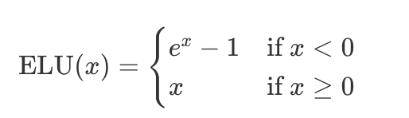
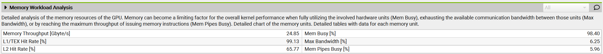

# 分布式训练之五：GPU入门 
<!-- more -->

## 1. GPU 架构
在计算方面，具有高度层次结构
- GPU由一组称为流式多处理器（SM, Streaming Multiprocessors）的计算单元组成。
- 每个SM包含并控制一组流处理器 (streaming processors)，也称为核心 (cores)。例如，Nvidia H100 GPU拥有132个SM，每个SM有128个核心，总计16,896个核心。
- 每个核心都能同时处理多个线程。


在内存方面，也具有高度层次结构，包括多层缓存和内存
- 寄存器（Registers）是最小的单元，在执行期间为线程私有
- 共享内存 （Shared Memory）和L1缓存（L1 cache）由运行在单个SM上的线程共享
- 更高一层是所有SM共享的L2缓存
- 最后是全局内存，这是GPU上最大的内存（例如H100标榜的80 GB），但访问和查询速度也是最慢的


GPU的目标是利用这种计算/内存的层次组织，在GPU cores上尽可能并行运行尽可能多的工作负载。

在GPU cores上运行的一段代码被称为内核（kernel）。它可以在CUDA或Triton中用高级语言编写，然后被编译为PTX（Parallel Thread Execution，并行线程执行），这是NVIDIA GPU使用的低级汇编语言。

要运行kernel，还需要一段特定的代码部分，称为主机代码（host code），它在CPU/主机上执行，负责准备数据分配以及加载数据和代码。

kernel 的调度通常如下：
- 线程（threads）按32的大小被分组为线程束（warps）。一个线程束中的所有线程同步执行指令，但处理数据的不同部分。
- 线程束（warps）被分组为更大且大小更灵活的块（blocks，例如大小为256），每个块仍然被分配给单个SM。一个SM可以并行运行多个块，然而取决于资源情况，并非所有块都能立即被分配执行，有些块可能会被列入等待列表，等待资源。


## 2. 如何通过 kernel 提升性能
### 2.1. 编写Kernels代码的工具
- Pytorch: easy but slow
- torch.compile: easy, fast, but not flexible
- triton: harder, faster, and more flexible
- CUDA: hardest, fastest, and flexiblest (if you get it right 如果你做对了的话)

### 2.2. torch.compile装饰器
如果你想添加一个内核中缺乏的新操作，或者加速现有的PyTorch函数，从头编写内核可能看似是最直接的方法。然而，从零开始创建高性能CUDA Kernels需要丰富的经验和陡峭的学习曲线。通常更好的入门方法是利用torch.compile，它通过捕获你的操作并在Triton中生成低层次、高性能的 Kernels，动态优化PyTorch代码。

假设想为指数线性单元的激活函数写一个Kernel:



写一个pytorch实现后，只需要在上面加装饰器 @torch.compile

```python
@torch.compile
def elu(x, alpha=1.0):
    return torch.where(x < 0, alpha * (torch.exp(x) - 1), x)
```

性能提升是显著的


一旦运行有@torch.compile装饰器的Python脚本，就会生成相应的Triton Kernel

查看@torch.compile生成的Triton Kernel，只需将环境变量TORCH_LOGS设为"output_code"
```python
export TORCH_LOGS="output_code"
```

相应的Triton Kernel (此处将变量重命名并表了注释以增强可读性)：
```python
@triton.jit
def elu_kernel(input_ptr, output_ptr, num_elements, BLOCK_SIZE: tl.constexpr):
    # Calculate the starting index for this block
    block_start = tl.program_id(0) * BLOCK_SIZE
    # Create an array of indices for this block
    block_indices = block_start + tl.arange(0, BLOCK_SIZE)[:]
    # Create a mask to ensure only valid indices are processed
    valid_mask = block_indices < num_elements
    # Load input values from the input pointer based on valid indices
    input_values = tl.load(input_ptr + block_indices, valid_mask)
    # Define the ELU parameters
    zero_value = 0.0  # Threshold for ELU activation
    negative_mask = input_values < zero_value
    exp_values = tl.math.exp(input_values)
    # Define the ELU output shift
    one_value = 1.0
    shifted_exp_values = exp_values - one_value

    output_values = tl.where(negative_mask, shifted_exp_values, input_values)

    # Store the computed output values back to the output pointer
    tl.store(output_ptr + block_indices, output_values, valid_mask)
```

在这里，tl.program_id(0) 提供了一个唯一的块ID（block ID），我们用它来确定该块（block）将处理的数据段。使用这个块ID（block ID），block_start 计算每个块段的起始索引（starting index），而 block_indices 指定该段内的索引范围（range of indices）。valid_mask 确保只处理 num_elements 内的索引，通过 tl.load 安全加载数据（load data）。然后应用 ELU 函数，根据值是否为负数修改值，最后通过 tl.store 将结果写回内存。

### 2.3. 实现 Triton Kernels
如果这种性能提升还不够，可以考虑实现Triton Kernels


即使在Triton中，有时由于语言在处理低层次细节（如共享内存和流式多处理器（SMs）内的调度）方面的限制，我们也无法完全实现设备的最佳性能。Triton的功能局限于块（blocks）以及块在SMs之间的调度。要获得更深入的控制，你需要直接在CUDA中实现内核（kernels），在那里你可以访问所有底层的低级别细节。

### 2.4. 实现 CUDA Kernels
提高kernels效率的技术：
- 优化内存访问模式以减少延迟
- 使用共享内存（shared memor）来存储频繁访问的数据
- 管理线程工作负载（thread workloads）以最小化空闲时间

#### 2.4.1. optimizing memory access 优化内存访问 / memory coalescing 内存合并
与缓存cache相比，Global Memory有较长的延迟（long latency）和较低的带宽（low bandwidth），这通常是大多数应用程序的瓶颈。

在CUDA设备中，global memory 是使用 DRAM 实现的


内存合并（memory coalescing）利用了DRAM爆发式的传输数据的方式，即每次访问一个内存地址时，会同时传输一系列连续的内存位置。

最大化内存访问效率通过确保一个线程束中的32个线程访问相邻的内存来实现（For instance, if thread 0 accesses location M, thread 1 accesses M + 1, thread 2 accesses M + 2, and so fort）




问题
- 吞吐量很低
- 未合并内存访问的警告

原因
由于矩阵元素按行优先顺序存储，如下图所示：


但线程加载数据是按列优先顺序，无法进行内存访问的合并

解决：让线程加载数据也按行优先顺序，可以合并内存访问


吞吐量扩大了10倍

#### 2.4.2. 使用共享内存 / tiling

共享内存是一小块可由一个block中的所有threads共享的快速内存访问空间，减少从缓慢的global memory中重复加载数据的需要

使用tiling一次性加载进共享内存中，使得一个block的所有线程能复用相同的共享数据，例如矩阵乘法的所有必要数据都能快速访问


吞吐量增加到410 GB/s，kernel执行时间减少了约43%，实现了约6.6TFLOPs的性能

#### 2.4.3. thread coarsening 线程粗化

线程粗化是将几个线程合为一个单个粗化线程，这将显著减少共享内存的访问因为每个粗化线程可以处理多个输出元素

#### 2.4.4. minimizing control divergence 最小化控制分歧

SIMD: single instruction, multiple data (单一指令，不同数据)

一个SM(Streaming Multiprocessor)执行一个线程束的所有线程采用 SIMD 模型

SIMD的优势是高效：负责指令获取与调度的控制硬件被多个执行单元共享，这样的设计最小化了与控制功能相关的硬件开销，允许更大部分的硬件聚焦于提升算术吞吐量

## 3. Fused Kernels 融合内核
GPU和CPU的操作可以是异步的。特别是，CPU上的主机代码（host code）可以以非阻塞的方式在GPU上调度工作负载。

尽量避免在主机和GPU Kernel 命令之间来回切换


一系列需要在全局内存global memory 和 计算单元compute units之间来回切换的kernels: 


一次性完成所有操作:


怎么避免这种来回切换呢？最好的方法是让我们的GPU尽可能自主。这可以通过将尽可能多的连续计算操作打包到一个单一的内核（kernel）中来实现，供GPU运行，这种内核被称为“融合内核”（Fused Kernel）。

融合内核（Fused Kernel）对于连续的点状操作（point-like operations）尤其高效且易于编写，这些操作在每个输入标记（token）上彼此独立执行。在这种情况下，将计算出的值先放回全局内存（Global Memory），然后再移动到SM内存并启动一个新内核是没有意义的。更为高效的做法是将所有值保持在本地，直到完成一系列计算为止。

在Transformer模型中有许多地方可以应用这种“融合”（fusing）方法：每次我们遇到一系列点状操作时，例如在层归一化（Layer norms）涉及的计算中。

## 4. Flash Attention
Flash Attention 由 Tri Dao 提出，旨在通过编写自定义 CUDA 内核（kernels）来优化注意力计算，使其速度更快且内存效率更高。Flash Attention 的核心思想是高效利用GPU的各种内存，避免过多依赖最慢的内存：GPU的全局内存（global memory）。

### 4.1. 优化前


HBM: High Bandwidth Memory (代表全局内存global memory，名不副实，完全不高效哦)

注意力机制的基本实现涉及内存和工作单元之间的大量传输。它需要在HBM中实例化S和P矩阵，这意味着结果需要先发送到HBM，然后再返回到SRAM进行后续计算。

因为HBM的带宽是相当低的，是注意力计算的瓶颈

### 4.2. Flash Attention 优化
关键在于以小块的方式计算S矩阵，使其能够适应SM较小的共享内存（shared memory）。但我们可以做得更好，完全避免实例化庞大的S矩阵，而是仅保留计算softmax归一化因子所需的必要统计信息。这样，我们可以直接在SRAM中一次性计算得到O，而不是来回移动中间结果。在这种情况下，我们不仅利用了共享内存，还缓解了因实例化注意力矩阵(激活值的大头)所导致的内存瓶颈。


Flash Attention 的理念解决了模型训练中的诸多瓶颈，因此迅速成为所有Transformer模型中执行注意力的默认方式。

在Flash-Attention 1之后，同一实验室接连发布了两个改进版本：Flash-Attention 2和Flash-Attention 3。与Flash-Attention 1相比，Flash-Attention 2和3的改进更多地集中在针对GPU的低层次实现优化，而非通用的注意力机制。具体来说，这些优化包括：(1)尽可能减少非矩阵乘法（non-matmul）操作的数量；(2)对于Flash-Attention 2，谨慎地将工作负载分配到线程束（warps）和线程块（thread blocks）中；对于Flash-Attention 3，则针对最新的Hopper（H100）架构，精心优化FP8和张量核心（Tensor Core）的支持。