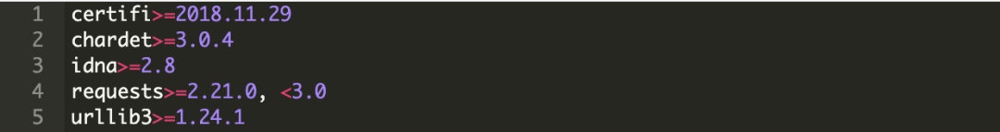

# 搭建Python开发环境，使用pip进行包管理
  - 1. 适用范围
  - 2. Python开发环境
  - 3. 包管理工具pip
  - 4. pip 命令
<!-- more -->

## 1. 适用范围

首选是网络应用，包括网站、后台服务等等；

其次是许多日常需要的小工具，包括系统管理员需要的脚本任务等等；

另外就是把其他语言开发的程序再包装起来，方便使用。

许多大型网站就是用Python开发的，例如YouTube、Instagram，还有国内的豆瓣。很多大公司，包括Google、Yahoo等，甚至NASA都大量地使用Python。

用极简单的工具完成大部分工作。在其他公司都在向更复杂的生态系统迁移的时候，YouTube一直保持着简单的技术栈。他们主要用Python编码，用MySQL做数据库，用Apache做web服务器。在这样一个庞大的网站中，新功能都是从一个简单的Python脚本开始，慢慢演化的。

## 2. Python开发环境

### 2.1. 下载、安装python、配置环境变量、验证

配置环境变量：安装时勾选，或自己配置

验证成功：在桌面打开命令行窗口

输入python  --version，会出现python版本

```
python --version
```

输入python，会出现python版本，还会展现>>>可供输入python命令

```
python
```

### 2.2. IDE和Jupyter

#### 2.2.1. IDE

pycharm

vscode

#### 2.2.2. Jupyter
##### 2.2.2.1. 安装Jupyter

```
pip install jupyterlab
```

##### 2.2.2.2. 浏览器中打开Jupyter

```
jupyter lab
jupyter notebook
```

##### 2.2.2.3. Jupyter查阅文档

1、查找模块中**所有**函数和类：调用dir函数

```python
dir(list)
```

2、查找**特定**函数和类的用法：调用help函数

```python
help(list)
```

3、使用?和??查看API的用法文档

在Jupyter记事本中，我们可以使用?指令在另一个浏览器窗口中显示文档。 例如，list?指令将创建与help(list)指令几乎相同的内容，并在新的浏览器窗口中显示它。 此外，如果我们使用两个问号，如list??，将显示实现该函数的Python代码。

## 3. 包管理工具pip

### 3.1. 什么是包(Package)

包是一个文件夹，包含有一个或多个模块

模块是一个文件，里面包含类，变量，函数等

### 3.2. 如何创建一个包

在文件夹mypackage下创建一个空的__init__.py文件。

Note：__init__.py是一个特殊的文件，可以帮助识别该文件夹为包。一个空的__init__.py文件使得该包下所有模块可用。

创建模块arithmetic.py和greet.py。

文件结构如下：

```python
─ mypackage
    ├── __init__.py
    ├── arithmetic.py
    └── greet.py
```

打开Python交互模式，就可以导入使用了。

```python
>>> from mypackage import arithmetics
>>> arithmetics.add_numbers(1, 2, 3, 5)
11
>>> arithmetics.subtract(5, 3)
2
>>> arithmetics.multiple(5, 3)
15
>>> arithmetics.division(5, 3)
1.6666666666666667
>>> arithmetics.remainder(5, 3)
2
>>> arithmetics.power(5, 3)
125
>>> from mypackage import greet
>>> greet.greet_person('Anne')
'Anne, nice to meet you!'
>>>
```
### 3.3. pip介绍

pip 是 Python 中的标准包管理器。它允许你安装和管理不属于 Python 标准库的其它软件包。

软件包管理极其重要，所以自 Python3 的 3.4 版本以及 Python2 的 2.7.9 版本开始，pip 一直被直接包括在 Python 的安装包内。

高级编程语言通常都会提供一个比较完善的基础代码库，让你能直接调用，比如，针对电子邮件协议的SMTP库，针对桌面环境的GUI库，在这些已有的代码库的基础上开发，一个电子邮件客户端几天就能开发出来。

Python 就为我们提供了非常完善的基础代码库，覆盖了网络、文件、GUI、数据库、文本等大量内容，被形象地称作“内置电池（batteries included）”。用 Python 开发，许多功能不必从零编写，直接使用现成的即可。

除了内置的库外，Python 还有大量的第三方库，也就是别人开发的，供你直接使用的东西。当然，如果你开发的代码通过很好的封装，也可以作为第三方库给别人使用。

### 3.4. PyPI(Python Package Index)介绍

Python 拥有一个活跃的社区，它提供了一个更大的软件包集合，以供你开发所需。这些软件包发布在 Python Package Index，也被称为 PyPI（发音 Pie Pea Eye）。PyPI 托管了大量包，包括开发框架，工具和库。

### 3.5. 搜索可用包

#### 3.5.1. PyPI搜索

[PyPI搜索](https://pypi.org/)

PyPI 为其索引提供了搜索功能，并通过包中公开的元数据（如框架，主题，开发状态等）过滤搜索结果。

PyPI 中用同一个术语搜索可能会产生大量的结果，不过你可以对它们进行分类过滤。比如，如果你想要找到可以帮助你开发应用的库，你可以展开 Intended Audience 并选择 Developers。另外，你可能还需要一个稳定且可用于生产的包，可以展开 Development Status 并选择 Production/Stable。


#### 3.5.2. Google搜索

被广泛使用的 Python 库会展示在 google 搜索的顶部，并且你应该能看到指向 PyPI 中包或者源代码仓库的链接。

## 4. pip 命令
### 4.1. 国内源

```
pip install -i https://pypi.tuna.tsinghua.edu.cn/simple xxx
```

```
pip install -i https://pypi.tuna.tsinghua.edu.cn/simple -r requirements.txt
pip install --upgrade -i https://pypi.tuna.tsinghua.edu.cn/simple -r requirements.txt # 自动升级需求文件中定义的软件包
pip install -r requirements.txt --no-dependencies #依赖包版本信息产生冲突时可以忽略版本要求，解决冲突
```

### 4.2. 安装pip并验证

```python
# install
pip install pip

# check
pip --version
```
### 4.3. 帮助命令

```
# 了解pip支持的命令
pip help

# 了解指定命令（eg.pip search命令）
pip help search
```
### 4.4. 安装包

使用 pip install 命令，其后跟着你想要安装的包名。pip 会在 PyPI 中查找这个包，计算其依赖关系，安装并确保安装好的包正常工作。

命令 pip install 会查找并安装软件包的最新版本。同时还会搜索软件包元数据中的依赖列表，并安装这些依赖以确保软件包满足所有的需求。

```python
pip install numpy
pip install matplotlib
pip install pandas
pip install scikit-learn
```

### 4.5. 查看已安装包列表

```python
pip list
```
### 4.6. 查看指定包的信息

```python
pip show numpy # 展示基础信息
pip show --verbose numpy # 展示详细信息
```
### 4.7. 卸载包

#### 4.7.1. 卸载之前：查看依赖和引用（Requires和Required-by）

```python
pip show requests
```


上图展示了 requests 需要依赖 urllib3，certifi，chardet 和 idna。而且你可以看到 requests 没有被其他包引用，所以它可以安全地卸载。

你应该对 requests 中所有的依赖都运行一下 show 命令，以确保没有其他库依赖它们。

如果有其它软件包在使用这些依赖，卸载会导致程序崩溃。

你了解了这些依赖次序之后，就可以使用 uninstall 命令来卸载它们。

#### 4.7.2. 卸载

```python
pip uninstall requests # 有确认信息
pip uninstall -y requests # 没有提示信息，直接卸载
pip uninstall -y urllib3 certifi chardet idna # 卸载多个包
pip uninstall -y -r requirements.txt # 卸载需求文档中列出的所有软件包
```

### 4.8. 使用 requirements.txt 需求文件

pip install 命令只会安装最新发布的软件包版本，但是有时候，你可能希望根据代码运行情况安装特定的版本。

需求文件可以精确指定需要安装的软件包和版本。

#### 4.8.1. 执行requirements.txt

```python
pip install -r requirements.txt
pip install --upgrade -r requirements.txt # 自动升级需求文件中定义的软件包
```
如果依赖项在镜像源中找不到指定版本导致安装终止，解决办法是：将requirements.txt中没有对应版本的依赖项删掉（已经安装完的不能删掉），然后继续使用pip install -r requirements.txt，最后再单独安装没有安装上的依赖项（pip install的后面不加版本号）：pip install 依赖项

#### 4.8.2. 生成&微调requirements.txt

##### 4.8.2.1. 生成：将pip freeze的输出重定向到文件以生成一个需求文件

```python
pip freeze # 该命令输出信息可用于requirements.txt

# 将pip freeze的输出重定向到文件以生成一个需求文件
pip freeze > requirements.txt

# 验证
cat requirements.txt
```

##### 4.8.2.2. 微调

需求文件的格式允许你使用逻辑运算符指定依赖的版本，这为确保更新包提供了更多的灵活性，但是仍然要定义一个包的基础版本。

可以通过改变逻辑运算符为 >= 来告知 pip 精准安装已发布的指定版本或更高版本。

理想情况下，新版本的包会向后兼容并且没有新引入的 bug。不幸的是，新版本引入的更改还是可能会破坏你的应用程序。可以通过 < 来避免安装不兼容的高版本。

