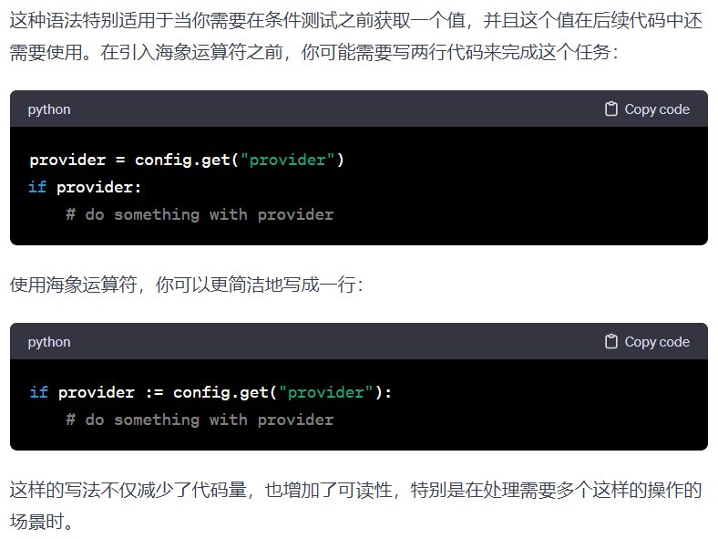

# Python的运算符
  - 1. 变量与常量
  - 2. 运算符 Operators
  - 3. 注释 Comment
<!-- more -->
## 1. 变量与常量
### 1.1. 变量Variable

#### 1.1.1. 变量名规则

组成：大小写字母A-z；数字0-9；下划线_

开头：以字母或下划线开头；不能以数字开头

惯例：用下划线分隔开每个词，例如first_name,is_married,engine_rotation_speed

Note：不能是关键字

#### 1.1.2. 变量声明

赋值是将一个变量指向一块存储数据的内存地址

可以一行声明并赋值一个变量，也可以一行声明并赋值多个变量

```python
# 一行声明并赋值一个变量
first_name = 'Asabeneh'
age = 250
is_married = True
skills = ['HTML', 'CSS', 'JS', 'React', 'Python']
person_info = {
    'firstname':'Asabeneh',
    'lastname':'Yetayeh',
    'country':'Finland',
    'city':'Helsinki'
}

# 一行声明并赋值多个变量
first_name, last_name, country, age, is_married = 'Asabeneh', 'Yetayeh', 'Helsink', 250, True
print(first_name, last_name, country, age, is_married)
print('First name:', first_name)
print('Last name: ', last_name)
print('Country: ', country)
print('Age: ', age)
print('Married: ', is_married)

# 交换值swap
x = 3	#变量
y = 5
x,y = y,x	#交换两变量的值
x,y # 结果为(5, 3)
```

#### 1.1.3. 本质

可以把任意数据类型赋值给变量，同一个变量可以反复赋值，而且可以是不同类型的变量

把一个变量a赋值给另一个变量b，这个操作实际上是把变量b指向变量a所指向的数据

```
a = 'ABC'
b = a
a = 'XYZ'
print(b)  # 输出结果是ABC
```


### 1.2. 常量 Constant

规范：全部大写（eg.PI）

python并不能保证常量不被修改,其实也是变量

## 2. 运算符 Operators

### 2.1. 赋值运算符 Assignment Operators


### 2.2. 算术运算符 Arithmetic Operators


|  |  |  |
| --- | --- | --- |
| addition 加 | + | 2 + 3 = 5 |
| subtraction 减 | - | 3 - 2 = 1 |
| multiplication 乘 | * | 3 * 2 = 6 |
| division 除 | / | 3 / 2 = 1.5 |
| floor division 向下整除 | // | 3 // 2 = 1 |
| modulus 取模 | % | 3 % 2 = 1 |
| exponential 求幂 | ** | 3 ** 2 = 3 x 3 = 9 |

Note：除法分为两种：/和//

/，除法计算结果是浮点数，即使是两个整数恰好整除，结果也是浮点数

```
>>> 9 / 3
3.0
```

//，称为向下整除，两个整数的除法仍然是整数，即使除不尽

```
>>> 10 // 3
3
```

### 2.3. 比较运算符 Comparison Operators


Note：比较运算符支持连续比较

```json
>>> 3>2>1	#python里这个表达式正确，同3>2 and 2>1，而c语言里则不正确，同(3>2)>1
True
>>> 1<2<3
True
```

除了上述的，python还有is，is not，in，not in

|  |  |
| --- | --- |
| is | 是，和 == 一样 |
| is not | 不是，和 != 一样 |
| in | 在内 |
| not in | 不在内 |

```python
>>> 1 is 1
<stdin>:1: SyntaxWarning: "is" with a literal. Did you mean "=="?
True
>>> 4 is 2**2
<stdin>:1: SyntaxWarning: "is" with a literal. Did you mean "=="?
True
>>> 1 is not 2
<stdin>:1: SyntaxWarning: "is not" with a literal. Did you mean "!="?
True
>>> 'A' in 'Asab'
True
>>> 'B' in 'Asab'
False
>>> 'coding' in 'coding for all'
True
>>> 'B' not in 'Asab'
True
```

### 2.4. 逻辑运算符 Logical Operators

优先级：not>and>or,优先级与c语言一样

| | |
| --- | --- |
| and | 与 |
| or | 或 |
| not | 非 |

```python
print(3 > 2 and 4 > 3) # True - because both statements are true
print(3 > 2 and 4 < 3) # False - because the second statement is false
print(3 < 2 and 4 < 3) # False - because both statements are false
print('True and True: ', True and True)
print(3 > 2 or 4 > 3)  # True - because both statements are true
print(3 > 2 or 4 < 3)  # True - because one of the statements is true
print(3 < 2 or 4 < 3)  # False - because both statements are false
print('True or False:', True or False)
print(not 3 > 2)     # False - because 3 > 2 is true, then not True gives False
print(not True)      # False - Negation, the not operator turns true to false
print(not False)     # True
print(not not True)  # True
print(not not False) # False
```

### 2.5. 海象运算符 `:=` Walrus Operator

Python 3.8 版本中引入的一种新语法特性



## 3. 注释 Comment

单行注释用#号（hash）

```python
# This is the first comment
# This is the second comment
# Python is eating the world
```

多行注释用三引号"""（Triple quote ）

Note：三引号可以支持换行，可以用作多行注释，但自身依旧是字符串

```python
"""This is multiline comment
multiline comment takes multiple lines.
python is eating the world
"""
```