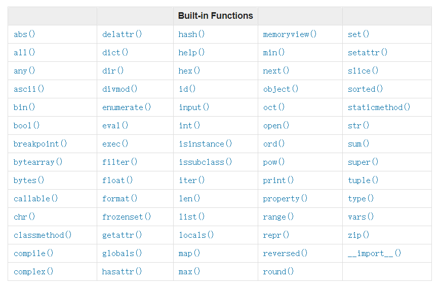
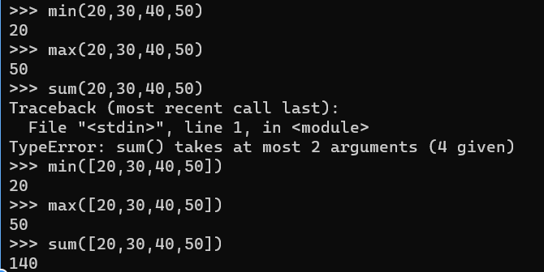

# Python的函数
  - 1. 顺序/选择/循环语句
  - 2. 函数 Functions
  - 3. 内置函数 built-in functions
  - 4. 高阶函数
  - 5. 内置高阶函数
<!-- more -->
## 1. 顺序/选择/循环语句

### 1.1. Conditionals 选择

```python
# if
a = 3
if a > 0:
    print('A is a positive number')

# else
a = 3
if a < 0:
    print('A is a negative number')
else:
    print('A is a positive number')

# elif
a = 0
if a > 0:
    print('A is a positive number')
elif a < 0:
    print('A is a negative number')
else:
    print('A is zero')

# code if condition else code
a = 3
print('A is positive') if a > 0 else print('A is negative') # first condition met, 'A is positive' will be printed
```

### 1.2. Loops 循环

```python
# while
count = 0
while count < 5:
    print(count)
    count = count + 1

# for string/list/tuple/set
for item in string/list/tuple/set:
    print(item)

# for string/list/tuple
for i in range(len(string/list/tuple)):
    print(String[i]/list[i]/tuple[i])

# for dict
for key in dict:
    print(key)

for key,value in dict.items():
    print(key,value)
```

#### 1.2.1. else 循环结束后执行

```python
# while else （while结束后会走到else）
count = 0
while count < 5:
    print(count)
    count = count + 1
else:
    print(count)

# for else （for结束后会走到else）
for number in range(11):
    print(number)   # prints 0 to 10, not including 11
else:
    print('The loop stops at', number)
```

#### 1.2.2. Break&Continue 关键字

```python
# break
count = 0
while count < 5:
    print(count)
    count = count + 1
    if count == 3:
        break

# continue
numbers = (0,1,2,3,4,5)
for number in numbers:
    print(number)
    if number == 3:
        continue
    print('Next number should be ', number + 1) if number != 5 else print("loop's end") # for short hand conditions need both if and else statements
print('outside the loop')
```

#### 1.2.3. Pass 关键字（占位）

```python
for number in range(6):
    pass
```

## 2. 函数 Functions

### 2.1. 声明函数 Declare Function

Note：python用缩进创造一个代码块，其他语言用括弧brackets创造一个代码块

- def 关键字——声明函数
- return 关键字——返回函数值；可以返回任意类型,甚至是函数；函数里没有返回值，则默认返回None。
- 参数：可以没有参数，也可以有多个参数，也可以通过**args，**args**不限定参数个数；参数可以指定默认值；参数可以是任意类型，甚至是函数。

```python
# 声明模板
def function_name(argList):
    function_body
    [return return_value]

# 不限定参数个数: *args，针对list和tuple的unpack
def generate_groups (team,*args):
    print(team)
    for i in args:
        print(i)

print(generate_groups('Team-1','Asabeneh','Brook','David','Eyob'))

# 不限定参数个数：**args，针对dict的unpack
def packing_person_info(**kwargs):
    # check the type of kwargs and it is a dict type
    # print(type(kwargs))
	# Printing dictionary items
    for key in kwargs:
        print("{key} = {kwargs[key]}")
    return kwargs

print(packing_person_info(name="Asabeneh",
      country="Finland", city="Helsinki", age=250))
```

### 2.2. 调用函数 Call/Invoking Function

- 调用时，参数指定key和value，可以不按参数列表顺序传参

```python
def add_two_numbers (num1, num2):
    total = num1 + num2
    print(total)

print(add_two_numbers(num2 = 3, num1 = 2))
```

- 参数指定了默认值的，可以不传

```python
# 参数指定默认值
def calculate_age (birth_year,current_year = 2021):
    age = current_year - birth_year
    return age;

print('Age: ', calculate_age(1821)) # 可以不传第2个参数
print('Age: ', calculate_age(1821,2023))
```

### 2.3. 匿名函数 Lambda Function 

1、赋值给变量

```
# syntax
x = lambda param1, param2, param3: param1 + param2 + param2
print(x(arg1, arg2, arg3))

# example
add_two_nums = lambda a, b: a + b
print(add_two_nums(2,3))    # 5
```

2、自调用（一次性函数）

```
# Self invoking lambda function
(lambda a, b: a + b)(2,3) # 5 - need to encapsulate it in print() to see the result in the console
```

3、在另一个函数内

```
def power(x):
    return lambda n : x ** n

cube = power(2)(3)   # function power now need 2 arguments to run, in separate rounded brackets
print(cube)          # 8
two_power_of_five = power(2)(5)
print(two_power_of_five)  # 32
```
### 2.4. 类型提示（→）

```xml
# 函数会返回一个布尔类型
def _get_verbosity() -> bool:
    from langchain.globals import get_verbose

    return get_verbose()
```
## 3. 内置函数 built-in functions

### 3.1. 所有内置函数

[所有内置函数及解释](https://docs.python.org/3.9/library/functions.html)



### 3.2. 常用内置函数

*print()*,  *input()*, *len()*, *type()*, *help()*

*int()*, *float()*, *str()*, *list()*, *dict()*,

*min()*, *max()*, *sum()*, *sorted()*,

*open()*, *file()*, and *dir()*

#### 3.2.1. help()&dir() 查看所有功能（模块，关键字，数据类型）


```python
# 查看模块所有功能
import math
print(help(math))
print(dir(math))

```

#### 3.2.2. print() 输出

print()函数可传无限个参数，多个参数用逗号“,”隔开，结果是连成一串输出，遇到逗号“,”会输出一个空格

交互模式下不用print()也可输出，命令模式下需要print()才可输出

```python
>>> print('Hello,World!')
Hello,World!
>>> print('Hello',',','World','!')
Hello , World !
>>> print(len('Hello,World!'))
12
>>> print('100 + 200 =', 100 + 200)
100 + 200 = 300
>>> print('The quick brown fox', 'jumps over', 'the lazy dog')
The quick brown fox jumps over the lazy dog
>>> print(100 + 200)
300
```

#### 3.2.3. input() 输入

通过input()动态给变量赋值

可以不传参，也可以传参给用户提供输入信息

```python
# 不传参
>>> name = input()
>>> name
Michael
# 传参
>>> name = input('please enter your name: ')
>>> print('hello,', name)
hello, Michael
```

#### 3.2.4. open() 文件处理（配合os模块）

#### 3.2.5. 打开文件——手动关闭方式

```python
f = open(filename,mode) # mode：r a w x t b
f = opne(filename) # mode可以不传，默认是 rt
```

- "r" - Read - Default value. Opens a file for reading, it returns an error if the file does not exist
- "a" - Append - Opens a file for appending, will append to the end of the file, creates the file if it does not exist
- "w" - Write - Opens a file for writing, will overwrite any existing content,creates the file if it does not exist
- "x" - Create - Creates the specified file, returns an error if the file exists
- "t" - Text - Default value. Text mode
- "b" - Binary - Binary mode (e.g. images)

需要手动关闭

```python
f.close() # 手动关闭
```

#### 3.2.6. 打开文件——自动关闭方式

```python
with open('./files/reading_file_example.txt') as f:
    lines = f.read().splitlines()
    print(type(lines))
    print(lines)
```

#### 3.2.7. 读文件

```python
txt = f.read() # 读所有，返回str
txt = f.read(10) # 读前10个字符，返回str
lines = f.read().splitlines() #  # 读所有行，返回list
line = f.readline() # 读一行，返回str
lines = f.readlines() # 读所有行，返回list
```

#### 3.2.8. type() 验证数据类型


#### 3.2.9. int(),float(),str(),list(),set() 转换数据类型

```python
# int to float
num_int = 10
print('num_int',num_int)         # 10
num_float = float(num_int)
print('num_float:', num_float)   # 10.0

# float to int
gravity = 9.81
print(int(gravity))             # 9

# int or float to str
num_int = 10
print(num_int)                  # 10
num_str = str(num_int)
print(num_str)                  # '10'

# str to int or float
num_str = '10.6'
print('num_int', int(num_str))      # 10
print('num_float', float(num_str))  # 10.6

# str to list
first_name = 'Asabeneh'
print(first_name)               # 'Asabeneh'
first_name_to_list = list(first_name)
print(first_name_to_list)            # ['A', 's', 'a', 'b', 'e', 'n', 'e', 'h']
```

#### 3.2.10. len() 长度

获取string,list,tuple,set,dict的长度

#### 3.2.11. range() 整数列表

range(start,end,step)

默认：start=0,step=1

至少需要1个参数，即end

```python
lst = list(range(11))
print(lst) # [0, 1, 2, 3, 4, 5, 6, 7, 8, 9, 10]
st = set(range(1, 11))    # 2 arguments indicate start and end of the sequence, step set to default 1
print(st) # {1, 2, 3, 4, 5, 6, 7, 8, 9, 10}

lst = list(range(0,11,2))
print(lst) # [0, 2, 4, 6, 8, 10]
st = set(range(0,11,2))
print(st) #  {0, 2, 4, 6, 8, 10}

for number in range(11):
    print(number)   # prints 0 to 10, not including 11
```

#### 3.2.12. min(),max(),sum()




## 4. 高阶函数

### 4.1. 函数作为参数

```python
# 函数作为参数
def square_number (n):
    return n * n
def do_something(f, x):
    return f(x)

print(do_something(square_number, 3)) # 9
```

### 4.2. 函数作为返回值

根据不同参数返回不同函数

```python
def square(x):          # a square function
    return x ** 2

def cube(x):            # a cube function
    return x ** 3

def absolute(x):        # an absolute value function
    if x >= 0:
        return x
    else:
        return -(x)

def higher_order_function(type): # a higher order function returning a function
    if type == 'square':
        return square
    elif type == 'cube':
        return cube
    elif type == 'absolute':
        return absolute

result = higher_order_function('square')
print(result(3))       # 9
result = higher_order_function('cube')
print(result(3))       # 27
result = higher_order_function('absolute')
print(result(-3))      # 3
```

### 4.3. 闭包 Python Closures

Python 允许嵌套函数访问封闭函数的外部范围。这就是闭包。

```python
def add_ten():
    ten = 10
    def add(num):
        return num + ten
    return add

closure_result = add_ten()
print(closure_result(5))  # 15
print(closure_result(10))  # 20
```

### 4.4. 装饰器 Python Decorators

不修改object结构的情况下，给object添加新功能

#### 4.4.1. 应用单个装饰器到一个函数

```python
# 定义装饰器
def uppercase_decorator(function):
    def wrapper():
        func = function()
        make_uppercase = func.upper()
        return make_uppercase
    return wrapper

# 应用装饰器
@uppercase_decorator
def greeting():
    return 'Welcome to Python'

# 结果展示
print(greeting())   # WELCOME TO PYTHON
```

#### 4.4.2. 应用多个装饰器到一个函数

Note：装饰器的顺序很重要，靠函数近的装饰器先执行（也就是一个函数上的装饰器，执行顺序是从下到上）

如果变更两个装饰器的顺序会报错，如下图所示：


```python

'''These decorator functions are higher order functions
that take functions as parameters'''

# First Decorator
def uppercase_decorator(function):
    def wrapper():
        func = function()
        make_uppercase = func.upper()
        return make_uppercase
    return wrapper

# Second decorator
def split_string_decorator(function):
    def wrapper():
        func = function()
        splitted_string = func.split()
        return splitted_string
    return wrapper

@split_string_decorator # 后执行
@uppercase_decorator    # 先执行
def greeting():
    return 'Welcome to Python'
print(greeting())   # WELCOME TO PYTHON
```

#### 4.4.3. 接收参数的装饰器

```python
def decorator_with_parameters(function):
    def wrapper_accepting_parameters(para1, para2, para3): # 此处接收参数，和被装饰函数的参数保持一致
        function(para1, para2, para3)
        print("I live in {}".format(para3))
    return wrapper_accepting_parameters

@decorator_with_parameters
def print_full_name(first_name, last_name, country):
    print("I am {} {}. I love to teach.".format(
        first_name, last_name, country))

print_full_name("Asabeneh", "Yetayeh",'Finland')
```

## 5. 内置高阶函数

### 5.1. map(function,iterable) ：把function应用于序列中每一项

返回结果是一个map object，需要用list等函数转成想要的类型

```python
numbers = [1, 2, 3, 4, 5] # iterable
def square(x):
    return x ** 2
numbers_squared = map(square, numbers)
print(list(numbers_squared))    # [1, 4, 9, 16, 25]

# Lets apply it with a lambda function
numbers_squared = map(lambda x : x ** 2, numbers)
print(list(numbers_squared))    # [1, 4, 9, 16, 25]

names = ['Asabeneh', 'Lidiya', 'Ermias', 'Abraham']  # iterable
names_upper_cased = map(lambda name: name.upper(), names)
print(list(names_upper_cased))    # ['ASABENEH', 'LIDIYA', 'ERMIAS', 'ABRAHAM']

```

### 5.2. reduce(function, iterable)：返回单个值

```python
numbers_str = ['1', '2', '3', '4', '5']  # iterable
def add_two_nums(x, y):
    return int(x) + int(y)

total = reduce(add_two_nums, numbers_str)
print(total)    # 15
```

### 5.3. filter(function, iterable)：留下function返回True的序列中的项

```python
# Lets filter only even nubers
numbers = [1, 2, 3, 4, 5]  # iterable

def is_even(num):
    if num % 2 == 0:
        return True
    return False

even_numbers = filter(is_even, numbers)
print(list(even_numbers))       # [2, 4]
```

