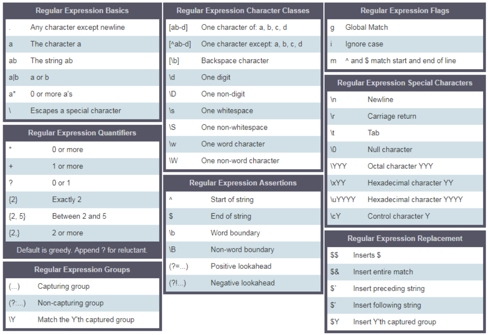

# Python的包与模块
  - 1. 包、模块与\_\_init\_\_.py
  - 2. Python文件内部
  - 3. python内置模块
  - 4. 应用
<!-- more -->
## 1. 包、模块与__init__.py

### 1.1. 包 Package

包是指含有__init__.py的文件夹，如果没有__init__.py则不是包

包里包含的内容：__init__.py，模块，子包


### 1.2. 模块 Modules

模块是指包里的python文件

模块是一个文件，里面包含变量，函数等

A module can contain multiple objects, such as classes, functions, etc.

包是一个文件夹，包含有一个或多个模块

A package can contain one or more relevant modules.

A package is actually a folder containing one or more module files.

### 1.3. \_\_init\_\_.py

三个主要作用：

1）标识其所在目录为一个python包，可以被其他代码导入使用

2）初始化python包，可以被理解为是包的构造函数，当一个包被第一次引入时会被执行，可以将一些初始化代码放如此

3）控制导入行为：在__init__.py中定义可以被外界调用的类和方法。

导入所有（from xxx import *）：可以通过设置 `__all__` 变量来指定包被import * 导入时，应该导入哪些模块

导入指定（from xxx import yyy）: 如果有__getattr__方法，导入前会调用该方法

注意：

- `__init__.py`文件可以为空
- 不能把其它同级目录的文件导入此package中
- 如果有多个类和方法名字相同，那么后导入的会覆盖先导入的

## 2. Python文件内部

### 2.1. 导入

1、导入整个模块

- import module_name
- from module_name import * # 使用更便捷

*Note：用* from statistics import * 代替 import statistics，可以避免前面都加statistics.mean(xxx)，

从而可以直接使用导入的函数mean(xxx)

```python
# main.py file
import mymodule
print(mymodule.generate_full_name('Asabeneh', 'Yetayeh')) # Asabeneh Yetayeh

from math import *
print(pi)                  # 3.141592653589793, pi constant
print(sqrt(2))             # 1.4142135623730951, square root
print(pow(2, 3))           # 8.0, exponential
print(floor(9.81))         # 9, rounding to the lowest
print(ceil(9.81))          # 10, rounding to the highest
print(math.log10(100))     # 2
```

2、导入模块中的部分变量或函数

```python
# main.py file
from mymodule import generate_full_name, sum_two_nums, person, gravity
print(generate_full_name('Asabneh','Yetayeh'))
print(sum_two_nums(1,9))
mass = 100;
weight = mass * gravity
print(weight)
print(person['firstname'])
```

3、导入内容重命名

```python
# main.py file
from mymodule import generate_full_name as fullname, sum_two_nums as total, person as p, gravity as g
print(fullname('Asabneh','Yetayeh'))
print(total(1, 9))
mass = 100;
weight = mass * g
print(weight)
print(p)
print(p['firstname'])
```

### 2.2. 类与对象

Python是面向对象的编程语言

Python的每个元素都是一个类，有其属性和方法（行为）

number, string, list, dictionary, tuple, set是内置类（built-in class）

#### 2.2.1. 创建类&对象

```python
# 创建Person类（用class关键字创建类，类名采用驼峰命名）
class Person:
      # 构造函数：Python有一个内置构造函数init()
      # 参数可以给默认值，调用构造函数时就可用默认值，从而不传参数
      # init()构造函数有一个 self 参数,是类的实例（对象）的一个指代
      def __init__(self, firstname='Asabeneh', lastname='Yetayeh', age=250, country='Finland', city='Helsinki'):
          self.firstname = firstname
          self.lastname = lastname
          self.age = age
          self.country = country
          self.city = city
          self.skills = []

      # 方法
      def person_info(self):
        return f'{self.firstname} {self.lastname} is {self.age} years old. He lives in {self.city}, {self.country}.'
      def add_skill(self, skill):
          self.skills.append(skill)

# 创建Person对象
p1 = Person() # 通过调用构造函数创建对象
print(p1.person_info())
p1.add_skill('HTML')
p1.add_skill('CSS')
p1.add_skill('JavaScript')

p2 = Person('John', 'Doe', 30, 'Nomanland', 'Noman city') # 通过调用构造函数创建对象
print(p2.person_info())
print(p1.skills)
print(p2.skills)
```

#### 2.2.2. 继承类

```python
# 通过class Student(Person)语法使Student类继承Person类
class Student(Person):
    # 改写父类方法：和父类方法同名，则会覆盖父类的方法
    # 如果子类没有改写init()，则可以使用父类的构造方法创建对象
    def __init__ (self, firstname='Asabeneh', lastname='Yetayeh',age=250, country='Finland', city='Helsinki', gender='male'):
        self.gender = gender
        # 通过super()调用父类的方法
        super().__init__(firstname, lastname,age, country, city)

    # 改写父类方法：和父类方法同名，则会覆盖父类的方法
    def person_info(self):
        gender = 'He' if self.gender =='male' else 'She'
        return f'{self.firstname} {self.lastname} is {self.age} years old. {gender} lives in {self.city}, {self.country}.'

# 创建Student对象
s1 = Student('Eyob', 'Yetayeh', 30, 'Finland', 'Helsinki','male')
print(s1.person_info())
s1.add_skill('JavaScript')
s1.add_skill('React')
s1.add_skill('Python')
print(s1.skills)

s2 = Student('Lidiya', 'Teklemariam', 28, 'Finland', 'Espoo', 'female')
print(s2.person_info())
s2.add_skill('Organizing')
s2.add_skill('Marketing')
s2.add_skill('Digital Marketing')
print(s2.skills)
```

### 2.3. 异常

#### 2.3.1. 异常类型

|  |  |
| --- | --- |
| SyntaxError | 语法错误 |
| NameError | 未申明变量 |
| IndexError | 索引越界 |
| ModuleNotFoundError | 模块未发现 |
| AttributeError | 属性错误 |
| KeyError | 键错误 |
| TypeError | 类型错误 |
| ImportError | 导入错误 |
| ValueError | 值错误 |
| ZeroDivisionError | 除0错误 |

#### 2.3.2. 异常处理（try except finally）

```python
# example 1
try:
    name = input('Enter your name:')
    year_born = input('Year you were born:')
    age = 2019 - year_born
    print(f'You are {name}. And your age is {age}.')
except:
    print('Something went wrong')

"""输出结果
Something went wrong
"""

# example 2
try:
    name = input('Enter your name:')
    year_born = input('Year you were born:')
    age = 2019 - year_born
    print(f'You are {name}. And your age is {age}.')
except TypeError:
    print('Type error occured')
except ValueError:
    print('Value error occured')
except ZeroDivisionError:
    print('zero division error occured')

""" 输出结果
Enter your name:Asabeneh
Year you born:1920
Type error occured
"""

# example 3
try:
    name = input('Enter your name:')
    year_born = input('Year you born:')
    age = 2019 - int(year_born)
    print('You are {name}. And your age is {age}.')
except Exception as e:
    print(e)
else:
    print('I usually run with the try block')
finally:
    print('I alway run.')

```

### 2.4. 内置变量\_\_name\_\_

- 在本文件中，\_\_name\_\_的值为‘\_\_main\_\_’
- 在该文件作为模块被导入到其他文件中，被导入模块的\_\_name\_\_值为导入的模块名


## 3. python内置模块
### 3.1. os

os：(operating system)操作系统

用途：操作文件夹或文件

```
# import the module
import os
# Creating a directory
os.mkdir('directory_name')
# Changing the current directory
os.chdir('path')
# Getting current working directory
os.getcwd()
# Removing directory
os.rmdir()

# 删除文件：如果不存在则报错
os.remove('./files/example.txt')
# 删除文件，提前校验文件是否存在
if os.path.exists('./files/example.txt'):
    os.remove('./files/example.txt')
else:
    print('The file does not exist')
```
### 3.2. sys
sys：(runtime environment)运行时环境

用途：命令行参数等

```
import sys
# command line: python script.py Asabeneh 30DaysOfPython
print(sys.argv[0], argv[1],sys.argv[2])  # this line would print out: filename argument1 argument2
print('Welcome {}. Enjoy  {} challenge!'.format(sys.argv[1], sys.argv[2])) # Welcome Asabeneh. Enjoy  30DayOfPython challenge! 
# to exit sys
sys.exit()
# To know the largest integer variable it takes
sys.maxsize
# To know environment path
sys.path
# To know the version of python you are using
sys.version
```
### 3.3. math
math 数学

数学运算及常量

```
import math
print(math.pi)           # 3.141592653589793, pi constant
print(math.sqrt(2))      # 1.4142135623730951, square root
print(math.pow(2, 3))    # 8.0, exponential function
print(math.floor(9.81))  # 9, rounding to the lowest
print(math.ceil(9.81))   # 10, rounding to the highest
print(math.log10(100))   # 2, logarithm with 10 as base
```
### 3.4. datetime
datetime 时间

- datetime 日期+时间
- date 日期
- time 时间

```
from datetime import datetime
now = datetime.now()
new_year = datetime(2020, 1, 1)
timestamp = now.timestamp()
t = now.strftime("%H:%M:%S") # 格式化输出
date_object = datetime.strptime(date_string, "%d %B, %Y") # string转datetime对象
from datetime import date
from datetime import time
```
### 3.5. random
random 随机数

random and randint

```
from random import random, randint
print(random())   # it doesn't take any arguments; it returns a value between 0 and 0.9999
print(randint(5, 20)) # it returns a random integer number between [5, 20] inclusive
```
### 3.6. statistics
statistics 统计数据

mean, median, mode, stdev等

```
from statistics import * # importing all the statistics modules
ages = [20, 20, 4, 24, 25, 22, 26, 20, 23, 22, 26]
print(mean(ages))       # ~22.9
print(median(ages))     # 23
print(mode(ages))       # 20
print(stdev(ages))      # ~2.3
```
### 3.7. webbrowser
can help us to open any website. For instance if you like to open any number of websites at any time or if you like to schedule something, this webbrowser module can be used.

```
import webbrowser # web browser module to open websites

# list of urls: python
url_lists = [
    'http://www.python.org',
    'https://www.linkedin.com/in/asabeneh/',
    'https://github.com/Asabeneh',
    'https://twitter.com/Asabeneh',
]

# opens the above list of websites in a different tab
for url in url_lists:
    webbrowser.open_new_tab(url)
```
### 3.8. json
json：JavaScript Object Notation (JSON)

JSON及JSON文件处理

1、导入

import json

2、jsonstr与dict转换

dict=json.loads(json_str)

json_str=json.dumps(dict)

3、保存JSON文件

json.dump(dict,output_file,...)

```
import json
# python dictionary
person = {
    "name": "Asabeneh",
    "country": "Finland",
    "city": "Helsinki",
    "skills": ["JavaScrip", "React", "Python"]
}
with open('./files/json_example.json', 'w', encoding='utf-8') as f:
    json.dump(person, f, ensure_ascii=False, indent=4)
```
### 3.9. csv

CSV文件处理

1、导入

import csv

2、读文件

csv.reader(f, delimiter=',')

```
import csv
with open('./files/csv_example.csv') as f:
    csv_reader = csv.reader(f, delimiter=',') # w use, reader method to read csv
    line_count = 0
    for row in csv_reader:
        if line_count == 0:
            print(f'Column names are :{", ".join(row)}')
            line_count += 1
        else:
            print(
                f'\t{row[0]} is a teachers. He lives in {row[1]}, {row[2]}.')
            line_count += 1
    print(f'Number of lines:  {line_count}')
```
### 3.10. string
```
import string
print(string.ascii_letters) # abcdefghijklmnopqrstuvwxyzABCDEFGHIJKLMNOPQRSTUVWXYZ
print(string.digits)        # 0123456789
print(string.punctuation)   # !"#$%&'()*+,-./:;<=>?@[\]^_`{|}~
```
### 3.11. re
re 正则表达式 RegEx (Regular Expressions)

```
re.I # 匹配是否不限大小写，加上则不限
re.match # 找第1个
re.search # 找第1个
re.findall  # 找所有
re.sub # 全部替代
re.split # 按分隔符拆分
声明一个正则表达式：r'xxx'
```

```

txt = '''%I a%m te%%a%%che%r% a%n%d %% I l%o%ve te%ach%ing. 
T%he%re i%s n%o%th%ing as r%ewarding a%s e%duc%at%i%ng a%n%d e%m%p%ow%er%ing p%e%o%ple.
I fo%und te%a%ching m%ore i%n%t%er%%es%ting t%h%an any other %jobs. 
D%o%es thi%s m%ot%iv%a%te %y%o%u to b%e a t%e%a%cher?'''

matches = re.sub('%', '', txt)
print(matches)

""" 输出结果
I am teacher and I love teaching.
There is nothing as rewarding as educating and empowering people. 
I found teaching more interesting than any other jobs. Does this motivate you to be a teacher?
"""
```
#### 3.11.1. 正则表达式规则



### 3.12. collections
### 3.12.1. Counter 计数

Counter是dict的子类，用于计数可哈希对象。

```
from collections import Counter

# 字符串
s = "loveleetcode"
counter = Counter(s)
print(counter) # Counter({'e': 4, 'l': 2, 'o': 2, 'v': 1, 't': 1, 'c': 1, 'd': 1})

# 列表
lst = ['red', 'blue', 'red', 'green', 'blue', 'blue']
counter = Counter(lst)
print(counter) # Counter({'blue': 3, 'red': 2, 'green': 1})
```
Counter的方法most_common(),返回top k的列表

```
Counter('abracadabra').most_common(3) # [('a', 5), ('b', 2), ('r', 2)]

Counter('abracadabra').most_common(5) # [('a', 5), ('b', 2), ('r', 2), ('c', 1), ('d', 1)]
```
### 3.12.2. deque 双端队列（double-end queue）
```
from collections import deque

queue = deque()

queue = deque(list/tuple/string/dict)
```

```
queue.append(item) # 从右端添加元素
queue.extend(list/tuple/string/dict) # 从右端添加可迭代对象
queue.pop() # 从右端移除元素并返回

queue.appendleft(item) # 从左端添加元素
queue.extendleft(list/tuple/string/dict)# 从左端添加可迭代对象
queue.popleft() # 从左端移除元素并返回
```

## 4. 应用

### 4.1. 抓取网站数据

- 使用requests从url获取数据
- 使用BeautifulSoup解析页面内容

[Beautiful Soup Doc](https://www.crummy.com/software/BeautifulSoup/bs4/doc/#quick-start)

导包

```python
pip install requests
pip install beautifulsoup4
```

使用

```python
import requests
from bs4 import BeautifulSoup
url = 'https://archive.ics.uci.edu/ml/datasets.php'

response = requests.get(url)
content = response.content # we get all the content from the website
soup = BeautifulSoup(content, 'html.parser') # beautiful soup will give a chance to parse
print(soup.title) # <title>UCI Machine Learning Repository: Data Sets</title>
print(soup.title.get_text()) # UCI Machine Learning Repository: Data Sets
print(soup.body) # gives the whole page on the website
print(response.status_code)

tables = soup.find_all('table', {'cellpadding':'3'})
# We are targeting the table with cellpadding attribute with the value of 3
# We can select using id, class or HTML tag , for more information check the beautifulsoup doc
table = tables[0] # the result is a list, we are taking out data from it
for td in table.find('tr').find_all('td'):
    print(td.text)
```

