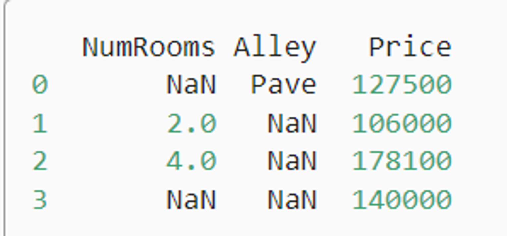

# 使用PyTorch进行深度学习实践
- 0. Pytorch的API
- 1. 数据加载和预处理
- 2. 定义网络模型
- 3. 定义损失函数和优化器
- 4. 训练网络
- 5. 测试网络
- 6. 保存和加载模型
- 7. GPU加速
- 8. 使用TensorBoard进行可视化
<!-- more -->
## 0. Pytorch的API
- data模块：提供了数据处理工具
- nn模型：定义了大量的神经网络层和常见损失函数
## 1. 数据加载和预处理
PyTorch提供了torch.utils.data.DataLoader类，可以帮助我们方便地进行数据的加载和处理。
### 1.1. DataLoarder
DataLoader类提供了对数据集的并行加载，可以有效地加载大量数据，并提供了多种数据采样方式。

常用的参数有：

- dataset：加载的数据集（Dataset对象）
- batch_size：batch大小
- shuffle：是否每个epoch时都打乱数据
- num_workers：使用多进程加载的进程数，0表示不使用多进程

### 1.2. 自定义数据集
自定义数据集需要继承Dataset类，并实现__len__和__getitem__两个方法。

以下是一个自定义数据集的简单示例：
```python
from torch.utils.data import Dataset, DataLoader

# 定义MyDataset类，继承父类Dataset
class MyDataset(Dataset):
    def __init__(self, x_tensor, y_tensor):
        self.x = x_tensor
        self.y = y_tensor

    def __getitem__(self, index):
        return (self.x[index], self.y[index])

    def __len__(self):
        return len(self.x)
```
我们创建了一个简单的数据集，包含10个数据。然后我们使用DataLoader加载数据，并设置了batch大小和shuffle参数。
```python
x = torch.arange(10)
y = torch.arange(10) + 1

my_dataset = MyDataset(x, y)

loader = DataLoader(my_dataset, batch_size=4, shuffle=True, num_workers=0)

for x, y in loader:
    print("x:", x, "y:", y)
```


### 1.3. 使用pandas预处理原始数据
**目标：使用pandas预处理原始数据，并将原始数据转换为张量格式**

- pandas软件包是Python中常用的数据分析工具，pandas可以与张量兼容。
- 用pandas处理缺失的数据时，我们可根据情况选择用插值法和删除法。

#### 1.3.1. 读取数据集
```python
import os

os.makedirs(os.path.join('..', 'data'), exist_ok=True) # os.path.join会用对应操作系统的分隔符如/去拼接路径
data_file = os.path.join('..', 'data', 'house_tiny.csv')
with open(data_file, 'w') as f:
    f.write('NumRooms,Alley,Price\n')  # 列名
    f.write('NA,Pave,127500\n')  # 每行表示一个数据样本
    f.write('2,NA,106000\n')
    f.write('4,NA,178100\n')
    f.write('NA,NA,140000\n')
```

```python
# 如果没有安装pandas，只需取消对以下行的注释来安装pandas
# !pip install pandas
import pandas as pd

data = pd.read_csv(data_file)
print(data)
```
输出如下：


#### 1.3.2. 处理缺失值(连续值和离散值)
注意，“NaN”项代表缺失值。

为了处理缺失的数据，典型的方法包括*插值法*和*删除法*， 其中插值法用一个替代值弥补缺失值，而删除法则直接忽略缺失值。

在这里，我们将考虑插值法。
```python
# iloc, 全称为index location，即对数据进行位置索引，从而在数据表中提取出相应的数据。
# 将data分成inputs和outputs
inputs, outputs = data.iloc[:, 0:2], data.iloc[:, 2]
# 对于inputs中缺少的数值，我们用同一列的均值替换“NaN”项。
inputs = inputs.fillna(inputs.mean())
print(inputs)
```
输出如下：


```python
# inputs中的类别值或离散值的缺失值处理
inputs = pd.get_dummies(inputs, dummy_na=True)
print(inputs)
```

#### 1.3.3. 转换为张量格式
```python
import torch

x, y = torch.tensor(inputs.values), torch.tensor(outputs.values)
x, y
```
输出如下：


## 2. 定义网络模型
PyTorch提供了`torch.nn`库，它是用于构建神经网络的工具库。
`nn.Module`包含了神经网络的层以及返回输出的`forward(input)`方法。

```python
import torch
import torch.nn as nn
import torch.nn.functional as F

# 定义一个Net类，继承父类nn.Module
class Net(nn.Module):
    
    # 在`__init__`方法中定义网络的结构(网络的层)
    def __init__(self):
        super(Net, self).__init__()

        # 输入图像channel：1，输出channel：6，5x5卷积核
        self.conv1 = nn.Conv2d(1, 6, 5)
        self.conv2 = nn.Conv2d(6, 16, 5)

        # 全连接层
        self.fc1 = nn.Linear(16 * 5 * 5, 120)
        self.fc2 = nn.Linear(120, 84)
        self.fc3 = nn.Linear(84, 10)

    # 在`forward`方法中定义数据的流向(网络的前向传播过程)
    def forward(self, x):
        # 使用2x2窗口进行最大池化
        x = F.max_pool2d(F.relu(self.conv1(x)), (2, 2))
        # 如果窗口是方的，只需要指定一个维度
        x = F.max_pool2d(F.relu(self.conv2(x)), 2)

        x = x.view(-1, self.num_flat_features(x))

        x = F.relu(self.fc1(x))
        x = F.relu(self.fc2(x))
        x = self.fc3(x)

        return x

    def num_flat_features(self, x):
        size = x.size()[1:]  # 获取除了batch维度之外的其他维度
        num_features = 1
        for s in size:
            num_features *= s
        return num_features

net = Net()
print(net)

输出结果为：
Net(
  (conv1): Conv2d(1, 6, kernel_size=(5, 5), stride=(1, 1))
  (conv2): Conv2d(6, 16, kernel_size=(5, 5), stride=(1, 1))
  (fc1): Linear(in_features=400, out_features=120, bias=True)
  (fc2): Linear(in_features=120, out_features=84, bias=True)
  (fc3): Linear(in_features=84, out_features=10, bias=True)
)
```
这里需要注意：

- backward函数（用于计算梯度）会被autograd自动创建和实现。你只需要在nn.Module的子类中定义forward函数。
- 在创建好神经网络后，我们可以使用net.parameters()方法来返回网络的可学习参数。

## 3. 定义损失函数和优化器
损失函数用于衡量模型的预测与真实标签的差距。我们一般使用交叉熵损失函数（Cross Entropy Loss）

优化器用于优化模型的参数以减少损失，我们一般使用随机梯度下降优化器（Stochastic Gradient Descent，SGD）

更新网络的梯度，一个简单的更新规则是 weight = weight - learning_rate * gradient

```python
import torch.optim as optim

# 定义损失函数
criterion = nn.CrossEntropyLoss()

# 定义优化器
# 我们需要将网络的参数传递给优化器，然后设置学习率和动量
optimizer = optim.SGD(net.parameters(), lr=0.001, momentum=0.9)
```
## 4. 训练网络
在训练过程中，我们首先通过网络进行前向传播得到输出，然后计算输出与真实标签的损失，接着通过后向传播计算梯度，最后使用优化器更新模型参数

在训练集上训练epochs轮次

每一轮，对于一batchs批次

- 获取输入数据：inputs, labels = data
- 梯度清零：optimizer.zero_grad()
- 前向传播：outputs = net(inputs)
- 计算损失：loss = criterion(outputs, labels)
- 反向传播：loss.backward()
- 更新参数：optimizer.step()

## 5. 测试网络
训练完成后，在测试集上测试网络的性能，评估其泛化能力
```python
with torch.no_grad(): # 是指无需计算梯度，减少内存消耗
```
## 6. 保存和加载模型
在深度学习模型的训练过程中，我们经常需要保存模型的参数以便于将来重新加载。这对于中断的训练过程的恢复，或者用于模型的分享和部署都是非常有用的。

PyTorch提供了简单的API来保存和加载模型。最常见的方法是使用torch.save来保存模型的参数，然后通过torch.load来加载模型的参数。

### 6.1. 保存和加载模型参数
```python
# 保存
torch.save(model.state_dict(), PATH)

# 加载
model = TheModelClass(*args, **kwargs) # 创建新的模型实例
model.load_state_dict(torch.load(PATH)) # 加载模型参数
model.eval()
```
在保存模型参数时，我们通常使用.state_dict()方法来获取模型的参数。.state_dict()是一个从参数名字映射到参数值的字典对象。

在加载模型参数时，我们首先需要实例化一个和原模型结构相同的模型，然后使用.load_state_dict()方法加载参数。

请注意，load_state_dict()函数接受一个字典对象，而不是保存对象的路径。这意味着在你传入load_state_dict()函数之前，你必须反序列化你的保存的state_dict。

在加载模型后，我们通常调用.eval()方法将dropout和batch normalization层设置为评估模式。否则，它们会在评估模式下保持训练模式。
### 6.2. 保存和加载整个模型
除了保存模型的参数，我们也可以保存整个模型。
```python
# 保存
torch.save(model, PATH)

# 加载
model = torch.load(PATH)
model.eval()
```
保存整个模型会将模型的结构和参数一起保存。这意味着在加载模型时，我们不再需要手动创建模型实例。但是，这种方式需要更多的磁盘空间，并且可能在某些情况下导致代码的混乱，所以并不总是推荐的。
## 7. GPU加速
在深度学习训练中，GPU加速是非常重要的一部分。GPU的并行计算能力使得其比CPU在大规模矩阵运算上更具优势。PyTorch提供了简单易用的API，让我们可以很容易地在CPU和GPU之间切换计算。但需要注意的是，数据在CPU和GPU之间的传输会消耗一定的时间，因此我们应该尽量减少数据的传输次数。

PyTorch支持使用GPU进行计算，这可以大大提高训练和推理的速度。使用GPU进行计算的核心就是将Tensor和模型转移到GPU上。

检查系统中是否存在可用的GPU:
```python
import torch

# 检查是否有可用的GPU
if torch.cuda.is_available():
    print("There is a GPU available.")
else:
    print("There is no GPU available.")
```

使用`.to(device)`方法将tensor移动到GPU上：
```python
# 判断是否支持CUDA
device = torch.device("cuda" if torch.cuda.is_available() else "cpu")

# 创建一个tensor
x = torch.tensor([1.0, 2.0])

# 移动tensor到GPU上
if torch.cuda.is_available():
    x = x.to(device)
```

创建tensor时指定设备：
```python
# 直接在GPU上创建tensor
if torch.cuda.is_available():
    x = torch.tensor([1.0, 2.0], device='cuda')
```

模型训练时，将模型和数据移动到GPU上:

当模型在GPU上时，我们需要确保输入的Tensor也在GPU上，否则会报错。

注意，将模型转移到GPU上后，模型的所有参数和缓冲区都会转移到GPU上。
```python
# 判断是否支持CUDA
device = torch.device("cuda" if torch.cuda.is_available() else "cpu")

# 创建一个简单的模型
model = torch.nn.Linear(10, 1)

# 创建一些数据
data = torch.randn(100, 10)

# 移动模型和数据到GPU
if torch.cuda.is_available():
    model = model.to(device)
    data = data.to(device)
```
## 8. 使用TensorBoard进行可视化
TensorBoard 是一个可视化工具，它可以帮助我们更好地理解，优化，和调试深度学习模型。PyTorch 提供了对 TensorBoard 的支持，我们可以非常方便地使用 TensorBoard 来监控模型的训练过程，比较不同模型的性能，可视化模型结构，等等。

通过使用 TensorBoard，我们可以更好地理解和优化我们的模型。

### 8.1. 启动TensorBoard
要启动 TensorBoard，我们需要在命令行中运行 tensorboard --logdir=runs 命令，其中 runs 是保存 TensorBoard 数据的目录。

### 8.2. 记录数据
我们可以使用 torch.utils.tensorboard 模块来记录数据。首先，我们需要创建一个 SummaryWriter 对象，然后通过这个对象的方法来记录数据。
```python
from torch.utils.tensorboard import SummaryWriter

# 创建一个 SummaryWriter 对象
writer = SummaryWriter('runs/experiment1')

# 使用 writer 来记录数据
for n_iter in range(100):
    writer.add_scalar('Loss/train', np.random.random(), n_iter)
    writer.add_scalar('Loss/test', np.random.random(), n_iter)
    writer.add_scalar('Accuracy/train', np.random.random(), n_iter)
    writer.add_scalar('Accuracy/test', np.random.random(), n_iter)

# 关闭 writer
writer.close()
```
### 8.3. 可视化模型结构
```python
# 添加模型
writer.add_graph(model, images)
```

### 8.4. 可视化高维数据
我们还可以使用 TensorBoard 的嵌入功能来可视化高维数据，如图像特征、词嵌入等。
```python
# 添加嵌入
writer.add_embedding(features, metadata=class_labels, label_img=images)
```