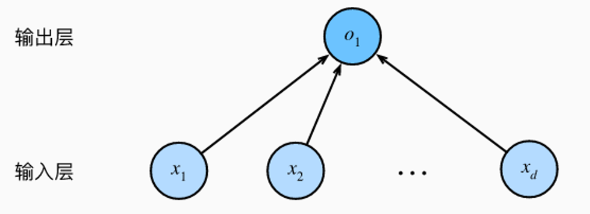
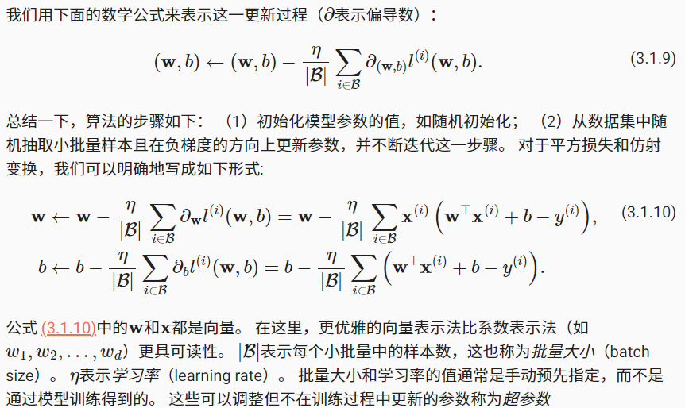
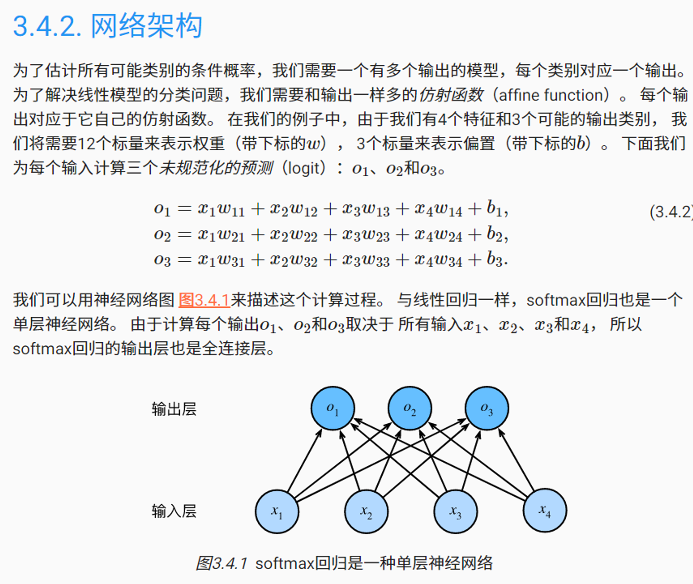
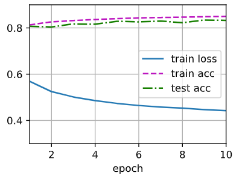

# Pytorch实战线性神经网络
- 1. Pytorch实现线性回归
- 2. Pytorch实现softmax回归
<!-- more -->
## 1. Pytorch实现线性回归
### 1.1. 目标
整体目标：预测

实例：根据房屋的面积和房龄来估算房屋价格


给定一个数据集，我们的目标是寻找模型的权重w和偏置b，使得根据模型做出的预测大体符合数据里的真实价格。


### 1.2. 合成数据集
```python
import torch

def synthetic_data(w, b, num_examples):
    """生成y=Xw+b+噪声"""
    """num_examples:样本数量
        w：权重向量
        b：偏置
    """
    X = torch.normal(0, 1, (num_examples, len(w))) # torch.Size([1000, 2])
    y = torch.matmul(X, w) + b # torch.Size([1000])
    y += torch.normal(0, 0.01, y.shape) # torch.Size([1000])  加上噪声
    return X, y.reshape((-1,1)) # torch.Size([1000, 2]), torch.Size([1000, 1])
```
- torch.normal(means,std,out=None)
  - 参数：
    - means（Tensor）：均值
    - std（Tensor）:标准差
    - out（Tensor）：可选的输出张量，指定Tensor的size是几行几列
  - 返回：
    - 返回一个张量，从给定均值、标准差的离散正太分布中抽取随机数
  - 此处解读：
    - 均值为0，标准差为1，输出张量num_examples行，len(w）列
```python
true_w = torch.tensor([2, -3.4])
true_b = 4.2
features, labels = synthetic_data(true_w, true_b, 1000) # torch.Size([1000, 2]), torch.Size([1000, 1])
```
### 1.3. 数据加载
```python
from torch.utils import data

def load_array(data_arrays, batch_size, is_train=True):
    dataset = data.TensorDataset(*data_arrays)
    return data.DataLoader(dataset, batch_size, shuffle=is_train)
```

```python
batch_size = 10
data_iter = load_array((features, labels), batch_size)
```
每一批次的数据有10条，示例如下：
```
[tensor([[-0.5176,  0.6470],
         [ 0.7657, -0.0239],
         [ 1.2130, -0.2022],
         [ 0.7047,  1.4854],
         [-0.3069,  2.0228],
         [ 1.3954,  1.4201],
         [ 0.2607, -0.0518],
         [ 1.3602, -0.3472],
         [ 0.2915,  0.4973],
         [ 1.0556,  0.8510]]),
 tensor([[ 0.9683],
         [ 5.8210],
         [ 7.3061],
         [ 0.5730],
         [-3.2839],
         [ 2.1581],
         [ 4.9031],
         [ 8.1074],
         [ 3.0919],
         [ 3.4130]])]
```
### 1.4. 定义网络  

线性回归是一个单层神经网络。对于线性回归，每个输入都与每个输出相连，我们将这种变换称为全连接层（full-connected layer）或称为稠密层（dense layer）。

输入为x<sub>1</sub>,...,x<sub>d</sub>，因此输入层中的输入数（或称为特征维度，feature dimensionality）为d。

输出为O<sub>1</sub>，因此输出层中的输出数是1。

```python
from torch import nn

net = nn.Sequential(nn.Linear(2,1))

# 初始化参数：通过_结尾的方法将参数替换，从而初始化参数
# 我们指定每个权重参数应该从均值为0、标准差为0.01的正态分布中随机采样，偏置参数将初始化为零
net[0].weight.data.normal_(0, 0.01) # 通过net[0]选择网络中的第一个图层
net[0].bias.data.fill_(0)

print(net)
```
网络结构为：
```
Sequential(
  (0): Linear(in_features=2, out_features=1, bias=True)
)
```
- Sequential类将多个层串联在一起。当给定输入数据时，Sequential实例将数据传入到第一层，然后将第一层的输出作为第二层的输入，以此类推。
- torch.nn.Linear(in_features,out_features,bias=True) 用于设置网络中的全连接层
  - in_features：每个输入样本的大小
  - out_features：每个输出样本的大小
  - bias：偏置，默认有偏置
- 从输入输出的张量的shape角度来理解，相当于一个输入为[batch_size, in_features]的张量变换成了[batch_size, out_features]的输出张量
### 1.5. 定义损失函数
```python
loss = nn.MSELoss()
```

### 1.6. 定义优化器
```python
trainer = torch.optim.SGD(net.parameters(), lr=0.03)
```
梯度下降（gradient descent）：通过不断地在损失函数递减的方向上更新参数来降低误差，几乎可以优化所有深度学习模型。

小批量随机梯度下降：原本计算损失函数（数据集中所有样本的损失均值）关于模型参数的导数（梯度）会很慢，因为每次更新参数要遍历整个数据集。因此，我们通常随机抽取一小批样本就更新一次参数，这一小批是由固定数量的训练样本组成的。

小批量随机梯度下降算法是一种优化神经网络的标准工具，PyTorch在optim模块中实现了该算法的许多变种。

当我们实例化一个SGD实例时，我们要指定优化的参数（可通过net.parameters()从我们的模型中获得）以及优化算法所需的超参数字典。

小批量随机梯度下降只需要设置学习率lr值，指在梯度下降的方向上走多大步伐，这里设置为0.03。


### 1.7. 模型训练
```python
num_epochs = 3
for epoch in range(num_epochs): # 每一轮 (在每个迭代周期里，我们将完整遍历一次数据集)
    for X,y in data_iter: # 每一批次(获取一个小批量的输入和相应的标签)
        # 此处X,y分别是features和labels的一个小批量
        l = loss(net(X), y) # 通过调用net(X)前向传播，生成预测，并计算损失
        trainer.zero_grad() # 初始化梯度为0
        l.backward() # 通过进行反向传播来计算梯度
        trainer.step() # 通过调用优化器来更新模型参数
    # 为了更好的衡量训练效果，我们计算每个迭代周期后的损失，并打印它来监控训练过程
    l = loss(net(features), labels) # 一轮完成后，算整体数据的损失
    print(f'epoch{epoch+1},loss{l:f}')
```
输出结果为：
```
epoch1,loss0.000239
epoch2,loss0.000103
epoch3,loss0.000103
```
### 1.8. 评估效果
```python
w = net[0].weight.data
b = net[0].bias.data
print('估计的w:', w.reshape(true_w.shape))
print('w的估计误差:', true_w - w.reshape(true_w.shape))
print('估计的b:', b)
print('b的估计误差:',true_b - b)
```
输出结果为：
```
估计的w: tensor([ 2.0000, -3.3994])
w的估计误差: tensor([ 2.1219e-05, -5.6791e-04])
估计的b: tensor([4.2010])
b的估计误差: tensor([-0.0010])
```
## 2. Pytorch实现softmax回归
### 2.1. 目标
整体目标：分类

实例：图像分类，给定图像，识别是哪一个类别


与线性回归一样，softmax回归也是一个单层神经网络。softmax回归的输出层也是全连接层。




softmax函数：softmax函数能够将未规范化的预测变换为非负数并且总和为1，可以视为求概率分布。 softmax运算不会改变未规范化的预测o之间的大小次序，只会确定分配给每个类别的概率。
### 2.2. 数据集介绍
Fashion-MNIST由10个类别的图像组成， 每个类别由训练数据集（train dataset）中的6000张图像 和测试数据集（test dataset）中的1000张图像组成。 因此，训练集和测试集分别包含60000和10000张图像。 测试数据集不会用于训练，只用于评估模型性能。

Fashion-MNIST中包含的10个类别，分别为t-shirt（T恤）、trouser（裤子）、pullover（套衫）、dress（连衣裙）、coat（外套）、sandal（凉鞋）、shirt（衬衫）、sneaker（运动鞋）、bag（包）和ankle boot（短靴）。

每个输入图像的高度和宽度均为28像素。 数据集由灰度图像组成，其通道数为1。

### 2.3. 数据加载
```python
import torchvision
from torch.utils import data
from torchvision import transforms

def load_data_fashion_mnist(batch_size, resize=None):
    """下载Fashion-MNIST数据集，然后将其加载到内存中"""
    trans = [transforms.ToTensor()]
    if resize:
        trans.insert(0, transforms.Resize(resize))
    trans = transforms.Compose(trans)
    mnist_train = torchvision.datasets.FashionMNIST(
        root="../data", train=True, transform=trans, download=True)
    mnist_test = torchvision.datasets.FashionMNIST(
        root="../data", train=False, transform=trans, download=True)
    return (data.DataLoader(mnist_train, batch_size, shuffle=True,
                            num_workers=4),
            data.DataLoader(mnist_test, batch_size, shuffle=False,
                            num_workers=4)) # 使用4个进程来读取数据
```

```python
batch_size = 256
train_iter, test_iter = load_data_fashion_mnist(batch_size)
for X, y in train_iter:
    print(X.shape, X.dtype, y.shape, y.dtype) # 每个图片形状为torch.Size([1, 28, 28])，对应一个0-9的标签
    break
```
输出为：
```
torch.Size([256, 1, 28, 28]) torch.float32 torch.Size([256]) torch.int64
```
### 2.4. 定义网络并初始化参数
```python
from torch import nn
# 在线性层前定义了展平层（flatten），来调整网络输入的形状
# 输入层为28*28=784个神经元，输出层为10种类别的神经元
# softmax回归的输出层是一个全连接层
net = nn.Sequential(nn.Flatten(), nn.Linear(784, 10)) 
```

```python
# 初始化模型参数
def init_weights(m):
    if type(m) == nn.Linear:
        nn.init.normal_(m.weight, std=0.01) # 以均值0和标准差0.01随机初始化权重

net.apply(init_weights);
```
### 2.5. 定义损失函数
```python
loss = nn.CrossEntropyLoss(reduction='none')
```

### 2.6. 定义优化器
```python
import torch
trainer = torch.optim.SGD(net.parameters(), lr=0.1) # 使用学习率为0.1的小批量随机梯度下降作为优化算法
```
### 2.7. 模型训练

```python
from matplotlib import pyplot as plt
from IPython import display
from matplotlib_inline import backend_inline

def use_svg_display():
    """使用svg格式在Jupyter中显示绘图"""
    backend_inline.set_matplotlib_formats('svg')

def set_axes(axes, xlabel, ylabel, xlim, ylim, xscale, yscale, legend):
    """设置matplotlib的轴"""
    axes.set_xlabel(xlabel)
    axes.set_ylabel(ylabel)
    axes.set_xscale(xscale)
    axes.set_yscale(yscale)
    axes.set_xlim(xlim)
    axes.set_ylim(ylim)
    if legend:
        axes.legend(legend)
        axes.grid()

class Animator: 
    """在动画中绘制数据"""
    def __init__(self, xlabel=None, ylabel=None, legend=None, xlim=None,
                 ylim=None, xscale='linear', yscale='linear',
                 fmts=('-', 'm--', 'g-.', 'r:'), nrows=1, ncols=1,
                 figsize=(3.5, 2.5)):
        # 增量地绘制多条线
        if legend is None:
            legend = []
        use_svg_display()
        self.fig, self.axes = plt.subplots(nrows, ncols, figsize=figsize)
        if nrows * ncols == 1:
            self.axes = [self.axes, ]
        # 使用lambda函数捕获参数
        self.config_axes = lambda: set_axes(
            self.axes[0], xlabel, ylabel, xlim, ylim, xscale, yscale, legend)
        self.X, self.Y, self.fmts = None, None, fmts

    def add(self, x, y):
        # 向图表中添加多个数据点
        if not hasattr(y, "__len__"):
            y = [y]
        n = len(y)
        if not hasattr(x, "__len__"):
            x = [x] * n
        if not self.X:
            self.X = [[] for _ in range(n)]
        if not self.Y:
            self.Y = [[] for _ in range(n)]
        for i, (a, b) in enumerate(zip(x, y)):
            if a is not None and b is not None:
                self.X[i].append(a)
                self.Y[i].append(b)
        self.axes[0].cla()
        for x, y, fmt in zip(self.X, self.Y, self.fmts):
            self.axes[0].plot(x, y, fmt)
        self.config_axes()
        display.display(self.fig)
        display.clear_output(wait=True)
```

```python
class Accumulator:
    """在n个变量上累加"""
    def __init__(self, n):
        self.data = [0.0] * n
    def add(self, *args):
        self.data = [a + float(b) for a, b in zip(self.data, args)]
    def reset(self):
        self.data = [0.0] * len(self.data)
    def __getitem__(self, idx):
        return self.data[idx]

def accuracy(y_hat, y): 
    """计算预测正确的数量"""
    if len(y_hat.shape) > 1 and y_hat.shape[1] > 1:
        y_hat = y_hat.argmax(axis=1)
    cmp = y_hat.type(y.dtype) == y
    return float(cmp.type(y.dtype).sum())

def evaluate_accuracy(net, data_iter):
    """计算在指定数据集上模型的精度"""
    if isinstance(net, torch.nn.Module):
        net.eval()  # 将模型设置为评估模式
    metric = Accumulator(2)  # 正确预测数、预测总数
    with torch.no_grad():
        for X, y in data_iter:
            metric.add(accuracy(net(X), y), y.numel())
    return metric[0] / metric[1]

def train_epoch_ch3(net, train_iter, loss, updater):
    """训练模型一个迭代周期"""
    # 将模型设置为训练模式
    if isinstance(net, torch.nn.Module):
        net.train()
    # 训练损失总和、训练准确度总和、样本数
    metric = Accumulator(3)
    for X, y in train_iter:
        # 计算梯度并更新参数
        y_hat = net(X)
        l = loss(y_hat, y)
        updater.zero_grad()
        l.mean().backward()
        updater.step()        
        metric.add(float(l.sum()), accuracy(y_hat, y), y.numel())
    # 返回训练损失和训练精度
    return metric[0] / metric[2], metric[1] / metric[2]

def train_ch3(net, train_iter, test_iter, loss, num_epochs, updater):
    """训练模型"""
    animator = Animator(xlabel='epoch', xlim=[1, num_epochs], ylim=[0.3, 0.9],
                        legend=['train loss', 'train acc', 'test acc'])
    for epoch in range(num_epochs):
        train_metrics = train_epoch_ch3(net, train_iter, loss, updater)
        test_acc = evaluate_accuracy(net, test_iter)
        animator.add(epoch + 1, train_metrics + (test_acc,))
    train_loss, train_acc = train_metrics
    assert train_loss < 0.5, train_loss
    assert train_acc <= 1 and train_acc > 0.7, train_acc
    assert test_acc <= 1 and test_acc > 0.7, test_acc
```

```python
num_epochs = 10
train_ch3(net, train_iter, test_iter, loss, num_epochs, trainer)
```
