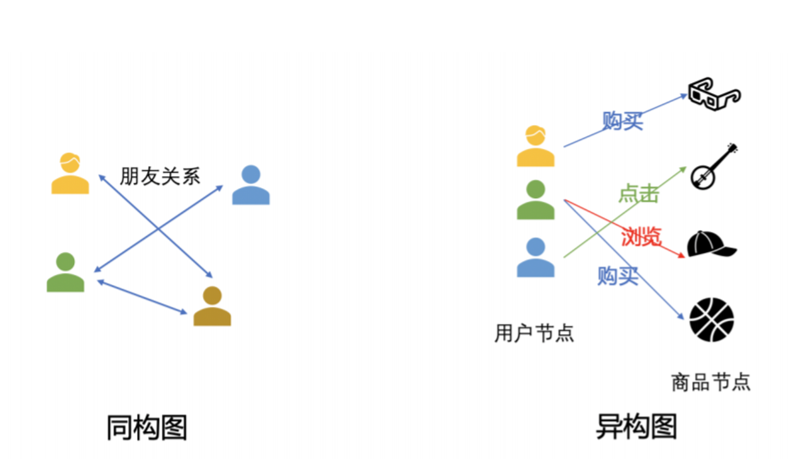

# PyG Heterogeneous Graph Practice
## 同构图与异构图

### 同构图
不区分节点和边的类型，节点和边都只有一种类型

点类型+边类型=2

例如，在社交网络中，可以想象node只有‘人’这一个种类，edge只有‘认识’这一种连接。而人和人要么认识，要么不认识。

### 异构图
点的类型或边的类型超过一种

点类型+边类型>2

现实世界中，大多数图都是异构图，表示了关于不同类型实体及其不同类型关系的信息。不同类型的点和边的特征表示类型和维度可以不相同。

## 图神经网络框架
### PyG
[PyG异构图指南](https://pytorch-geometric.readthedocs.io/en/latest/notes/heterogeneous.html?highlight=Heterogeneous#creating-heterogeneous-gnns)
### DGL
[DGL异构图指南](https://docs.dgl.ai/en/1.1.x/guide_cn/graph-heterogeneous.html)

## 案例

这个异构图有1939743个节点，分为4种类型：作者author, 论文paper, 机构institution，研究领域field of study。
有21111007个边，也分为4种类型：
- 写writes：一位作者[写]一篇特定的论文
- 隶属于affiliated with：一位作者[隶属于]一个特定的机构
- 引用cites：一篇论文[引用]另一篇论文
- 涉及主题has topic：一篇论文[涉及]特定领域的[主题]

## 邻居加载
https://pytorch-geometric.readthedocs.io/en/latest/tutorial/neighbor_loader.html