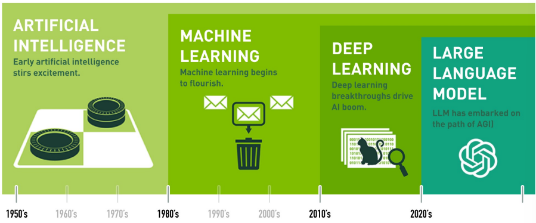

# AI发展历程
<!-- more -->

## 1. AI历史上的四次大发展

## 2. 里程碑事件
- 1942年，艾萨克·阿西莫夫（IsaacAsimov）提出「机器人三大定律」
- 1943年，「神经网络」的提出
- 1950年，艾伦·图灵（Alan Turing）提出「图灵测试」
- 1956年，达特茅斯会议，正式提出「人工智能」概念
- 1960年代，人工智能进入了第一个高潮期，以逻辑理论为主要研究方向。当时研究人员尝试用形式逻辑来表达计算机的推理过程。
- 1969年，反向传播算法（BP）的提出
- 1970年代，人工智能的研究进入低谷期，这是因为早期的研究希望通过逻辑推理将人类的智能模拟出来，但是这种方法有着典型的符号主义问题，即无法处理模糊的语言和不确定性的情况。
- 1980年代，人工智能的研究开始从符号主义走向连接主义，也就是从逻辑推理转向神经网络。神经网络允许计算机通过学习来逐步改进自己的性能。
- 1990年代开始，人工智能进入了第二个高潮期。专家系统、机器学习、自然语言处理等技术不断得到改进和完善，计算机开始具备了更强的智能。
- 1997年，IBM的深蓝（Deep Blue）战胜国际象棋世界冠军加里·卡斯帕罗夫（Garry Kasparov）
- 2009年，李飞飞（Fei-Fei Li）创建了ImageNet数据集，是人工智能史上最大的数据集，包含 1500 万张图像，涉及 22000 个类别，为深度学习在计算机视觉领域的应用奠定了基础。
- 2011年，IBM的沃森（Watson）在著名的智力竞赛节目“Jeopardy”中击败了对手布拉德·拉特和肯·詹宁斯，成功赢取了100万美元的大奖
- 2011年，谷歌工程师杰夫·迪恩（Jeff Dean）和斯坦福大学计算机科学教授吴恩达（Andrew Ng），从YouTube视频中提取了1000万个未标记的图像，训练了一个由16，000个电脑处理器组成的庞大神经网络。除此之外，并没有给出任何识别信息，然而人工智能准确的通过深度学习算法识别出了猫科动物的照片。在计算机视觉任务中使用了神经网络和无监督学习，这个事件也标志着「谷歌大脑项目」（Google Brain Project）的开始
- 2012年，多伦多大学教授杰弗里·辛顿（Geoffrey Hinton）和他的两个学生建立了名为 AlexNet 的计算机视觉神经网络模型，在著名的 ImageNet 的图像识别大赛中，AlexNet 一举夺冠。这次夺冠影响极其深远，使深度神经网络得以复兴，也为辛顿赢得了「深度学习教父」的绰号。
- 2016年，DeepMind的AlphaGo战胜围棋世界冠军李世石（Lee Sedol），通过这次事件，真正的掀起了人工智能AI热潮
- 2017年，Google在论文《Attention is All You Need》中提出了Transformer架构，该架构摒弃了传统的循环神经网络（RNN）用于序列建模，转而采用自注意力机制，极大地提升了自然语言处理任务如机器翻译的性能。
- 2018年，Google推出预训练模型BERT，首次实现了大规模双向Transformer结构的预训练，并在多种NLP下游任务上取得了当时最先进的效果，开启了NLP领域的预训练模型时代。
- 2019年，OpenAI发布了GPT-3模型，它是当时参数量最大的预训练语言模型之一，展现出强大的文本生成和理解能力，进一步推动了大模型在NLP领域的应用。
- 2022年，OpenAI推出ChatGPT，虽然ChatGPT是在2022年末推出的，但其影响力一直延续到2024年甚至更远，成为人机交互和对话系统的重大突破，预示着未来智能助手和AI客服的新标准。 

